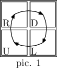
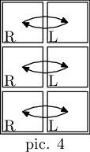

<h1 style='text-align: center;'> A. Admissible Map</h1>

<h5 style='text-align: center;'>time limit per test: 3 seconds</h5>
<h5 style='text-align: center;'>memory limit per test: 512 megabytes</h5>

A map is a matrix consisting of symbols from the set of 'U', 'L', 'D', and 'R'.

A map graph of a map matrix $a$ is a directed graph with $n \cdot m$ vertices numbered as $(i, j)$ ($1 \le i \le n; 1 \le j \le m$), where $n$ is the number of rows in the matrix, $m$ is the number of columns in the matrix. The graph has $n \cdot m$ directed edges $(i, j) \to (i + di_{a_{i, j}}, j + dj_{a_{i, j}})$, where $(di_U, dj_U) = (-1, 0)$; $(di_L, dj_L) = (0, -1)$; $(di_D, dj_D) = (1, 0)$; $(di_R, dj_R) = (0, 1)$. A map graph is valid when all edges point to valid vertices in the graph.

An admissible map is a map such that its map graph is valid and consists of a set of cycles.

A description of a map $a$ is a concatenation of all rows of the map — a string $a_{1,1} a_{1,2} \ldots a_{1, m} a_{2, 1} \ldots a_{n, m}$.

You are given a string $s$. Your task is to find how many substrings of this string can constitute a description of some admissible map. 

A substring of a string $s_1s_2 \ldots s_l$ of length $l$ is defined by a pair of indices $p$ and $q$ ($1 \le p \le q \le l$) and is equal to $s_ps_{p+1} \ldots s_q$. Two substrings of $s$ are considered different when the pair of their indices $(p, q)$ differs, even if they represent the same resulting string.

##### Input

In the only input line, there is a string $s$, consisting of at least one and at most $20\,000$ symbols 'U', 'L', 'D', or 'R'.

##### Output

##### Output

 one integer — the number of substrings of $s$ that constitute a description of some admissible map.

## Examples

##### Input


```text
RDUL
```
##### Output


```text
2
```
##### Input


```text
RDRU
```
##### Output


```text
0
```
##### Input


```text
RLRLRL
```
##### Output


```text
6
```
## Note

In the first example, there are two substrings that can constitute a description of an admissible map — "RDUL" as a matrix of size $2 \times 2$ (pic. 1) and "DU" as a matrix of size $2 \times 1$ (pic. 2). 

In the second example, no substring can constitute a description of an admissible map. E. g. if we try to look at the string "RDRU" as a matrix of size $2 \times 2$, we can find out that the resulting graph is not a set of cycles (pic. 3).

In the third example, three substrings "RL", two substrings "RLRL" and one substring "RLRLRL" can constitute an admissible map, some of them in multiple ways. E. g. here are two illustrations of substring "RLRLRL" as matrices of size $3 \times 2$ (pic. 4) and $1 \times 6$ (pic. 5).







#### Tags 

#3300 #NOT OK 

## Blogs
- [All Contest Problems](../2021-2022_ICPC,_NERC,_Northern_Eurasia_Onsite_(Unrated,_Online_Mirror,_ICPC_Rules,_Teams_Preferred).md)
- [Announcement #2 (en)](../blogs/Announcement_2_(en).md)
