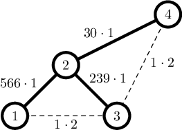

<h1 style='text-align: center;'> J. Job Lookup</h1>

<h5 style='text-align: center;'>time limit per test: 3 seconds</h5>
<h5 style='text-align: center;'>memory limit per test: 512 megabytes</h5>

Julia's $n$ friends want to organize a startup in a new country they moved to. They assigned each other numbers from 1 to $n$ according to the jobs they have, from the most front-end tasks to the most back-end ones. They also estimated a matrix $c$, where $c_{ij} = c_{ji}$ is the average number of messages per month between people doing jobs $i$ and $j$.

Now they want to make a hierarchy tree. It will be a binary tree with each node containing one member of the team. Some member will be selected as a leader of the team and will be contained in the root node. In order for the leader to be able to easily reach any subordinate, for each node $v$ of the tree, the following should apply: all members in its left subtree must have smaller numbers than $v$, and all members in its right subtree must have larger numbers than $v$.

After the hierarchy tree is settled, people doing jobs $i$ and $j$ will be communicating via the shortest path in the tree between their nodes. Let's denote the length of this path as $d_{ij}$. Thus, the cost of their communication is $c_{ij} \cdot d_{ij}$.

Your task is to find a hierarchy tree that minimizes the total cost of communication over all pairs: $\sum_{1 \le i < j \le n} c_{ij} \cdot d_{ij}$.

### Input

The first line contains an integer $n$ ($1 \le n \le 200$) – the number of team members organizing a startup.

The next $n$ lines contain $n$ integers each, $j$-th number in $i$-th line is $c_{ij}$ — the estimated number of messages per month between team members $i$ and $j$ ($0 \le c_{ij} \le 10^9; c_{ij} = c_{ji}; c_{ii} = 0$).

### Output

### Output

 a description of a hierarchy tree that minimizes the total cost of communication. To do so, for each team member from 1 to $n$ output the number of the member in its parent node, or 0 for the leader. If there are many optimal trees, output a description of any one of them.

## Example

### Input


```text
4
0 566 1 0
566 0 239 30
1 239 0 1
0 30 1 0
```
### Output


```text
2 4 2 0
```
## Note

The minimal possible total cost is $566 \cdot 1+239 \cdot 1+30 \cdot 1+1 \cdot 2+1 \cdot 2=839$:

  

#### Tags 

#2100 #NOT OK #constructive_algorithms #dp #shortest_paths #trees 

## Blogs
- [All Contest Problems](../2021-2022_ICPC,_NERC,_Northern_Eurasia_Onsite_(Unrated,_Online_Mirror,_ICPC_Rules,_Teams_Preferred).md)
- [Announcement #2 (en)](../blogs/Announcement_2_(en).md)
