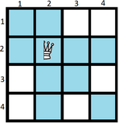

<h1 style='text-align: center;'> C. Half Queen Cover</h1>

<h5 style='text-align: center;'>time limit per test: 1 second</h5>
<h5 style='text-align: center;'>memory limit per test: 256 megabytes</h5>

You are given a board with $n$ rows and $n$ columns, numbered from $1$ to $n$. The intersection of the $a$-th row and $b$-th column is denoted by $(a, b)$.

A half-queen attacks cells in the same row, same column, and on one diagonal. More formally, a half-queen on $(a, b)$ attacks the cell $(c, d)$ if $a=c$ or $b=d$ or $a-b=c-d$.

  The blue cells are under attack.  What is the minimum number of half-queens that can be placed on that board so as to ensure that each square is attacked by at least one half-queen?Construct an optimal solution.

##### Input

The first line contains a single integer $n$ ($1 \le n \le 10^5$) — the size of the board.

##### Output

In the first line print a single integer $k$ — the minimum number of half-queens.

In each of the next $k$ lines print two integers $a_i$, $b_i$ ($1 \le a_i, b_i \le n$) — the position of the $i$-th half-queen.

If there are multiple solutions, print any.

## Examples

##### Input


```text
1
```
##### Output


```text
1
1 1
```
##### Input


```text
2
```
##### Output


```text
1
1 1
```
##### Input


```text
3
```
##### Output


```text
2
1 1
1 2
```
## Note

Example $1$: one half-queen is enough. 
## Note

: a half-queen on $(1, 1)$ attacks $(1, 1)$.

Example $2$: one half-queen is enough too. $(1, 2)$ or $(2, 1)$ would be wrong solutions, because a half-queen on $(1, 2)$ does not attack the cell $(2, 1)$ and vice versa. $(2, 2)$ is also a valid solution.

Example $3$: it is impossible to cover the board with one half queen. There are multiple solutions for $2$ half-queens; you can print any of them.


#### Tags 

#2400 #NOT OK #constructive_algorithms #math 

## Blogs
- [All Contest Problems](../Codeforces_Round_783_(Div._1).md)
- [Announcement (en)](../blogs/Announcement_(en).md)
- [Tutorial (en)](../blogs/Tutorial_(en).md)
