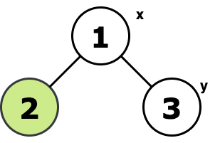
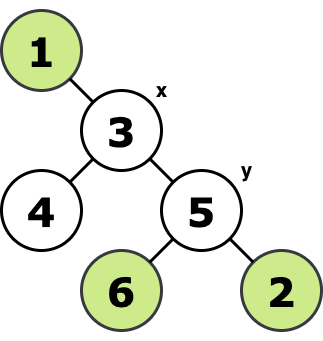
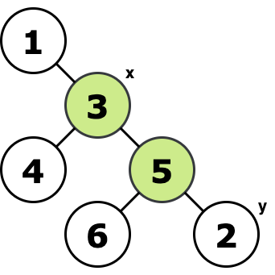

<h1 style='text-align: center;'> F. Vlad and Unfinished Business</h1>

<h5 style='text-align: center;'>time limit per test: 2 seconds</h5>
<h5 style='text-align: center;'>memory limit per test: 256 megabytes</h5>

Vlad and Nastya live in a city consisting of $n$ houses and $n-1$ road. From each house, you can get to the other by moving only along the roads. That is, the city is a tree.

Vlad lives in a house with index $x$, and Nastya lives in a house with index $y$. Vlad decided to visit Nastya. However, he remembered that he had postponed for later $k$ things that he has to do before coming to Nastya. To do the $i$-th thing, he needs to come to the $a_i$-th house, things can be done in any order. In $1$ minute, he can walk from one house to another if they are connected by a road.

Vlad does not really like walking, so he is interested what is the minimum number of minutes he has to spend on the road to do all things and then come to Nastya. Houses $a_1, a_2, \dots, a_k$ he can visit in any order. He can visit any house multiple times (if he wants).

### Input

The first line of input contains an integer $t$ ($1 \le t \le 10^4$) — the number of input test cases. There is an empty line before each test case.

The first line of each test case contains two integers $n$ and $k$ ($1 \le k \le n \le 2\cdot 10^5$) — the number of houses and things, respectively.

The second line of each test case contains two integers $x$ and $y$ ($1 \le x, y \le n$) — indices of the houses where Vlad and Nastya live, respectively.

The third line of each test case contains $k$ integers $a_1, a_2, \dots, a_k$ ($1 \le a_i \le n$) — indices of houses Vlad need to come to do things.

The following $n-1$ lines contain description of city, each line contains two integers $v_j$ and $u_j$ ($1 \le u_j, v_j \le n$) — indices of houses connected by road $j$.

It is guaranteed that the sum of $n$ for all cases does not exceed $2\cdot10^5$.

### Output

### Output

 $t$ lines, each of which contains the answer to the corresponding test case of input. As an answer output single integer — the minimum number of minutes Vlad needs on the road to do all the things and come to Nastya.

## Example

### Input


```text
3  
3 11 321 31 2  
6 43 51 6 2 11 33 43 55 65 2  
6 23 25 31 33 43 55 65 2
```
### Output

```text

3
7
2

```
## Note

Tree and best path for the first test case:

  $1 \rightarrow 2 \rightarrow 1 \rightarrow 3$ Tree and best path for the second test case:

  $3 \rightarrow 1 \rightarrow 3 \rightarrow 5 \rightarrow 2 \rightarrow 5 \rightarrow 6 \rightarrow 5$ Tree and best path for the third test case:

  $3 \rightarrow 5 \rightarrow 2$ 

#### Tags 

#1800 #NOT OK #dfs_and_similar #dp #greedy #trees 

## Blogs
- [All Contest Problems](../Codeforces_Round_787_(Div._3).md)
- [Announcement](../blogs/Announcement.md)
- [Tutorial (en)](../blogs/Tutorial_(en).md)
