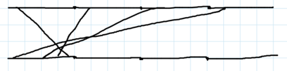

# Tutorial_(en)

Thank you for participating!

[1676A - Lucky?](../problems/A._Lucky_.md "Codeforces Round 790 (Div. 4)")

Idea: [mesanu](https://codeforces.com/profile/mesanu "Expert mesanu") and [SlavicG](https://codeforces.com/profile/SlavicG "Candidate Master SlavicG")

 **Tutorial**
### [1676A - Lucky?](../problems/A._Lucky_.md "Codeforces Round 790 (Div. 4)")

We need to check if the sum of the first three digits is equal to the sum of the last three digits. This is doable by scanning the input as a string, then comparing the sum of the first three characters with the sum of the last three characters using the if statement and the addition operation.

 **Solution**
```cpp
#include <bits/stdc++.h>
using namespace std;

void solve() {
	string s;
	cin >> s;
	if(s[0]+s[1]+s[2] == s[3]+s[4]+s[5]) {
		cout << "YES" << endl;
	}
	else {
		cout << "NO" << endl;
	}
}

int main() {
	int t = 1;
	cin >> t;
	while (t--) {
		solve();
	}
}
```
[1676B - Equal Candies](../problems/B._Equal_Candies.md "Codeforces Round 790 (Div. 4)")

Idea: [Errichto](https://codeforces.com/profile/Errichto "International Grandmaster Errichto")

 **Tutorial**
### [1676B - Equal Candies](../problems/B._Equal_Candies.md "Codeforces Round 790 (Div. 4)")

Because we can only eat candies from boxes. The only way to make all boxes have the same quantity of candies in them would be to make all candies contain a number of candies equal to the minimum quantity of candies a box initially has. So, we should find this minimum number, let's denote it as m, and then for each box, there should be eaten ai−m candies. So the answer would be the sum of ai−m over all i-s (1≤i≤n).

 **Solution**
```cpp
#include "bits/stdc++.h"
using namespace std;

int main() {
    int t; cin >> t;
    while(t--) {
        int n; cin >> n;
        vector<int> a(n);
        int mn = INT_MAX, ans = 0;
        for(int i = 0; i < n; ++i) {
            cin >> a[i];
            mn = min(mn, a[i]);
        }
        for(int i = 0; i < n; ++i) {
            ans += a[i] - mn;
        }
        cout << ans << "n";
    }
}
```
[1676C - Most Similar Words](../problems/C._Most_Similar_Words.md "Codeforces Round 790 (Div. 4)")

Idea: [MikeMirzayanov](https://codeforces.com/profile/MikeMirzayanov "Headquarters, MikeMirzayanov")

 **Tutorial**
### [1676C - Most Similar Words](../problems/C._Most_Similar_Words.md "Codeforces Round 790 (Div. 4)")

Firstly, given any pair of strings of length m, we should be able to tell the difference between them. It's enough to find the sum of absolute differences between each character from the same position. Now, we should go through all possible pairs and pick the minimum value over all of them using the function we use to calculate the difference.

 **Solution**
```cpp
#include "bits/stdc++.h"
using namespace std;

int cost(string& a, string& b) {
    int val = 0;
    for(int i = 0; i < a.size(); ++i) {
        val += abs(a[i] - b[i]);
    }
    return val;
}

int main() {
    int t; cin >> t;
    while(t--) {
        int n, m; cin >> n >> m;
        vector<string> s(n);
        for(int i = 0; i < n; ++i) {
            cin >> s[i];
        }
        int ans = INT_MAX;
        for(int i = 0; i < n; ++i) {
            for(int j = i + 1; j < n; ++j) {
                ans = min(ans, cost(s[i], s[j]));
            }
        }
        cout << ans << "n";
    }
}
```
[1676D - X-Sum](../problems/D._X-Sum.md "Codeforces Round 790 (Div. 4)")

Idea: [mesanu](https://codeforces.com/profile/mesanu "Expert mesanu")

 **Tutorial**
### [1676D - X-Sum](../problems/D._X-Sum.md "Codeforces Round 790 (Div. 4)")

The solution is to check the sum over all diagonals for each cell.

For a cell (i,j) we can iterate over all elements in all its diagonals. This will be in total O(max(n,m)) elements.

The complexity will be O(n⋅m⋅max(n,m)).

O(n⋅m) solutions involving precomputation are also possible but aren't needed.

 **Solution**
```cpp
#include <bits/stdc++.h>
using namespace std;
 
void solve()
{
	int n, m;
	cin >> n >> m;
	int a[n][m];
	for(int i = 0; i < n; i++)
	{
		for(int j = 0; j < m; j++)
		{
			cin >> a[i][j];
		}
	}
	int mx = 0;
	for(int i = 0; i < n; i++)
	{
		for(int j = 0; j < m; j++)
		{
			int now = 0;
			int ci = i, cj = j;
			while(ci >= 0 && ci < n && cj >= 0 && cj < m)
			{
				now+=a[ci][cj];
				ci--;
				cj--;
			}
			ci = i, cj = j;
			while(ci >= 0 && ci < n && cj >= 0 && cj < m)
			{
				now+=a[ci][cj];
				ci++;
				cj--;
			}
			ci = i, cj = j;
			while(ci >= 0 && ci < n && cj >= 0 && cj < m)
			{
				now+=a[ci][cj];
				ci--;
				cj++;
			}
			ci = i, cj = j;
			while(ci >= 0 && ci < n && cj >= 0 && cj < m)
			{
				now+=a[ci][cj];
				ci++;
				cj++;
			}
			now-=a[i][j]*3;
			mx = max(mx, now);
		}
	}
	cout << mx << endl;
}

int main() {
	int t;
	cin >> t;
	while(t--)
	{
		solve();
	}
}

```
[1676E - Eating Queries](../problems/E._Eating_Queries.md "Codeforces Round 790 (Div. 4)")

Idea: [mesanu](https://codeforces.com/profile/mesanu "Expert mesanu")

 **Tutorial**
### [1676E - Eating Queries](../problems/E._Eating_Queries.md "Codeforces Round 790 (Div. 4)")

Let's solve the problem with just one query. Greedily, we should pick the candies with the most sugar first, since there is no benefit to picking a candy with less sugar.

So the solution is as follows: sort the candies in descending order, and then find the prefix whose sum is ≥x. This is O(n) per query, which is too slow for us.

To speed it up, notice that we just need to find a prefix sum at least x. So if we compute the prefix sums of the reverse-sorted array, we need to find the first element that is at least x.

Since all elements of a are positive, the array of prefix sums is increasing. Therefore, you can binary search the first element ≥x. This solves the problem in logn per query.

Total time complexity: O(qlogn+n).

 **Solution**
```cpp
#include "bits/stdc++.h"
using namespace std;

int main() {  
    int t; cin >> t;
    while(t--) {
        int n, q; cin >> n >> q;
        vector<long long> a(n), p(n);
        for(int i = 0; i < n; ++i) {
            cin >> a[i];
        }
        sort(a.rbegin(), a.rend());
        for(int i = 0; i < n; ++i) {
            p[i] = (i ? p[i - 1] : 0) + a[i];
        }
    
        while(q--) {
            long long x; cin >> x;
            int l = 1, r = n, ans = -1;
            while(l <= r) {
                int mid = (l + r) / 2;
                if(p[mid - 1] >= x) {
                    ans = mid;
                    r = mid - 1;
                } else {
                    l = mid + 1;
                }
            }
            cout << ans << "n";
        }
    }
}   
```
[1676F - Longest Strike](../problems/F._Longest_Strike.md "Codeforces Round 790 (Div. 4)")

Idea: [MikeMirzayanov](https://codeforces.com/profile/MikeMirzayanov "Headquarters, MikeMirzayanov")

 **Tutorial**
### [1676F - Longest Strike](../problems/F._Longest_Strike.md "Codeforces Round 790 (Div. 4)")

Let's call a value good if it appears at least k times. For example, if a=[1,1,2,2,3,4,4,4,5,5,6,6] and k=2, then good values are [1,2,4,5,6].

So we need to find the longest subarray of this array in which all values are consecutive. For example, the subarray [4,5,6] is the answer, because all values are good and the length of the array is longest.

There are many ways to do this. For example, we can see when the difference between two elements is more than 1, and then break the array into parts based on that. For instance, [1,2,4,5,6]→[1,2],[4,5,6]. You can also iterate from left to right and keep track of the size of the current array.

Time complexity: O(n).

 **Solution**
```cpp
#include <bits/stdc++.h>
using namespace std;
 
void solve()
{
	int n, k;
	cin >> n >> k;
	int a[n];
	map<int, int> mp;
	for(int i = 0; i < n; i++)
	{
		cin >> a[i];
		mp[a[i]]++;
	}
	vector<int> c;
	for(auto x : mp)
	{
		if(x.second >= k)
		{
			c.push_back(x.first);
		}
	}
	if(c.size() == 0)
	{
		cout << -1 << endl;
		return;
	}
	sort(c.begin(), c.end());
	int mx = 0;
	int lans = c[0], rans = c[0];
	int l = c[0];
	for(int i = 1; i < c.size(); i++)
	{
		if(c[i]-1 == c[i-1])
		{
			if(c[i]-l > mx)
			{
				lans = l;
				rans = c[i];
				mx = c[i]-l;
			}
		}
		else
		{
			l = c[i];
		}
	}
	cout << lans << " " << rans << endl;
}

int main(int argc, char * argv[])
{
	int t;
	cin >> t;
	while(t--)
	{
		solve();
	}
}

```
[1676G - White-Black Balanced Subtrees](../problems/G._White-Black_Balanced_Subtrees.md "Codeforces Round 790 (Div. 4)")

Idea: [MikeMirzayanov](https://codeforces.com/profile/MikeMirzayanov "Headquarters, MikeMirzayanov")

 **Tutorial**
### [1676G - White-Black Balanced Subtrees](../problems/G._White-Black_Balanced_Subtrees.md "Codeforces Round 790 (Div. 4)")

Let's run a dynamic programming from the leaves to the root. For each vertex store the values of the number of balanced subtrees, as well as the number of white and black vertices in it. 

Then from a vertex we can count the total number of white vertices in its subtree as well as the black vertices in its subtree, and update our total if they are equal. Remember to include the color of the vertex itself in these counts. The answer is the answer at the root.

Therefore the problem is solved in O(n) time. 

 **Solution**
```cpp
#include <bits/stdc++.h>

using namespace std;

const int MAX = 200007;
const int MOD = 1000000007;

void solve() {
	int n;
	cin >> n;
	vector<int> child[n + 7];
	for (int i = 2; i <= n; i++) {
		int x;
		cin >> x;
		child[x].push_back(i);
	}
	string s;
	cin >> s;
	int res = 0;
	function<int(int)> dp = [&] (int x) {
		int bal = (s[x - 1] == 'B') ? -1 : 1;
		if (child[x].empty()) {return bal;}
		for (int i : child[x]) {
			bal += dp(i);
		}
		if (bal == 0) {res++;}
		return bal;
	};
	dp(1);
	cout << res << 'n';
}

int main() {
    ios::sync_with_stdio(false);
    cin.tie(nullptr);
    int tt; cin >> tt; for (int i = 1; i <= tt; i++) {solve();}
    // solve();
}
```
[1676H1 - Maximum Crossings (Easy Version)](../problems/H1._Maximum_Crossings_(Easy_Version).md "Codeforces Round 790 (Div. 4)")

Idea: [flamestorm](https://codeforces.com/profile/flamestorm "Expert flamestorm")

 **Tutorial**
### [1676H1 - Maximum Crossings (Easy Version)](../problems/H1._Maximum_Crossings_(Easy_Version).md "Codeforces Round 790 (Div. 4)")

Let's look at two wires from i→ai and j→aj. 

* If ai<aj, there can never be any intersection.
* If ai>aj, there has to be an intersection.
* If ai=aj, it is possible that there is an intersection or not, depending on how we arrange the wires on the bottom terminal.

 In the last case, if there are multiple wires that go to the same segment ai, we can make all pairs of them cross by arranging the points in which they hit this segment from right to left. For example, if a=[1,1,1,1], then we can make all pairs of segments cross as shown.   Since we want to maximize the number of intersections, we just need to count the number of pairs (i,j) such that ai≥aj. You can brute force all pairs in O(n2).

 **Solution**
```cpp
#include <bits/stdc++.h>

using namespace std;

const int MAX = 200007;
const int MOD = 1000000007;

void solve() {
	int n;
	cin >> n;
	int a[n];
	for (int i = 0; i < n; i++) {
		cin >> a[i];
	}
	int res = 0;
	for (int i = 0; i < n; i++) {
		for (int j = i + 1; j < n; j++) {
			if (a[i] >= a[j]) {res++;}
		}
	}
	cout << res << 'n';
}

int main() {
    ios::sync_with_stdio(false);
    cin.tie(nullptr);
    int tt; cin >> tt; for (int i = 1; i <= tt; i++) {solve();}
    // solve();
}
```
[1676H2 - Maximum Crossings (Hard Version)](../problems/H2._Maximum_Crossings_(Hard_Version).md "Codeforces Round 790 (Div. 4)")

Idea: [flamestorm](https://codeforces.com/profile/flamestorm "Expert flamestorm")

 **Tutorial**
### [1676H2 - Maximum Crossings (Hard Version)](../problems/H2._Maximum_Crossings_(Hard_Version).md "Codeforces Round 790 (Div. 4)")

Read the solution of the easy version.

We want to count the number of pairs (i,j) such that i<j and ai≥aj. This is a standard problem, and we can do this we can use a segment tree or BIT, for example. Insert the aj from j=1 to n, and then for each aj count the number of ai≤aj using a BIT.

It is also related to the problem of counting inversions, so you can solve it using a modification of merge sort.

Either way, the solution is O(nlogn).

 **Solution**
```cpp
#include <bits/stdc++.h>

using namespace std;

const int MAX = 200007;
const int MOD = 1000000007;

long long merge(int a[], int temp[], int left, int mid, int right) {
   int i, j, k;
   long long count = 0;
   i = left;
   j = mid;
   k = left;
   while ((i <= mid - 1) && (j <= right)) {
      if (a[i] <= a[j]){
      temp[k++] = a[i++];
      } else {
         temp[k++] = a[j++];
         count += (mid - i);
      }
   }
   while (i <= mid - 1)
      temp[k++] = a[i++];
   while (j <= right)
      temp[k++] = a[j++];
   for (i=left; i <= right; i++)
      a[i] = temp[i];
   return count;
}
long long mergeSort(int a[], int temp[], int left, int right){
   int mid;
   long long count = 0;
   if (right > left) {
      mid = (right + left)/2;
      count = mergeSort(a, temp, left, mid);
      count += mergeSort(a, temp, mid+1, right);
      count += merge(a, temp, left, mid+1, right);
   }
   return count;
}
long long aInversion(int a[], int n) {
   int temp[n];
   return mergeSort(a, temp, 0, n - 1);
}

void solve() {
	int n;
	cin >> n;
	int a[n];
	for (int i = 0; i < n; i++) {
		cin >> a[i];
	}
	long long res = aInversion(a, n);
	sort(a, a + n);
	long long curr = 1;
	for (int i = 1; i < n; i++) {
	    if (a[i] != a[i - 1]) {res += (curr * (curr - 1)) / 2; curr = 1;}
	    else {curr++;}
	}
	res += (curr * (curr - 1)) / 2;
	cout << res << 'n';
}

int main() {
    ios::sync_with_stdio(false);
    cin.tie(nullptr);
    int tt; cin >> tt; for (int i = 1; i <= tt; i++) {solve();}
    // solve();
}
```
