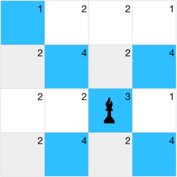

<h1 style='text-align: center;'> D. X-Sum</h1>

<h5 style='text-align: center;'>time limit per test: 2 seconds</h5>
<h5 style='text-align: center;'>memory limit per test: 256 megabytes</h5>

Timur's grandfather gifted him a chessboard to practice his chess skills. This chessboard is a grid $a$ with $n$ rows and $m$ columns with each cell having a non-negative integer written on it. 

Timur's challenge is to place a bishop on the board such that the sum of all cells attacked by the bishop is maximal. The bishop attacks in all directions diagonally, and there is no limit to the distance which the bishop can attack. 
## Note

 that the cell on which the bishop is placed is also considered attacked. Help him find the maximal sum he can get.

### Input

The first line of the input contains a single integer $t$ ($1 \le t \le 1000$) — the number of test cases. The description of test cases follows.

The first line of each test case contains the integers $n$ and $m$ ($1 \le n \le 200$, $1 \leq m \leq 200$).

The following $n$ lines contain $m$ integers each, the $j$-th element of the $i$-th line $a_{ij}$ is the number written in the $j$-th cell of the $i$-th row $(0\leq a_{ij} \leq 10^6)$

It is guaranteed that the sum of $n\cdot m$ over all test cases does not exceed $4\cdot10^4$.

### Output

For each test case output a single integer, the maximum sum over all possible placements of the bishop.

## Example

### Input


```text
44 41 2 2 12 4 2 42 2 3 12 4 2 42 1103 31 1 11 1 11 1 13 30 1 11 0 11 1 0
```
### Output

```text

20
1
5
3

```
## Note

For the first test case here the best sum is achieved by the bishop being in this position: 

  

#### Tags 

#1000 #OK #brute_force #greedy #implementation 

## Blogs
- [All Contest Problems](../Codeforces_Round_790_(Div._4).md)
- [Announcement (en)](../blogs/Announcement_(en).md)
- [Tutorial (en)](../blogs/Tutorial_(en).md)
