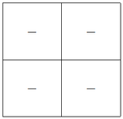
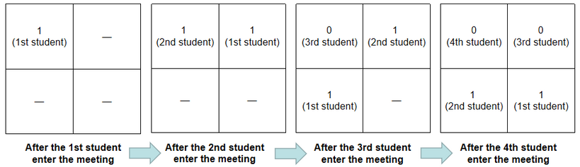

<h1 style='text-align: center;'> B. Tokitsukaze and Meeting</h1>

<h5 style='text-align: center;'>time limit per test: 1 second</h5>
<h5 style='text-align: center;'>memory limit per test: 256 megabytes</h5>

Tokitsukaze is arranging a meeting. There are $n$ rows and $m$ columns of seats in the meeting hall.

There are exactly $n \cdot m$ students attending the meeting, including several naughty students and several serious students. The students are numerated from $1$ to $n\cdot m$. The students will enter the meeting hall in order. When the $i$-th student enters the meeting hall, he will sit in the $1$-st column of the $1$-st row, and the students who are already seated will move back one seat. Specifically, the student sitting in the $j$-th ($1\leq j \leq m-1$) column of the $i$-th row will move to the $(j+1)$-th column of the $i$-th row, and the student sitting in $m$-th column of the $i$-th row will move to the $1$-st column of the $(i+1)$-th row.

For example, there is a meeting hall with $2$ rows and $2$ columns of seats shown as below:

  There will be $4$ students entering the meeting hall in order, represented as a binary string "1100", of which '0' represents naughty students and '1' represents serious students. The changes of seats in the meeting hall are as follows:

  Denote a row or a column good if and only if there is at least one serious student in this row or column. Please predict the number of good rows and columns just after the $i$-th student enters the meeting hall, for all $i$.

### Input

The first contains a single positive integer $t$ ($1 \leq t \leq 10\,000$) — the number of test cases.

For each test case, the first line contains two integers $n$, $m$ ($1 \leq n,m \leq 10^6$; $1 \leq n \cdot m \leq 10^6$), denoting there are $n$ rows and $m$ columns of seats in the meeting hall.

The second line contains a binary string $s$ of length $n \cdot m$, consisting only of zeros and ones. If $s_i$ equal to '0' represents the $i$-th student is a naughty student, and $s_i$ equal to '1' represents the $i$-th student is a serious student.

It is guaranteed that the sum of $n \cdot m$ over all test cases does not exceed $10^6$.

### Output

For each test case, print a single line with $n \cdot m$ integers — the number of good rows and columns just after the $i$-th student enters the meeting hall.

## Example

### Input


```text
32 211004 2110011012 411001101
```
### Output

```text

2 3 4 3
2 3 4 3 5 4 6 5
2 3 3 3 4 4 4 5

```
## Note

The first test case is shown in the statement.

After the $1$-st student enters the meeting hall, there are $2$ good rows and columns: the $1$-st row and the $1$-st column.

After the $2$-nd student enters the meeting hall, there are $3$ good rows and columns: the $1$-st row, the $1$-st column and the $2$-nd column.

After the $3$-rd student enters the meeting hall, the $4$ rows and columns are all good.

After the $4$-th student enters the meeting hall, there are $3$ good rows and columns: the $2$-nd row, the $1$-st column and the $2$-nd column.


#### Tags 

#1700 #NOT OK #data_structures #implementation #math 

## Blogs
- [All Contest Problems](../Codeforces_Round_789_(Div._1).md)
- [Announcement (en)](../blogs/Announcement_(en).md)
- [Tutorial #1 (en)](../blogs/Tutorial_1_(en).md)
