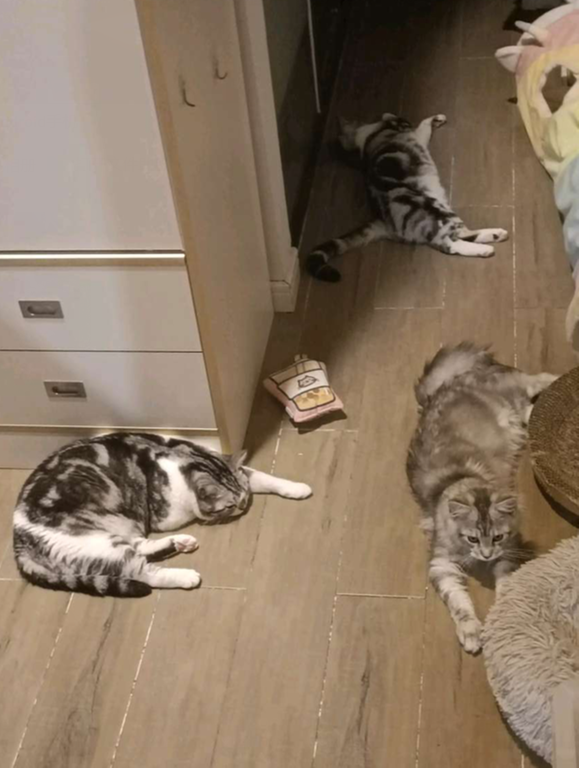

# Codeforces_Round_789_(en)

Hello, Codeforces! ฅ(*`ω´*)ฅ

We are glad to invite you to take part in [Codeforces Round 789 (Div. 1)](https://codeforces.com/contest/1677 "Codeforces Round 789 (Div. 1)") and [Codeforces Round 789 (Div. 2)](https://codeforces.com/contest/1678 "Codeforces Round 789 (Div. 2)"), which will be held on [Sunday, May 8, 2022 at 20:35UTC+6](https://codeforces.com/https://www.timeanddate.com/worldclock/fixedtime.html?day=8&month=5&year=2022&hour=17&min=35&sec=0&p1=166). 

The round will be **rated** for all participants from both divisions. Participants in each division will be offered **6** problems and **2** hours to solve them. Both divisions will share 4 problems.

The problems were written and prepared by [funer](https://codeforces.com/profile/funer "Candidate Master funer"), [dark_light](https://codeforces.com/profile/dark_light "Grandmaster dark_light"), [FreshP_0325](https://codeforces.com/profile/FreshP_0325 "International Master FreshP_0325"), [Frank_DD](https://codeforces.com/profile/Frank_DD "Master Frank_DD"), [qsmcgogo](https://codeforces.com/profile/qsmcgogo "Master qsmcgogo"), [winterzz1](https://codeforces.com/profile/winterzz1 "Master winterzz1"), [Sugar_fan](https://codeforces.com/profile/Sugar_fan "International Grandmaster Sugar_fan"), [TomiokapEace](https://codeforces.com/profile/TomiokapEace "Expert TomiokapEace") and me.

Thank to:

 * [74TrAkToR](https://codeforces.com/profile/74TrAkToR "Grandmaster 74TrAkToR") for excellent coordination of this round! And translating the statements to Russian.
* [KAN](https://codeforces.com/profile/KAN "Legendary Grandmaster KAN") for helping us to review and fix some statements.
* [TomiokapEace](https://codeforces.com/profile/TomiokapEace "Expert TomiokapEace") for helping us to translate **all** the statements and tutorials to English.
* [Sugar_fan](https://codeforces.com/profile/Sugar_fan "International Grandmaster Sugar_fan") for giving valuable advice and helping us to fix some statements.
* [Elder_Giang](https://codeforces.com/profile/Elder_Giang "Master Elder_Giang"), [ddytxdy](https://codeforces.com/profile/ddytxdy "Grandmaster ddytxdy"), [zwezdinv](https://codeforces.com/profile/zwezdinv "Specialist zwezdinv"), [zarubin](https://codeforces.com/profile/zarubin "Pupil zarubin"), [olyazyryanova](https://codeforces.com/profile/olyazyryanova "Expert olyazyryanova"), [marzipan](https://codeforces.com/profile/marzipan "Expert marzipan"), [MichsSS](https://codeforces.com/profile/MichsSS "Specialist MichsSS"), [playf](https://codeforces.com/profile/playf "Grandmaster playf"), [TeaTime](https://codeforces.com/profile/TeaTime "Master TeaTime"), [gojira](https://codeforces.com/profile/gojira "Candidate Master gojira"), [plagues](https://codeforces.com/profile/plagues "Expert plagues"), [AlexLuchianov](https://codeforces.com/profile/AlexLuchianov "International Grandmaster AlexLuchianov"), [kpw29](https://codeforces.com/profile/kpw29 "Grandmaster kpw29"), [Huah](https://codeforces.com/profile/Huah "Grandmaster Huah"), [Yzm007](https://codeforces.com/profile/Yzm007 "Master Yzm007"), [Duck_sajin](https://codeforces.com/profile/Duck_sajin "Candidate Master Duck_sajin"), [Operation27](https://codeforces.com/profile/Operation27 "Master Operation27"), [Venn](https://codeforces.com/profile/Venn "Master Venn"), [Nephry](https://codeforces.com/profile/Nephry "Candidate Master Nephry"), [Sugar_fan](https://codeforces.com/profile/Sugar_fan "International Grandmaster Sugar_fan"), [errorgorn](https://codeforces.com/profile/errorgorn "International Grandmaster errorgorn"), [Um_nik](https://codeforces.com/profile/Um_nik "Legendary Grandmaster Um_nik"), [TadijaSebez](https://codeforces.com/profile/TadijaSebez "International Grandmaster TadijaSebez"), [Prokhor08](https://codeforces.com/profile/Prokhor08 "Expert Prokhor08"), [Grigoreva-Irina](https://codeforces.com/profile/Grigoreva-Irina "Specialist Grigoreva-Irina"), [Dragonado](https://codeforces.com/profile/Dragonado "Candidate Master Dragonado"), [lunaTu](https://codeforces.com/profile/lunaTu "Pupil lunaTu") and [jqdai0815](https://codeforces.com/profile/jqdai0815 "Legendary Grandmaster jqdai0815") for testing this round and giving good advice.
* [MikeMirzayanov](https://codeforces.com/profile/MikeMirzayanov "Headquarters, MikeMirzayanov") and his Codeforces team for amazing systems Codeforces and Polygon!
* [NEAR](https://codeforces.com/https://near.org/) for supporting this round, details can be found in [this post](https://codeforces.com/blog/entry/101398).

Here are some things I personally want to say. This is my second round. Three years have passed since the first round [round 573](https://codeforces.com/contests/1190,1191) I held. Now I have graduated and worked. I like codeforces very much. Though I have already participated in work, haven't trained for a long time, my ability has degraded a lot, I will still come to codeforces to participate in the contest in my spare time. This time I also prepared some problems to propose a round, but for some reasons, most of them were rejected. In particular, one of my favorite problems was rejected because "many testers don't like it". I'm a little frustrated, but I also understand that the coordinator's job is to make the round better and more people like this round. I think it's a great honor to prepare round on codeforces and let so many people around the world try to solve the problem I prepared. I will accumulate some more interesting ideas for the next round and try to make more people like the problems I prepared. 

I'd like to express my great gratitude to my friends for preparing this round with me, I don't think I can prepare this round alone without them. I really appreciate having the support of my good friends in my round. 

In addition, the three naughty cats mentioned in the statement.(*=｀ω´=)ﾉ I understand that I shouldn't post pictures irrelevant to the statement, so I post it here ↓

 **meow 0w0**

Finally, I hope you like the problems in this round, good luck and have fun!(≧ω≦)/

The score distribution will soon be published.

**UPD1: Although our coordinator allows to post the PDF of Chinese statements in the contest material, it seems that codeforces does not allow it. We are only allowed to post something after the round. So we will still post Chinese tutorials after the round.**

**UPD2**: List of contributors is a bit changed, and the score distribution will be:

 * Div.2: **500 — (750 + 1000) — 1250 — 2000 — 2000 — 2750**
* Div.1: **500 — 1250 — 1250 — 2000 — 2500 — 3500**

**UPD3: Note that the score of the last problem of Div.1 has changed, 4000 → 3500.**

**UPD4**: [Editorial](Tutorial_1_(en).md) is out, and Chinese Tutorial will soon be published.

**UPD5**: [Chinese Tutorial](https://codeforces.com/contest/1678/attachments/download/16089/Codeforces%20Round%20789%20Chinese%20Tutorial.pdf) is out.

**UPD6**: Congratulations to the winners!

**Div.1**:

 1. [maroonrk](https://codeforces.com/profile/maroonrk "Legendary Grandmaster maroonrk")
2. [tourist](https://codeforces.com/profile/tourist "Legendary Grandmaster tourist")
3. [eecs](https://codeforces.com/profile/eecs "International Grandmaster eecs")
4. [ainta](https://codeforces.com/profile/ainta "Legendary Grandmaster ainta")
5. [duality](https://codeforces.com/profile/duality "International Grandmaster duality")

**Div.2**:

 1. [NiNiV](https://codeforces.com/profile/NiNiV "Newbie NiNiV")
2. [WA_On_Pretest2_Forces](https://codeforces.com/profile/WA_On_Pretest2_Forces "Newbie WA_On_Pretest2_Forces")
3. [ouql](https://codeforces.com/profile/ouql "Expert ouql")
4. [KroosTheKeenGlint](https://codeforces.com/profile/KroosTheKeenGlint "Specialist KroosTheKeenGlint")
5. [jialiang250](https://codeforces.com/profile/jialiang250 "Expert jialiang250")
