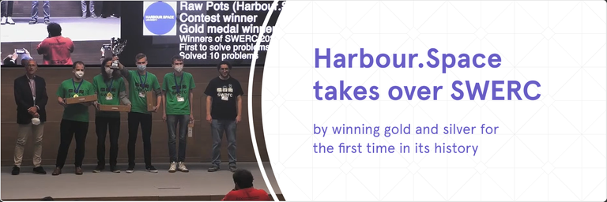
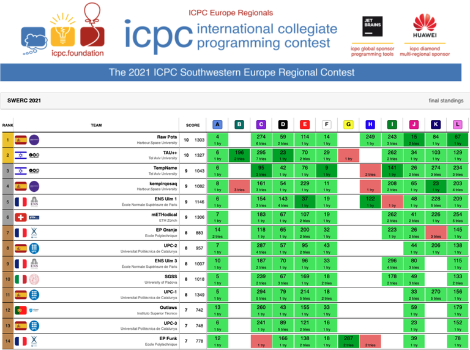

# Announcement

Hello Codeforces!

On [Friday, May 13, 2022 at 20:35UTC+6](https://codeforces.com/https://www.timeanddate.com/worldclock/fixedtime.html?day=13&month=5&year=2022&hour=17&min=35&sec=0&p1=166) [Educational Codeforces Round 128 (Rated for Div. 2)](https://codeforces.com/contest/1680 "Educational Codeforces Round 128 (Rated for Div. 2)") will start.

Series of Educational Rounds continue being held as [Harbour.Space University](https://codeforces.com/https://harbour.space/) initiative! You can read the details about the cooperation between [Harbour.Space University](https://codeforces.com/https://harbour.space/) and Codeforces in the [blog post](//codeforces.com/blog/entry/51208).

This round will be **rated for the participants with rating lower than 2100**. It will be held on extended ICPC rules. The penalty for each incorrect submission until the submission with a full solution is 10 minutes. After the end of the contest you will have 12 hours to hack any solution you want. You will have access to copy any solution and test it locally.

You will be given **6 or 7 problems** and **2 hours** to solve them.

The problems were invented and prepared by Adilbek [adedalic](https://codeforces.com/profile/adedalic "International Master adedalic") Dalabaev, Vladimir [vovuh](https://codeforces.com/profile/vovuh "Master vovuh") Petrov, Ivan [BledDest](https://codeforces.com/profile/BledDest "International Grandmaster BledDest") Androsov, Maksim [Neon](https://codeforces.com/profile/Neon "Candidate Master Neon") Mescheryakov and me. Also huge thanks to Mike [MikeMirzayanov](https://codeforces.com/profile/MikeMirzayanov "Headquarters, MikeMirzayanov") Mirzayanov for great systems Polygon and Codeforces.

Good luck to all the participants!

Our friends at Harbour.Space also have a message for you:

*Harbour.Space takes over **SWERC** by **winning gold and silver** for the first time in its history and will go to the ICPC World Finals. Congratulations to all of our participants and coaches that made this a reality!*

*This is a very important moment in Harbour.Space and Codeforces long partnership, with 127 educational rounds being organized and a big [Harbour.Space Scholarship Contest](https://codeforces.com/blog/entry/93105) held on July 22th. We have selected contest winners ([early-morning-dreams](https://codeforces.com/profile/early-morning-dreams "Candidate Master early-morning-dreams"), [Meijer](https://codeforces.com/profile/Meijer "Grandmaster Meijer") and [amanbol](https://codeforces.com/profile/amanbol "Master amanbol")) to form our current teams.* 

*Since its creation, one of Harbour.Spaces’s goals has been to win SWERC and compete at a high level in the ICPC globally. On April 24th, that objective was accomplished when Harbour.Space’s team RAW POTS (read it backwards!) won the gold medal and the overall contest against Southwestern Europe’s top contenders.* 

*Team **Raw Pots** — gold medal:* 

*Maksym Oboznyi ([MaksymOboznyi](https://codeforces.com/profile/MaksymOboznyi "Grandmaster MaksymOboznyi")), Marco Meijer ([Meijer](https://codeforces.com/profile/Meijer "Grandmaster Meijer")), and Danil Zashikhin ([early-morning-dreams](https://codeforces.com/profile/early-morning-dreams "Candidate Master early-morning-dreams"))*

*Team **Kempirqosaq** — silver medal:* 

*Temirlan Baibolov ([bthero](https://codeforces.com/profile/bthero "Grandmaster bthero")), Dinmukhamed Tursynbay ([DimmyT](https://codeforces.com/profile/DimmyT "Candidate Master DimmyT")), and Amanbol Kanatuly ([amanbol](https://codeforces.com/profile/amanbol "Master amanbol")), ranked 4th and won a silver medal.* 

*Team **Harbour.Backspace** — ranked 27th:*

*Anier Velasco ([aniervs](https://codeforces.com/profile/aniervs "Expert aniervs")), Fadi Younes, and Ekaterina Podruzhko, ranked 27th.*

*The faculty, current students, alumni, and everyone involved with Harbour.Space would like to congratulate the winners and participants at SWERC 2021-2022 for their wonderful performance and hard work.*

*As usual, we are always excited to see Codeforces participants as our students here at Harbour.Space. That’s why we encourage you to apply to our latest apprenticeship program in partnership with Hansgrohe, as a **Kotlin Developer until May 31st, 2022.*** 

   [Apply | Scholarship](https://harbour.space/scholarships/computer-science-apprenticeship-hansgrohe?utm_source=codeforces&utm_medium=partner&utm_campaign=both_b2b_hansgrohe-apprenticeship) *Harbour.Space University Team*

**UPD:** [Editorial is out](Tutorial.md)

