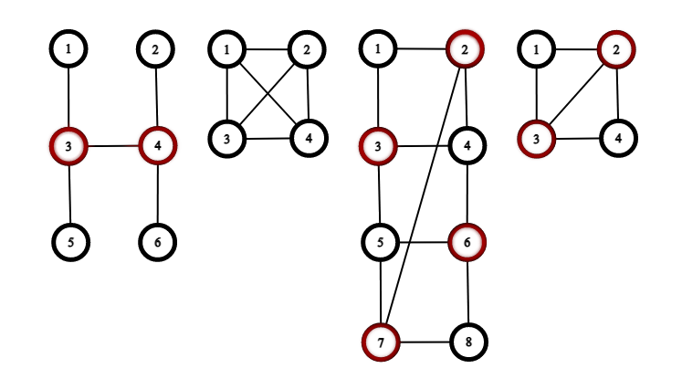

<h1 style='text-align: center;'> F. Lenient Vertex Cover</h1>

<h5 style='text-align: center;'>time limit per test: 5 seconds</h5>
<h5 style='text-align: center;'>memory limit per test: 512 megabytes</h5>

You are given a simple connected undirected graph, consisting of $n$ vertices and $m$ edges. The vertices are numbered from $1$ to $n$.

A vertex cover of a graph is a set of vertices such that each edge has at least one of its endpoints in the set.

Let's call a lenient vertex cover such a vertex cover that at most one edge in it has both endpoints in the set.

Find a lenient vertex cover of a graph or report that there is none. If there are multiple answers, then print any of them.

##### Input

The first line contains a single integer $t$ ($1 \le t \le 10^4$) — the number of testcases.

The first line of each testcase contains two integers $n$ and $m$ ($2 \le n \le 10^6$; $n - 1 \le m \le \min(10^6, \frac{n \cdot (n - 1)}{2})$) — the number of vertices and the number of edges of the graph.

Each of the next $m$ lines contains two integers $v$ and $u$ ($1 \le v, u \le n$; $v \neq u$) — the descriptions of the edges.

For each testcase, the graph is connected and doesn't have multiple edges. The sum of $n$ over all testcases doesn't exceed $10^6$. The sum of $m$ over all testcases doesn't exceed $10^6$.

##### Output

For each testcase, the first line should contain YES if a lenient vertex cover exists, and NO otherwise. If it exists, the second line should contain a binary string $s$ of length $n$, where $s_i = 1$ means that vertex $i$ is in the vertex cover, and $s_i = 0$ means that vertex $i$ isn't.

If there are multiple answers, then print any of them.

## Examples

##### Input


```text
46 51 32 43 43 54 64 61 22 33 41 41 32 48 111 32 43 54 65 76 81 23 45 67 87 24 51 22 33 41 32 4
```
##### Output

```text

YES
001100
NO
YES
01100110
YES
0110

```
##### Input


```text
110 159 43 46 41 28 28 37 29 57 85 101 42 105 35 72 9
```
##### Output

```text

YES
0101100100

```
##### Input


```text
110 197 95 33 41 69 41 410 57 19 28 37 310 92 109 83 21 510 79 51 2
```
##### Output

```text

YES
1010000011

```
## Note

Here are the graphs from the first example. The vertices in the lenient vertex covers are marked red. 

  

#### Tags 

#2600 #NOT OK #dfs_and_similar #divide_and_conquer #dsu #graphs #trees 

## Blogs
- [All Contest Problems](../Educational_Codeforces_Round_128_(Rated_for_Div._2).md)
- [Announcement](../blogs/Announcement.md)
- [Tutorial](../blogs/Tutorial.md)
