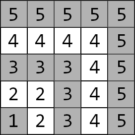
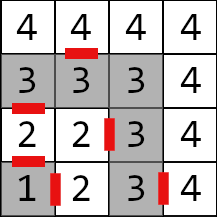

<h1 style='text-align: center;'> E. Labyrinth Adventures</h1>

<h5 style='text-align: center;'>time limit per test: 6 seconds</h5>
<h5 style='text-align: center;'>memory limit per test: 512 megabytes</h5>

You found a map of a weirdly shaped labyrinth. The map is a grid, consisting of $n$ rows and $n$ columns. The rows of the grid are numbered from $1$ to $n$ from bottom to top. The columns of the grid are numbered from $1$ to $n$ from left to right.

The labyrinth has $n$ layers. The first layer is the bottom left corner (cell $(1, 1)$). The second layer consists of all cells that are in the grid and adjacent to the first layer by a side or a corner. The third layer consists of all cells that are in the grid and adjacent to the second layer by a side or a corner. And so on. 

The labyrinth with $5$ layers, for example, is shaped as follows: 

  The layers are separated from one another with walls. However, there are doors in these walls.

Each layer (except for layer $n$) has exactly two doors to the next layer. One door is placed on the top wall of the layer and another door is placed on the right wall of the layer. For each layer from $1$ to $n-1$ you are given positions of these two doors. The doors can be passed in both directions: either from layer $i$ to layer $i+1$ or from layer $i+1$ to layer $i$.

If you are standing in some cell, you can move to an adjacent by a side cell if a wall doesn't block your move (e.g. you can't move to a cell in another layer if there is no door between the cells).

Now you have $m$ queries of sort: what's the minimum number of moves one has to make to go from cell $(x_1, y_1)$ to cell $(x_2, y_2)$.

#### Input

The first line contains a single integer $n$ ($2 \le n \le 10^5$) — the number of layers in the labyrinth.

The $i$-th of the next $n-1$ lines contains four integers $d_{1,x}, d_{1,y}, d_{2,x}$ and $d_{2,y}$ ($1 \le d_{1,x}, d_{1,y}, d_{2,x}, d_{2,y} \le n$) — the coordinates of the doors. Both cells are on the $i$-th layer. The first cell is adjacent to the top wall of the $i$-th layer by a side — that side is where the door is. The second cell is adjacent to the right wall of the $i$-th layer by a side — that side is where the door is.

The next line contains a single integer $m$ ($1 \le m \le 2 \cdot 10^5$) — the number of queries.

The $j$-th of the next $m$ lines contains four integers $x_1, y_1, x_2$ and $y_2$ ($1 \le x_1, y_1, x_2, y_2 \le n$) — the coordinates of the cells in the $j$-th query.

#### Output

For each query, print a single integer — the minimum number of moves one has to make to go from cell $(x_1, y_1)$ to cell $(x_2, y_2)$.

## Examples

#### Input


```text
2
1 1 1 1
10
1 1 1 1
1 1 1 2
1 1 2 1
1 1 2 2
1 2 1 2
1 2 2 1
1 2 2 2
2 1 2 1
2 1 2 2
2 2 2 2
```
#### Output


```text
0
1
1
2
0
2
1
0
1
0
```
#### Input


```text
4
1 1 1 1
2 1 2 2
3 2 1 3
5
2 4 4 3
4 4 3 3
1 2 3 3
2 2 4 4
1 4 2 3
```
#### Output


```text
3
4
3
6
2
```
## Note

Here is the map of the labyrinth from the second example. The doors are marked red.

  

#### Tags 

#2600 #NOT OK #data_structures #dp #matrices #shortest_paths 

## Blogs
- [All Contest Problems](../Educational_Codeforces_Round_129_(Rated_for_Div._2).md)
- [Announcement](../blogs/Announcement.md)
- [Tutorial](../blogs/Tutorial.md)
