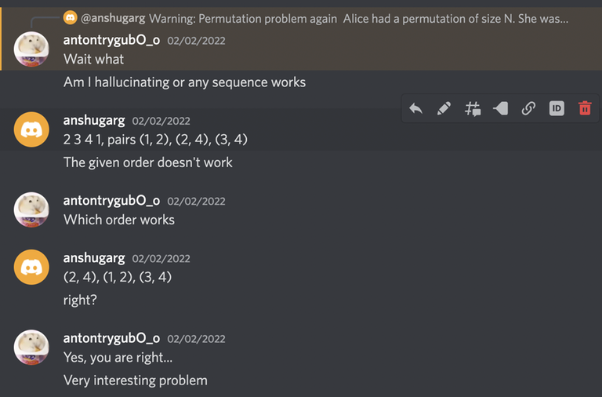

# Tutorial_(en)

I hope you all liked the round. Please share your feedback in the comments section. 

[1682A — Palindromic Indices](../problems/A._Palindromic_Indices.md)
============================================================================

 **Hint**Read the statement carefully!! The given string is a **palindrome**. 

 **Tutorial**Let's remove some index i from the first half of s and check whether the resulting string is a palindrome or not, the other half has the same approach. The prefix of length i−1 already matches with the suffix of the same length because the initial string was a palindrome, so we just need to check if t=s[i+1…n−i+1] is a palindrome. 

For t to be a palindrome, sn−i+1 should be equal to si+1 which was initially equal to sn−i, again which should be equal to si+2 and this goes on. Here we can see that si=si+1…=sn−i+1. So the answer is simply equal to the number of contiguous same characters in the center of the string which can be calculated in O(n).

 **Solution**
```cpp
#include<bits/stdc++.h>
using namespace std ;

#define ll              long long 
#define pb              push_back
#define all(v)          v.begin(),v.end()
#define sz(a)           (ll)a.size()
#define F               first
#define S               second
#define INF             2000000000000000000
#define popcount(x)     __builtin_popcountll(x)
#define pll             pair<ll,ll>
#define pii             pair<int,int>
#define ld              long double

template<typename T, typename U> static inline void amin(T &x, U y){ if(y < x) x = y; }
template<typename T, typename U> static inline void amax(T &x, U y){ if(x < y) x = y; }

#ifdef LOCAL
#define debug(...) debug_out(#__VA_ARGS__, __VA_ARGS__)
#else
#define debug(...) 2401
#endif


int _runtimeTerror_()
{
    int n;
    cin >> n;
    string s;
    cin >> s;
    int cnt = 0;
    for(int i=(n-1)/2;i>=0;--i) {
    	if(s[i] == s[(n - 1) / 2]) {
    		++cnt;
    	}
    	else {
    		break;
    	}
    }
    cout << 2 * cnt - (n & 1) << "n";
    return 0;
}

int main()
{
    ios_base::sync_with_stdio(0);cin.tie(0);cout.tie(0);
    #ifdef runSieve
        sieve();
    #endif
    #ifdef NCR
        initncr();
    #endif
    int TESTS = 1;
    cin >> TESTS;
    while(TESTS--) {
        _runtimeTerror_();
    }
    return 0;
}
```
[1682B — AND Sorting](../problems/B._AND_Sorting.md)
====================================================================

 **Hints****Hint 1**You must have to make at least one swap on the elements which are not at their correct positions initially. So X must be a submask of all elements which are not at their correct positions.

 **Hint 2**What is the maximum possible value of X from Hint 1? It is the bitwise AND of all elements which are not at their correct positions. It turns out that this value is achievable too.

 **Tutorial**We always have to make at least one swap for the elements which are not at their correct positions. Hence an upper bound of answer would be the bitwise AND of those elements. Let the value be X. It turns out that the given permutation is X-sortable. 

**Proof**:

First, notice that X would always be present in p. Let posx be the position of X in p initially. Let's say at some point we want to swap two values pi and pj, then pi and pj would always be a supermask of X i.e. pi & X=X and pj & X=X. We can make the following moves to swap pi and pj without disturbing any other element.

 * Swap values at indices i and posx.
* Swap values at indices i and j.
* Swap values at indices j and posx.

It can be seen that in every swap the bitwise AND of two values which we are swapping is always X. Hence we can swap any two values which were not at their correct positions, therefore we can sort the permutation p.

Overall Complexity: O(n).

 **Solution**
```cpp
#include<bits/stdc++.h>
using namespace std ;

#define ll              long long 
#define pb              push_back
#define all(v)          v.begin(),v.end()
#define sz(a)           (ll)a.size()
#define F               first
#define S               second
#define INF             2000000000000000000
#define popcount(x)     __builtin_popcountll(x)
#define pll             pair<ll,ll>
#define pii             pair<int,int>
#define ld              long double

template<typename T, typename U> static inline void amin(T &x, U y){ if(y < x) x = y; }
template<typename T, typename U> static inline void amax(T &x, U y){ if(x < y) x = y; }

#ifdef LOCAL
#define debug(...) debug_out(#__VA_ARGS__, __VA_ARGS__)
#else
#define debug(...) 2401
#endif


int _runtimeTerror_()
{
    int n;
    cin >> n;
    int ans = (1 << 30) - 1;
    for(int i=0;i<n;++i) {
    	int x;
    	cin >> x;
    	if(x != i) {
    		ans &= x;
    	}
    }
    cout << ans << "n";
    return 0;
}

int main()
{
    ios_base::sync_with_stdio(0);cin.tie(0);cout.tie(0);
    #ifdef runSieve
        sieve();
    #endif
    #ifdef NCR
        initncr();
    #endif
    int TESTS = 1;
    cin >> TESTS;
    while(TESTS--) {
        _runtimeTerror_();
    }
    return 0;
}
```
[1682C — LIS or Reverse LIS?](../problems/C._LIS_or_Reverse_LIS_.md)
============================================================================

 **Hint**Let LDS(a) be the longest strictly decreasing subsequence of a, then LIS(a′) = LDS(a).

There can be at most one index common between LIS(a) and LDS(a). 

 **Tutorial**Let's make a small observation:

 * There can be at most one index common to both LIS(a) and LDS(a).

If some element x occurs ≥2 times, then one of its occurrences can be included in LIS(a) and another one in LDS(a), and all the remaining occurrences are of no use because none of them can contain 2 equal elements.

If some element x is a singleton i.e. the frequency of x in a is 1, then it can have 3 positions

 * In LIS(a) only.
* In LDS(a) only.
* The only common element of LIS(a) and LDS(a).

It can be seen that it is always optimal to choose some singleton as the only common element (if available) because those with frequency ≥2 can easily contribute 1 to both LIS(a) and LDS(a) easily. 

Let t be the number of elements having frequency ≥2 and s be the number of singletons in a. The singletons should be divided equally among LIS(a) and LDS(a) with one of them given to both, if available.

Hence, the answer is t+⌈s2⌉. 

The values s and t can be found using some data structure like std:map in C++ in O(nlog(n)).

 **Solution**
```cpp
#include<bits/stdc++.h>
using namespace std ;

#define ll              long long 
#define pb              push_back
#define all(v)          v.begin(),v.end()
#define sz(a)           (ll)a.size()
#define F               first
#define S               second
#define INF             2000000000000000000
#define popcount(x)     __builtin_popcountll(x)
#define pll             pair<ll,ll>
#define pii             pair<int,int>
#define ld              long double

template<typename T, typename U> static inline void amin(T &x, U y){ if(y < x) x = y; }
template<typename T, typename U> static inline void amax(T &x, U y){ if(x < y) x = y; }

#ifdef LOCAL
#define debug(...) debug_out(#__VA_ARGS__, __VA_ARGS__)
#else
#define debug(...) 2401
#endif


int _runtimeTerror_()
{
    int n;
    cin >> n;
    map<int, int> mp;
    for(int i=1;i<=n;++i) {
    	int x;
    	cin >> x;
    	++mp[x];
    }
    int single = 0, doble = 0;
    for(auto &[i, j]:mp) {
    	single += j == 1;
    	doble += j > 1;
    }
    cout << doble + (single + 1) / 2 << "n";
    return 0;
}

int main()
{
    ios_base::sync_with_stdio(0);cin.tie(0);cout.tie(0);
    #ifdef runSieve
        sieve();
    #endif
    #ifdef NCR
        initncr();
    #endif
    int TESTS = 1;
    cin >> TESTS;
    while(TESTS--) {
        _runtimeTerror_();
    }
    return 0;
}
```
[1682D — Circular Spanning Tree](../problems/D._Circular_Spanning_Tree.md)
===============================================================================

 **Hints****Hint 1**What are the mandatory conditions on string s for a tree to be possible?

 **Hint 2**If there are no odd degree vertices or the count of odd degree vertices is odd, then it is impossible to construct any tree. It turns out that these conditions are sufficient too.

 **Tutorial**Let's check some cases when it is not possible to construct the answer-

 * When all vertices have an even degree, then there is no way to generate a tree because every tree contains at least 2 leaves.
* When there are an odd number of vertices with odd degrees, then there is no tree possible because the sum of degrees must be even.

It turns out that it is always possible to construct a tree if none of the above is true.

The following construction works -

 * Select some vertex i such that the previous vertex of i (assumed cyclically) has an odd degree i.e. si−1=1. Clearly, such a vertex always exists.
* Now left rotate s, i−1 times such that the selected vertex is now at index 1. Note that after the rotation sn will become 1. Now we can see that s[2…n] can be divided into several segments such that each segment ends with some vertex having an odd degree. And each segment should contain exactly one vertex with an odd degree. So s[2…n]=[0…1][0…1]…[0…1] where 0 may appear 0 times. Connect vertex 1 to the starting vertex of each segment and connect adjacent vertices inside each segment. It can be clearly seen that edges will never intersect internally. The only thing we need to verify is the degree constraints.

**Proof**:

 * The degree condition is valid for each segment, as each vertex with an even degree is connected with 2 other vertices and the last vertex with an odd degree will be connected to only one vertex i.e it's previous one or vertex 1 if it was only on its segment.
* Let cnt1 be the number of vertices with odd degree. If s1=1, then there will be cnt1−1 segments which is an odd number, hence vertex 1 will be connected to odd number of vertices. If s1=0, then there will be cnt1 segments which is an even number, hence vertex 1 will be connected to even number of vertices.

Note that we renumbered the vertices during rotation which should be handled in implementation.

The intuition for the above approach comes from the case when all si are 1 in which we create a star network.

Overall complexity: O(n).

 **Solution**
```cpp
#include<bits/stdc++.h>
using namespace std;


#define all(v)         v.begin(),v.end()
#define endl           "n"


int solve(){
 		int n; cin >> n;
 		string s; cin >> s;
 		auto cnt = count(all(s),'1');
 		if(cnt == 0 or cnt & 1){
 			cout << "NO" << endl;
 			return 0;
 		}
 		auto inc = [&](int j){
		 	return (j + 1)%n;
		};
 		cout << "YES" << endl;
 		for(int p = 1; p < n; p++){
 			if(s[p - 1] == '1'){
		 		auto i = inc(p);
		 		while(i != p){
		 			int j = i;
		 			int prev = p;
		 			while(j != p){
		 				cout << prev + 1 << " " << j + 1 << endl;
		 				prev = j;
		 				j = inc(j);
		 				if(s[prev] == '1')break;
		 			}
		 			i = j;
		 		}
		 		return 0;
 			}
 		}

 return 0;
}
signed main(){
    ios_base::sync_with_stdio(0);cin.tie(0);cout.tie(0);
    //freopen("input.txt", "r", stdin);
    //freopen("output.txt", "w", stdout);
    #ifdef SIEVE
    sieve();
    #endif
    #ifdef NCR
    init();
    #endif
    int t=1;cin>>t;
    while(t--){
        solve();
    }
    return 0;
}
```
[1682E — Unordered Swaps](../problems/E._Unordered_Swaps.md)
========================================================================

 **Tutorial**One way of solving permutation problems is to look at permutation cycles. Let's decompose our permutation into cycles, then it's easy to see that each cycle can be solved independently because we have to sort the permutation in a minimum number of moves which isn't possible if two cycles are merged at any instant.

Let's look at one cycle only, whose vertices are numbered from 1 to n in the orientation of cycle i.e the cycle is 1→2→…→n→1. Also assume that we only have swaps (x,y) that are relevant to this cycle.

It is known that we can sort a cycle of size n in n−1 moves and it is the minimum number of required moves.

**Claim 1:** The set of swaps if considered as edges (x,y) form a tree on the n vertices of the cycle.

 **Proof**Assume that the edges don't form a tree, then there exist at least two disjoint components let's say S and T. Now we must be able to make swaps inside S only, to sort elements in S which needs that the set {i,i∈S} is same as set {pi,i∈S} which is not possible by property of permutation cycles. Any cycle of permutation, say C, can't be split further into two sets S and T such that both of them can be sorted independently among themselves.

So we must use all the n−1 edges of the tree in some order to get n cycles each of size 1.

Let's consider any element u having adjacency list as [x1,x2,...,xk] in the order they appear on the cycle if we start moving from u in the orientation of cycle i.e u→u+1→...→n→1→...→u.

**Claim 2:** We can never make the swap (u,xj) before swap (u,xi) if j>i.

 **Proof**If we make the swap (u,xj) first, then u and xi will go in different cycles for subsequent operations and we will never be able to use edge (u,xi) because it will merge the two different cycles which isn't possible because we are constrained to break a cycle into smaller cycles only.

And if are not able to use edge (u,xi) then we will never be able to sort the permutation because we had n−1 edges all of which were to be used and we wasted 1 of them.

Using above claim, for every element u the order of edges is fixed i.e x1, then x2, ..., and finally xk.

Let's build a directed graph on n−1 vertices (representing the swaps) where for every element u we add directed edges (u,x1)→(u,x2), ..., (u,xk−1)→(u,xk).

Since it is guaranteed that the answer will exist i.e a valid sequence of moves exist, hence the topological sorting of the above graph must exist, any of which represents a correct sequence of swaps.

Note that whenever we make a swap that is not violating claim 2 for any element u, then there will be no cross edge in two smaller cycles that are going to be formed and those smaller cycles can be further solved independently. Also the order of edges i.e [x1,x2,...,xk] is not going to change for any element which ensures that the directed graph we built remains correct even if we remove some appropriate edge.

Hence the answer is simply the topological sort of the graph we built.

Overall Complexity: O(nlog(n)), nlog(n) for sorting the edges according to cycle's orientation to get the order [x1,x2,...,xk] for every vertex.

 **Some other interesting things about this problem****Claim:** The given swaps considered as edges (x,y) forms a non-intersecting tree on n vertices on the circle i.e no two edges intersect internally.  ~~Motivation for problem D~~

 **Proof**Let's say edges (a,b) and (c,d) intersect internally in the circle.

WLOG, let's suppose we make swap (a,b) before swap (c,d), then c and d will go in different cycles as in Claim 2 above.

What if you were given any tree on n vertices and asked to solve the problem with "YES/NO"?

 * If the given edges intersect internally in the circle then the answer is "NO" otherwise it's always possible to construct a valid sequence of swaps. This is what the validator of E and checker of D do, try this one, and feel free to discuss in the comments section.

 **Validator**Let's make every edge (u,v) such that u<v, clearly the order of u, v doesn't matter.

Consider each edge as a segment [u,v], then the edges of the tree intersect internally if and only if any two segments say [l1,r1] and [l2,r2] satisfies any of the below conditions-

 1. l1<l2<r1<r2
2. l2<l1<r2<r1
In the original problem, it was mentioned that there is always a correct sequence of swaps so we claimed that topological sorting must exist and indeed any topological sorting suffices. What if we were given a non-intersecting spanning tree? Can we still claim that there exists a correct move at every step?

**Claim:** Yes, we can

 **Proof**We need to show that there there is always some edge that can be removed without breaking claim 2 above which is the only required condition.

Cycles of length ≤2 are trivial.

Let's represent by unext the first element of the list [x1,x2,...,xk] for u i.e the closest vertex having an edge with u in cycle's orientation.

Now, let's start an iteration, start moving from 1 and jump to vnext every time when you are at vertex v. Continue this process until you again reach 1 or cross over 1.

Let the sequence obtained be s i.e s1=1,s2,...,sk where on moving further from sk we cross/reach 1. For simplicity assume k≥3, k=2 is trivial.

It can be shown that (sk−1,sk) is the required edge.

 **Proof**sknext lies between sk−1 and sk. There are three cases other that this:

 1. sknext lies between sk and 1, which is not possible because we would have moved further and sk would not be the last element of sequence s.
2. sknext = 1 which is not possible because it will create a cycle and we are given a tree.
3. sknext lies between sj and sj+1 for j≤k−2, this is also not possible because then the edges (sk,sknext) and (sj,sj+1) will intersect and we are given a non-intersecting tree.

sk is first element of adjacency list of sk−1 by the definition of vnext and sk−1 is the first element of adjacency list of sk by above 3 points.

Hence it is safe to make the swap (sk−1,sk).

So the topological sort still works.

This might not be the only proof, if you have some other proofs feel free to discuss them in the comments.

Hope you liked the details!!

 **Generator**Any ideas on how to write a generator for this problem?

 **My Approach**Randomly partition the permutation into cycles, so generating swaps for a particular cycle is the main issue.

Let's represent the cycle by an array a of size n with cycle as a1→a2→...→an→a1 Now let's start making random swaps say (ai,aj) to break the cycle, then this generates two smaller cycles -

 1. a1→a2→...→ai→aj+1→...→an→a1.
2. ai+1→...→aj→ai+1.

This can be easily done using treaps :) and then we can use recursion to solve them independently.

 **Review by Anton Sir**

It's very rare!! Atleast first time for us.

 **Solution**
```cpp
#include<bits/stdc++.h>
using namespace std ;

#define ll              long long 
#define pb              push_back
#define all(v)          v.begin(),v.end()
#define sz(a)           (ll)a.size()
#define F               first
#define S               second
#define INF             2000000000000000000
#define popcount(x)     __builtin_popcountll(x)
#define pll             pair<ll,ll>
#define pii             pair<int,int>
#define ld              long double

template<typename T, typename U> static inline void amin(T &x, U y){ if(y < x) x = y; }
template<typename T, typename U> static inline void amax(T &x, U y){ if(x < y) x = y; }

#ifdef LOCAL
#define debug(...) debug_out(#__VA_ARGS__, __VA_ARGS__)
#else
#define debug(...) 2401
#endif

const int N = 2e5 + 5;
vector<int> t_sort;
int idx[N];
int vs[N];
vector<int> v[N];

bool dfs_sort(int u)
{
    vs[u]=2;
    for(auto j:v[u])
    {
        if(vs[j]==2)
            return true;
        if(vs[j]==0 && dfs_sort(j))
            return true;
    }
    vs[u]=1;
    t_sort.push_back(u);
    return false;
}

// Returns true if there is a topological sort else returns false
bool top_sort(int n)
{
    t_sort.clear();
    for(int i=1;i<=n;++i)
        vs[i]=0;
    for(int i=1;i<=n;++i)
    {
        if(vs[i]==0)
        {
            if(dfs_sort(i))
            {
                t_sort.clear();
                return false;
            }
        }
    }
    reverse(t_sort.begin(),t_sort.end());
    assert(t_sort.size()==n);
    for(int i=0;i<n;++i)
        idx[t_sort[i]]=i;
    return true;
}

int _runtimeTerror_()
{
    int n, k;
    cin >> n >> k;
    vector<int> p(n+1), a(k), b(k);
    for(int i=1;i<=n;++i) {
        cin >> p[i];
    }

    vector<vector<pii>> g(n+1);
    for(int i=0;i<k;++i) {
        int x, y;
        cin >> x >> y;
        a[i] = x, b[i] = y;
        g[x].push_back({y, i + 1});
        g[y].push_back({x, i + 1});
    }    
    vector<int> id(n+1);
    vector<int> ans;
    auto solve = [&](vector<int> &cyc) {
        int n = sz(cyc);
        if(n == 1) {
            return;
        }
        for(int i=0;i<n;++i) {
            id[cyc[i]] = i;
        }
        auto dist = [&](int x, int y) {
            return (id[y] - id[x] + n) % n;
        };
        vector<int> good;
        for(int i:cyc) {
            sort(all(g[i]), [&](pii &a, pii &b) {
                return dist(i, a.F) < dist(i, b.F);
            });
            for(int j=1;j<sz(g[i]);++j) {
                v[g[i][j-1].S].push_back(g[i][j].S);
            }
        }
    };
    vector<bool> vis(n+1);
    for(int i=1;i<=n;++i) {
        if(vis[i]) {
            continue;
        }   
        vector<int> cycle;
        int cur = i;
        while(!vis[cur]) {
            cycle.push_back(cur);
            vis[cur] = 1;
            cur = p[cur];
        }
        solve(cycle);
    }
    top_sort(k);
    for(auto i:t_sort) {
        cout << i << " ";
    }
    cout << "n";
    return 0;
}

int main()
{
    ios_base::sync_with_stdio(0);cin.tie(0);cout.tie(0);
    #ifdef runSieve
        sieve();
    #endif
    #ifdef NCR
        initncr();
    #endif
    int TESTS = 1;
    //cin >> TESTS;
    while(TESTS--) {
        _runtimeTerror_();
    }
    return 0;
}
```
[1682F — MCMF?](../problems/F._MCMF_.md)
==============================================================

 **Tutorial**Let us suppose we need to calculate the answer for only one query, say complete array i.e a[1:n].

The scary flow structure in the problem can be reduced as-

Let's replicate each vertex i, |bi| times. Then we can see that there will be an equal number of vertices on the left and right side. Now the problem reduces that we have to match these vertices with minimum cost such that the cost of matching i and j is |ai−aj|.

There are only 2 type of elements (left side and right side) and the following greedy algorithm to match the elements works.

Algorithm: Sort the type 1 and 2 elements independently and match them in the sorted order.

 **Proof**Assume that two elements from left l1≤l2 are matched with two elements from right r1≤r2 as [l1,r2] and [l2,r1], then it can be easily shown that matching [l1,r1] and [l2,r2] is always more optimal. The proof is left as an excercise to reader.

Since the array a is given in sorted order, let's use it!!

Let's assume-

 * Type 1 elements are those having bi<0.
* Type 2 elements are those having bi>0.

Now instead of replicating elements |bi| times and sorting them independently, let's iterate on array a from left to right and add the contribution of each element independently. Say we are at index i, and prefix sum of bi so far is psumi, then the following cases arise-

 * bi>0, psumi≥0 — There is no unmatched type 1 element on the left, so we just add this element's contribution to the answer i.e −bi⋅ai.
* bi>0, psumi<−bi — There are more than bi unmatched type 1 elements on the left, so we match bi of them to ai, adding a contribution of ai⋅bi to the answer.
* bi>0, psumi<0 and psumi>−bi — There are less than bi unmatched elements (=|psumi|) on the left, so we match those with equal number of ai and remaining are propagated further, adding a contribution of |psumi|∗ai−(bi−|psumi|)∗ai, where the positive term comes from those matching with previous unmatched elements and the negative term comes from those that are going to be left unmatched.

Similar cases are there for bi<0.

Ok so now we can easily solve the problem for one query in O(n).

**Main idea**:

Let's simulate the above algorithm for every suffix and record the obtained answer in ansi for ith suffix. Note that the value ansi doesn't denote any answer for some suffix because the sum of bi over that suffix might or might not be zero. One important observation here is that-

 * Let some subarray a[l:r] for which sum of bi is 0, then ansl−ansr+1 do have a good meaning, it's the answer for that query indeed.

 **Proof**Our answer for a[l:r] would have been the result of simulation on the subarray, but how does simulation on lth suffix looks?

It greedily matches the subarray a[l:r] first because the sum of bi is zero, so it will surely pair up all elements in that subarray. Then it moves further on r+1 and continuing the simulation after r+1 is equivalent to starting the simulation from r+1 itself because psum so far (defined above) would be automatically 0.

Note that ansl doesn't have any physical meaning because it will add some junk value if elements after r+1 are not paired up equally but those junk values are exactly same in ansl and ansr which cancel out, giving the correct answer.

But still, we can't simulate for every suffix, right? It would go O(n2) again.

Let's iterate from left to right and for every i try calculating it's contribution in 1st, 2nd, ..., (i−1)th suffixes which is easy because it depends only on psumi, bi (which are constant for a given i) and psuml for contribution to lth suffix. This is pretty standard using 2 fenwick trees.

**How to calculate ansi?** 

Let's solve bi>0 and bi<0 independently, say bi>0 for now. Other case is similar.

Let psumi=∑ij=1bj.

Consider the contribution of index i to ansl for l<i, from three cases described above the contribution is different for different l with different psuml. We can build a fenwick tree on compressed prefix sums. Case 1 and 2 above add a constant value to a range of prefix sums that can be maintained in one fenwick tree and Case 2 gives some linear function of psum to be added in a range that can be maintained in other fenwick tree. Add contribution of each i from 1 to n first, and let's start calculating ansi.

 * For i=1, ans1 can be obtained by querying at psum1 in both fenwicks.
* Then we remove the contribution of i=1 from the two fenwick trees (simply the negative of which we added above), because i=1 won't be contributing to any suffix other than 1st one.
* Similarly we move from left to right and calculate ansi by querying at psumi and then remove the contribution of ith element.
 **Solution**
```cpp
#include<bits/stdc++.h>
using namespace std ;

#define ll              long long 
#define pb              push_back
#define all(v)          v.begin(),v.end()
#define sz(a)           (ll)a.size()
#define F               first
#define S               second
#define INF             2000000000000000000
#define popcount(x)     __builtin_popcountll(x)
#define pll             pair<ll,ll>
#define pii             pair<int,int>
#define ld              long double

template<typename T, typename U> static inline void amin(T &x, U y){ if(y<x) x=y; }
template<typename T, typename U> static inline void amax(T &x, U y){ if(x<y) x=y; }

#ifdef LOCAL
#define debug(...) debug_out(#__VA_ARGS__, __VA_ARGS__)
#else
#define debug(...) 2401
#endif

    
const int MOD=1000000007;
struct Mint {
    int val;
 
    Mint(long long v = 0) {
        if (v < 0)
            v = v % MOD + MOD;
        if (v >= MOD)
            v %= MOD;
        val = v;
    }
 
    static int mod_inv(int a, int m = MOD) {
        int g = m, r = a, x = 0, y = 1;
        while (r != 0) {
            int q = g / r;
            g %= r; swap(g, r);
            x -= q * y; swap(x, y);
        } 
        return x < 0 ? x + m : x;
    } 
    explicit operator int() const {
        return val;
    }
    Mint& operator+=(const Mint &other) {
        val += other.val;
        if (val >= MOD) val -= MOD;
        return *this;
    }
    Mint& operator-=(const Mint &other) {
        val -= other.val;
        if (val < 0) val += MOD;
        return *this;
    }
    static unsigned fast_mod(uint64_t x, unsigned m = MOD) {
           #if !defined(_WIN32) || defined(_WIN64)
                return x % m;
           #endif
           unsigned x_high = x >> 32, x_low = (unsigned) x;
           unsigned quot, rem;
           asm("divl %4n"
            : "=a" (quot), "=d" (rem)
            : "d" (x_high), "a" (x_low), "r" (m));
           return rem;
    }
    Mint& operator*=(const Mint &other) {
        val = fast_mod((uint64_t) val * other.val);
        return *this;
    }
    Mint& operator/=(const Mint &other) {
        return *this *= other.inv();
    }
    friend Mint operator+(const Mint &a, const Mint &b) { return Mint(a) += b; }
    friend Mint operator-(const Mint &a, const Mint &b) { return Mint(a) -= b; }
    friend Mint operator*(const Mint &a, const Mint &b) { return Mint(a) *= b; }
    friend Mint operator/(const Mint &a, const Mint &b) { return Mint(a) /= b; }
    Mint& operator++() {
        val = val == MOD - 1 ? 0 : val + 1;
        return *this;
    }
    Mint& operator--() {
        val = val == 0 ? MOD - 1 : val - 1;
        return *this;
    }
    Mint operator++(int32_t) { Mint before = *this; ++*this; return before; }
    Mint operator--(int32_t) { Mint before = *this; --*this; return before; }
    Mint operator-() const {
        return val == 0 ? 0 : MOD - val;
    }
    bool operator==(const Mint &other) const { return val == other.val; }
    bool operator!=(const Mint &other) const { return val != other.val; }
    Mint inv() const {
        return mod_inv(val);
    }
    Mint power(long long p) const {
        assert(p >= 0);
        Mint a = *this, result = 1;
        while (p > 0) {
            if (p & 1)
                result *= a;
 
            a *= a;
            p >>= 1;
        }
        return result;
    }
    friend ostream& operator << (ostream &stream, const Mint &m) {
        return stream << m.val;
    }
    friend istream& operator >> (istream &stream, Mint &m) {
        return stream>>m.val;   
    }
};


template<typename T=long long>
struct fenwick {
    vector<T> bit;
    int n;
    fenwick(int x) {
        n = x;
        bit.resize(x + 1, T(0));
    }
    void update(int j,T val)
    {
        for(;j<=n;j+=j&-j)
            bit[j] += val;
    }
    T get(int r)
    {
        T u = 0;
        for(;r;r-=r&-r)
            u += bit[r]; 
        return u;
    }
    T query(int l,int r)
    {
        return get(r)-get(l-1);
    }
    // kth element
    int getKth(T k) {
        int ans = 0;
        T cnt = 0;
        for(int i=20;i>=0;--i) {
            if(ans + (1 << i) <= n && cnt + bit[ans + (1 << i)] < k) {
                ans += (1 << i);
                cnt += bit[ans];
            }
        }
        if(ans == n) {
            return -1;
        }
        return ans + 1;
    }
    void insert(int x) {
        update(x, 1);
    }
    void erase(int x) {
        update(x, -1);
    }
};
int _runtimeTerror_()
{
    int n;
    int Q;
    cin >> n >> Q;
    vector<array<int,2>> a(n);
    for(int i=0;i<n;++i) {
        cin >> a[i][0];
    }
    for(int i=0;i<n;++i) {
        cin >> a[i][1];
    }
    vector<Mint> val(n, 0);
    for(int i=n-1;i>=0;--i) {
        if(i < n - 1) {
            val[i] = val[i + 1];
        }
        val[i] += a[i][0] * Mint(abs(a[i][1]));
    }
    auto solve = [&](vector<array<int,2>> &a) {

        ll psum = 0;
        vector<ll> psums;
        psums.push_back(0);
        for(int i=0;i<n;++i) {
            psum += a[i][1];
            assert(a[i][1] != 0);
            psums.push_back(psum);
        }
        sort(all(psums));
        psums.resize(unique(all(psums)) - psums.begin());
        psum = 0;
        auto get_next = [&](ll x) {
            return lower_bound(all(psums), x) - psums.begin() + 1;
        };
        fenwick<Mint> f1(2*n), f2(2*n), f3(2*n);
        for(int i=0;i<n;++i) {
            if(a[i][1] > 0) {
                f1.update(1, Mint(a[i][1]) * a[i][0]);
                f1.update(get_next(psum), -Mint(a[i][1]) * a[i][0]);

                f2.update(get_next(psum), a[i][0]);
                f2.update(get_next(psum + a[i][1]), -a[i][0]);

                f3.update(get_next(psum), Mint(a[i][0]) * Mint(psum + a[i][1]));
                f3.update(get_next(psum + a[i][1]), -Mint(a[i][0]) * (psum + a[i][1]));
            }
            psum += a[i][1];
        }   
        psum = 0;
        for(int i=0;i<n;++i) {
            val[i] -= 2 * f1.get(get_next(psum));

            val[i] -= 2 * (f3.get(get_next(psum)) - psum * f2.get(get_next(psum)));
            if(a[i][1] > 0) {
                
                f1.update(1, -Mint(a[i][1]) * a[i][0]);
                f1.update(get_next(psum), Mint(a[i][1]) * a[i][0]);

                f2.update(get_next(psum), -a[i][0]);
                f2.update(get_next(psum + a[i][1]), a[i][0]);

                f3.update(get_next(psum), -Mint(a[i][0]) * Mint(psum + a[i][1]));
                f3.update(get_next(psum + a[i][1]), Mint(a[i][0]) * (psum + a[i][1]));
            }
            psum += a[i][1];
        }
    };
    solve(a);
    for(int i=0;i<n;++i) {  
        a[i][1] = -a[i][1];
    }
    solve(a);   
    val.push_back(0);
    while(Q--) {
        int l, r;
        cin >> l >> r;
        --l, --r;
        cout << val[l] - val[r + 1] << "n";
    }
    return 0;
}

int main()
{
    ios_base::sync_with_stdio(0);cin.tie(0);cout.tie(0);
    #ifdef runSieve
        sieve();
    #endif
    #ifdef NCR
        initialize();
    #endif
    int TESTS = 1;
    //cin >> TESTS;
    while(TESTS--)
        _runtimeTerror_();
    return 0;
}
```
