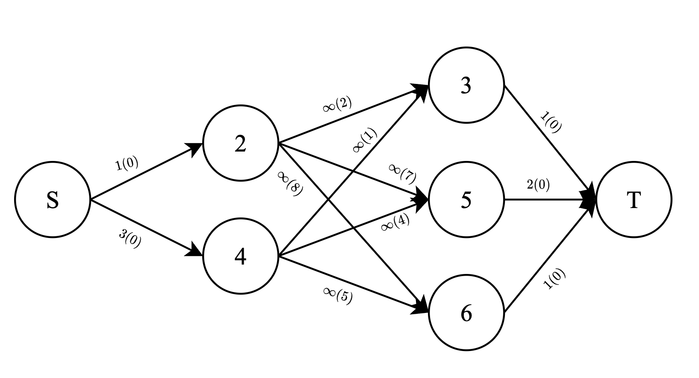
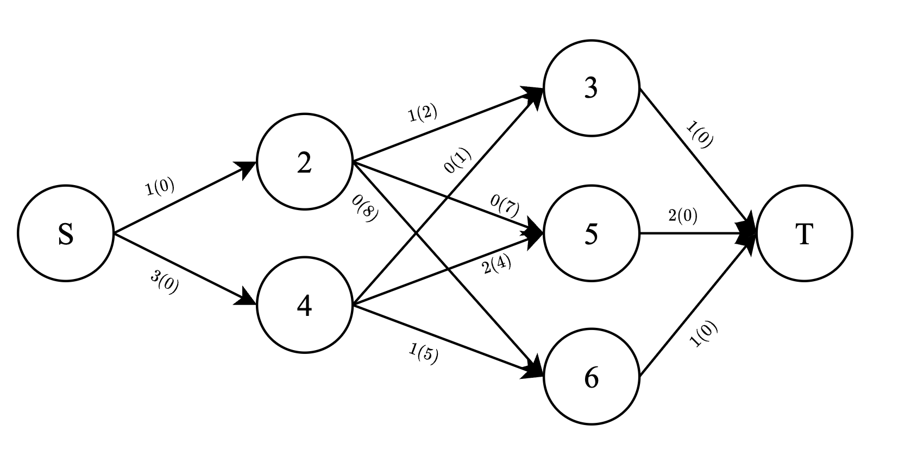

<h1 style='text-align: center;'> F. MCMF?</h1>

<h5 style='text-align: center;'>time limit per test: 3 seconds</h5>
<h5 style='text-align: center;'>memory limit per test: 256 megabytes</h5>

You are given two integer arrays $a$ and $b$ ($b_i \neq 0$ and $|b_i| \leq 10^9$). Array $a$ is sorted in non-decreasing order.

The cost of a subarray $a[l:r]$ is defined as follows:

* If $ \sum\limits_{j = l}^{r} b_j \neq 0$, then the cost is not defined.
* Otherwise:


	+ Construct a bipartite flow graph with $r-l+1$ vertices, labeled from $l$ to $r$, with all vertices having $b_i \lt 0$ on the left and those with $b_i \gt 0$ on right. For each $i, j$ such that $l \le i, j \le r$, $b_i<0$ and $b_j>0$, draw an edge from $i$ to $j$ with infinite capacity and cost of unit flow as $|a_i-a_j|$.
	+ Add two more vertices: source $S$ and sink $T$.
	+ For each $i$ such that $l \le i \le r$ and $b_i<0$, add an edge from $S$ to $i$ with cost $0$ and capacity $|b_i|$.
	+ For each $i$ such that $l \le i \le r$ and $b_i>0$, add an edge from $i$ to $T$ with cost $0$ and capacity $|b_i|$.
	+ The cost of the subarray is then defined as the minimum cost of maximum flow from $S$ to $T$.

You are given $q$ queries in the form of two integers $l$ and $r$. You have to compute the cost of subarray $a[l:r]$ for each query, modulo $10^9 + 7$.

If you don't know what the minimum cost of maximum flow means, read [here](https://en.wikipedia.org/wiki/Minimum-cost_flow_problem).

### Input

The first line of input contains two integers $n$ and $q$ $(2 \leq n \leq 2\cdot 10^5, 1 \leq q \leq 2\cdot10^5)$  — length of arrays $a$, $b$ and the number of queries.

The next line contains $n$ integers $a_1,a_2 \ldots a_n$ ($0 \leq a_1 \le a_2 \ldots \le a_n \leq 10^9)$  — the array $a$. It is guaranteed that $a$ is sorted in non-decreasing order.

The next line contains $n$ integers $b_1,b_2 \ldots b_n$ $(-10^9\leq b_i \leq 10^9, b_i \neq 0)$  — the array $b$.

The $i$-th of the next $q$ lines contains two integers $l_i,r_i$ $(1\leq l_i \leq r_i \leq n)$. It is guaranteed that $ \sum\limits_{j = l_i}^{r_i} b_j = 0$.

### Output

For each query $l_i$, $r_i$  — print the cost of subarray $a[l_i:r_i]$ modulo $10^9 + 7$.

## Example

### Input


```text
8 4
1 2 4 5 9 10 10 13
6 -1 1 -3 2 1 -1 1
2 3
6 7
3 5
2 6
```
### Output


```text
2
0
9
15
```
## Note

In the first query, the maximum possible flow is $1$ i.e one unit from source to $2$, then one unit from $2$ to $3$, then one unit from $3$ to sink. The cost of the flow is $0 \cdot 1 + |2 - 4| \cdot 1 + 0 \cdot 1 = 2$.

In the second query, the maximum possible flow is again $1$ i.e from source to $7$, $7$ to $6$, and $6$ to sink with a cost of $0 \cdot |10 - 10| \cdot 1 + 0 \cdot 1 = 0$. 

In the third query, the flow network is shown on the left with capacity written over the edge and the cost written in bracket. The image on the right shows the flow through each edge in an optimal configuration. 

   Maximum flow is $3$ with a cost of $0 \cdot 3 + 1 \cdot 1 + 4 \cdot 2 + 0 \cdot 1 + 0 \cdot 2 = 9$.In the fourth query, the flow network looks as – 

  The minimum cost maximum flow is achieved in the configuration – 

  The maximum flow in the above network is 4 and the minimum cost of such flow is 15.


#### Tags 

#2700 #NOT OK #data_structures #flows #graphs #greedy #sortings #two_pointers 

## Blogs
- [All Contest Problems](../Codeforces_Round_793_(Div._2).md)
- [Announcement (en)](../blogs/Announcement_(en).md)
- [Tutorial (en)](../blogs/Tutorial_(en).md)
