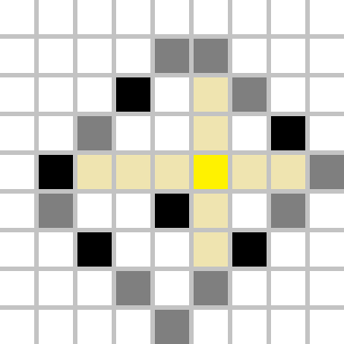

# Tutorial_(en)

[1689A - Lex String](../problems/A._Lex_String.md "Codeforces Round 798 (Div. 2)")
====================================================================================================

Author: [wxhtzdy](https://codeforces.com/profile/wxhtzdy "Grandmaster wxhtzdy")

 **Hint**Greedily take the smallest character in both strings. What's the exception to this?

 **Solution**We can't take the smallest character in both strings when we've already took k elements from the string we chose. Denote A as the number of characters we've took from string a in the last few consecutive moves and denote B the same for b. If A=k, then we have to take the smallest character in string b instead of possibly a. If B=k, then we have to take the smallest character in string a instead of possibly b.

Remember to reset A to 0 when you take a character from b. Similarly, reset B to 0 when you take a character from a.

 **C++ Code**
```cpp
#include <bits/stdc++.h>
 
using namespace std;
 
int main()
{
    ios_base::sync_with_stdio(false);
    cin.tie(0),cout.tie(0);
 
    int t; cin>>t;
    while (t--)
    {
        int n,m,k; cin>>n>>m>>k;
        string a,b,c; cin>>a>>b;
        sort(a.begin(),a.end(),greater<char>());
        sort(b.begin(),b.end(),greater<char>());
 
        int ak=0,bk=0;
        while (!a.empty() && !b.empty())
        {
            bool gde=b.back()<a.back();
            if (gde && bk==k) gde=0;
            if (!gde && ak==k) gde=1;
 
            if (gde) c.push_back(b.back()),bk++,ak=0,b.pop_back();
            else c.push_back(a.back()),ak++,bk=0,a.pop_back();
        }
 
        cout<<c<<"n";
    }
}
```
[1689B - Mystic Permutation](../problems/B._Mystic_Permutation.md "Codeforces Round 798 (Div. 2)")
============================================================================================================

Author: [n0sk1ll](https://codeforces.com/profile/n0sk1ll "Candidate Master n0sk1ll")

 **Hint 1**When is it impossible to find such permutation?

 **Hint 2**It is impossible only for n=1. In every other case, iterate over each position in order from 1 to n and take the smallest available number. What's the exception to this?

 **Solution**The exception is the last two elements. We can always take the smallest available number for each qi satisfying i<n−1. To do this we maintain an array of bools of already taken numbers, and then iterate over it to find the smallest available number satisfying pi≠qi which is also not checked in the array, and then check it (we took it).

Now consider (pn−1,pn) and we want (qn−1,qn) to be lexicographically minimal while satisfying pn−1≠qn−1 and pn≠qn. Let a and b be the last two unused numbers in the array of bools with a<b. We try to take (qn−1,qn)=(a,b). If a=pn−1 or b=pn, then we take (qn−1,qn)=(b,a). If (a,b) isn't valid, then (b,a) is. The proof is left as an exercise to the reader.

This solution runs in O(n2) and can be optimized to O(n log n).

 **C++ Code (Main solution)**
```cpp
#include <bits/stdc++.h>
 
using namespace std;
 
bool took[1005];
int p[1005];
 
int main()
{
    ios_base::sync_with_stdio(false);
    cin.tie(0),cout.tie(0);
 
    int t; cin>>t;
    while (t--)
    {
        int n; cin>>n;
        for (int i=1;i<=n;i++) cin>>p[i];
        for (int i=1;i<=n;i++) took[i]=0;
        
        if (n==1)
        {
            cout<<"-1n";
            continue;
        }
 
        for (int i=1;i<=n-2;i++)
        {
            int k=1;
            while (took[k] || k==p[i]) ++k;
            cout<<k<<" "; took[k]=1;
        }
 
        int a=-1,b=-1;
        for (int i=1;i<=n;i++) if (!took[i])
        {
            if (a==-1) a=i;
            else b=i;
        }
 
        if (a!=p[n-1] && b!=p[n]) cout<<a<<" "<<b<<"n";
        else cout<<b<<" "<<a<<"n";
    }
}
```
 **C++ Code (O(n) solution)**
```cpp
#include <bits/stdc++.h>

using namespace std;

int t,n,A[1010],B[1010];

int main()
{
    scanf("%d",&t);
    while(t--)
    {
        scanf("%d",&n);
        for(int i=1; i<=n; i++)
        {
            scanf("%d",&A[i]);
            B[i] = i;
        }
        if(n==1)
        {
            printf("-1n");
            continue;
        }
        for(int i=1; i<n; i++)
        {
            if(A[i]==B[i]) swap(B[i],B[i+1]);
        }
        if(A[n]==B[n]) swap(B[n-1],B[n]);
        for(int i=1; i<=n; i++) printf("%d ",B[i]);
        printf("n");
    }
    return 0;
}
```
[Riblji_Keksic](https://codeforces.com/profile/Riblji_Keksic "Master Riblji_Keksic") found the O(n) solution.

[1689C - Infected Tree](../problems/C._Infected_Tree.md "Codeforces Round 798 (Div. 2)")
=======================================================================================================

Author: [n0sk1ll](https://codeforces.com/profile/n0sk1ll "Candidate Master n0sk1ll")

 **Hint 1**We always delete a vertex directly connected to an infected one.

 **Hint 2**Use dp.

 **Solution**Let u1,u2,...,uk be the sequence of removed vertices such that the infection cannot spread anymore. If vertex ui was never directly connected to an infected vertex, then we could have deleted its parent instead of ui and we would have got a better solution. Hence, we may assume we always delete a vertex directly connected to an infected one. 

Now, we may use some dynamic programming ideas. Let dpi be the maximum number of vertices we can save in the subtree of vertex i if that vertex is infected and we use operations only in the subtree. We can assume the second as the tree is binary and we have two choices — save the subtree of one child by deleting it and infect the other, or the other way around. In each case, the infection will be "active" in at most one subtree of some vertex. 

If c1 and c2 are the children of vertex i, the transition is

 dpi=max(dpc1+s2−1,dpc2+s1−1)where si denotes the number of vertices in the subtree of i.

The answer to the problem is dp1. Complexity is O(n).

 **C++ Code**
```cpp
#include <bits/stdc++.h>
 
using namespace std;
 
vector<vector<int>> g(300005);
int ch[300005],dp[300005];
 
void dfs(int p, int q)
{
    ch[p]=1,dp[p]=0; int s=0;
    for (auto it : g[p]) if (it!=q)
    {
        dfs(it,p); s+=dp[it];
        ch[p]+=ch[it];
    }
    for (auto it : g[p]) if (it!=q)
    {
        dp[p]=max(dp[p],s-dp[it]+ch[it]-1);
    }
}
 
int main()
{
    ios_base::sync_with_stdio(false);
    cin.tie(0),cout.tie(0);
 
    int t; cin>>t;
    while (t--)
    {
        int n; cin>>n;
        for (int i=1;i<=n;i++) g[i].clear();
        for (int i=1;i<n;i++)
        {
            int u,v; cin>>u>>v;
            g[u].push_back(v);
            g[v].push_back(u);
        }
 
        dfs(1,0);
        cout<<dp[1]<<"n";
    }
}

```
[1689D - Lena and Matrix](../problems/D._Lena_and_Matrix.md "Codeforces Round 798 (Div. 2)")
=========================================================================================================

Author: [n0sk1ll](https://codeforces.com/profile/n0sk1ll "Candidate Master n0sk1ll") 

 **Hint**There are not a lot of useful black squares.

 **Solution**Consider this algorithm: iterate over all squares in the matrix and find the most distant black square. 

Let's find out how to do that efficiently. In fact, only 4 (not necessarily distinct) black squares will be useful: one square which minimizes i−j, one square which maximizes i−j, one square which minimizes i+j and one square which maximizes i+j, where (i,j) denotes the black cell's coordinates. In other words, we would like to find the most distant "border".



Let's look at the example above. The cell we choose to recolour to yellow creates four regions (the top-left rectangle, the top-right rectangle, the bottom-left rectangle and the bottom-right rectangle, which are created by two lines parallel with coordinate axes passing through our yellow point). The most distant border will be fully contained inside one region, hence we should find the distance from our yellow cell to any cell on that border, and that is the maximum possible distance.

The complexity is O(n⋅m).

 **C++ Code**
```cpp
#include <bits/stdc++.h>
 
using namespace std;
 
char tab[1003][1003];
pair<int,int> a={-1,-1},b={-1,-1},c={-1,-1},d={-1,-1};
 
int main()
{
    ios_base::sync_with_stdio(false);
    cin.tie(0),cout.tie(0);
 
    int t; cin>>t;
    while (t--)
    {
        a={-1,-1},b={-1,-1},c={-1,-1},d={-1,-1};
        
        int n,m; cin>>n>>m;
        for (int i=0;i<n;i++) cin>>tab[i];
 
        vector<pair<int,int>> interesting;
 
        for (int i=0;i<n;i++) for (int j=0;j<m;j++) if (tab[i][j]=='B')
        {
            if (a.first==-1 || i+j>a.first+a.second) a={i,j};
            if (b.first==-1 || i+j<b.first+b.second) b={i,j};
            if (c.first==-1 || i-j>c.first-c.second) c={i,j};
            if (d.first==-1 || i-j<d.first-d.second) d={i,j};
        }
 
        interesting.push_back(a);
        interesting.push_back(b);
        interesting.push_back(c);
        interesting.push_back(d);
 
        int ans=1e9; pair<int,int> opt;
        for (int i=0;i<n;i++) for (int j=0;j<m;j++)
        {
            int dist=0;
            for (auto it : interesting) dist=max(dist,abs(i-it.first)+abs(j-it.second));
            if (dist<ans) ans=dist,opt={i,j};
        }
 
        cout<<opt.first+1<<" "<<opt.second+1<<"n";
    }
}
```
[1689E - ANDfinity](../problems/E._ANDfinity.md "Codeforces Round 798 (Div. 2)")
===================================================================================================

Author: [wxhtzdy](https://codeforces.com/profile/wxhtzdy "Grandmaster wxhtzdy")

 **Stupid Hint**Increase every 0 by 1 initially.

 **Hint 1**Check if the answer is 0: check whether the graph is already connected.

 **Hint 2**Check if the answer is 1.

 **Hint 3**If the answer is not 0 or 1, then it is 2.

 **Solution**Firslty, let's understand how to check whether the graph induced by some array b is connected in O(n log max bi). We create a graph over bits. Let's take all elements bi and add an edge between their adjacent bits (all bits of a single bi will be connected). To quickly access the lowest bit we will use bi & −bi in code. Now we just check whether the graph over bits is connected.

We check whether the graph for initial array a is connected. If it is, the answer is 0.

Then, we wonder if the answer is 1. Check if at least one of the graphs for arrays a1,...,ai−1,ai−1,ai+1,...,an for every 1≤i≤n is connected. Do the same for arrays a1,...,ai−1,ai+1,ai+1,...,an. If none of the graphs is connected, the answer is 2 and otherwise 1.

Now let's see how the answer will be at most 2. Let i1,i2,...,ik be the sequence of indices denoting that aij has the highest lowest bit (the highest value of ai & −ai). if k=1 then we can just decrease ai1 by 1 and connect everything. If k≥2 and we do the same we might disconnect that number from other numbers having the highest lowest bit, thus an additional operation of adding 1 to ai2 is needed to keep everything connected. The answer is 2 in this case.

Complexity of this solution is O(n2 log max ai).

 **C++ Code**
```cpp
#include <bits/stdc++.h>
 
using namespace std;
 
int a[2005];
 
vector<vector<int>> g(32);
bool vis[32];
 
void dfs(int p)
{
    if (vis[p]) return; vis[p]=1;
    for (auto it : g[p]) dfs(it);
}
 
bool connected(int n)
{
    int m=0;
    for (int i=0;i<n;i++) if (a[i]==0) return false;
    for (int i=0;i<n;i++) m|=a[i];
    for (int i=0;i<31;i++) g[i].clear();
    for (int i=0;i<n;i++)
    {
        int last=-1;
        for (int j=0;j<31;j++)
            if (a[i]&(1<<j)){
                if (last!=-1) g[last].push_back(j),g[j].push_back(last);
                last=j;
            }
    }
 
    for (int j=0;j<31;j++) vis[j]=0;
    for (int j=0;j<31;j++) if ((1<<j)&m)
    {
        dfs(j); break;
    }
    for (int j=0;j<31;j++) if (((1<<j)&m) && !vis[j]) return false;
    return true;
}
 
int main()
{
    ios_base::sync_with_stdio(false);
    cin.tie(0),cout.tie(0);
 
    int t; cin>>t;
    while (t--){
 
 
    int n; cin>>n;
    for (int i=0;i<n;i++) cin>>a[i];
 
    int ans=0;
    for (int i=0;i<n;i++) if (a[i]==0) ans++,a[i]++;
 
    int m=0;
    for (int i=0;i<n;i++) m=max(m,(a[i]&(-a[i])));
 
    if (connected(n))
    {
        cout<<ans<<"n";
        for (int i=0;i<n;i++) cout<<a[i]<<" "; cout<<"n";
        goto kraj;
    }
 
    for (int i=0;i<n;i++)
    {
        a[i]--;
        if (connected(n))
        {
            cout<<ans+1<<"n";
            for (int i=0;i<n;i++) cout<<a[i]<<" "; cout<<"n";
            goto kraj;
        }
        a[i]++;
    }
    
    for (int i=0;i<n;i++)
    {
        a[i]++;
        if (connected(n))
        {
            cout<<ans+1<<"n";
            for (int i=0;i<n;i++) cout<<a[i]<<" "; cout<<"n";
            goto kraj;
        }
        a[i]--;
    }
 
    for (int i=0;i<n;i++) if ((a[i]&-a[i])==m)
    {
        a[i]--;
        break;
    }
    for (int i=0;i<n;i++) if ((a[i]&-a[i])==m)
    {
        a[i]++;
        break;
    }
 
    cout<<ans+2<<"n";
    for (int i=0;i<n;i++) cout<<a[i]<<" ";
    cout<<"n";
    
    kraj:;
    }
}
```
