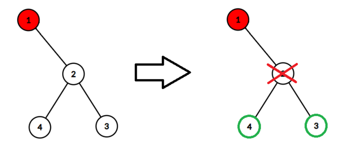

<h1 style='text-align: center;'> C. Infected Tree</h1>

<h5 style='text-align: center;'>time limit per test: 3 seconds</h5>
<h5 style='text-align: center;'>memory limit per test: 256 megabytes</h5>

Byteland is a beautiful land known because of its beautiful trees.

Misha has found a binary tree with $n$ vertices, numbered from $1$ to $n$. A binary tree is an acyclic connected bidirectional graph containing $n$ vertices and $n - 1$ edges. Each vertex has a degree at most $3$, whereas the root is the vertex with the number $1$ and it has a degree at most $2$.

Unfortunately, the root got infected.

The following process happens $n$ times:

* Misha either chooses a non-infected (and not deleted) vertex and deletes it with all edges which have an end in this vertex or just does nothing.
* Then, the infection spreads to each vertex that is connected by an edge to an already infected vertex (all already infected vertices remain infected).

As Misha does not have much time to think, please tell him what is the maximum number of vertices he can save from the infection (note that deleted vertices are not counted as saved).

### Input

There are several test cases in the input data. The first line contains a single integer $t$ ($1\leq t\leq 5000$) — the number of test cases. This is followed by the test cases description.

The first line of each test case contains one integer $n$ ($2\leq n\leq 3\cdot 10^5$) — the number of vertices of the tree. 

The $i$-th of the following $n-1$ lines in the test case contains two positive integers $u_i$ and $v_i$ ($1 \leq u_i, v_i \leq n$), meaning that there exists an edge between them in the graph. 

It is guaranteed that the graph is a binary tree rooted at $1$. It is also guaranteed that the sum of $n$ over all test cases won't exceed $3\cdot 10^5$.

### Output

For each test case, output the maximum number of vertices Misha can save.

## Example

### Input


```text
421 241 22 32 471 21 52 32 45 65 7151 22 33 44 54 63 72 81 99 109 1110 1210 1311 1411 15
```
### Output

```text

0
2
2
10

```
## Note

In the first test case, the only possible action is to delete vertex $2$, after which we save $0$ vertices in total.

In the second test case, if we delete vertex $2$, we can save vertices $3$ and $4$.

  

#### Tags 

#1600 #NOT OK #dfs_and_similar #dp #trees 

## Blogs
- [All Contest Problems](../Codeforces_Round_798_(Div._2).md)
- [Announcement (en)](../blogs/Announcement_(en).md)
- [Tutorial (en)](../blogs/Tutorial_(en).md)
