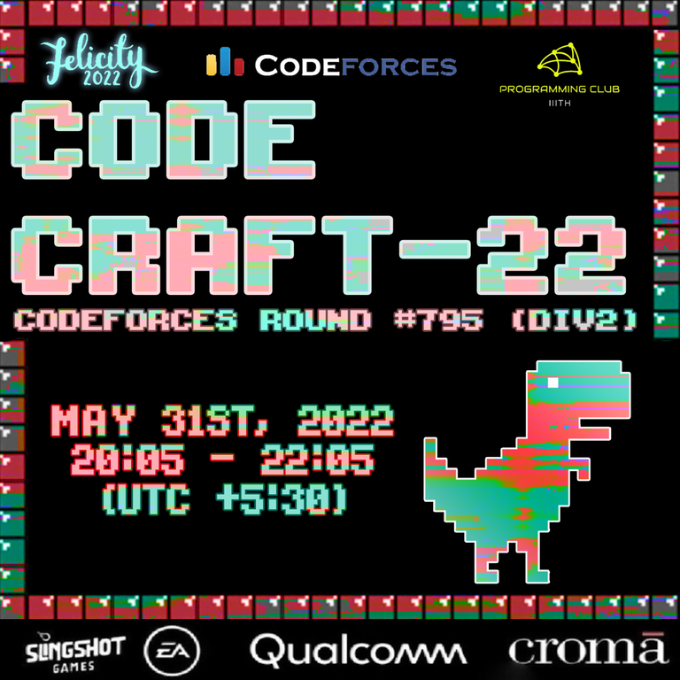

# Announcement_(en)

**Namaste Codeforces!**

We are excited to invite everyone to **CodeCraft-22** which will take place on [Tuesday, May 31, 2022 at 20:35UTC+6](https://codeforces.com/https://www.timeanddate.com/worldclock/fixedtime.html?day=31&month=5&year=2022&hour=17&min=35&sec=0&p1=166). It is rated for all people who are below **yellow**! (rating under 2100)

The [**Programming Club at IIIT-H**](https://codeforces.com/https://iiit-programming-club.github.io/) organizes this event under Threads'22, as a part of our techno-cultural fest [**Felicity, IIIT Hyderabad**](https://codeforces.com/http://felicity.iiit.ac.in).

There are **6** Problems with **2 hours** to solve them. The scoring distribution will be released soon!

We have worked hard to keep the statements clean and the pretests strong! After the contest, **step-wise tutorial** and **video tutorial** will be released along with the code!

 * This round was wonderfully co-ordinated by [darkkcyan](https://codeforces.com/profile/darkkcyan "Grandmaster darkkcyan") and [KAN](https://codeforces.com/profile/KAN "Legendary Grandmaster KAN") orz!
* This round was a joint effort by [rahulgoel](https://codeforces.com/profile/rahulgoel "Expert rahulgoel"), [menavlikar.rutvij](https://codeforces.com/profile/menavlikar.rutvij "Expert menavlikar.rutvij"), [ltc.groverkss](https://codeforces.com/profile/ltc.groverkss "Master ltc.groverkss"), [akcube](https://codeforces.com/profile/akcube "Expert akcube"), [fangahawk](https://codeforces.com/profile/fangahawk "Candidate Master fangahawk"), [JadeReaper](https://codeforces.com/profile/JadeReaper "Expert JadeReaper"), [keyurchd_11](https://codeforces.com/profile/keyurchd_11 "Candidate Master keyurchd_11") and me!
* [KAN](https://codeforces.com/profile/KAN "Legendary Grandmaster KAN") also translated the statements to Russian! **благодарю вас**
* We would like to thank our army of testers for providing valuable feedback: [generic_placeholder_name](https://codeforces.com/profile/generic_placeholder_name "Grandmaster generic_placeholder_name"), [Lomk](https://codeforces.com/profile/Lomk "Grandmaster Lomk"), [TheScrasse](https://codeforces.com/profile/TheScrasse "Grandmaster TheScrasse"), [vinfat](https://codeforces.com/profile/vinfat "Master vinfat"), [codelegend](https://codeforces.com/profile/codelegend "International Master codelegend"), [BucketPotato](https://codeforces.com/profile/BucketPotato "Master BucketPotato"), [ajit](https://codeforces.com/profile/ajit "Master ajit"), [manish.17](https://codeforces.com/profile/manish.17 "Master manish.17"), [Dragonado](https://codeforces.com/profile/Dragonado "Candidate Master Dragonado"), [anmolagarwal999](https://codeforces.com/profile/anmolagarwal999 "Expert anmolagarwal999"), [Lihwy](https://codeforces.com/profile/Lihwy "Expert Lihwy"), [kryptai](https://codeforces.com/profile/kryptai "Expert kryptai"), [ak2006](https://codeforces.com/profile/ak2006 "Specialist ak2006") and [brj](https://codeforces.com/profile/brj "Specialist brj")!
* Thanks to [nandini.maroo](https://codeforces.com/profile/nandini.maroo "Newbie nandini.maroo") and [akcube](https://codeforces.com/profile/akcube "Expert akcube") for helping with the poster design.
* And finally, we would thank [MikeMirzayanov](https://codeforces.com/profile/MikeMirzayanov "Headquarters, MikeMirzayanov") for the platforms Codeforces and Polygon without which all this would not be possible.

We hope you enjoy this contest!

 

---

### UPDATES

Score Distribution: 500 — 750 — 1250 — 1750 — 2250 — 2750  
[**Editorial**](Tutorial_(en).md) is out.

#### Winners

Congratulations to all the winners for such an amazing performance.  
**Global Top 5**  
1. [tourist](https://codeforces.com/profile/tourist "Legendary Grandmaster tourist")  
2. [ksun48](https://codeforces.com/profile/ksun48 "Legendary Grandmaster ksun48")  
3. [noimi](https://codeforces.com/profile/noimi "International Grandmaster noimi")  
4. [jiangly](https://codeforces.com/profile/jiangly "Legendary Grandmaster jiangly")  
5. [Um_nik](https://codeforces.com/profile/Um_nik "Legendary Grandmaster Um_nik") 

**Official Top 5**  
1. [JrNTR](https://codeforces.com/profile/JrNTR "Expert JrNTR")  
2. [YinJinRun](https://codeforces.com/profile/YinJinRun "Master YinJinRun")  
3. [Remakee](https://codeforces.com/profile/Remakee "Newbie Remakee")  
4. [see_wo](https://codeforces.com/profile/see_wo "Master see_wo")  
5. [HowtobeRed](https://codeforces.com/profile/HowtobeRed "Specialist HowtobeRed") 

We will send a CF personal message to the winners of the T-shirts soon.

 

---

### PRIZES

The following twenty lucky participants receive a T-shirt:

 * Top 10 Indian participants.
* Random 10 from top 100 (ranks 11-100) Indian participants.

These ranks are determined from the combined unofficial rank list. People who have their Country set to India in their CF profile will qualify as Indian participants. 

We are giving T-shirts to Indian participants only to avoid logistic issues that we have to face during international delivery. We apologize for this limitation, we will try our best to bring international prizes too from next year. 

 

---

Thanks to [NEAR](https://codeforces.com/https://near.org/) for supporting this round, details can be found in [this post](https://codeforces.com/blog/entry/101398).

