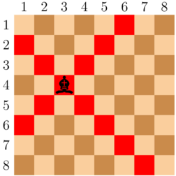

<h1 style='text-align: center;'> C. Where's the Bishop?</h1>

<h5 style='text-align: center;'>time limit per test: 1 second</h5>
<h5 style='text-align: center;'>memory limit per test: 256 megabytes</h5>

Mihai has an $8 \times 8$ chessboard whose rows are numbered from $1$ to $8$ from top to bottom and whose columns are numbered from $1$ to $8$ from left to right.

Mihai has placed exactly one bishop on the chessboard. The bishop is not placed on the edges of the board. (In other words, the row and column of the bishop are between $2$ and $7$, inclusive.)

The bishop attacks in all directions diagonally, and there is no limit to the distance which the bishop can attack. 
## Note

 that the cell on which the bishop is placed is also considered attacked. 

  An example of a bishop on a chessboard. The squares it attacks are marked in red. Mihai has marked all squares the bishop attacks, but forgot where the bishop was! Help Mihai find the position of the bishop.

### Input

The first line of the input contains a single integer $t$ ($1 \leq t \leq 36$) — the number of test cases. The description of test cases follows. There is an empty line before each test case.

Each test case consists of $8$ lines, each containing $8$ characters. Each of these characters is either '#' or '.', denoting a square under attack and a square not under attack, respectively.

### Output

For each test case, output two integers $r$ and $c$ ($2 \leq r, c \leq 7$) — the row and column of the bishop. 

The input is generated in such a way that there is always exactly one possible location of the bishop that is not on the edge of the board.

## Example

### Input


```text
3  
.....#..#...#....#.#......#......#.#....#...#........#........#.  
#.#......#......#.#........#........#........#........#........
#  
.#.....#..#...#....#.#......#......#.#....#...#..#.....##.......
```
### Output

```text

4 3
2 2
4 5

```
## Note

The first test case is pictured in the statement. Since the bishop lies in the intersection row $4$ and column $3$, the correct output is 4 3.


#### Tags 

#800 #OK #implementation 

## Blogs
- [All Contest Problems](../Codeforces_Round_799_(Div._4).md)
- [Announcement (en)](../blogs/Announcement_(en).md)
- [Tutorial (en)](../blogs/Tutorial_(en).md)
