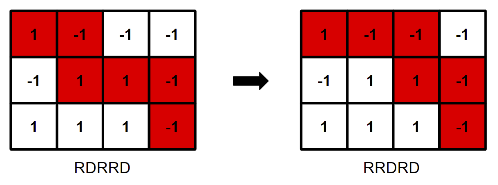

# Tutorial_(en)


### [1695A - Subrectangle Guess](../problems/A._Subrectangle_Guess.md "Codeforces Round 801 (Div. 2) and EPIC Institute of Technology Round")

Note that for any rectangle size, we can always choose an h by w rectangle that contains the maximum element in the grid (which is unique). So in order for Michael to ensure that he can win, he needs to make h and w big enough such that every h by w rectangle contains the maximum element in the grid. 

Let (i,j) be the position of the maximum (1−indexed). The furthest point in the grid from it has to be one of the four corners, and hxw has to be big enough to include that furthest point and (i,j). So just try all four corners and take the biggest rectangle that gives you. This reduces to max(i,n−i+1)⋅max(j,m−j+1) (because the dimensions are independent).

So the answer is max(i,n−i+1)⋅max(j,m−j+1).

Complexity: O(nm)

 **Solution**
```cpp
#include <bits/stdc++.h>
using namespace std;

int grid[45][45];

int main() {
    int num_tests;
    cin >> num_tests;

    for (int test = 0; test < num_tests; ++test) {
        int n, m;
        cin >> n >> m;

        int max_i = 0, max_j = 0;
        
        for (int i = 0; i < n; ++i)
            for (int j = 0; j < m; ++j) {
                cin >> grid[i][j];
                if (grid[i][j] > grid[max_i][max_j])
                    max_i = i, max_j = j;
            }

        int h = max(max_i+1, n-max_i);
        int w = max(max_j+1, m-max_j);
        cout << h * w << 'n';
    }
}

```
 
### [1695B - Circle Game](../problems/B._Circle_Game.md "Codeforces Round 801 (Div. 2) and EPIC Institute of Technology Round")

Note that since all piles are initially nonempty, the game will not end for the first n turns, because on each of those turns, a player will be removing from a nonempty pile. If n is odd, Mike can remove all of the stones from the first pile. Then, on the n+1th turn (the first turn where the game can end), Joe will be forced to remove from the first pile, which is empty. So Mike can always win if n is odd.

If n is even, then Mike will only ever remove from the odd piles, and Joe will only ever remove from the even piles. So each player has n/2 piles, and neither can remove from the other's piles. Therefore, it is optimal for each player to remove the minimal possible number of stones at each step, so that they stay in the game for as long as possible.

So on each turn, a player removes exactly one stone, and the first pile to become empty will be the pile with the minimal number of stones. If there are multiple minimal piles, it will be the leftmost such pile. So if this pile is on an odd position, Mike will lose (and therefore Joe will win), and otherwise Joe will lose (and Mike will win).

Complexity: O(n)

 **Solution**
```cpp
#include <bits/stdc++.h>
using namespace std;

int main() {
    int num_tests;
    cin >> num_tests;

    for (int test = 0; test < num_tests; ++test) {

        int n; cin >> n;
        vector<int> a(n);
        for (int i = 0; i < n; ++i)
            cin >> a[i];

        if (n % 2 == 1) {
            cout << "Miken";
            continue;
        }

        int smallest = 0;
        for (int i = 0; i < n; ++i)
            if (a[i] < a[smallest])
                smallest = i;

        if (smallest % 2 == 0) cout << "Joen";
        else cout << "Miken";
    }
}
```
 
### [1695C - Zero Path](../problems/C._Zero_Path.md "Codeforces Round 801 (Div. 2) and EPIC Institute of Technology Round")

Note that if n+m is even, then the sum of any path from the top left to bottom right will be odd, and therefore nonzero. So in this case, there is no solution.

Otherwise, every path from top left to bottom right will have even sum. For each position (i,j) in the grid, we define maxij to be the maximum possible sum of a path starting at the top left and ending at (i,j). Similarly, minij is defined to be the minimum possible sum starting at the top left and ending at (i,j). These values can be computed using an O(nm) DP, where maxij=aij+max(max(i−1)j,maxi(j−1)) minij=aij+min(min(i−1)j,mini(j−1)) If 0<minnm or maxnm<0, there is no path adding up to zero. Otherwise, 0 lies in the range [minnm,maxnm], and we can show that there is a valid solution path. 

Proof: Let p1 be a path from (1,1) to (n,m) adding up to minnm, and p2 be another such path adding up to maxnm. Each of these paths consists of n−1 down moves and m−1 right moves, so it can be represented as a string of "R" and "D" of length n+m−2. We can move p1 to p2 by a sequence of operations where we swap two adjacent (and different) characters. Visually, what we are doing is replacing one square on the path with a square diagonally adjacent to it. The below picture shows one possible operation on a path.

Note that in each step, the sum of values on the path changes by either −2,0, or 2. So after performing this sequence of operations taking p1 to p2, we have moved the path with sum minnm to a path with sum maxnm, changing the sum by −2,0, or 2 at each step. Therefore, because both minnm and maxnm are even, and minnm≤0≤maxnm, at some point in this sequence of operations, the sum of the path must be zero.

Complexity: O(nm)

 **Solution**
```cpp
#include <bits/stdc++.h>
using namespace std;

#define N 1010

int grid[N][N], mn[N][N], mx[N][N];

int main() {
    int num_tests;
    cin >> num_tests;

    for (int test = 0; test < num_tests; ++test) {
        int n, m;
        cin >> n >> m;
        
        for(int i = 0; i < n; ++i)
            for(int j = 0; j < m; ++j)
                cin >> grid[i][j];
        
        mn[0][0] = mx[0][0] = grid[0][0];
        
        for(int i = 1; i < n; ++i)
            mx[i][0] = mn[i][0] = mx[i - 1][0] + grid[i][0];
        
        for(int j = 1; j < m; ++j)
            mx[0][j] = mn[0][j] = mx[0][j - 1] + grid[0][j];
        
        for(int i = 1; i < n; ++i)
            for(int j = 1; j < m; ++j) {
                mx[i][j] = max(mx[i - 1][j], mx[i][j - 1]) + grid[i][j];
                mn[i][j] = min(mn[i - 1][j], mn[i][j - 1]) + grid[i][j];
            }
        
        if(mx[n - 1][m - 1] % 2 || mn[n - 1][m - 1] > 0 || mx[n - 1][m - 1] < 0)
            cout << "NOn";
        else
            cout << "YESn";
    }
}
```
 
### [1695D1 - Tree Queries (Easy Version)](../problems/D1._Tree_Queries_(Easy_Version).md "Codeforces Round 801 (Div. 2) and EPIC Institute of Technology Round")

If n=1, then no queries are needed, because there is only one vertex. Otherwise, we need at least one query.

If we fix a node u, and force it to be a query, we can root the tree at u and do a greedy DFS to compute the answer. Note that because we guarantee that the root is a query, when we are computing the answer for any node v in this DFS, we can assume that either v or some vertex not in the subtree of v has already been queried.

We define ans[v] to be the minimal number of queries to distinguish all vertices in the subtree of v, given that v or some vertex not in the subtree of v has been queried. Note that for each child c of v, we need to be able to distinguish all vertices in the subtree of c, so we have ans[v]≥∑cans[c]. Additionally, there can be at most one child c of v with no queries in its subtree, otherwise all of these children will be indistinguishable by the queries. If there are x>1 such children of v, we can query the first x−1 of them, which will be enough to differentiate all vertices in these x subtrees. So, using this definition of x, our final formula is

ans[v]=∑cans[c]+max(0,x−1)

For each possible root, we do a DFS to recursively compute these answers. The answer is the minimum ans[root]+1, where the +1 is to account for the fact that we are querying the root.

Complexity: O(n^2)

 **Solution**
```cpp
#include <bits/stdc++.h>
using namespace std;

#define N 2010

vector<int> tree[N];

int dfs(int i, int p) {
    int sm = 0, z = 0;
    
    for (int j : tree[i]) if (j != p) {
        int x = dfs(j, i);
        sm += x;
        if (x == 0)
            z++;
    }
    
    return sm + max(0, z - 1);
}

int main() {
    int num_tests;
    cin >> num_tests;

    for (int test = 0; test < num_tests; ++test) {
        int n;
        cin >> n;
        
        for (int i = 1; i < n; ++i) {
            int u, v;
            cin >> u >> v;
            tree[u].push_back(v);
            tree[v].push_back(u);
        }
        
        if (n == 1)
            cout << "0n";
        else {
            int ans = n;

            for (int i = 1; i <= n; ++i)
                ans = min(ans, 1 + dfs(i, i));
            
            cout << ans << 'n';
        }
        
        for (int i = 1; i <= n; ++i)
            tree[i].clear();
    }
}
```
 
### [1695D2 - Tree Queries (Hard Version)](../problems/D2._Tree_Queries_(Hard_Version).md "Codeforces Round 801 (Div. 2) and EPIC Institute of Technology Round")

In the previous solution, we forced the root to be a query, because we needed to ensure that for every node v, either v was queried, or there was a query outside the subtree of v. Notice that if the root has degree ≥3, regardless of whether we query the root, this property still holds. The way we compute values in the DFS ensures that at least degree[root]−1≥2 subtrees of the root will have at least one query. Therefore, for each other vertex, some vertex outside its subtree must have a query.

So the solution is the same as D1, except we root the tree at any vertex of degree ≥3, and don't query the root itself. If there are no vertices of degree ≥3, then the tree is a path, and querying either of the endpoints is sufficient, so the answer is 1.

Complexity: O(n)

 **Solution**
```cpp
#include <bits/stdc++.h>
using namespace std;

#define N 200010

vector<int> tree[N];

int dfs(int i, int p) {
    int sm = 0, z = 0;
    
    for (int j : tree[i]) if (j != p) {
        int x = dfs(j, i);
        sm += x;
        if (x == 0)
            z++;
    }
    
    return sm + max(0, z - 1);
}

int main() {
    int num_tests;
    cin >> num_tests;

    for (int test = 0; test < num_tests; ++test) {
        int n;
        cin >> n;
        
        for (int i = 1; i < n; ++i) {
            int u, v;
            cin >> u >> v;
            tree[u].push_back(v);
            tree[v].push_back(u);
        }

        int max_deg = 0;
        for (int i = 1; i <= n; ++i)
            max_deg = max(max_deg, (int)tree[i].size());
        
        if (max_deg == 0)
            cout << "0n";
        else if (max_deg < 3)
            cout << "1n";
        else {
            for (int i = 1; i <= n; ++i)
                if (tree[i].size() >= 3) {
                    cout << dfs(i, i) << 'n';
                    break;
                }
        }
        
        for (int i = 1; i <= n; ++i)
            tree[i].clear();
    }
}
```
 
### [1695E - Ambiguous Dominoes](../problems/E._Ambiguous_Dominoes.md "Codeforces Round 801 (Div. 2) and EPIC Institute of Technology Round")

We represent the set of dominoes as a graph on 2n vertices, where the vertices are the values 1 to 2n, and the ith domino represents an edge between xi and yi. Note that this graph can contain self-loops and duplicate edges.

If any of the connected components of the graph contain only one edge, then that means that there is a domino such that its xi and yi values don't appear in any other dominoes. Therefore, this domino must be in the same location in both grids, so there is no solution.

Otherwise, iterate over all connected components with >0 edges, which must therefore contain ≥2 edges. For a component with k edges, we will run a DFS that will generate a valid 2 by k grid for the k dominoes in this component.

As we go through this DFS, we keep track of which vertices and which edges we've already seen. When we DFS from a vertex u we haven't seen, mark it as seen, and iterate over all edges adjacent to u that we haven't seen. Mark each one as seen, and then traverse it to the other vertex v, marking u as its parent. Once we backtrack to u, continue to the next unseen edge. Once all unseen edges are traversed, traverse back to the parent of u. 

When we visit a vertex u we have already seen, just traverse the edge back to its parent.

Throughout this process, maintain a list of all vertices we've seen in order, including any duplicates. Because we traverse every edge exactly twice (once in each direction) in this DFS, this list will be of size 2k+1, and every two adjacent vertices in the list are connected by an edge. Each edge will be represented in two positions in this list.

We can additionally prove that within this list, each edge appears in one even position and one odd position.

Proof: Let uv be an edge that we initially traverse from u to v. If v has already been traversed by this point in the DFS, we immediately traverse back to u, so the two positions of uv are adjacent in the list, and thus on different parity positions.

If not, consider the final sequence of edges traversed, but removing any edges that are immediately traversed backwards. Note that since we are only removing pairs of adjacent edges, the parities of positions of edges in the list are unchanged. Now, the sequence of edges is just a DFS traversal of a tree. So because the graph is now a tree, and thus bipartite, any path from v to itself must be of even length. Therefore, the sequence of moves looks like (...,uv, [an even number of edges], vu,...) and therefore the two occurrences of uv must be on different parities.

Now, to generate the 2 by k grid that works for this component, we note that the list of size 2k+1 can be seen as a cyclic list of size 2k, because the first and last element of the list must be equal. So we pop the last element of the list off, and insert the remaining vertices of the list into a 2 by k grid in clockwise order. Now, the edges form a cycle of length 2k, and because each edge appears on one odd and one even position, each domino will appear exactly once in both of the below orientations. Each of these orientations takes the dominoes going around the cycle in order.

To get the solution for the whole problem, simply concatenate the 2 by k grids for each component into a 2 by n grid.

The below example demonstrates the whole process. The blue edges are the edges to previously-seen vertices, and the red edges are the edges to previously-unseen vertices.

Complexity: O(n)

 **Solution**
```cpp
#include <bits/stdc++.h>
using namespace std;

#define N 600010

vector<pair<int, int>> graph[N];
vector<int> lst;

int ans[2][N];

bool used[N], usedEdges[N];

void dfs(int i) {
    lst.push_back(i);

    if (!used[i]) {
        used[i] = true;
        
        for (pair<int, int> p : graph[i])
            if (!usedEdges[p.second]) {
                usedEdges[p.second] = true;
                dfs(p.first);
                lst.push_back(i);
            }
    }
}

int main() {

    int n; cin >> n;
    string ptop(n, 'U'), pbot(n, 'D');
    string mtop(n, 'U'), mbot(n, 'D');

    for (int i = 0; i < n; ++i) {
        int u, v;
        cin >> u >> v;
        graph[u].emplace_back(v, i);
        graph[v].emplace_back(u, i);
    }

    int idx = 0;
    for (int i = 1; i <= 2 * n; ++i) if (!used[i]) {

        dfs(i);
        lst.pop_back();
        int k = lst.size() / 2;
        
        if (k == 1) {
            cout << "-1n";
            exit(0);
        }

        for (int j = 0; j < k; ++j) {
            ans[0][j + idx] = lst[j];
            ans[1][j + idx] = lst[2 * k - 1 - j];
        }

        for (int j = 0; j < k - 1; j += 2)
            ptop[j + idx] = pbot[j + idx] = 'L', ptop[j + 1 + idx] = pbot[j + 1 + idx] = 'R';
        for (int j = 1; j < k - 1; j += 2)
            mtop[j + idx] = mbot[j + idx] = 'L', mtop[j + 1 + idx] = mbot[j + 1 + idx] = 'R';
        lst.clear();

        idx += k;
    }

    cout << "2 " << n << 'n';
    
    for (int i = 0; i < 2; ++i) {
        for (int j = 0; j < n; ++j)
            cout << ans[i][j] << ' ';
        cout << 'n';
    }

    cout << ptop << 'n' << pbot << 'n';
    cout << mtop << 'n' << mbot << 'n';
}
```
