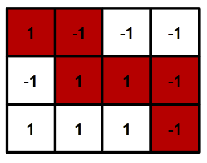

<h1 style='text-align: center;'> C. Zero Path</h1>

<h5 style='text-align: center;'>time limit per test: 2 seconds</h5>
<h5 style='text-align: center;'>memory limit per test: 256 megabytes</h5>

You are given a grid with $n$ rows and $m$ columns. We denote the square on the $i$-th ($1\le i\le n$) row and $j$-th ($1\le j\le m$) column by $(i, j)$ and the number there by $a_{ij}$. All numbers are equal to $1$ or to $-1$. 

You start from the square $(1, 1)$ and can move one square down or one square to the right at a time. In the end, you want to end up at the square $(n, m)$.

Is it possible to move in such a way so that the sum of the values written in all the visited cells (including $a_{11}$ and $a_{nm}$) is $0$?


### Input

Each test contains multiple test cases. The first line contains the number of test cases $t$ ($1 \leq t \leq 10^4$). Description of the test cases follows.

The first line of each test case contains two integers $n$ and $m$ ($1 \le n, m \le 1000$)  — the size of the grid.

Each of the following $n$ lines contains $m$ integers. The $j$-th integer on the $i$-th line is $a_{ij}$ ($a_{ij} = 1$ or $-1$)  — the element in the cell $(i, j)$.

It is guaranteed that the sum of $n\cdot m$ over all test cases does not exceed $10^6$.

### Output

For each test case, print "YES" if there exists a path from the top left to the bottom right that adds up to $0$, and "NO" otherwise. You can output each letter in any case.

## Example

### Input


```text
51 111 21 -11 41 -1 1 -13 41 -1 -1 -1-1 1 1 -11 1 1 -13 41 -1 1 1-1 1 -1 11 -1 1 1
```
### Output

```text

NO
YES
YES
YES
NO

```
## Note

One possible path for the fourth test case is given in the picture in the statement.


#### Tags 

#1700 #OK #brute_force #data_structures #dp #graphs #greedy #shortest_paths 

## Blogs
- [All Contest Problems](../Codeforces_Round_801_(Div._2)_and_EPIC_Institute_of_Technology_Round.md)
- [Announcement (en)](../blogs/Announcement_(en).md)
- [Tutorial (en)](../blogs/Tutorial_(en).md)
