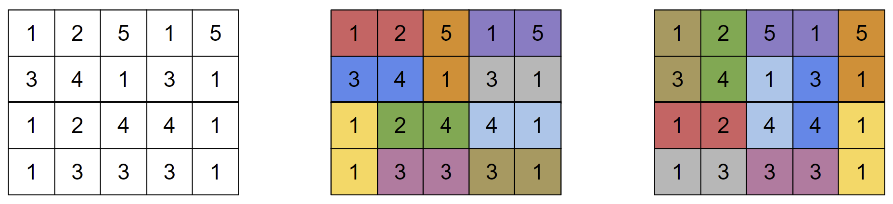

<h1 style='text-align: center;'> E. Ambiguous Dominoes</h1>

<h5 style='text-align: center;'>time limit per test: 8 seconds</h5>
<h5 style='text-align: center;'>memory limit per test: 256 megabytes</h5>

Polycarp and Monocarp are both solving the same puzzle with dominoes. They are given the same set of $n$ dominoes, the $i$-th of which contains two numbers $x_i$ and $y_i$. They are also both given the same $m$ by $k$ grid of values $a_{ij}$ such that $m\cdot k = 2n$.

The puzzle asks them to place the $n$ dominoes on the grid in such a way that none of them overlap, and the values on each domino match the $a_{ij}$ values that domino covers. Dominoes can be rotated arbitrarily before being placed on the grid, so the domino $(x_i, y_i)$ is equivalent to the domino $(y_i, x_i)$.

They have both solved the puzzle, and compared their answers, but noticed that not only did their solutions not match, but none of the $n$ dominoes were in the same location in both solutions! Formally, if two squares were covered by the same domino in Polycarp's solution, they were covered by different dominoes in Monocarp's solution. The diagram below shows one potential $a$ grid, along with the two players' solutions.

  Polycarp and Monocarp remember the set of dominoes they started with, but they have lost the grid $a$. Help them reconstruct one possible grid $a$, along with both of their solutions, or determine that no such grid exists.

##### Input

The first line contains a single integer $n$ ($1 \le n \le 3\cdot 10^5$).

The $i$-th of the next $n$ lines contains two integers $x_i$ and $y_i$ ($1 \le x_i, y_i \le 2n$).

##### Output

If there is no solution, print a single integer $-1$.

Otherwise, print $m$ and $k$, the height and width of the puzzle grid, on the first line of output. These should satisfy $m\cdot k = 2n$.

The $i$-th of the next $m$ lines should contain $k$ integers, the $j$-th of which is $a_{ij}$.

The next $m$ lines describe Polycarp's solution. Print $m$ lines of $k$ characters each. For each square, if it is covered by the upper half of a domino in Polycarp's solution, it should contain a "U". Similarly, if it is covered by the bottom, left, or right half of a domino, it should contain "D", "L", or "R", respectively.

The next $m$ lines should describe Monocarp's solution, in the same format as Polycarp's solution.

If there are multiple answers, print any.

## Examples

##### Input


```text
1
1 2
```
##### Output


```text
-1
```
##### Input


```text
2
1 1
1 2
```
##### Output


```text
2 2

2 1
1 1

LR
LR

UU
DD
```
##### Input


```text
10
1 3
1 1
2 1
3 4
1 5
1 5
3 1
2 4
3 3
4 1
```
##### Output


```text
4 5

1 2 5 1 5
3 4 1 3 1
1 2 4 4 1
1 3 3 3 1

LRULR
LRDLR
ULRLR
DLRLR

UULRU
DDUUD
LRDDU
LRLRD
```
## Note

Extra blank lines are added to the output for clarity, but are not required.

The third sample case corresponds to the image from the statement.


#### Tags 

#2700 #NOT OK #constructive_algorithms #dfs_and_similar #graphs 

## Blogs
- [All Contest Problems](../Codeforces_Round_801_(Div._2)_and_EPIC_Institute_of_Technology_Round.md)
- [Announcement (en)](../blogs/Announcement_(en).md)
- [Tutorial (en)](../blogs/Tutorial_(en).md)
