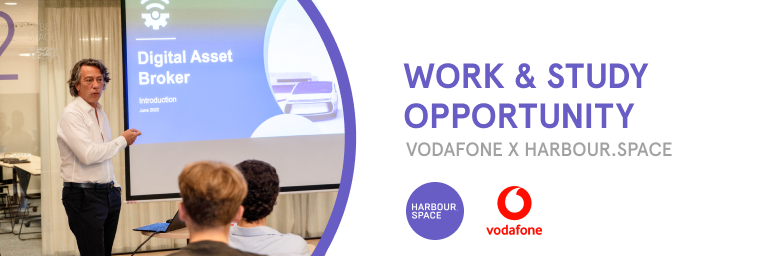
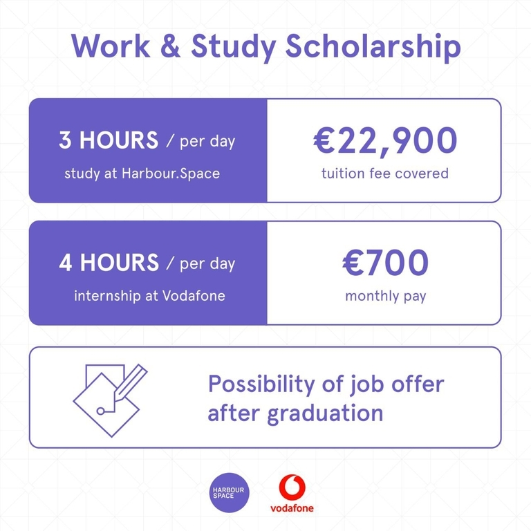

# Announcement

Hello Codeforces!

On [Sunday, June 12, 2022 at 20:35UTC+6](https://codeforces.com/https://www.timeanddate.com/worldclock/fixedtime.html?day=12&month=6&year=2022&hour=17&min=35&sec=0&p1=166) [Educational Codeforces Round 130 (Rated for Div. 2)](https://codeforces.com/contest/1697 "Educational Codeforces Round 130 (Rated for Div. 2)") will start.

Series of Educational Rounds continue being held as [Harbour.Space University](https://codeforces.com/https://harbour.space/) initiative! You can read the details about the cooperation between [Harbour.Space University](https://codeforces.com/https://harbour.space/) and Codeforces in the [blog post](//codeforces.com/blog/entry/51208).

This round will be **rated for the participants with rating lower than 2100**. It will be held on extended ICPC rules. The penalty for each incorrect submission until the submission with a full solution is 10 minutes. After the end of the contest you will have 12 hours to hack any solution you want. You will have access to copy any solution and test it locally.

You will be given **6 or 7 problems** and **2 hours** to solve them.

The problems were invented and prepared by Adilbek [adedalic](https://codeforces.com/profile/adedalic "International Master adedalic") Dalabaev, Vladimir [vovuh](https://codeforces.com/profile/vovuh "Master vovuh") Petrov, Ivan [BledDest](https://codeforces.com/profile/BledDest "International Grandmaster BledDest") Androsov, Maksim [Neon](https://codeforces.com/profile/Neon "Candidate Master Neon") Mescheryakov and me. Also huge thanks to Mike [MikeMirzayanov](https://codeforces.com/profile/MikeMirzayanov "Headquarters, MikeMirzayanov") Mirzayanov for great systems Polygon and Codeforces.

Good luck to all the participants!

Our friends at Harbour.Space also have a message for you:

*Hey, Codeforces!*

*We are thrilled to announce an amazing work & study opportunity with Vodafone.* 

*[Vodafone Group](https://codeforces.com/https://www.vodafone.com/) has partnered with [Harbour.Space University](https://codeforces.com/https://harbour.space/) to offer **Bachelor's and Master’s degree scholarships** in Computer Science, Data Science, Cyber Security and Front-end Development as well as **MBA**s and **work experience** in one of the leading UK telecommunication companies.* 

*Vodafone Group is opening a new technological HUB in Malaga, an international center of excellence dedicated to research and development of technical solutions, such as Secure Networks, 5G and 6G development, Open RAN, IoT, MPN & MEC and UCC for Vodafone Business, platforms and enterprise solutions.*

*We are looking for various **junior** to **mid** level positions (or **senior**) to fill in different fields such as:*

 * *Front-end Development*
* *Full-stack Development*
* *Backend Development*
* *Technical Architecture*
* *Enterprise Architecture*

***APPRENTICESHIP REQUIREMENTS***

***General Requirements**:*

 * *High School Diploma or Bachelor's Degree with prior work experience*
* *CV or LinkedIn Profile (your Codeforces rank has to be added to your CV)*
* *Proficiency in English (Spanish is a plus)*

*Requirements for **Frontend Developer**:*

 * *At least 1-3 years of experience in Angular.*
* *At least 1-3 year of experience working in React.*
* *Strong knowledge of web platform fundamentals: HTML, JavaScript and CSS.*
* *Design and implementation of low-latency, high-availability, and performant applications*
* *Definition / construction of CI / CD pipelines using tools such as Jenkins, Sonar, Kiuwan.*

*Requirements for **Full-Stack Developer**:*

 * *Minimum 3 years of proven experience in platform development (CDI/DevOps based environment). With one or more of the following:*
* *Java SE/ Javascript*
* *Scripting languages, i.e. python, perl, shell scripts.*
* *Proven experience in backend & frontend software systems & web applications.*
* *Proven experience with HTPP, MQTT, LwM2M, Kafka, various databases (SQL and non-SQL).*
* *Proficiency in cloud-native development.*
* *Hands-on experience with CDI tools.*

*Requirements for **Java Developer**:*

 * *Industry experience with Software Platforms in Linux, on-premises and cloud*
* *Solid understanding of server technologies*
* *Strong academic knowledge and professional experience of software development: Java Enterprise, Oracle, Linux, Windows*
* *Good understanding of system monitoring tools and automated testing frameworks*
* *Experience with SQL, XML, JSON and CSV*
* *Experience of providing and maintaining transformations and APIs for customers and partners*
* *Good understanding of Databases – Oracle, MongoDB, ElasticSearch.*
* *Good understanding of java frameworks, SpringBoot, Spring technologies*
* *Good understanding of container systems (docker) and orchestrators (docker compose, Kubernetes) and messaging technologies, kafka, rabbitmq*
* *Good understanding of Unix shell, Perl, python to perform automation and maintenance tasks and CI/CD environments*
* *Educated to BSc degree level in telecommunications or related discipline with Software Development experience*

   [APPLY NOW →](https://harbour.space/scholarships/java-developer-apprenticeship-vodafone?utm_source=codeforces&utm_medium=partner&utm_campaign=bcn_b2b_voafone-apprenticeship) *Good luck on your round, and see you next time!* 

*Harbour.Space University*

**UPD:** [Editorial is out](Tutorial.md)

