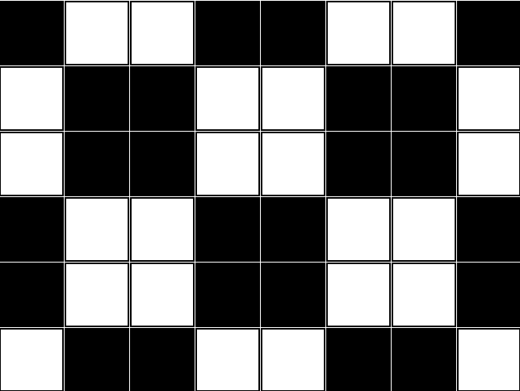

# Tutorial_(en)

The [original blog](https://web.archive.org/web/20220705073720/https://codeforces.com/blog/entry/104088) was deleted yesterday by one of the other authors. We are very sorry about this.

[A — The Third Three Number Problem](../problems/A._The_Third_Three_Number_Problem.md)
===================================================================================

Authors: [antontrygubO_o](https://codeforces.com/profile/antontrygubO_o "International Grandmaster antontrygubO_o"), [Gheal](https://codeforces.com/profile/Gheal "Master Gheal")

 **Hints****Hint 1**An answer exists only when n is even.

 **Hint 2**a⊕a=0

a⊕0=a

 **Solution**First and foremost, it can be proven that (a⊕b)+(b⊕c)+(a⊕c) is always even, for all possible non-negative values of a, b and c. 

 **Proof**Firstly, a⊕b and a+b have the same parity, since a+b=a⊕b+2⋅(a&b). Therefore, (a⊕b)+(b⊕c)+(a⊕c) has the same parity as (a+b)+(b+c)+(a+c)=2⋅(a+b+c).

Therefore, if n is even, one possible solution is a=0, b=0 and c=n2. In this case, (a⊕b)+(b⊕c)+(a⊕c)=0+n2+n2=n. Otherwise, there are no solutions.

Time complexity per testcase: O(1).

 **Code (C++)**
```cpp
  
#include<bits/stdc++.h>

using namespace std;

void testcase(){
    int n;
    cin>>n;

    if(n%2==0)
        cout<<"0 "<<n/2<<' '<<n/2<<'n';
    else
        cout<<"-1n";
}
int main()
{
    ios_base::sync_with_stdio(false); cin.tie(0);
    int t;
    cin>>t;
    while(t--)
        testcase();
    return 0;
}

```
 **Rate Problem**Good problem 


[*58*](https://codeforces.com/data/like?action=like "I like this")


Ok problem 

 
[*8*](https://codeforces.com/data/like?action=like "I like this")


Bad problem 

 
[*8*](https://codeforces.com/data/like?action=like "I like this")


Didn't solve it, idk 

 
[*2*](https://codeforces.com/data/like?action=like "I like this")


 **Post Scriptum**This is actually the third iteration of the problem, which was suggested by [antontrygubO_o](https://codeforces.com/profile/antontrygubO_o "International Grandmaster antontrygubO_o").

The first iteration had |a−b|+|b−c|+|a−c|=n, and the second one had gcd(a,b)+gcd(b,c)+gcd(a,c)=n.

[B — Almost Ternary Matrix](../problems/B._Almost_Ternary_Matrix.md)
==========================================================================

Author: [Gheal](https://codeforces.com/profile/Gheal "Master Gheal")

 **Solution**The general construction consists of a 2×2 checkerboard with a 1-thick border. Here is the intended solution for n=6 and m=8:



Time complexity per testcase: O(nm).

 **Code (C++)**
```cpp
#include<bits/stdc++.h>

using namespace std;
typedef long long ll;

void testcase(){
    ll n,m;
    cin>>n>>m;

    for(ll i=1;i<=n;i++){
        for(ll j=1;j<=m;j++){
            cout<<((i%4<=1)!=(j%4<=1))<<" n"[j==m];
        }
    }
}
int main()
{
    ios_base::sync_with_stdio(false); cin.tie(0);
    int t;
    cin>>t;
    while(t--)
        testcase();
    return 0;
}

```
 **Rate Problem**Good problem 

 
[*98*](https://codeforces.com/data/like?action=like "I like this")


Ok problem 

 
[*14*](https://codeforces.com/data/like?action=like "I like this")


Bad problem 

 
[*35*](https://codeforces.com/data/like?action=like "I like this")


Didn't solve it, idk 

 
[*16*](https://codeforces.com/data/like?action=like "I like this")


[C — The Third Problem](../problems/C._The_Third_Problem.md)
======================================================================

Author: [Gheal](https://codeforces.com/profile/Gheal "Master Gheal")

 **Hints****Hint 1**Let p[x] be the position of x in permutation a.

Since MEX([ap[0]])=1, the only possible position of 0 in permutation b is exactly p[0]. 

 **Hint 2**Continuing this line of thought, where can 1 be placed in permutation b?

 **Hint 3**Without loss of generality, we will assume that p[0]<p[1].

If p[2]<p[0], then how many possible positions can 2 have in permutation b?

If p[0]<p[2]<p[1], then how many possible positions can 2 have in permutation b?

If p[2]>p[1], then how many possible positions can 2 have in permutation b?

 **Solution**Let p[x] be the position of x in permutation a.

Since MEX([ap[0]])=1, the only possible position of 0 in permutation b is exactly p[0]. 

Without loss of generality, we will assume that p[0]<p[1]. For every interval [l,r] (l≤p[0]<p[1]≤r), MEX([bl,…,br]) must be at least 2. For every other interval, MEX([bl,…,br]) cannot exceed 2. The only position for 1 which satisfies both of these constraints is exactly p[1].

Let's consider the current interval [l,r] as being [p[0],p[1]].

If p[2]∈[l,r], we can say that, for every interval [x,y] (x≤l<r≤y), MEX([bx,…,by]) must be at least 3. Similarly, for every other interval, MEX([bx,…,by]) cannot exceed 3. Both of these constraints are only met if 2 occurs in permutation b on some position p∈[l,r]. Since only 2 positions are currently occupied in [l,r], the total number of similar permutations will be multiplied by (r−l+1)−2.

Otherwise, 2 can be placed in permutation b only on p[2]. Additionally, the current interval will be "extended" to include p[2], resuting in either [p[2],r] or [l,p[2]].

After processing 0,1,…,k−2 and k−1, the algorithm for processing k is very similar to the one presented earlier. If p[k]∈[l,r], the answer gets multiplied by (r−l+1)−k. Otherwise, the current interval is extended to include p[k].

Time complexity per testcase: O(n)

 **Code (C++)**
```cpp
#include<bits/stdc++.h>

using namespace std;
typedef long long ll;
const ll NMAX=1e5+5,MOD=1e9+7;
ll v[NMAX],pos[NMAX];
void tc(){
    ll n,l,r,ans=1;
    cin>>n;
    for(ll i=0;i<n;i++){
        cin>>v[i];
        pos[v[i]]=i;
    }
    l=r=pos[0];
    for(ll i=1;i<n;i++){
        if(pos[i]<l) l=pos[i];
        else if(pos[i]>r) r=pos[i];
        else ans=ans*(r-l+1-i)%MOD;
    }
    cout<<ans<<'n';
}
int main()
{
    ios_base::sync_with_stdio(false); cin.tie(0);
    ll t;
    cin>>t;
    while(t--)
        tc();
    return 0;
}

```
 **Rate Problem**Good problem 

 
[*83*](https://codeforces.com/data/like?action=like "I like this")


Ok problem 

 
[*4*](https://codeforces.com/data/like?action=like "I like this")


Bad problem 

 
[*11*](https://codeforces.com/data/like?action=like "I like this")


Didn't solve it, idk 

 
[*16*](https://codeforces.com/data/like?action=like "I like this")


[D — Almost Triple Deletions](../problems/D._Almost_Triple_Deletions.md)
============================================================================

Authors: [Gheal](https://codeforces.com/profile/Gheal "Master Gheal")

 **Hints****Hint 1**Consider the opposite problem: What is the smallest possible length of a final array?

 **Hint 2**For which arrays is the smallest possible final length equal to 0?

 **Hint 3**Considering the second hint, it is possible to completely remove some subarrays from the array.

 **Solution**Lemma: An array a1,a2,…,an can be fully deleted via a sequence of operations if and only if it satisfies both of the following constraints:

 * n is even
* The maximum frequency of any element in the array is at most n2.

 **Proof**If n is odd, then any final array will also have an odd length, which can't be 0.

An optimal strategy is to always delete one of the most frequent elements and any one of its neighbours. If the most frequent element occurs k>n2 times, then the final array will have at least n−2⋅(n−k)=2⋅k−n>0 elements. Otherwise, this strategy ensures the full deletion of the array, since, after performing an operation, it is impossible for an element to occur more than n−22 times in the array.

Since the maximum frequency of a value for every subarray [al,al+1,…,ar] can be computed in O(n2), it is possible to precompute all subarrays which can be deleted via a sequence of operations.

Let dp[i] be the maximum length of a final array consisting of ai and some subsequence from the first i−1 elements. Initially, dp[i] is set to 1 if the prefix [a1,a2,…,ai−1] can be fully deleted. Otherwise, dp[i]=0.

For every pair of indices i and j (1≤j<i≤n,ai=aj), if we can fully delete the subarray [aj+1,aj+2,…ai−1], then we can append ai to any final array ending in aj. Naturally, dp[i] will be strictly greater than dp[j]. This gives us the following recurrence:

dp[i]=maxi−1j=1(dp[j]>0 and ai=aj and [aj+1,aj+2,…,ai−1] is deletable)⋅(dp[j]+1)

If we define a final array as a subsequence of equal elements from the array a, to which an+1 is forcefully appended, then the final answer can be written as dp[n+1]−1. Note that, when computing dp[n+1], aj should not be compared to an+1.

Total time complexity per testcase: O(n2).

 **Code (C++)**
```cpp
  
#include<bits/stdc++.h>

using namespace std;
typedef long long ll;
const ll NMAX=5e3+5;
ll dp[NMAX],v[NMAX],fr[NMAX];
void testcase(){
    ll n,ans=0;
    cin>>n;
    for(ll i=1;i<=n;i++){
        cin>>v[i];
        dp[i]=0;
    }
    for(ll i=0;i<=n;i++){

        if(i && dp[i]==0) continue;
        ll frmax=0;
        for(int j=1;j<=n;j++) fr[j]=0;

        for(int j=i+1;j<=n;j++){
            if((j-i)%2 && frmax<=(j-i)/2 && (i==0 || v[i]==v[j]))
                dp[j]=max(dp[j],dp[i]+1);
            frmax=max(frmax,++fr[v[j]]);
        }
    }

    ll frmax=0;
    for(int j=1;j<=n;j++) fr[j]=0;

    for(int i=n;i>=0;i--){
        if((n-i)%2==0 && frmax<=(n-i)/2) ans=max(ans,dp[i]);
        frmax=max(frmax,++fr[v[i]]);
    }
    cout<<ans<<'n';
}
int main()
{
    ios_base::sync_with_stdio(false); cin.tie(0);
    int t;
    cin>>t;
    while(t--)
        testcase();
    return 0;
}
```
 **Rate Problem**Good problem 

 
[*40*](https://codeforces.com/data/like?action=like "I like this")


Ok problem 

 
[*1*](https://codeforces.com/data/like?action=like "I like this")


Bad problem 

 
[*1*](https://codeforces.com/data/like?action=like "I like this")


Didn't solve it, idk 

 
[*3*](https://codeforces.com/data/like?action=like "I like this")


[E — Three Days Grace](../problems/E._Three_Days_Grace.md)
=====================================================================

Author: [tibinyte](https://codeforces.com/profile/tibinyte "Pupil tibinyte")

 **Solution**We can see that in the final multiset, each number Ai from the initial multiset will be assigned to a subset of values x1,x2,....,xk such that their product is Ai. Every such multiset can be created. Also let vmax be the maximum value in the initial multiset.

Consider iterating through the minimum value. To get the best maximum value that has this minimum we fixed, one can use dynamic programming dp[i][j]=the best possible maximum if we had number i and the minimum value in the product is j, j is a divisor of i. This dp can be calculated in O(vmax⋅log2(vmax)) for all values. We can also process all updates when incrementing the minimum and keeping the result with a total effort of O(vmax⋅log2(vmax)). Thus we have a total time complexity of O(vmax⋅log2(vmax)). However, this ( we hope ) won't pass.

Here is a way more elegant solution ( thanks to [valeriu](https://codeforces.com/profile/valeriu "Candidate Master valeriu") ):

To get things straight, we observe that when we decompose a number, we just actually write it as a product of numbers. We still consider fixing the minimum value used in our multiset, call it L. We will further consider that we iterate L from the greatest possible value (i.e. vmax) to 1, and as such, we try at each iteration to calculate the minimum possible value which will appear in any decomposition as the maximum value in said decomposition. 

We shall now retain for each element the minimal maximum value in a decomposition where the minimum of that decomposition is L, let's say for element i, this value will be stored in dp[i]. Naturally, after calculating this value for every number, we now try to tweak the calculated values as to match the fact that, after this iteration concluded, we will decrease L. For further simplicity, we denote L′=L−1. 

So, we changed the minimum value allowed. What changes now? Well, it is easy to see that any element that is not divisible by L′ won't be affected by this modification, as much as it is impossible to include L′ in any decomposition of said number. So it remains to modify the multiples of L′. Let's take a such number, M. How can we modify dp[M]? Well, we can include L′ in the decomposition as many times as we want, and then when we decide to stop including it, we remain with a number which needs to be further decomposed. The attributed maximum of this value should already be calculated, so we can consider it as a new candidate for the update of dp[M]. This idea could be implemented simpler by going through multiples of L′, and for an element, updating dp[i] with dp[i/L′] (by taking the minimum of either)

We now need for each iteration to keep track of the attributed maximums of each element that actually appears in our initial list. This can be done by keeping a frequency of all these elements, and after all updates, taking the (already known) maximum of the previous iteration and decreasing it until we find another element that actually appears in our set (this can be verified by simply checking the frequency). This is correct, as much as all the values gradually decrease as L decreases, so their maximum would have to decrease as well.

Final time complexity: O(vmax∗log(vmax))

 **Code (C++)**
```cpp
  
#include <bits/stdc++.h>

using namespace std;

using ll = long long;

const int nmax = 5e6 + 5;
int appear[nmax];
int mxval[nmax];
int toggle[nmax];

int main()
{
    cin.tie(nullptr)->sync_with_stdio(false);
    int t;
    cin >> t;
    while (t--)
    {
        int n, m, mn = nmax, mx = 0;
        cin >> n >> m;
        for (int i = 0; i <= m; ++i)
        {
            appear[i] = toggle[i] = mxval[i] = 0;
        }
        for (int i = 0, x; i < n; i++)
        {
            cin >> x;
            appear[x] = 1;
            toggle[x] = 1;
            mn = min(mn, x);
            mx = max(mx, x);
        }
        for (int i = 0; i <= mx; i++)
        {
            mxval[i] = i;
        }
        int ptr = mx, smax = mx - mn;
        for (int i = mx; i >= 1; i--)
        {
            for (ll j = (ll)i * i; j <= mx; j += i)
            {
                if (appear[j])
                    toggle[mxval[j]]--;
                mxval[j] = min(mxval[j], mxval[j / i]);
                if (appear[j])
                    toggle[mxval[j]]++;
            }
            while (toggle[ptr] == 0)
                ptr--;
            if (i <= mn)
                smax = min(smax, ptr - i);
        }
        cout << smax << 'n';
    }
}

```
 **Rate Problem**Good problem 

 
[*18*](https://codeforces.com/data/like?action=like "I like this")


Ok problem 

 
[*3*](https://codeforces.com/data/like?action=like "I like this")


Bad problem 

 
[*2*](https://codeforces.com/data/like?action=like "I like this")


Didn't solve it, idk 

 
[*1*](https://codeforces.com/data/like?action=like "I like this")


