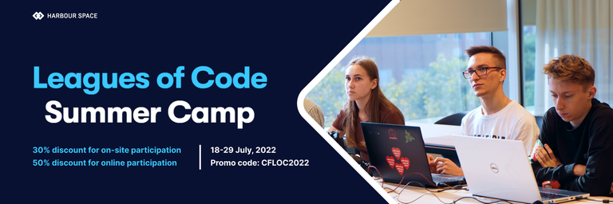
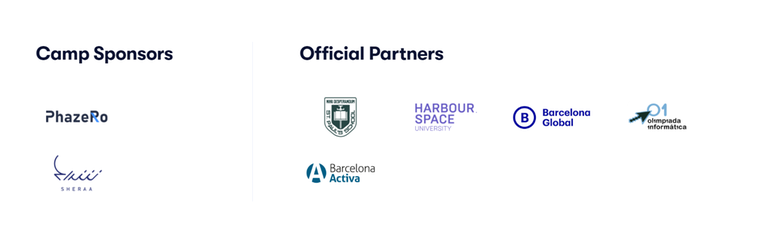

# Announcement

Hello Codeforces!

On [Friday, July 8, 2022 at 20:35UTC+6](https://codeforces.com/https://www.timeanddate.com/worldclock/fixedtime.html?day=8&month=7&year=2022&hour=17&min=35&sec=0&p1=166) [Educational Codeforces Round 131 (Rated for Div. 2)](https://codeforces.com/contest/1701 "Educational Codeforces Round 131 (Rated for Div. 2)") will start.

Series of Educational Rounds continue being held as [Harbour.Space University](https://codeforces.com/https://harbour.space/) initiative! You can read the details about the cooperation between [Harbour.Space University](https://codeforces.com/https://harbour.space/) and Codeforces in the [blog post](//codeforces.com/blog/entry/51208).

This round will be **rated for the participants with rating lower than 2100**. It will be held on extended ICPC rules. The penalty for each incorrect submission until the submission with a full solution is 10 minutes. After the end of the contest you will have 12 hours to hack any solution you want. You will have access to copy any solution and test it locally.

You will be given **6 or 7 problems** and **2 hours** to solve them.

The problems were invented and prepared by Adilbek [adedalic](https://codeforces.com/profile/adedalic "International Master adedalic") Dalabaev, Vladimir [vovuh](https://codeforces.com/profile/vovuh "Master vovuh") Petrov, Ivan [BledDest](https://codeforces.com/profile/BledDest "International Grandmaster BledDest") Androsov, Maksim [Neon](https://codeforces.com/profile/Neon "Candidate Master Neon") Mescheryakov and me. Also huge thanks to Mike [MikeMirzayanov](https://codeforces.com/profile/MikeMirzayanov "Headquarters, MikeMirzayanov") Mirzayanov for great systems Polygon and Codeforces.

Good luck to all the participants!

Our friends at Harbour.Space also have a message for you:

*Hey, Codeforces!*

*Welcome to the 131st educational round hosted by Harbour.Space and Codeforces.* 

*Quite exciting, isn’t it? Now it's time for you to dive deeper into the competitive programming world with the 10 days intensive Summer Camp organized by Harbour.Space and Leagues of Code.*

*Don’t forget about the discounts for participating in our [Summer Camp](https://summer-camp.leaguesofcode.com/?utm_source=codeforces&utm_medium=partner&utm_campaign=summer_camp). Every member of the Codeforces community gets a 30% discount for on-site participation or a 50% discount for online participation with promo-code CFLOC2022.*

*Our Summer Camp is a training program that will teach participants competitive programming. It will take place in Barcelona and online on July 18-29, both participation formats are available.* 

*We are inviting students ages 10 to 24, interested in improving their skills or seeking intensive, high-level training prior to the IOI. Teachers in the camp will be ICPC World Final Silver medalist [244mhq](https://codeforces.com/profile/244mhq "Legendary Grandmaster 244mhq"), SWERC 2022 Winners [MaksymOboznyi](https://codeforces.com/profile/MaksymOboznyi "Grandmaster MaksymOboznyi"), ICPC World Final Champion [pashka](https://codeforces.com/profile/pashka "International Grandmaster pashka") and others. Participants will be divided into classes based on their level and previous experience. Classes will be held in English.*

  [Learn more →](https://summer-camp.leaguesofcode.com?utm_source=codeforces&utm_medium=partner&utm_campaign=summer_camp) 

*Good luck with the round!*

**UPD:** [Editorial is out](Tutorial.md)

