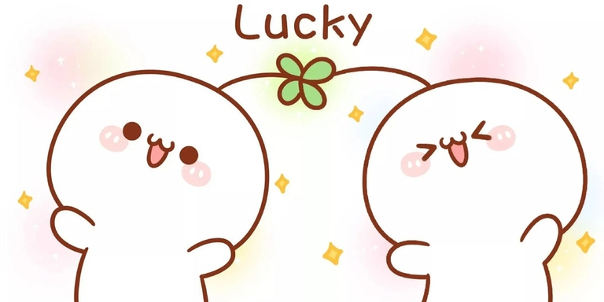

# CodeTON_Round_2_(en)

Hello, Codeforces!

A wonderful summer holiday! After College Entrance Examination, we are extremely delighted to invite you to our second round, [CodeTON Round 2 (Div. 1 + Div. 2, Rated, Prizes!)](https://codeforces.com/contest/1704), which will be held on [Sunday, July 31, 2022 at 20:05UTC+6](https://codeforces.com/https://www.timeanddate.com/worldclock/fixedtime.html?day=31&month=7&year=2022&hour=17&min=5&sec=0&p1=166). **Note the unusual start time of the round.**You are given **8 problems** and **2.5 hours** to solve them.

All problems were written and prepared by [Cirno_9baka](https://codeforces.com/profile/Cirno_9baka "International Grandmaster Cirno_9baka"), [CoupDeGrace](https://codeforces.com/profile/CoupDeGrace "Master CoupDeGrace"), [Sugar_fan](https://codeforces.com/profile/Sugar_fan "Legendary Grandmaster Sugar_fan"), [ODT](https://codeforces.com/profile/ODT "Master ODT"), [Yakumo_Ran](https://codeforces.com/profile/Yakumo_Ran "Master Yakumo_Ran"), [farmerj](https://codeforces.com/profile/farmerj "Expert farmerj"), [MagicalFlower](https://codeforces.com/profile/MagicalFlower "Grandmaster MagicalFlower"), [izlyforever](https://codeforces.com/profile/izlyforever "Candidate Master izlyforever"), [kuangbin](https://codeforces.com/profile/kuangbin "Master kuangbin"), [mejiamejia](https://codeforces.com/profile/mejiamejia "Expert mejiamejia"), [ugly2333](https://codeforces.com/profile/ugly2333 "Legendary Grandmaster ugly2333") and me. 

Task statements and editorials will also be available in Chinese (Simplified) and Chinese (Traditional) after the contest.

We are sincerely thankful for the help provided by:

 * [3.141592653](https://codeforces.com/profile/3.141592653 "Grandmaster 3.141592653"), [emorgan](https://codeforces.com/profile/emorgan "Grandmaster emorgan"), [errorgorn](https://codeforces.com/profile/errorgorn "International Grandmaster errorgorn"), [SevenDawns](https://codeforces.com/profile/SevenDawns "Master SevenDawns"), [prabowo](https://codeforces.com/profile/prabowo "Grandmaster prabowo"), [why_no_girlfriend](https://codeforces.com/profile/why_no_girlfriend "International Grandmaster why_no_girlfriend"), [valeriu](https://codeforces.com/profile/valeriu "Master valeriu"), [arvindr9](https://codeforces.com/profile/arvindr9 "Master arvindr9"), [ExplodingFreeze](https://codeforces.com/profile/ExplodingFreeze "Master ExplodingFreeze"), [Huah](https://codeforces.com/profile/Huah "Grandmaster Huah"), [chenkuowen](https://codeforces.com/profile/chenkuowen "Grandmaster chenkuowen"), [plagues](https://codeforces.com/profile/plagues "Master plagues"), [antontrygubO_o](https://codeforces.com/profile/antontrygubO_o "International Grandmaster antontrygubO_o"), [lych123](https://codeforces.com/profile/lych123 "Master lych123"), [YunQian](https://codeforces.com/profile/YunQian "Master YunQian"), [magnus.hegdahl](https://codeforces.com/profile/magnus.hegdahl "Master magnus.hegdahl"), [Bench0310](https://codeforces.com/profile/Bench0310 "Grandmaster Bench0310"), [Roundgod](https://codeforces.com/profile/Roundgod "Grandmaster Roundgod"), [njupt_lyy](https://codeforces.com/profile/njupt_lyy "Master njupt_lyy"), [null_awe](https://codeforces.com/profile/null_awe "Master null_awe"), [aniervs](https://codeforces.com/profile/aniervs "Expert aniervs"), [Savior-of-Cross](https://codeforces.com/profile/Savior-of-Cross "Grandmaster Savior-of-Cross"), [dorijanlendvaj](https://codeforces.com/profile/dorijanlendvaj "International Grandmaster dorijanlendvaj"), [Suiseiseki](https://codeforces.com/profile/Suiseiseki "International Grandmaster Suiseiseki"), [dannyboy20031204](https://codeforces.com/profile/dannyboy20031204 "Master dannyboy20031204"), [Lucina](https://codeforces.com/profile/Lucina "Master Lucina"), [ChthollyNotaSeniorious](https://codeforces.com/profile/ChthollyNotaSeniorious "Master ChthollyNotaSeniorious"), [JianfengZhu](https://codeforces.com/profile/JianfengZhu "International Grandmaster JianfengZhu"), [aaaaawa](https://codeforces.com/profile/aaaaawa "Grandmaster aaaaawa"), [leukocyte](https://codeforces.com/profile/leukocyte "International Master leukocyte"), [RiverHamster](https://codeforces.com/profile/RiverHamster "Grandmaster RiverHamster"), [-skyline-](https://codeforces.com/profile/-skyline- "International Grandmaster -skyline-"), [Nanako](https://codeforces.com/profile/Nanako "Master Nanako"), [Nezzar](https://codeforces.com/profile/Nezzar "Candidate Master Nezzar"), [I.Gleb](https://codeforces.com/profile/I.Gleb "Master I.Gleb"), [glebustim](https://codeforces.com/profile/glebustim "Master glebustim"), [Y25t](https://codeforces.com/profile/Y25t "International Grandmaster Y25t"), [gisp_zjz](https://codeforces.com/profile/gisp_zjz "International Grandmaster gisp_zjz"), [Mitsukasa_Ayase](https://codeforces.com/profile/Mitsukasa_Ayase "Master Mitsukasa_Ayase"), [ustze](https://codeforces.com/profile/ustze "Grandmaster ustze"), [Vladithur](https://codeforces.com/profile/Vladithur "Master Vladithur"), [IIIIndex](https://codeforces.com/profile/IIIIndex "Candidate Master IIIIndex"), [Acfboy](https://codeforces.com/profile/Acfboy "Candidate Master Acfboy"), [127.0.0.1](https://codeforces.com/profile/127.0.0.1 "Candidate Master 127.0.0.1"), [tibinyte](https://codeforces.com/profile/tibinyte "Expert tibinyte"), [i_wyxkk_ak](https://codeforces.com/profile/i_wyxkk_ak "Expert i_wyxkk_ak"), [TML104](https://codeforces.com/profile/TML104 "Expert TML104"), [spookywooky](https://codeforces.com/profile/spookywooky "Expert spookywooky"), [4qqqq](https://codeforces.com/profile/4qqqq "Expert 4qqqq"), [CSP_Sept](https://codeforces.com/profile/CSP_Sept "Expert CSP_Sept"), [marzipan](https://codeforces.com/profile/marzipan "Expert marzipan"), [efimovpaul](https://codeforces.com/profile/efimovpaul "Expert efimovpaul"), [Erkhemkhuu](https://codeforces.com/profile/Erkhemkhuu "Expert Erkhemkhuu"), [ak2006](https://codeforces.com/profile/ak2006 "Specialist ak2006"), [NeuraXmy](https://codeforces.com/profile/NeuraXmy "Candidate Master NeuraXmy"), [RomkaRS](https://codeforces.com/profile/RomkaRS "Pupil RomkaRS"), [bpaT_Kapaca](https://codeforces.com/profile/bpaT_Kapaca "Pupil bpaT_Kapaca"), [sus](https://codeforces.com/profile/sus "Pupil sus"), [snowysecret](https://codeforces.com/profile/snowysecret "Master snowysecret"), [755352046](https://codeforces.com/profile/755352046 "Candidate Master 755352046"), [IgorI](https://codeforces.com/profile/IgorI "Grandmaster IgorI"), and [Kieray](https://codeforces.com/profile/Kieray "Newbie Kieray") for testing and good advice
* [74TrAkToR](https://codeforces.com/profile/74TrAkToR "Grandmaster 74TrAkToR") for his excellent round coordination and help with preparation
* [MikeMirzayanov](https://codeforces.com/profile/MikeMirzayanov "Headquarters, MikeMirzayanov") for great systems Codeforces and Polygon
* [MinakoKojima](https://codeforces.com/profile/MinakoKojima "Candidate Master MinakoKojima"), [Ynoi](https://codeforces.com/profile/Ynoi "Candidate Master Ynoi"), [Suiseiseki](https://codeforces.com/profile/Suiseiseki "International Grandmaster Suiseiseki") for proposing problems that didn't been used in the final version of the round.
* [Nanako](https://codeforces.com/profile/Nanako "Master Nanako"), [absi2011](https://codeforces.com/profile/absi2011 "Pupil absi2011"), [Nezzar](https://codeforces.com/profile/Nezzar "Candidate Master Nezzar"), [QAQAutoMaton](https://codeforces.com/profile/QAQAutoMaton "Legendary Grandmaster QAQAutoMaton"), [rgnerdplayer](https://codeforces.com/profile/rgnerdplayer "Master rgnerdplayer") for helping prepare the problems.
* [magnus.hegdahl](https://codeforces.com/profile/magnus.hegdahl "Master magnus.hegdahl") for strengthening the data of one problem (but because the problem was too hard, we removed it)
* [emorgan](https://codeforces.com/profile/emorgan "Grandmaster emorgan") for reviewing the statements
* [dannyboy20031204](https://codeforces.com/profile/dannyboy20031204 "Master dannyboy20031204") for traditional chinese statement and editorial
* You, for participating!

This is our second round! Great efforts have been put in during the past year. We are sincerely looking forward to your participation and we hope everyone will enjoy it. Besides, this round is sponsored, which indicates that everyone has an opportunity to get the prize!

Good luck!

**UPD1: Here is the score distribution:**

**500-750-1250-1750-2000-2750-3500-(2250+2750)**

**UPD2:[Tutorial](Tutorial_(en).md) is available.**

**UPD3: [Simplified Chinese tutorial](https://codeforces.com/https://www.cnblogs.com/aaaaawa/p/16538468.html) is available.**

**UPD4: [Traditional Chinese tutorial](https://codeforces.com/https://hackmd.io/nSTr3Ky4SyWNyvatJOXefw?view) is available.**

**UPD5: Congratulations to the winners**

 1. [tourist](https://codeforces.com/profile/tourist "Legendary Grandmaster tourist")
2. [jiangly](https://codeforces.com/profile/jiangly "Legendary Grandmaster jiangly")
3. [ksun48](https://codeforces.com/profile/ksun48 "Legendary Grandmaster ksun48")
4. [Rewinding](https://codeforces.com/profile/Rewinding "Legendary Grandmaster Rewinding")
5. [djq_cpp](https://codeforces.com/profile/djq_cpp "Legendary Grandmaster djq_cpp")
6. [maroonrk](https://codeforces.com/profile/maroonrk "Legendary Grandmaster maroonrk")
7. [cnnfls_csy](https://codeforces.com/profile/cnnfls_csy "Legendary Grandmaster cnnfls_csy")
8. [he_____hezhou](https://codeforces.com/profile/he_____hezhou "Legendary Grandmaster he_____hezhou")
9. [353cerega](https://codeforces.com/profile/353cerega "International Grandmaster 353cerega")
10. [WYZFL](https://codeforces.com/profile/WYZFL "International Grandmaster WYZFL")
11. [ecnerwala](https://codeforces.com/profile/ecnerwala "Legendary Grandmaster ecnerwala")

**UPD6: [Simplified Chinese statement](https://codeforces.com/contest/1704/attachments/download/16830/Schinese_Statements_mod.mhtml) is available.(please download it and open it with edge)** 

    
   

And here is the information from our title sponsor:

*Hello, Codeforces!*

*We, the [TON Foundation](https://codeforces.com/https://ton.org/) team, are pleased to support CodeTON Round 2.*

*The Open Network (TON) is a fully decentralized layer-1 blockchain designed to onboard billions of users to Web3.*

*Since July, [we have been supporting](https://codeforces.com/blog/entry/104544) Codeforces as a title sponsor. This round is another way for us to contribute to the development of the community.*

*The winners of CodeTON Round 2 will receive valuable prizes.*

*The first 1,023 participants will receive prizes in TON cryptocurrency:*

 * *1st place: 1,024 TON*
* *2–3 places: 512 TON each*
* *4–7 places: 256 TON each*
* *8–15 places: 128 TON each*
* *…*
* *512–1,023 places: 2 TON each*

*We wish you good luck at CodeTON Round 2 and hope you enjoy the contest!*

