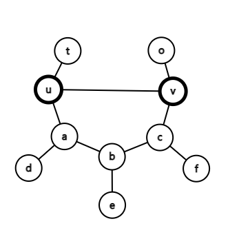

# Tutorial_(en)

[1708A - Difference Operations](https://codeforces.com/contest/1708/problem/A "Codeforces Round 808 (Div. 2)")

idea: [Imakf](https://codeforces.com/profile/Imakf "Master Imakf")

 **Solution**
### [1708A - Difference Operations](https://codeforces.com/contest/1708/problem/A "Codeforces Round 808 (Div. 2)")

Solution 1

For all $i \ge 2$, $a_i$ is the multiple of $a_1$ is equivalent to the YES answer.

Proof of necessity

$a_2$ must be the multiple of $a_1$. Otherwise $a_2$ cannot become zero.

In the whole process, $a_2$ is always the multiple of $a_1$. So $a_3$ must be the multiple of $a_1$. Otherwise $a_3$ cannot become zero.

In the whole process, $a_3$ is always the multiple of $a_1$. So $a_4$ must be the multiple of $a_1$. Otherwise $a_4$ cannot become zero.

...

Proof of sufficiency

For all $i \ge 2$, $a_i$ is the multiple of $a_1$. So we can perform operations to make $a=[a_1,a_1,a_1,\cdots]$ and then make $a=[a_1,0,0,\cdots]$.

Solution 2

Consider everything in the reverse order.

You are given an array $b$ consisting of $n$ positive integers, where $b=[b_1,0,0,\cdots,0]$ ($b_1$ and $n-1$ zeros).

You are given an array $a$ consisting of $n$ positive integers. It is guaranteed that $a_1=b_1$.

You are allowed to perform this operation any number of times (possibly, zero):

* Choose an index $i$ ($2\le i \le n$), and change $b_i$ to $b_i+b_{i-1}$.

Is it possible to change $b$ to $a$?

Check if $a_i$ is the multiple of $a_1$.

 **Code**By [Imakf](https://codeforces.com/profile/Imakf "Master Imakf")

 
```cpp
#include <bits/stdc++.h>

#define debug(...) fprintf(stderr ,__VA_ARGS__)
#define LL long long

const LL MOD = 1e9 + 7;
const int MX = 1e5 + 23;

int read(){
	char k = getchar(); LL x = 0;
	while(k < '0' || k > '9') k = getchar();
	while(k >= '0' && k <= '9') x = x * 10 + k - '0' ,k = getchar();
	return x;
}

int n ,a[MX];
void solve(){
	n = read();
	for(int i = 1 ; i <= n ; ++i) a[i] = read();
	int ok = 1;
	for(int i = 1 ; i <= n ; ++i){
		if(a[i] % a[1]) ok = false;
	}
	puts(ok ? "YES" : "NO");
}

int main(){
	int T = read();
	while(T--) solve();
	return 0;
}

```
[1708B - Difference of GCDs](https://codeforces.com/contest/1708/problem/B "Codeforces Round 808 (Div. 2)")

idea: [waaitg](https://codeforces.com/profile/waaitg "Master waaitg")

 **Solution**
### [1708B - Difference of GCDs](https://codeforces.com/contest/1708/problem/B "Codeforces Round 808 (Div. 2)")

$\gcd(i,a_i)\le i$. Because all $\gcd(i,a_i)$ are different, then $\gcd(i,a_i)=i$, which means $a_i$ is the multiple of $i$. 

To check if there is such $a_i$, just check if $a_i=\left(\lfloor \frac{l-1}{i} \rfloor +1\right)\cdot i$ (the minimum multiple of $i$ that is strictly bigger than $l-1$) is less than $r$.

Time complexity $O(n)$ for each test case.

 **Code**By [Imakf](https://codeforces.com/profile/Imakf "Master Imakf")

 
```cpp
#include <bits/stdc++.h>

#define debug(...) fprintf(stderr ,__VA_ARGS__)
#define __FILE(x)
	freopen(#x".in" ,"r" ,stdin);
	freopen(#x".out" ,"w" ,stdout)
#define LL long long

const int MX = 1e5 + 23;
const LL MOD = 998244353;

int read(){
	char k = getchar(); int x = 0;
	while(k < '0' || k > '9') k = getchar();
	while(k >= '0' && k <= '9') x = x * 10 + k - '0' ,k = getchar();
	return x;
}

int a[MX];
void solve(){
	int n = read() ,l = read() ,r = read();
	int ok = 1;
	for(int i = 1 ; i <= n ; ++i){
		a[i] = ((l - 1) / i + 1) * i;
		ok = ok && a[i] <= r;
	}
	if(ok){
		puts("YES");
		for(int i = 1 ; i <= n ; ++i)
			printf("%d%c" ,a[i] ," n"[i == n]);
	}
	else puts("NO");
}

int main(){
	int T = read();
	for(int i = 1 ; i <= T ; ++i){
		solve();
	}
	return 0;
}

```
[1707A - Doremy's IQ](../problems/A._Doremy's_IQ.md "Codeforces Round 808 (Div. 1)")

idea: [Imakf](https://codeforces.com/profile/Imakf "Master Imakf")

 **Solution**
### [1707A - Doremy's IQ](../problems/A._Doremy's_IQ.md "Codeforces Round 808 (Div. 1)")

Solution 1

We call contests that will decrease Doremy's IQ bad contests and the other good contests.

In the best solution(testing the maximum number of contests), there is always an index $x$.

* Contest $i$ ($i < x$) is tested, if Contest $i$ is good;
* Contest $i$ ($i \ge x$) is tested, no matter what kind of contest it is.

How to prove that this conclusion? For any choice, we can find the last contest $a$ that is not tested and the first bad contest $b$ that is tested. If $b<a$, we can give up contest $b$ and choose to test contest $a$, and the number of contests that is tested does not change. If $b>a$, there is already an valid $x$.

When $x$ is smallest, you can get the best solution. And we can find the smallest $x$ by binary search.

Time complexity $O(n \log n)$.

Solution 2

Consider everything in the reverse order.

Assume that Doremy has $Q=0$ IQ in the end. Consider whether a contest should be tested in the reverse order.

* $a_i\le Q$. Doremy should tested the contest because there is no decrease in her IQ.
* $a_i > Q$ and $Q < q$. If Doremy tests the contest, her IQ will decrease by $1$, so in the reverse order, her IQ increases by $1$; otherwise she just skipped the contest and nothing happened. Doremy can test at most $q$ contest with the $a_i>Q$ property. But if Doremy gets more IQ, she can participate more previous good contests. So she should test this contest.
* If $a_i > Q$ and $Q=q$, Doremy cannot test the contest because her IQ is not enough.

So you can determine whether every contest should be tested.

Time complexity $O(n)$.

 **Code of solution 1**By [Imakf](https://codeforces.com/profile/Imakf "Master Imakf")

 
```cpp
#include <bits/stdc++.h>

#define debug(...) fprintf(stderr ,__VA_ARGS__)
#define __FILE(x)
	freopen(#x".in" ,"r" ,stdin);
	freopen(#x".out" ,"w" ,stdout)
#define LL long long

const int MX = 5e5 + 23;
const LL MOD = 998244353;

int read(){
	char k = getchar(); int x = 0;
	while(k < '0' || k > '9') k = getchar();
	while(k >= '0' && k <= '9') x = x * 10 + k - '0' ,k = getchar();
	return x;
}

int n ,a[MX] ,q ,choose[MX];
bool check(int mid){
	for(int i = 1 ; i <= n ; ++i) choose[i] = 0;
	int iq = q;
	for(int i = 1 ; i < mid ; ++i)
		if(a[i] <= iq) choose[i] = 1;
	for(int i = mid ; i <= n ; ++i){
		choose[i] = 1;
		if(iq == 0) return 0;
		if(a[i] > iq) --iq;
		
	}
	if(iq < 0) return 0;
	return 1;
}

void solve(){
	n = read() ,q = read();
	for(int i = 1 ; i <= n ; ++i)
		a[i] = read();
	int l = 1 ,r = n ,mid;
	while(l <= r){
		mid = (l + r) >> 1;
		if(check(mid)) r = mid - 1;
		else l = mid + 1;
	}
	// [r + 1 ,n] is selected
	check(r + 1);
	for(int i = 1 ; i <= n ; ++i)
		printf("%d" ,choose[i]);
	puts("");
}

int main(){
	int T = read();
	for(int i = 1 ; i <= T ; ++i){
		solve();
	}
	return 0;
}

```
 **Code of solution 2**By [waaitg](https://codeforces.com/profile/waaitg "Master waaitg")

 
```cpp
#include<cstdio>
int a[100005],b[100005];
int main(){
	int T;
	scanf("%d",&T);
	while(T--){
		int n,iq;
		scanf("%d%d",&n,&iq);
		for(int i=1;i<=n;++i)
			scanf("%d",&a[i]);
		int sum=0,nq=0;
		for(int i=n;i>=1;--i){
			if(a[i]<=nq)b[i]=1;
			else if(nq<iq)++nq,b[i]=1; 
			else b[i]=0;
		} 
		for(int i=1;i<=n;++i)
			printf("%d",b[i]);
		puts("");
	}
	return 0;
}

```
[1707B - Difference Array](../problems/B._Difference_Array.md "Codeforces Round 808 (Div. 1)")

idea: [Imakf](https://codeforces.com/profile/Imakf "Master Imakf") and [waaitg](https://codeforces.com/profile/waaitg "Master waaitg")

Unfortunately, a harder version of this problem has appeared in a codechef contest [here](https://codeforces.com/https://www.codechef.com/START33B/problems/ARRAY_OPS).

In fact, this problem was come up with more than 1 year ago, earlier than the problem in that codechef contest. We are sorry again.

 **Solution**
### [1707B - Difference Array](../problems/B._Difference_Array.md "Codeforces Round 808 (Div. 1)")

Let's prove that the brute-force solution (considering zeros differently) can pass.

Define $S=\sum\limits_{i=1}^{n} a_i$ and it changes when an operation is performed.

After sorting the array $a$ and ignoring $0$ s, the fact

$$ \begin{aligned} n-1+a_n &\le S & (a_i \ge 1)\\\ n-1 &\le S - a_n \end{aligned} $$

is always true.

And after performing one operation, $S = a_n-a_1\le a_n$.

So in each operation, you cost $O(n \log n)$ time to sort the new array and decrease $S$ by at least $n-1$.

After the first operation, $S$ is $O(a_n)$. The complexity is $O(A \log A)$, where $A=\max\{n,a_n\}$.

 **Code**By [waaitg](https://codeforces.com/profile/waaitg "Master waaitg")

 
```cpp
#include<cstdio>
#include<cstring>
#include<iostream>
#include<algorithm>
#define ch() getchar()
#define pc(x) putchar(x)
using namespace std;
template<typename T>void read(T&x){
	static char c;static int f;
	for(c=ch(),f=1;c<'0'||c>'9';c=ch())if(c=='-')f=-f;
	for(x=0;c>='0'&&c<='9';c=ch())x=x*10+(c&15);x*=f;
}
template<typename T>void write(T x){
	static char q[65];int cnt=0;
	if(x<0)pc('-'),x=-x;
	q[++cnt]=x%10,x/=10;
	while(x)
		q[++cnt]=x%10,x/=10;
	while(cnt)pc(q[cnt--]+'0');
}
const int maxn=100005;
int a[maxn];
int main(){
	int T;read(T);
	while(T--){
		int n;read(n);
		for(int i=1;i<=n;++i)read(a[i]);
		for(int i=n-1;i>=1;--i){
			int pre=a[i+1],ok=false;
			for(int j=i;j>=1;--j){
				ok=(a[j]==0);
				pre-=(a[j]=pre-a[j]);
				if(ok){
					sort(a+j,a+i+1);
					break;
				}
			}
			if(!ok)
				sort(a+1,a+i+1);
		}
		write(a[1]),pc('n');
	}
	return 0;
}
/*
_|_|_|_|        _|_|      _|      _|   _|_|_|_|_|   _|_|_|_|_|   _|
_|      _|    _|    _|    _|_|    _|       _|       _|           _|
_|      _|   _|      _|   _| _|   _|       _|       _|           _|
_|      _|   _|_|_|_|_|   _|  _|  _|       _|       _|_|_|_|_|   _|
_|      _|   _|      _|   _|   _| _|       _|       _|           _|
_|      _|   _|      _|   _|    _|_|       _|       _|           _|
_|_|_|_|     _|      _|   _|      _|   _|_|_|_|_|   _|_|_|_|_|   _|_|_|_|_|

_|_|_|_|_|   _|      _|   _|_|_|_|     _|      _|
    _|        _|    _|    _|      _|    _|    _|
    _|         _|  _|     _|      _|     _|  _|
    _|          _|_|      _|      _|      _|_|
    _|         _|  _|     _|      _|       _|
    _|        _|    _|    _|      _|       _|
    _|       _|      _|   _|_|_|_|         _|

_|             _|_|_|     _|      _|   _|_|_|_|_|
_|           _|      _|   _|      _|   _|
_|           _|      _|    _|    _|    _|
_|           _|      _|    _|    _|    _|_|_|_|_|
_|           _|      _|     _|  _|     _|
_|           _|      _|      _|_|      _|
_|_|_|_|_|     _|_|_|         _|       _|_|_|_|_|

_|_|_|_|_|   _|      _|   _|_|_|_|_|
    _|        _|    _|        _|
    _|         _|  _|         _|
    _|          _|_|          _|
    _|           _|           _|
    _|           _|           _|
    _|           _|           _|

Created by xiaolilsq.
*/
```
[1707C - DFS Trees](../problems/C._DFS_Trees.md "Codeforces Round 808 (Div. 1)")

idea: [waaitg](https://codeforces.com/profile/waaitg "Master waaitg")

 **Solution**
### [1707C - DFS Trees](../problems/C._DFS_Trees.md "Codeforces Round 808 (Div. 1)")

Minimum spanning tree is unique in the given graph.

If $\operatorname{findMST}$(x) creates an MST, there is no cross edge in the graph. So if you can determine whether there is a cross edge starting DFS from every node, the problem is solved.

Pay attention to every edge that is not in the MST. Let's focus on one single edge $(u,v)$ and see starting DFS from which node, $(u,v)$ is a cross edge. Take the following graph as an example.



If we start from nodes $a$, $b$, $c$, $d$, $e$ or $f$, $(u,v)$ is a cross edge. If we start from nodes $t$, $u$, $o$ or $v$, $(u,v)$ is not a cross edge. We can find that when considering $u$ as the root of the tree, $o$ and $v$ are on the subtree of $v$. When considering $v$ as the root of the tree, $t$ and $u$ are on the subtree of $u$.

So if an edge $(u,v)$ is not in the MST, only the subtree of $u$($u$ included, when considering $v$ as the root) and the subtree of $v$($v$ included, when considering $u$ as the root) can be answers. We just need to do this process for each edge not in the MST. After that we can get the answers.

We can finish the process in $O(n\log n)$ with bin-up on tree and BIT or in $O(n)$ with some case work while dfs.

 **Code**By [waaitg](https://codeforces.com/profile/waaitg "Master waaitg")

 
```cpp
#include<cstdio>
#include<cstring>
#include<iostream>
#include<algorithm>
#define ch() getchar()
#define pc(x) putchar(x)
using namespace std;
template<typename T>void read(T&x){
	static char c;static int f;
	for(c=ch(),f=1;c<'0'||c>'9';c=ch())if(c=='-')f=-f;
	for(x=0;c>='0'&&c<='9';c=ch())x=x*10+(c&15);x*=f;
}
template<typename T>void write(T x){
	static char q[65];int cnt=0;
	if(x<0)pc('-'),x=-x;
	q[++cnt]=x%10,x/=10;
	while(x)
		q[++cnt]=x%10,x/=10;
	while(cnt)pc(q[cnt--]+'0');
}
const int maxn=100005,maxm=200005;
int par[maxn];
int AC(int x){
	return par[x]==x?x:par[x]=AC(par[x]);
}
struct Edge{
	int v,nt;
	Edge(int v=0,int nt=0):
		v(v),nt(nt){}
}e[maxn*2],es[maxm];
int hd[maxn],num;
void qwq(int u,int v){
	e[++num]=Edge(v,hd[u]),hd[u]=num;
}
int dp[maxn];
int pa[maxn][20];
void dfs(int u,int p){
	pa[u][0]=p;
	for(int j=1;(1<<j)<=dp[u];++j)
		pa[u][j]=pa[pa[u][j-1]][j-1];
	for(int i=hd[u];i;i=e[i].nt){
		int v=e[i].v;
		if(v==p)continue;
		dp[v]=dp[u]+1;dfs(v,u);
	}
}
int jump(int x,int t){
	for(int cn=0;t;t>>=1,++cn)
		if(t&1)x=pa[x][cn];
	return x;
}
int lca(int x,int y){
	if(dp[x]>dp[y])x=jump(x,dp[x]-dp[y]);
	if(dp[y]>dp[x])y=jump(y,dp[y]-dp[x]);
	if(x==y)return x;
	for(int t=19;t>=0;--t)
		if(pa[x][t]!=pa[y][t])
			x=pa[x][t],y=pa[y][t];
	return pa[x][0];
}
int vis[maxn];
char s[maxn];
void pushdown(int u,int p){
	if(vis[u]==0)s[u]='1';
	else s[u]='0';
	for(int i=hd[u];i;i=e[i].nt){
		int v=e[i].v;
		if(v==p)continue;
		vis[v]+=vis[u];
		pushdown(v,u);
	}
}
int main(){
	int n,m;
	read(n),read(m);
	for(int i=1;i<=n;++i)
		par[i]=i;
	int tp=0;
	for(int i=1;i<=m;++i){
		int u,v;
		read(u),read(v);
		if(AC(u)==AC(v)){
			es[++tp]=Edge(u,v);
		}
		else{
			par[AC(u)]=AC(v);
			qwq(u,v),qwq(v,u);
		}
	}
	int root=1;
	dfs(root,0);
	for(int i=1;i<=tp;++i){
		int u=es[i].v,v=es[i].nt;
		if(dp[u]>dp[v])u^=v^=u^=v;
		int w=lca(u,v);
		if(u==w){
			--vis[v];
			++vis[jump(v,dp[v]-dp[u]-1)];
		}
		else{
			++vis[root];
			--vis[u];
			--vis[v];
		}
	}
	pushdown(root,0);
	s[n+1]='0';
	printf("%sn",s+1);
	return 0;
}
```
[1707D - Partial Virtual Trees](../problems/D._Partial_Virtual_Trees.md "Codeforces Round 808 (Div. 1)")

idea: [Imakf](https://codeforces.com/profile/Imakf "Master Imakf") and [waaitg](https://codeforces.com/profile/waaitg "Master waaitg")

 **Solution**
### [1707D - Partial Virtual Trees](../problems/D._Partial_Virtual_Trees.md "Codeforces Round 808 (Div. 1)")

First ignore the requirement that the virtual tree cannot be the entire tree. Then we count the number of ways without this requirement for all $k$ using DP.

$dp_{x,i}$ is the number of ways to delete everything in the subtree of $x$ in exact $i$ operations. Node $x$ must be deleted at some time $j \le i$ and all but at most one child subtree of $x$ must be deleted before time $j$.

Let:

* $C_x$ be the set of $x$'s children.
* $S_{x,i}=\sum_{j\le i} dp_{x,i}$
* $D_{x,j}=\prod_{u\in C(x)}S_{u,j}$

Then

$$ \begin{aligned} dp_{x,i} &=\sum_{j < i}\sum_{u\in C_x}\dfrac{dp_{u,i}D_{x,j}}{S_{u,j}} + \prod_{u\in C_x} S_{u,i}\\\ &=\sum_{u \in C_x}dp_{u,i} \sum_{j < i} \dfrac{D_{x,j}}{S_{u,j}}+\prod_{u \in C_x}S_{u,i} \end{aligned} $$

Specially, when $x$ is root ($x=1$), $x$ is the last one to be deleted. So $dp_{x,i}=\prod_{u\in C_x} S_{u,i}$ in this case.

It's not hard to computer this with prefix sums in $O(n^2)$ time.

Then consider the requirement that the virtual tree cannot be the entire tree. Let the real answer be $Ans_k$. Then

$$ \begin{aligned} dp_{1,i} &= \sum_{j=0}^{i} \binom{i}{j}Ans_j \\\ Ans_i &= dp_{1,i} - \sum_{j=0}^{i-1} \binom{i}{j} Ans_j \end{aligned} $$

So we can figure out the real answer in $O(n^2)$ time.

 **Code**By [Imakf](https://codeforces.com/profile/Imakf "Master Imakf")

 
```cpp
#include <bits/stdc++.h>
 
#define debug(...) fprintf(stderr ,__VA_ARGS__)
#define __FILE(x)
	freopen(#x".in" ,"r" ,stdin);
	freopen(#x".out" ,"w" ,stdout)
#define LL long long
 
const int MX = 2000 + 23;
 
LL MOD;
 
using namespace std;
 
int read(){
	char k = getchar(); int x = 0;
	while(k < '0' || k > '9') k = getchar();
	while(k >= '0' && k <= '9') x = x * 10 + k - '0' ,k = getchar();
	return x;
}
 
int head[MX] ,tot = 1;
struct edge{
	int node ,next;
}h[MX << 1];
void addedge(int u ,int v ,int flg = 1){
	// if(flg) debug("%d %dn" ,u ,v);
	h[++tot] = (edge){v ,head[u]} ,head[u] = tot;
	if(flg) addedge(v ,u ,false);
}
 
int n ,dp[MX][MX] ,S[MX][MX] ,suf[MX][MX] ,pre[MX][MX];
void dapai(int x ,int f){
	int ch = 0;
	for(int i = head[x] ,d ; i ; i = h[i].next){
		if((d = h[i].node) == f) continue;
		dapai(d ,x);
	}
	for(int i = head[x] ,d ; i ; i = h[i].next){
		if((d = h[i].node) == f) continue;
		++ch;
		for(int j = 0 ; j <= n ; ++j){
			suf[ch][j] = pre[ch][j] = S[d][j];
		}
	}
 
	if(!ch){
		for(int i = 1 ; i <= n ; ++i){
			dp[x][i] = 1 % MOD;
			S[x][i] = (S[x][i - 1] + dp[x][i]) % MOD;
		}
		return ;
	}
	for(int j = 0 ; j <= n ; ++j){
		for(int i = 1 ; i <= ch ; ++i)
			pre[i][j] = 1LL * pre[i][j] * pre[i - 1][j] % MOD;
		for(int i = ch ; i >= 1 ; --i)
			suf[i][j] = 1LL * suf[i][j] * suf[i + 1][j] % MOD;
	}
	for(int i = 1 ; i <= n ; ++i) dp[x][i] = pre[ch][i];
	if(x != 1) for(int i = head[x] ,d ,c = 0 ; i ; i = h[i].next){
		if((d = h[i].node) == f) continue;
		++c;
		LL sum = 0;
		for(int mx = 1 ; mx <= n ; ++mx){
			dp[x][mx] = (dp[x][mx] + sum * dp[d][mx]) % MOD;
			sum = (sum + 1LL * pre[c - 1][mx] * suf[c + 1][mx]) % MOD;
		}
	}
	for(int i = 1 ; i <= ch ; ++i)
		for(int j = 0 ; j <= n ; ++j)
			suf[i][j] = pre[i][j] = 1 % MOD;
	for(int i = 1 ; i <= n ; ++i)
		S[x][i] = (S[x][i - 1] + dp[x][i]) % MOD;
}
 
int C[MX][MX];
void init(){
	for(int i = 0 ; i < MX ; ++i) C[i][0] = 1 % MOD;
	for(int i = 1 ; i < MX ; ++i)
		for(int j = 1 ; j < MX ; ++j)
			C[i][j] = (C[i - 1][j - 1] + C[i - 1][j]) % MOD;
}
 
int main(){
    
    n = read() ,MOD = read();
	init();
	
	for(int i = 0 ; i < MX ; ++i)
		for(int j = 0 ; j < MX ; ++j)
			suf[i][j] = pre[i][j] = 1 % MOD;
			
	
	 
	for(int i = 2 ; i <= n ; ++i){
		addedge(read() ,read());
		// addedge(rand() % (i - 1) + 1 ,i);
	}
	
	dapai(1 ,0);
	
	for(int i = 1 ; i < n ; ++i){
		LL ans = 0;
		for(int j = 1 ; j <= i ; ++j){
			ans += ((i - j) & 1 ? -1LL : 1LL) * C[i][j] * dp[1][j] % MOD;
		}
		ans = (ans % MOD + MOD) % MOD;
		printf("%lld%c" ,ans ," n"[i == n]);
	}
	return 0;
}
```
[1707E - Replace](../problems/E._Replace.md "Codeforces Round 808 (Div. 1)")

idea: [Wolam](https://codeforces.com/profile/Wolam "Candidate Master Wolam"), [Imakf](https://codeforces.com/profile/Imakf "Master Imakf") and [waaitg](https://codeforces.com/profile/waaitg "Master waaitg")

 **Solution**
### [1707E - Replace](../problems/E._Replace.md "Codeforces Round 808 (Div. 1)")

Let $f([l,r])$ be the "replace" function. That means $f([l,r])=[\min\{a_i|l\le i\le r\},\max\{a_i|l\le i\le r\}]$. $f^k([l,r])$ means applying the function $k$ times.

When $[a_1,b_1]\bigcap[a_2,b_2]\ne \emptyset$, Let $j=\max\{a_1,a_2\}$, then $j\in[a_1,b_1]$ and $j\in[a_{2},b_{2}]$. So $a_j\in f([a_1,b_1])$ and $a_j\in f([a_{2},b_{2}])$. That means $f([a_1,b_1])\bigcap f([a_{2},b_{2}])\ne \emptyset$, so $f([\min\{a_1,a_{2}\},\max\{b_1,b_{2}\}])=f([a_1,b_1])\bigcup f([a_{2},b_{2}])$. When $m>2$ it can be similarly proved that if $\forall 1\le i<m,[a_i,b_i]\bigcap [a_{i+1},b_{i+1}]\ne \emptyset$, then $f(\bigcup\limits_{1\le i\le m}[a_i,b_i])=\bigcup\limits_{1\le i\le m}f([a_i,b_i])$.

And we also know that if $[a_1,b_1]\bigcap [a_2,b_2]\ne \emptyset$, then $f([a_1,b_1])\bigcap f([a_2,b_2])\ne \emptyset$, then $f^k([a_1,b_1])\bigcap f^k([a_2,b_2])\ne \emptyset$. So we know $f^k(\bigcup\limits_{1\le i\le m}[a_i,b_i])=\bigcup\limits_{1\le i\le m}f^k([a_i,b_i])$.

So $f^k([l,r])=\bigcup\limits_{l\le i<r}f^k([i,i+1])$. We can use $f^{p+q}([l,r])=f^p(f^q([l,r]))$ to easily get $f^{2^k}([i,i+1])$ in $O(n\log^2n)$ at first, then we can calculate $f^{2^k}([l,r])$ in $O(\log n)$. Use binary search we can get answer in $O(\log^2n)$. So the time complexity is $O((n+q)\log^2n)$.

We can use BIT instead of segment tree to make our program run faster. 

 **Code**By [waaitg](https://codeforces.com/profile/waaitg "Master waaitg")

 
```cpp
#include<cstdio>
#include<cstring>
#include<iostream>
#include<algorithm>
#define ch() getchar()
#define pc(x) putchar(x)
using namespace std;
template<typename T>void read(T&x){
	static char c;static int f;
	for(f=1,c=ch();c<'0'||c>'9';c=ch())if(c=='-')f=-f;
	for(x=0;c>='0'&&c<='9';c=ch()){x=x*10+(c&15);}x*=f;
}
template<typename T>void write(T x){
	static char q[64];int cnt=0;
	if(x==0)return pc('0'),void();
	if(x<0)pc('-'),x=-x;
	while(x)q[cnt++]=x%10+'0',x/=10;
	while(cnt--)pc(q[cnt]);
}
const int maxn=100005,maxq=100005,maxt=34;
const int inf=0x3f3f3f3f;
int a[maxn];
struct Segment{
	int l,r;
	Segment(int l=inf,int r=-inf):
		l(l),r(r){}
	Segment operator * (const Segment o)const{
		return Segment(min(l,o.l),max(r,o.r));
	}
	bool operator != (const Segment o)const{
		return l!=o.l||r!=o.r;
	}
	void input(void){
		read(l),read(r);
	}
}sg[maxt][maxn],tr[maxn],qy[maxq];
int n;
void res(void){
	for(int i=1;i<n;++i)
		tr[i]=Segment();
}
void add(int p,Segment v){
	while(p<n){
		tr[p]=tr[p]*v;
		p+=(p&(-p));
	}
}
Segment ask(int p){
	Segment re;
	while(p){
		re=re*tr[p];
		p^=(p&(-p));
	}
	return re;
}
struct Edge{
	int v,w,nt;
	Edge(int v=0,int w=0,int nt=0):
		v(v),w(w),nt(nt){}
}e[maxn];
int num,hd[maxn];
void ins(int u,int v,int w){
	e[++num]=Edge(v,w,hd[u]),hd[u]=num;
}
int st[maxq],tp;
long long Ans[maxq];
int main(){
	int q;read(n),read(q);
	if(n==1){while(q--)puts("0");return 0;}
	for(int i=1;i<=n;++i)read(a[i]);
	for(int i=1;i<n;++i){
		 if(a[i]<=a[i+1])
		 	sg[0][i]=Segment(a[i],a[i+1]);
		else
			sg[0][i]=Segment(a[i+1],a[i]);
	}
	for(int i=1;i<maxt;++i){
		for(int j=1;j<n;++j){
			if(sg[i-1][j].l>=sg[i-1][j].r)sg[i][j]=Segment();
			else ins(sg[i-1][j].l,sg[i-1][j].r-1,j);
		}
		res();
		for(int j=n-1;j>=1;--j){
			add(j,sg[i-1][j]);
			for(int k=hd[j];k;k=e[k].nt){
				sg[i][e[k].w]=ask(e[k].v);
			}
			hd[j]=0;
		}
		num=0;
	}
	for(int i=1;i<=q;++i){
		qy[i].input();
		if(qy[i].l==qy[i].r)Ans[i]=-2;
		else ins(qy[i].l,qy[i].r-1,i);
	}
	res();
	for(int i=n-1;i>=1;--i){
		add(i,sg[maxt-1][i]);
		for(int j=hd[i];j;j=e[j].nt){
			if(i==1&&e[j].v==n-1)
				Ans[e[j].w]=-1;
			else if(ask(e[j].v)!=Segment(1,n))
				Ans[e[j].w]=-2;
			else
				st[++tp]=e[j].w;
		}
		hd[i]=0;
	}
	num=0;
	for(int i=maxt-2;~i;--i){
		for(int j=1;j<=tp;++j){
			ins(qy[st[j]].l,qy[st[j]].r-1,st[j]);
		}
		res();
		for(int j=n-1;j>=1;--j){
			add(j,sg[i][j]);
			for(int k=hd[j];k;k=e[k].nt){
				Segment tmp=ask(e[k].v);
				int id=e[k].w;
				if(tmp!=Segment(1,n))
					Ans[id]|=(1ll<<i),qy[id]=tmp;
			}
			hd[j]=0;
		}
		num=0;
	}
	for(int i=1;i<=q;++i)
		write(++Ans[i]),pc('n');
	return 0;
}
```
[1707F - Bugaboo](../problems/F._Bugaboo.md "Codeforces Round 808 (Div. 1)")

This is a noun almost one year ago when this problem came out.

idea: [Imakf](https://codeforces.com/profile/Imakf "Master Imakf") and [waaitg](https://codeforces.com/profile/waaitg "Master waaitg")

 **Solution**
### [1707F - Bugaboo](../problems/F._Bugaboo.md "Codeforces Round 808 (Div. 1)")

We can first solve an easier condition when $n=2^h(h\ge 0)$.

We know for any array $a_1,a_2,\ldots,a_{2^h}$, transforming it for $2^h$ times $a_i=0$. If you transform it more than $2^h$ times it is also guaranteed that $a_i=0$. So in this condition, if $t\ge 2^h$, we only need to test whether for all $i$, $c_i$ can be $0$.

When $t<2^h$, if transforming an array $a_1,a_2,\ldots,a_n$ for $t$ times $a$ becomes $c$, then it can be proved that $\bigoplus\limits_{i=1}^{2^h}a_i$ depends on $t,h$ and the array $c$. We can let $f(t,h,c_1,c_2,\ldots,c_{2^h})=\bigoplus\limits_{i=1}^{2^h}a_i$.

Proof: When $h=0$, $t$ must be $0$, so $f(t,h,c_1)=c_1$. When $h>0$, $f(t,h,c_1,c_2,\ldots,c_{2^h})$ can be given by $f(\lfloor\frac{t}{2}\rfloor,h-1,c_1,c_3,\ldots,c_{2^h-1})$ and $f(\lfloor\frac{t}{2}\rfloor,h-1,c_2,c_4,\ldots,c_{2^h})$. The specific process is below. If $t$ is an even number, then we know transforming $a_1,a_3,\ldots,a_{2^h-1}$ for $\frac{t}{2}$ times it becomes $c_1,c_3,\ldots,c_{2^h-1}$. Also transforming $a_2,a_4,\ldots,a_{2^h}$ for $\frac{t}{2}$ times it becomes $c_2,c_4,\ldots,c_{2^h}$. So in this case, $f(t,h,c_1,c_2,\ldots,c_{2^h})=f(\lfloor\frac{t}{2}\rfloor,h-1,c_1,c_3,\ldots,c_{2^h-1})\oplus f(\lfloor\frac{t}{2}\rfloor,h-1,c_2,c_4,\ldots,c_{2^h})$. If $t$ is an odd number, then we can first transform $a$ once, then it becomes the even number case. That is to say, $a$ now becomes $a_1\oplus a_2,a_2\oplus a_3,\ldots,a_{2^h}\oplus a_1$. Transforming $a_1\oplus a_2,a_3\oplus a_4,\ldots,a_{2^h-1}\oplus a_{2^h}$ for $\lfloor\frac{t}{2}\rfloor$ times it becomes $c_1,c_3,\ldots,c_{2^h-1}$. Transforming $a_2\oplus a_3,a_4\oplus a_5,\ldots,a_{2^h}\oplus a_1$ for $\lfloor\frac{t}{2}\rfloor$ times it becomes $c_2,c_4,\ldots,c_{2^h}$. So in this case, $f(t,h,c_1,c_2,\ldots,c_{2^h})=f(\lfloor\frac{t}{2}\rfloor,h-1,c_1,c_3,\ldots,c_{2^h-1})=f(\lfloor\frac{t}{2}\rfloor,h-1,c_2,c_4,\ldots,c_{2^h})$.

Actually the process above can inspire us to find an easy way to judge whether an array is a bugaboo. We just need to use divide and conquer to calculate $f(t,h,c_1,\ldots,c_{2^h})$ .When it becomes the second case, judge whether $f(\lfloor\frac{t}{2}\rfloor,h-1,c_1,c_3,\ldots,c_{2^h-1})=f(\lfloor\frac{t}{2}\rfloor,h-1,c_2,c_4,\ldots,c_{2^h})$. If and only if all the requirements are met, the array $c$ is a bugaboo.

And the good news is that it can be used to calculate the number of bugaboos. Let $dp(t,h,d_1,d_2,\ldots,d_{2^h},k)=$ the number of arrays $c_{d_1},c_{d_2},\ldots,c_{d_{2^h}}$ which are bugaboos and $f(t,h,c_{d_1},c_{d_2},\ldots,c_{d_{2^h}})=k$. Just like the process above, when $t$ is an even number, $dp(t,h,d_1,d_2,\ldots,d_{2^h},k)=\sum\limits_{l=0}^{2^w-1}dp(\lfloor\frac{t}{2}\rfloor,h-1,d_1,d_3,\ldots,d_{2^h-1},l)\cdot dp(\lfloor\frac{t}{2}\rfloor,h-1,d_2,d_4,\ldots,d_{2^h},k\oplus l)$; When $t$ is an odd number, $dp(t,h,d_1,d_2,\ldots,d_{2^h},k)=dp(\lfloor\frac{t}{2}\rfloor,h-1,d_1,d_3,\ldots,d_{2^h-1},k)\cdot dp(\lfloor\frac{t}{2}\rfloor,h-1,d_2,d_4,\ldots,d_{2^h},k)$.When $c_d$ is lost, $dp(0,0,d,k)=1$. When $c_d=k_0$, $dp(0,0,d,k)=[k=k_0]$. The answer is $\sum\limits_{k=0}^{2^w-1}dp(t,h,1,2,\ldots,2^h,k)$.

However, $2^w$ is so huge that we cannot do it in a short time. After some careful observations, we can surprisingly find that for $dp(t,h,d_1,d_2,\ldots,d_{2^h},?)$ either $\forall k,dp(t,h,d_1,d_2,\ldots,d_{2^h},k)=(2^w)^A$, or $\forall k,dp(t,h,d_1,d_2,\ldots,d_{2^h},k)=[k=B]\cdot(2^w)^C$, or $\forall k,dp(t,h,d_1,d_2,\ldots,d_{2^h},k)=0$. We can use this to simplify our process, making our time complexity free from $w$.

By the way, the divide and conquer process above is very similar to FFT. That is to say, we can reverse the indexes' binary bit to make the process faster.

So, when $n=2^h$, without modifications we can work out the answer in $O(n)$. And the process is just like the structure of segment tree, so we can do a modification in $O(\log n)$. The total time complexity is $O(n+(m+q)\log n)$.

When $n$ cannot be given by $2^h$, we can simply let $h$ be the lowest bit of $n$, that is to say, $n=2^h\cdot o$($o$ is an odd number). Then we can consider $i,i+2^h,\ldots,i+2^h\cdot(o-1)$ as a whole to do the process above. The only thing we need to notice is that when $t>2^h$, the requirement is that for all $i$, $\bigoplus\limits_{l=0}^{o-1}c_{i+2^h\cdot l}$ can be $0$.

Now we can solve the problem in $O(n+(m+q)\log n)$.

 **Code**By [waaitg](https://codeforces.com/profile/waaitg "Master waaitg")

 
```cpp
#include<cstdio>
#include<cstring>
#include<iostream>
#include<algorithm>
#include<assert.h>
#define ch() getchar()
#define pc(x) putchar(x)
template<typename T>void read(T&x){
	static char c;static int f;
	for(c=ch(),f=1;c<'0'||c>'9';c=ch())if(c=='-')f=-f;
	for(x=0;c>='0'&&c<='9';c=ch())x=x*10+(c&15);x*=f;
}
template<typename T>void write(T x){
	static char q[65];int cnt=0;
	if(x<0)pc('-'),x=-x;
	q[++cnt]=x%10,x/=10;
	while(x)
		q[++cnt]=x%10,x/=10;
	while(cnt)pc(q[cnt--]+'0');
}
const int maxn=20000005;
struct Count{
	int pos,val;
	Count(int pos=-1,int val=-1):
		pos(pos),val(val){}
};
int plus(int x,int y){
	return (x<0||y<0)?-1:x+y;
}
Count operator + (const Count A,const Count B){
	int Ap=A.pos,Bp=B.pos,va=plus(A.val,B.val);
	if(~Ap&&~Bp)return Ap^Bp?Count():Count(Ap|Bp,va);
	if(~Ap||~Bp)return Count(Ap&Bp,va);
	return Count(-1,va);
}
Count operator * (const Count A,const Count B){
	int Ap=A.pos,Bp=B.pos,va=plus(A.val,B.val);
	if(~Ap&&~Bp)return Count(Ap^Bp,va);
	if(~Ap||~Bp)return Count(-1,va);
	return Count(-1,plus(va,1));
}
int c[maxn];
int tn,Op[maxn],Cn[maxn];
Count dp[maxn];
int t,hb[maxn],rev[maxn];
void pushup(int p){
	int l=p<<1,r=l|1;
	dp[p]=((t&hb[p])?(dp[l]+dp[r]):(dp[l]*dp[r]));
}
int va1,sum;
void ins(int i){
	int p=rev[(i&(tn-1))];
	if(~c[i])Op[p]^=c[i];else ++Cn[p];
	if(dp[p+tn].pos>0)--va1;else sum-=dp[p+tn].val;
	dp[p+tn]=(Cn[p]?Count(-1,Cn[p]-1):Count(Op[p],0));
	if(dp[p+tn].pos>0)++va1;else sum+=dp[p+tn].val;
}
void del(int i){
	int p=rev[(i&(tn-1))];
	if(~c[i])Op[p]^=c[i];else --Cn[p];
}
int power(int a,int x,int p){
	if(x==-1)return 0;
	int re=1;
	while(x){
		if(x&1)re=1ll*re*a%p;
		a=1ll*a*a%p;x>>=1;
	}
	return re;
}
int main(){
	int n,m,w;
	read(n),read(m),read(t),read(w);
	memset(c,-1,sizeof c);
	for(int i=1;i<=m;++i){
		int d;read(d);--d;read(c[d]);
	}
	tn=(n&(-n));
	hb[0]=0;hb[1]=1;
	for(int i=2;i<tn*2;++i)
		hb[i]=(hb[i>>1]<<1);
	int cn=-1;for(;(1<<(cn+1))<tn;++cn);
	for(int i=1;i<tn;++i)
		rev[i]=(rev[i>>1]>>1)|((i&1)<<cn);
	for(int i=0;i<tn;++i)dp[i+tn].val=0;
	for(int i=0;i<n;++i)ins(i);
	if(t<tn)for(int i=tn-1;i>=1;--i)pushup(i);
	int q;read(q);
	while(q--){
		int f;read(f);--f;
		del(f);read(c[f]);ins(f);
		int p;read(p);
		if(t>=tn){
			write(va1?0:power((1<<w)%p,sum,p));
		}
		else{
			int now=(rev[(f&(tn-1))]|tn);while(now>>=1)pushup(now);
			write(power((1<<w)%p,plus(dp[1].val,dp[1].pos==-1),p));
		}
		pc('n');
	}
	return 0;
}
```
