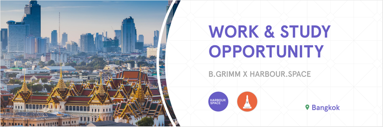

# Announcement

Hello Codeforces!

On [Thursday, July 21, 2022 at 20:35UTC+6](https://codeforces.com/https://www.timeanddate.com/worldclock/fixedtime.html?day=21&month=7&year=2022&hour=17&min=35&sec=0&p1=166) [Educational Codeforces Round 132 (Rated for Div. 2)](https://codeforces.com/contest/1709 "Educational Codeforces Round 132 (Rated for Div. 2)") will start.

Series of Educational Rounds continue being held as [Harbour.Space University](https://codeforces.com/https://harbour.space/) initiative! You can read the details about the cooperation between [Harbour.Space University](https://codeforces.com/https://harbour.space/) and Codeforces in the [blog post](//codeforces.com/blog/entry/51208).

This round will be **rated for the participants with rating lower than 2100**. It will be held on extended ICPC rules. The penalty for each incorrect submission until the submission with a full solution is 10 minutes. After the end of the contest you will have 12 hours to hack any solution you want. You will have access to copy any solution and test it locally.

You will be given **6 or 7 problems** and **2 hours** to solve them.

The problems were invented and prepared by Adilbek [adedalic](https://codeforces.com/profile/adedalic "International Master adedalic") Dalabaev, Vladimir [vovuh](https://codeforces.com/profile/vovuh "Master vovuh") Petrov, Ivan [BledDest](https://codeforces.com/profile/BledDest "International Grandmaster BledDest") Androsov, Maksim [Neon](https://codeforces.com/profile/Neon "Candidate Master Neon") Mescheryakov and me. Also huge thanks to Mike [MikeMirzayanov](https://codeforces.com/profile/MikeMirzayanov "Headquarters, MikeMirzayanov") Mirzayanov for great systems Polygon and Codeforces.

Good luck to all the participants!

Our friends at Harbour.Space also have a message for you: 

***WORK & STUDY OPPORTUNITY IN BANGKOK — B.GRIMM POWER x HARBOUR.SPACE UNIVERSITY***

*[B.GRIMM POWER](https://codeforces.com/https://www.bgrimmpower.com/en/home) has partnered with [Harbour.Space University](https://codeforces.com/https://harbour.space/register) to **offer Bachelor's and Master’s degree scholarships** in **Data Science** as well as **work experience** in one of the main infrastructure developers in Thailand.* 

*B.Grimm Power PCL (B.Grimm Power), is a Thailand-based electricity generating and distribution energy company. B.Grimm Power is involved in the development, financing, construction and operation of power plants. Its product portfolio includes solar, hydro, wind power, and Diesel.*

*We are looking for various **junior** to **mid-level** candidates to work on solving tasks in the following fields:* 

 * *Data analysis*
* *System integration*
* *AI*
* *Forecasting Modeling*

*All successful applicants will be eligible for a 100% tuition fee scholarship (22.900 €/year) provided by the B.GRIMM POWER.*

***CANDIDATE’S COMMITMENT***

***Study Commitment:** 3 hours/day* ‍

*You will complete 15 modules (each three weeks long) in one year. The daily class workload is 3 hours, plus homework to complete in your own time.*

***Work Commitment:** 4+ hours/day* ‍

*Immerse yourself in the professional world during your apprenticeship. You’ll learn from the best and get to apply your newly acquired knowledge in the field from day one.*

***REQUIREMENTS:*** 

 * *Industry experience*
* *International exposure*
* *Eager to learn*
* *Entrepreneurial mindset*
* *(Thai Language is a plus, not a must)*

  [Apply Now](https://scholarships.harbour.space/bgrimm-data-science?utm_source=codeforces&utm_medium=partner&utm_campaign=bkk_b2b_bgrimm-apprenticeship) **UPD:** [Editorial is out](Tutorial.md)

