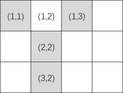
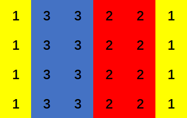

<h1 style='text-align: center;'> A. Color the Picture</h1>

<h5 style='text-align: center;'>time limit per test: 1 second</h5>
<h5 style='text-align: center;'>memory limit per test: 256 megabytes</h5>

A picture can be represented as an $n\times m$ grid ($n$ rows and $m$ columns) so that each of the $n \cdot m$ cells is colored with one color. You have $k$ pigments of different colors. You have a limited amount of each pigment, more precisely you can color at most $a_i$ cells with the $i$-th pigment.

A picture is considered beautiful if each cell has at least $3$ toroidal neighbors with the same color as itself.

Two cells are considered toroidal neighbors if they toroidally share an edge. In other words, for some integers $1 \leq x_1,x_2 \leq n$ and $1 \leq y_1,y_2 \leq m$, the cell in the $x_1$-th row and $y_1$-th column is a toroidal neighbor of the cell in the $x_2$-th row and $y_2$-th column if one of following two conditions holds:

* $x_1-x_2 \equiv \pm1 \pmod{n}$ and $y_1=y_2$, or
* $y_1-y_2 \equiv \pm1 \pmod{m}$ and $x_1=x_2$.

Notice that each cell has exactly $4$ toroidal neighbors. For example, if $n=3$ and $m=4$, the toroidal neighbors of the cell $(1, 2)$ (the cell on the first row and second column) are: $(3, 2)$, $(2, 2)$, $(1, 3)$, $(1, 1)$. They are shown in gray on the image below:

  The gray cells show toroidal neighbors of $(1, 2)$. Is it possible to color all cells with the pigments provided and create a beautiful picture?

### Input

Each test contains multiple test cases. The first line contains the number of test cases $t$ ($1 \leq t \leq 10^4$). The description of the test cases follows.

The first line of each test case contains three integers $n$, $m$, and $k$ ($3 \leq n,m \leq 10^9$, $1 \leq k \leq 10^5$) — the number of rows and columns of the picture and the number of pigments.

The next line contains $k$ integers $a_1,a_2,\dots, a_k$ ($1 \leq a_i \leq 10^9$) — $a_i$ is the maximum number of cells that can be colored with the $i$-th pigment.

It is guaranteed that the sum of $k$ over all test cases does not exceed $10^5$.

### Output

For each test case, print "Yes" (without quotes) if it is possible to color a beautiful picture. Otherwise, print "No" (without quotes).

## Example

### Input


```text
64 6 312 9 83 3 28 83 3 29 54 5 210 115 4 29 1110 10 311 45 14
```
### Output

```text

Yes
No
Yes
Yes
No
No

```
## Note

In the first test case, one possible solution is as follows:

  In the third test case, we can color all cells with pigment $1$.


#### Tags 

#1500 #NOT OK #constructive_algorithms #greedy #math 

## Blogs
- [All Contest Problems](../Codeforces_Round_810_(Div._1).md)
- [Announcement #1 (en)](../blogs/Announcement_1_(en).md)
- [Codeforces Round #810 (en)](../blogs/Codeforces_Round_810_(en).md)
- [Tutorial (en)](../blogs/Tutorial_(en).md)
