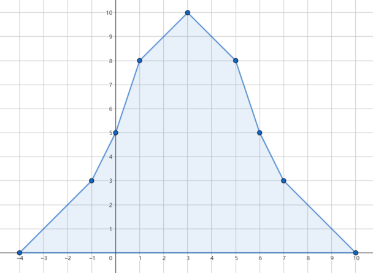
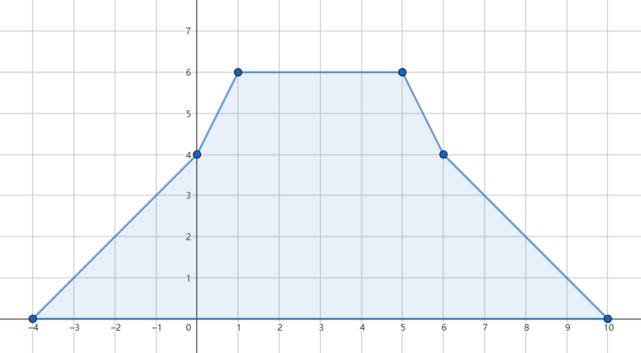

<h1 style='text-align: center;'> B. Rain</h1>

<h5 style='text-align: center;'>time limit per test: 4 seconds</h5>
<h5 style='text-align: center;'>memory limit per test: 256 megabytes</h5>

You are the owner of a harvesting field which can be modeled as an infinite line, whose positions are identified by integers.

It will rain for the next $n$ days. On the $i$-th day, the rain will be centered at position $x_i$ and it will have intensity $p_i$. Due to these rains, some rainfall will accumulate; let $a_j$ be the amount of rainfall accumulated at integer position $j$. Initially $a_j$ is $0$, and it will increase by $\max(0,p_i-|x_i-j|)$ after the $i$-th day's rain.

A flood will hit your field if, at any moment, there is a position $j$ with accumulated rainfall $a_j>m$.

You can use a magical spell to erase exactly one day's rain, i.e., setting $p_i=0$. For each $i$ from $1$ to $n$, check whether in case of erasing the $i$-th day's rain there is no flood.

### Input

Each test contains multiple test cases. The first line contains the number of test cases $t$ ($1 \leq t \leq 10^4$). The description of the test cases follows.

The first line of each test case contains two integers $n$ and $m$ ($1 \leq n \leq 2 \cdot 10^5$, $1 \leq m \leq 10^9$) — the number of rainy days and the maximal accumulated rainfall with no flood occurring.

Then $n$ lines follow. The $i$-th of these lines contains two integers $x_i$ and $p_i$ ($1 \leq x_i,p_i \leq 10^9$) — the position and intensity of the $i$-th day's rain.

The sum of $n$ over all test cases does not exceed $2 \cdot 10^5$.

### Output

For each test case, output a binary string $s$ length of $n$. The $i$-th character of $s$ is 1 if after erasing the $i$-th day's rain there is no flood, while it is 0, if after erasing the $i$-th day's rain the flood still happens.

## Example

### Input


```text
43 61 55 53 42 31 35 22 51 610 66 124 51 612 55 59 78 3
```
### Output

```text

001
11
00
100110

```
## Note

In the first test case, if we do not use the spell, the accumulated rainfall distribution will be like this:

  If we erase the third day's rain, the flood is avoided and the accumulated rainfall distribution looks like this:

  In the second test case, since initially the flood will not happen, we can erase any day's rain.

In the third test case, there is no way to avoid the flood.


#### Tags 

#2100 #NOT OK #binary_search #brute_force #data_structures #geometry #greedy #implementation #math 

## Blogs
- [All Contest Problems](../Codeforces_Round_810_(Div._1).md)
- [Announcement #1 (en)](../blogs/Announcement_1_(en).md)
- [Codeforces Round #810 (en)](../blogs/Codeforces_Round_810_(en).md)
- [Tutorial (en)](../blogs/Tutorial_(en).md)
