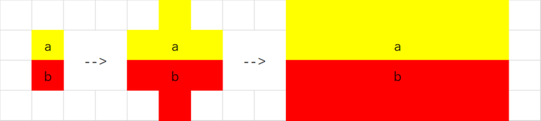

# Tutorial_(en)

Sorry for the late editorial. May this editorial help you. If you have questions, feel free to ask.

[1711A - Perfect Permutation](../problems/A._Perfect_Permutation.md "Codeforces Round 810 (Div. 2)")

 **hint1.**The minimal weight is at least 1 since 1 divides any integer (so 1 divides p1).

 **solution**Since k+1 does not divide k, a permutation with weight equal to 1 is: [n,1,2,⋯,n−1].

 **code**
```cpp
#include <bits/stdc++.h>

using namespace std;


void work()
{
	int n;
	cin>>n;
	cout<<n<<' ';
	for (int i=1;i<n;i++)
		cout<<i<<' ';
	cout<<endl;
}

int main()
{
	int casenum=1;
	cin>>casenum;
	for (int testcase=1;testcase<=casenum;testcase++)
		work();
	return 0;
}
```
[1711B - Party](../problems/B._Party.md "Codeforces Round 810 (Div. 2)")

 **hint1.**See the party as a graph.

 **hint2.**Divide the vertices into two categories according to their degrees' parity.

 **solution**Let's consider the case where m is odd only, since if m is even the answer is 0.

Assume that you delete x vertices with even degrees and y vertices with odd degrees.

If y≥1, then only deleting one vertex with an odd degree would lead to a not worse answer, so you do not need to consider it except for (x,y)=(0,1).

If y=0, then the parity of the edges at the end is determined only by the number of edges whose both endpoints are deleted. In particular, there must be at least two adjacent vertices deleted with even degrees. So you do not need to consider it except for (x,y)=(2,0) and they are neighbours.

Thus, an optimal solution either has (x,y)=(0,1) or (x,y)=(2,0) and the two vertices are adjacent.

One can iterate over all possible solutions with such a structure and take the optimal one.

Total time complexity: O(n+m).

 **code**
```cpp
#include <bits/stdc++.h>
using namespace std;
#define MAXN 100010
int x[MAXN],y[MAXN],a[MAXN],degree[MAXN];
int n,m;
void work()
{
	cin>>n>>m;
	for (int i=1;i<=n;i++)
	{
		degree[i]=0;
		cin>>a[i];
	}
	for (int i=1;i<=m;i++)
	{
		cin>>x[i]>>y[i];
		degree[x[i]]++;
		degree[y[i]]++;
	}
	int ans=INT_MAX;
	if (m%2==0)
		ans=0;
	for (int i=1;i<=n;i++)
		if (degree[i]%2==1)
			ans=min(ans,a[i]);
	for (int i=1;i<=m;i++)
		if (degree[x[i]]%2==0 && degree[y[i]]%2==0)
			ans=min(ans,a[x[i]]+a[y[i]]);
	cout<<ans<<endl;
}

int main()
{
	int casenum=1;
	cin>>casenum;
	for (int testcase=1;testcase<=casenum;testcase++)
		work();
	return 0;
}
```
[1710A - Color the Picture](https://codeforces.com/contest/1710/problem/A "Codeforces Round 810 (Div. 1)")

 **hint1.**The picture must consist of some stripes with at least 2 rows or at least 2 columns.

 **hint2.**When n is odd and all ⌊aim⌋=2, we cannot draw a beautiful picture using row stripes.

 **solution**Let's first prove hint1 first.

If there is a pair of toroidal neighbors with different colors. For example, colx,y=a and colx+1,y=b(a≠b). Then we will find colx−1,y=colx,y+1=colx,y−1=a,colx+2,y=colx+1,y+1=colx+1,y−1=b must hold. Then we find another two pairs of toroidal neighbors colx,y+1,colx+1,y+1 and colx,y−1,colx+1,y−1. Repeat such process, we will find the boundary should be like:



Similar, the boundaries can be vertical lines, but horizontal lines and vertical lines can not exist in one picture.

So the pattern should be row stripes all with at least 2 rows or column stripes all with at least 2 columns.

Check if one can draw a beautiful picture with row stripes only or with column stripes only. We consider only the case of row stripes, the reasoning is analogous for column stripes.

If it is possible, then ∑ai≥2m⌊aim⌋≥n must hold.

If n is even, then such a condition is enough.

If n is odd, there must be some ⌊aim⌋≥3. In this case, you can draw a beautiful picture using such algorithm:

 * Sort ai from large to small.
* Draw 2 rows stripes of each color if possible.
* If the picture still has some rows empty, insert new rows into each stripe.

Total time complexity: O(n).

 **code**
```cpp
#include <bits/stdc++.h>
using namespace std;
#define MAXN 100010
int n,m,k;
int a[MAXN];
void work()
{
	cin>>n>>m>>k;
	for (int i=1;i<=k;i++)
		cin>>a[i];
	bool flag;
	long long tot=0;
	flag=0;
	tot=0;
	for (int i=1;i<=k;i++)
	{
		if (a[i]/n>2)
			flag=1;
		if (a[i]/n>=2)
			tot+=a[i]/n;
	}
	if (tot>=m && (flag || m%2==0))
	{
		cout<<"Yes"<<endl;
		return ;
	}
	flag=0;
	tot=0;
	for (int i=1;i<=k;i++)
	{
		if (a[i]/m>2)
			flag=1;
		if (a[i]/m>=2)
			tot+=a[i]/m;
	}
	if (tot>=n && (flag || n%2==0))
	{
		cout<<"Yes"<<endl;
		return ;
	}
	cout<<"No"<<endl;

}

int main()
{
	int casenum=1;
	cin>>casenum;
	for (int testcase=1;testcase<=casenum;testcase++)
		work();
	return 0;
}
```
[1710B - Rain](https://codeforces.com/contest/1710/problem/B "Codeforces Round 810 (Div. 1)")

 **hint1.**The maximum can always be achieved in the center position of one day's rain.

 **hint2.**ai is a piecewise linear function and the slope of ai will only change for O(n) times.

 **hint3.**Supposing you know an invalid position j where aj>m, what are the properties of a rain that, if erase, makes it valid?

 **solution**Let's call position j a key position if it is the center position of a rain. i.e. there exists i so that xi=j.

You can calculate aj for all key positions j using the difference array.

Let d1j=aj−aj−1, d2j=d1j−d1j−1, then the i-th day's rain will change it as follows:

d2xi−pi+1←d2xi−pi+1+1

d2xi+1←d2xi+1−2

d2xi+pi+1←d2xi+pi+1+1

This can be calculated efficiently using prefix sums.

We say that a position j is valid if aj≤m.

Now, consider an invalid position j; erasing the i-th day's rain will make it valid if and only if pi−|xi−j|≥aj−m.

One can check that the region of (x,p) satisfying such an inequality is a quadrant rotated 45∘ anticlockwise and translated. And in particular, even the intersections of two such regions have the same structure and can be computed easily (to avoid using floating point numbers, one can multiply all xi,pi by 2).

In the end, for each i, you only need to check whether point (xi,pi) belongs to such region.

Total time complexity: O(nlogn).

 **code**
```cpp
#include <bits/stdc++.h>
#define MAXN 200100
#define LL long long
using namespace std;

typedef pair<LL,LL> pll;
LL n,m;
LL x[MAXN],p[MAXN];
vector<pll> diff;
pll key;

pll getIntersection(pll p1,pll p2)
{
	LL tx=max(p1.first+p1.second,p2.first+p2.second);
	LL ty=max(p1.second-p1.first,p2.second-p2.first);
	return {(tx-ty)/2,(tx+ty)/2};
}

void work()
{
	diff.clear();
	key={0,-0x3f3f3f3f3f3f3f3f};
	cin>>n>>m;
	m*=2;
	for (int i=1;i<=n;i++)
	{
		cin>>x[i]>>p[i];
		x[i]*=2;
		p[i]*=2;
		diff.push_back({x[i]-p[i],1});
		diff.push_back({x[i],-2});
		diff.push_back({x[i]+p[i],1});
	}
	sort(diff.begin(), diff.end());
	LL a=0,d=0;
	LL lst=0;
	for (auto p:diff)
	{
		if (p.first!=lst)
		{
			a=a+(p.first-lst)*d;
			lst=p.first;
			if (a>m)
				key=getIntersection(key,{p.first,a-m});
		}
		d+=p.second;
	}
	for (int i=1;i<=n;i++)
		if (getIntersection(key,{x[i],p[i]})==pll(x[i],p[i]))
			cout<<'1';
		else
			cout<<'0';
	cout<<endl;
}

int main()
{
	int casenum=1;
	cin>>casenum;
	for (int testcase=1;testcase<=casenum;testcase++)
		work();
	return 0;
}
```
[1710C - XOR Triangle](https://codeforces.com/contest/1710/problem/C "Codeforces Round 810 (Div. 1)")

 **hint1.**Consider the same bit of three integers at the same time.

 **hint2.**a⨁b≤a+b

 **solution**Define cnti1i2i3 as:

jth bit of cnti1i2i3 is 1 iif i1=aj,i2=bj,i3=cj 

e.g. a=(10)2,b=(11)2,c=(01)2 then cnt110=(10)2,cnt011=(01)2, other cnt is 0.

a=cnt100+cnt101+cnt110+cnt111

b=cnt010+cnt011+cnt110+cnt111

c=cnt001+cnt011+cnt101+cnt111

a⨁b=cnt010+cnt011+cnt100+cnt101

a⨁c=cnt001+cnt011+cnt100+cnt110

b⨁c=cnt001+cnt010+cnt101+cnt110

a⨁b+a⨁c>b⨁c⟺cnt011+cnt100>0

similar:

cnt101+cnt010>0

cnt110+cnt001>0

then we use digit dp: dp[n][i][j] means when we consider first n bits, state of reaching the upper bound is i, state of conditions is j. 

Enumerate ajbjcj for j from |n|−1 to 0 and make transition.

Time complexity is O(29|n|) where |n| is the length of input.

 **code**
```cpp
#include <bits/stdc++.h>
#define MAXN 200100
#define LL long long
#define MOD 998244353
using namespace std;

LL dp[MAXN][8][8];
string s;
int main()
{
	cin>>s;
	dp[0][0][0]=1;
	for (int i=0;i<s.size();i++)
		for (int mask1=0;mask1<8;mask1++)
			for (int mask2=0;mask2<8;mask2++)
			{
				dp[i][mask1][mask2]%=MOD;
				for (int m=0;m<8;m++)
				{
					bool flag=false;
					for (int j=0;j<3;j++)
						if (s[i]=='0' && (mask2>>j)%2==0 && (m>>j)%2==1)
						{
							flag=true;
							break;
						}
					if (flag)
						continue;
					int tmpmask1=mask1;
					int tmpmask2=mask2;
					for (int j=0;j<3;j++)
						if (s[i]-'0'!=((m>>j)&1))
							tmpmask2|=(1<<j);
					for (int j=0;j<3;j++)
						if (m==(1<<j) || m==7-(1<<j))
							tmpmask1|=(1<<j);
					dp[i+1][tmpmask1][tmpmask2]+=dp[i][mask1][mask2];
				}
			}
	LL ans=0;
	for (int i=0;i<8;i++)
		ans+=dp[s.size()][7][i];
	cout<<ans%MOD<<endl;
	return 0;
}
```
[1710D - Recover the Tree](https://codeforces.com/contest/1710/problem/D "Codeforces Round 810 (Div. 1)")

Thank [dario2994](https://codeforces.com/profile/dario2994 "International Grandmaster dario2994"), the key part of the proof is from him.

 **hint1**If interval A,B are all good and A∩B≠∅, then A∩B is good, too.

 **hint2**If interval A,B are all good and A∩B≠∅, then A∪B is good, too.

 **hint3**Consider enumerating good intervals according to their length.

 **solution**Let's consider the interval in the order of its length (small to large) and add the edge one by one.

Initially, the graph has no edge. There are n connected components each consisting of exactly one vertex. Note our algorithm will guarantee that at every moment every connected component's indices compose an interval. Let [Li,Ri] be the connected component vertex i in.

If [x,y] is good and x and y are not in the same connected component, we can merge [Lx,Ry] into a larger connected component.

Supposing [Lx,Ry] consist of k+2 connected components now, let's call them [l0,r0],[l1,r1],⋯,[lk+1,rk+1](x∈[l0,r0],y∈[lk+1,rk+1]), you can link edges like:

⋯−l4−l2−x−y−l1−l3−⋯

If [x,y] is good and x and y are in the same connected component, then we do nothing.

Finally, you will get a valid tree.

Total time complexity: O(n2).

 **proof**Let ans[x][y] be if interval [x,y] is good as the input data demands.

Let res[x][y] be if interval [x,y] is good in our answer tree.

Assume that the intervals we have considered are consistent with the input and we are considering [x,y]. Let's first prove if ans[x][y]=1 then res[x][y]=1.

 **proof1**If interval x,y are in different connected components when [x,y] is enumerated.

The edge-link method will ensure [x,y] is good in our answer tree.

If interval x,y are in the same connected components when [x,y] is enumerated.

Since [x,y] has been merged into a larger connected component, then there must be a series of good intervals:

I1,I2,⋯,Ik,Ii+1∩Ii≠∅,Ii∩[x,y]≠∅,[x,y]⊂∪Ii

Let Ji=Ii∩[x,y]

Then according to hint1, all Ji is good. Ji+1∩Ji≠∅,∪Ji=[x,y]

Then we know [x,y] is good in our tree, too. 

Let's then prove if ans[x][y]=0 then res[x][y]=0.

 **proof2**Assume that we are processing the interval [x,y] and up to now we did not create an invalid interval. I will prove that even after "connecting" [x,y] it still remains true that bad intervals are not connected.

Let I=[a,b] not be connected before performing the operation on [x,y] and become connected later. Let CC be "connected component".

Case1: I does not contain x or does not contain y, and at least one of a,b is in (Rx,Ly).

When a,b are in different CC, I does not contain both of x and y while they are the key vertices to walk from CC i to CC i+1.

When a,b are in the same CC, the link will have no influence on its connectivity.

Case2: I contains [x,y].

If [a,b] becomes connected after the linking, since we only add edges in [x,y], [a,x] and [y,b] must be connected.

Since [a,x],[x,y],[y,b] are all good, [a,b] is good and we are happy.

case3: b≤Rx or a≥Ly.

I's connectivity will not be influenced.

The proof is rather long and hard, and if you have some better ideas please share them.

 **code**
```cpp
#include <bits/stdc++.h>
using namespace std;
#define MAXN 5100
typedef pair<int,int> pii;
int n;
char good[MAXN][MAXN];
int lv[MAXN],rv[MAXN];
vector<pii> ans;


void work()
{
	ans.clear();
	cin>>n;
	for (int i=1;i<=n;i++)
	{
		lv[i]=rv[i]=i;
		cin>>(good[i]+i);
	}
	for (int len=2;len<=n;len++)
		for (int l=1;l<=n+1-len;l++)
		{
			int r=l+len-1;
			if (good[l][r]=='1' && lv[l]!=lv[r] && rv[l]!=rv[r])
			{
				ans.push_back({l,r});
				vector<int> tmp[2];
				int id=1;
				tmp[0].push_back({l});
				tmp[1].push_back({r});
				for (int i=rv[l]+1;i<lv[r];i++)
					if (lv[i]==i)
					{
						ans.push_back({tmp[id].back(),i});
						tmp[id].push_back(i);
						id^=1;
					}
				int lm=lv[l];
				int rm=rv[r];
				for (int i=lm;i<=rm;i++)
				{
					lv[i]=lm;
					rv[i]=rm;
				}
			}
		}
	for (auto p:ans)
		cout<<p.first<<' '<<p.second<<endl;
}

int main()
{
	int casenum=1;
	cin>>casenum;
	for (int testcase=1;testcase<=casenum;testcase++)
		work();
	return 0;
}
```
[1710E - Two Arrays](https://codeforces.com/contest/1710/problem/E "Codeforces Round 810 (Div. 1)")

 **hint1.**Since they are very smart, they know the result of the game at the beginning.

 **hint2.**If the result is x, then Alice will end the game when Bob moves to a cell with score less than x, and something analogous holds for Bob.

 **hint3.**Thus, Alice can only move to a certain subset of cells, and the same holds for Bob. 

 **solution**Knowing the above facts, it is clear that we can apply binary search on the answer Z, which is less than a1+b1, or Alice can end the game immediately to get a1+b1.

Let's color white all the cells with ar+bc≤Z, and black all the cells with ar+bc>Z.

Then we shall add edges between cells in the same row or same column with different colors. These edges and cells form a bipartite graph.

Consider the game on the bipartite graph. Initially, we are at cell (1,1). Alice moves first, then they take turns to move. Each player can only move the cell to another place with an edge connecting them, or the other player will end the game immediately.

Each cell can be visited at most 1000 times, whoever cannot move loses.

If Alice wins, then the answer is no greater than Z, otherwise, the answer is greater than Z.

The version of this game where each vertex can be visited exactly once is known. If both players play optimally, the first player wins iff the starting vertex belongs to all possible maximum matchings. I'll explain why at the end of the editorial.

It turns out that the condition is exactly the same even if each vertex can be visited at most 1000 times. Let us show why.

First, calculate the maximum matching. Then we erase the starting vertex and calculate the maximum matching in the new graph. If two matchings have the same size, the vertex does not belong to all maximum matchings and vice versa.

Now, we know that if we copy a cell 1000 times and copy the edges as well, this problem is exactly the same as the model mentioned above. If we consider the initial bipartite graph, it's easy to see that we only need to check whether (1,1) is in all maximum matchings of the initial graph, because the maximum matching remains unchanged in the other 999 parts.

So, we have shifted the problem to see if the initial cell belongs to all matchings. 

According to [Kőnig's theorem in graph theory]([https://en.wikipedia.org/wiki/K%C5%91nig%27s_theorem_(graph_theory))](https://codeforces.com/https://en.wikipedia.org/wiki/K%C5%91nig%27s_theorem_(graph_theory))), the size of the maximum matching is equal to the size of the minimum vertex cover. And if you erase all vertices in the minimum vertex cover, you get an independent set, which is the maximum independent set.

Using M to refer to the maximum matching, I to refer to the maximum independent set, V to refer to the set of vertices, we know that |M|+|I|=|V|

So, if we erase one vertex and |M| remains unchanged, then |I| must be changed and vice versa.

Now our issue is to calculate the maximum independent set in this graph, with or without the initial cell.

Let us sort ai and bi (notice that reordering rows and columns do not change the game at all). Now the white cells form a "decreasing histogram". We can still find the starting cell (va,vb).

First, let's compute the maximum independent set with the initial cell.

Before that, consider the following constraints: 

It's obvious that one column has at most one color of its cells in the independent set(we shall call it I), so does a row. Let's call a column white if only white cells of it are in I, otherwise, we shall call it black.

What is the maximum size of I, when we must have i white columns and j white rows? The answer is simple. We shall select the first i columns to be white and the first j rows to be white, the rest of the columns and rows to be black. Then the independent set consists of black cells on black rows and black columns, and white cells on white columns and white rows. It's easy to prove this greedy strategy is correct.

Now we fix the number of white columns as i, and try to find a j that maximizes |I|. If we make an array da[i] satisfying ai+bda[i]≤Z and ai+bda[i]+1>Z, and a similar array db[j], we can easily calculate the change of |I| when we turn row j from black to white and vice versa, which is n−max(i,db[j])−min(i,db[j]), −min(i,db[j]) means remove the white part from I, +n−max(i,db[j]) means add the black part to I. For a fixed i, it's easy to see that the change increases with j.

So you can maintain all positive changes of |I|, just decrease the j with i decreasing. Now you can calculate the maximum of |I| in O(n+m) time.

It's easy to see that da[i] and db[i] are non-increasing, so they can be calculated in O(n+m) time.

For the maximum independent set without the initial cell, you just need to remove it when it is in I. Since the cell is always black, it is quite easy.

Using binary search on the answer, you can solve the whole problem in O((n+m)logA+nlogn+mlogm), where A is the maximum value of the arrays a and b.

Let us conclude with the idea of the known game on bipartite graphs.

\textbf{Lemma}: The first player can win if and only if all possible maximum matchings include the initial vertex H.

Let's prove it when H satisfies the constraint.

The first player can just choose any matching M and move to the vertex P matching with current vertex, then any unvisited neighbor of P still matches with other unvisited vertices. If P has a neighbor unmatched in a certain matching M, we find an augmenting path and a matching M′ that doesn't include H, which is in conflict with the constraint. So no matter how the second player chooses to move, the first player always has a vertex to go after that.

Otherwise, we add a vertex P with the only edge (P,H), move the initial cell to P, swap the two players, then it turns into the situation above.

 **code**
```cpp
#include <bits/stdc++.h>

using ll=long long;
using std::cin;
using std::cerr;
using std::cout;
using std::min;
using std::max;

template<class T>
void ckmx(T &A,T B){
	A<B?A=B:B;
}

const int N=2e5+7;

int n,m,va,vb;
int a[N],b[N];
int da[N],db[N];

bool check(int x){
	ll sm=0,f1=0,f2=0;
	for(int j=m,i=0;j>=1;--j){
		while(i<n&&a[i+1]+b[j]<=x)
			++i;
		db[j]=i;
		sm+=db[j];
	}
	for(int i=n,j=0;i>=1;--i){
		while(j<m&&a[i]+b[j+1]<=x)
			++j;
		da[i]=j;
	}
	f1=f2=sm;
	for(int i=n,j=m;i>=1;--i){
		sm-=min(j,da[i]);
		sm+=m-max(j,da[i]);
		ckmx(f1,sm);
		ckmx(f2,sm-(i<=va&&j<vb));
		while(j&&min(db[j],i-1)<=n-max(db[j],i-1)){
			sm-=min(db[j],i-1);
			sm+=n-max(db[j],i-1);
			--j;
			ckmx(f1,sm);
			ckmx(f2,sm-(i<=va&&j<vb));
		}
	}return f1==f2;
}

void Main(){
	cin>>n>>m;
	for(int i=1;i<=n;++i)
		cin>>a[i];
	for(int j=1;j<=m;++j)
		cin>>b[j];
	va=a[1],vb=b[1];
	std::sort(a+1,a+n+1);
	std::sort(b+1,b+m+1);
	int l=a[1]+b[1],r=va+vb;
	va=std::lower_bound(a+1,a+n+1,va)-a;
	vb=std::lower_bound(b+1,b+m+1,vb)-b;
	while(l<r){
		int mid=(l+r)>>1;
		if(check(mid))
			r=mid;
		else 
			l=mid+1;
	}cout<<l<<"n";
}

inline void File(){
	cin.tie(nullptr)->sync_with_stdio(false);
#ifdef zxyoi
	freopen("my.in","r",stdin);
#endif
}signed main(){File();Main();return 0;}
```
