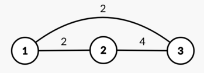

<h1 style='text-align: center;'> D. Empty Graph</h1>

<h5 style='text-align: center;'>time limit per test: 1.5 seconds</h5>
<h5 style='text-align: center;'>memory limit per test: 256 megabytes</h5>

 — Do you have a wish?  — I want people to stop gifting each other arrays.O_o and Another Young BoyAn array of $n$ positive integers $a_1,a_2,\ldots,a_n$ fell down on you from the skies, along with a positive integer $k \le n$.

You can apply the following operation at most $k$ times: 

* Choose an index $1 \le i \le n$ and an integer $1 \le x \le 10^9$. Then do $a_i := x$ (assign $x$ to $a_i$).

Then build a [complete](https://en.wikipedia.org/wiki/Complete_graph) undirected weighted graph with $n$ vertices numbered with integers from $1$ to $n$, where edge $(l, r)$ ($1 \le l < r \le n$) has weight $\min(a_{l},a_{l+1},\ldots,a_{r})$.

You have to find the maximum possible diameter of the resulting graph after performing at most $k$ operations.

The diameter of a graph is equal to $\max\limits_{1 \le u < v \le n}{\operatorname{d}(u, v)}$, where $\operatorname{d}(u, v)$ is the length of the shortest path between vertex $u$ and vertex $v$.

### Input

Each test contains multiple test cases. The first line contains the number of test cases $t$ ($1 \le t \le 10^4$). Description of the test cases follows.

The first line of each test case contains two integers $n$ and $k$ ($2 \le n \le 10^5$, $1 \le k \le n$).

The second line of each test case contains $n$ positive integers $a_1,a_2,\ldots,a_n$ ($1 \le a_i \le 10^9$).

It is guaranteed that the sum of $n$ over all test cases does not exceed $10^5$.

### Output

For each test case print one integer — the maximum possible diameter of the graph after performing at most $k$ operations.

## Example

### Input


```text
63 12 4 13 21 9 843 110 2 63 2179 17 10000000002 15 92 24 2
```
### Output

```text

4
168
10
1000000000
9
1000000000

```
## Note

In the first test case, one of the optimal arrays is $[2,4,5]$.

The graph built on this array: 

  $\operatorname{d}(1, 2) = \operatorname{d}(1, 3) = 2$ and $\operatorname{d}(2, 3) = 4$, so the diameter is equal to $\max(2,2,4) = 4$.


#### Tags 

#2000 #NOT OK #binary_search #constructive_algorithms #data_structures #greedy #shortest_paths 

## Blogs
- [All Contest Problems](../Codeforces_Round_813_(Div._2).md)
- [Announcement](../blogs/Announcement.md)
- [Tutorial (en)](../blogs/Tutorial_(en).md)
