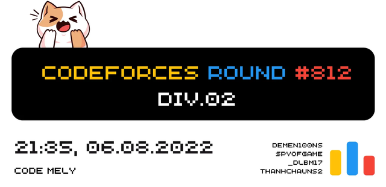

# Announcement_(en)

Hi Codeforces!
==============

[GlowCheese](https://codeforces.com/profile/GlowCheese "Master GlowCheese"), [DeMen100ns](https://codeforces.com/profile/DeMen100ns "Specialist DeMen100ns"), [SPyofgame](https://codeforces.com/profile/SPyofgame "Expert SPyofgame") and I are delighted to invite you to participate in [Codeforces Round #812 (Div. 2)](https://codeforces.com/contests/1713).

 * Start time: [Saturday, August 6, 2022 at 20:35UTC+6](https://codeforces.com/https://www.timeanddate.com/worldclock/fixedtime.html?day=6&month=8&year=2022&hour=17&min=35&sec=0&p1=166)
* Duration: **120 minutes**.
* Number of tasks: **6**, including at least **one interactive** problem. Make sure to read [this blog](https://codeforces.com/blog/entry/45307) and familiarize yourself with these types of problem before the round!

 **This contest is brought to you by:*** [PTIT](https://codeforces.com/https://www.facebook.com/HocvienPTIT), my university.
* [Code Mely](https://codeforces.com/https://discord.gg/vKjE9xan), a Vietnamese fanpage for Computer Science.

Special thanks to:

 * [errorgorn](https://codeforces.com/profile/errorgorn "International Grandmaster errorgorn") for wonderful coordination by rejecting 50+ problems from me, all for a better Codeforces.
* [KAN](https://codeforces.com/profile/KAN "Legendary Grandmaster KAN") for translating our statements.
* Vip testers: [satyam343](https://codeforces.com/profile/satyam343 "Candidate Master satyam343"), [tfg](https://codeforces.com/profile/tfg "Grandmaster tfg").
* The great great coordinators that tested our round: [antontrygubO_o](https://codeforces.com/profile/antontrygubO_o "International Grandmaster antontrygubO_o"), [74TrAkToR](https://codeforces.com/profile/74TrAkToR "Grandmaster 74TrAkToR").
* [DeMen100ns](https://codeforces.com/profile/DeMen100ns "Candidate Master DeMen100ns") for providing amazing problems, which helped us a lot.
* [GlowCheese](https://codeforces.com/profile/GlowCheese "Master GlowCheese") and [SPyofgame](https://codeforces.com/profile/SPyofgame "Expert SPyofgame") for their great effort, for pointing out mistakes in the original intended solutions.
* [_FireGhost_](https://codeforces.com/profile/_FireGhost_ "Master _FireGhost_") and [neko_nyaaaaaaaaaaaaaaaaa](https://codeforces.com/profile/neko_nyaaaaaaaaaaaaaaaaa "Grandmaster neko_nyaaaaaaaaaaaaaaaaa") for spending time helping us while they have to organize VNOI CUP 2022.
* Our testers: [thenymphsofdelphi](https://codeforces.com/profile/thenymphsofdelphi "International Grandmaster thenymphsofdelphi"), [neko_nyaaaaaaaaaaaaaaaaa](https://codeforces.com/profile/neko_nyaaaaaaaaaaaaaaaaa "Grandmaster neko_nyaaaaaaaaaaaaaaaaa"), [generic_placeholder_name](https://codeforces.com/profile/generic_placeholder_name "Grandmaster generic_placeholder_name"), [Andreasyan](https://codeforces.com/profile/Andreasyan "Grandmaster Andreasyan"), [PurpleCrayon](https://codeforces.com/profile/PurpleCrayon "Grandmaster PurpleCrayon"), [tfg](https://codeforces.com/profile/tfg "Grandmaster tfg"), [BucketPotato](https://codeforces.com/profile/BucketPotato "International Master BucketPotato"), [Vladithur](https://codeforces.com/profile/Vladithur "Master Vladithur"), [_FireGhost_](https://codeforces.com/profile/_FireGhost_ "Master _FireGhost_"), [LetterC67](https://codeforces.com/profile/LetterC67 "Master LetterC67"), [satyam343](https://codeforces.com/profile/satyam343 "Candidate Master satyam343"), [18o3](https://codeforces.com/profile/18o3 "Candidate Master 18o3"), [1DWalker](https://codeforces.com/profile/1DWalker "Candidate Master 1DWalker"), [vangtrangtan](https://codeforces.com/profile/vangtrangtan "Candidate Master vangtrangtan"), [haong](https://codeforces.com/profile/haong "Expert haong"), [Megumin2006](https://codeforces.com/profile/Megumin2006 "Expert Megumin2006"), [dinhsangBKA](https://codeforces.com/profile/dinhsangBKA "Expert dinhsangBKA"), [QuangBuiCPP](https://codeforces.com/profile/QuangBuiCPP "Expert QuangBuiCPP"), [Etherite](https://codeforces.com/profile/Etherite "Specialist Etherite"), [nyagami](https://codeforces.com/profile/nyagami "Specialist nyagami"), [Hehe](https://codeforces.com/profile/Hehe "Specialist Hehe"), [sonoobIdie](https://codeforces.com/profile/sonoobIdie "Pupil sonoobIdie"), [hydroshiba](https://codeforces.com/profile/hydroshiba "Pupil hydroshiba"), [LeCaToX](https://codeforces.com/profile/LeCaToX "Pupil LeCaToX"), [makyuri.ami](https://codeforces.com/profile/makyuri.ami "Pupil makyuri.ami").
* [MikeMirzayanov](https://codeforces.com/profile/MikeMirzayanov "Headquarters, MikeMirzayanov") for amazing platforms Codeforces and Polygon.
* Last but not least, you for your participation and being WA, then dropping at least one color :P

The score distribution is **500-1000-1750-2000-2500-3000**

Hope to see you in final standings!

**UPD**: We have a small gift for a Vietnamese participant who have the highest score, so if it is you, please DM me after contest. Good luck everybody!

**UPD2**: [Editorial](Tutorial_(en).md)

**UPD3**: Congratulations to the winners!

**Div.2:**

 1. [RGB_ICPC7](https://codeforces.com/profile/RGB_ICPC7 "Expert RGB_ICPC7")
2. [Xylenox](https://codeforces.com/profile/Xylenox "International Master Xylenox")
3. [5cd](https://codeforces.com/profile/5cd "Master 5cd")
4. [Jason2022](https://codeforces.com/profile/Jason2022 "Newbie Jason2022")
5. [Imot](https://codeforces.com/profile/Imot "Newbie Imot")

**Div.1 + 2:**

 1. [peti1234](https://codeforces.com/profile/peti1234 "International Grandmaster peti1234")
2. [A_G](https://codeforces.com/profile/A_G "Grandmaster A_G")
3. [kotatsugame](https://codeforces.com/profile/kotatsugame "International Grandmaster kotatsugame")
4. [jiangly](https://codeforces.com/profile/jiangly "Legendary Grandmaster jiangly")
5. [Rubikun](https://codeforces.com/profile/Rubikun "International Grandmaster Rubikun")
