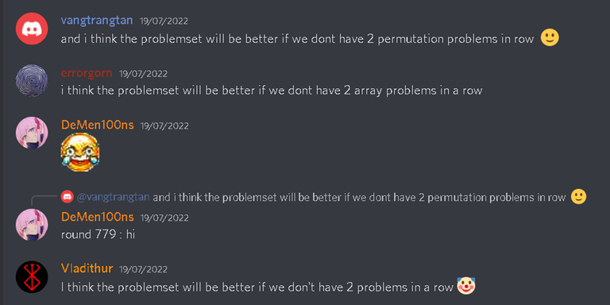
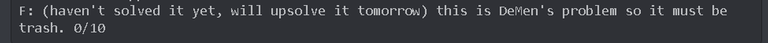
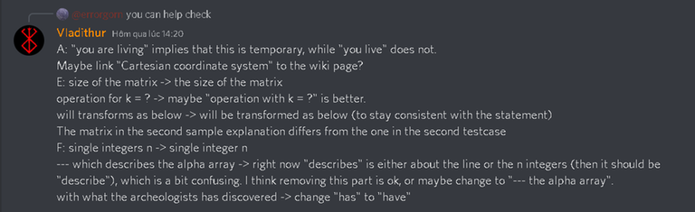
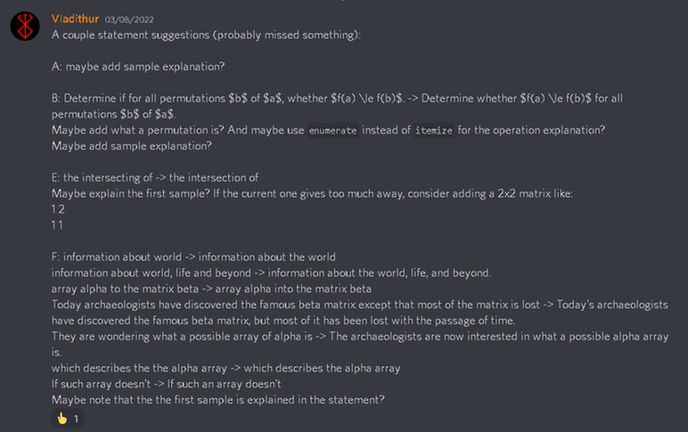
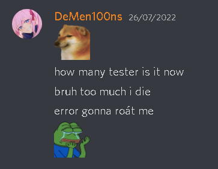

# Tutorial_(en)

**Before the round starts**Great efforts have been put over last year. We want to say thanks to everybody who helped us to make this round as it is. Cannot wait to see you guys on the next one!

 **Testers' predictions**

| Tester | A | B | C | D | E | F |
| --- | --- | --- | --- | --- | --- | --- |
| [tfg](https://codeforces.com/profile/tfg "Grandmaster tfg") | 800 | 1100 | 1500 | 1600 | 1900 | 2400 |
| [neko_nyaaaaaaaaaaaaaaaaa](https://codeforces.com/profile/neko_nyaaaaaaaaaaaaaaaaa "Grandmaster neko_nyaaaaaaaaaaaaaaaaa") | 800 | 1100 | 1700 | 1900 | 2100 | 2600 |
| [BucketPotato](https://codeforces.com/profile/BucketPotato "International Master BucketPotato") | 800 | 1000 | 1400 | 1800 | 2400 | - |
| [LetterC67](https://codeforces.com/profile/LetterC67 "Master LetterC67") | 800 | 1200 | 1400 | 1600 | 2100 | - |
| [_FireGhost_](https://codeforces.com/profile/_FireGhost_ "Master _FireGhost_") | 800 | 1100 | 1500 | 1900 | 2000 | 2400 |
| [fextivity](https://codeforces.com/profile/fextivity "Grandmaster fextivity") | 800 | 1000 | 1400 | 1700 | 2000 | 2400 |
| [generic_placeholder_name](https://codeforces.com/profile/generic_placeholder_name "Grandmaster generic_placeholder_name") | 800 | 1100 | 1600 | 1900 | 2200 | - |

 **Some comments from testers and authors****From BucketPotato**

 **From tfg**

 **Shower thoughts from vangtrangtan**

 **From Fireghost**

 **Also from Fireghost**

 **From thenymphsofdelphi**

 **From antontrygubO_o**

 **Huge help from Vladithur when polishing our statements** 

 **From hydroshiba**

 **From thanhchauns2**

 **From me**

 **From errorgorn**

[1713A - Traveling Salesman Problem](../problems/A._Traveling_Salesman_Problem.md)

 **Hint 1**Do we actually need to go off the axis?

 **Hint 2**How to avoid visiting an axis more than once?

 **Tutorial**
### [1713A - Traveling Salesman Problem](../problems/A._Traveling_Salesman_Problem.md)

Suppose we only have boxes on the Ox+ axis, then the optimal strategy is going in the following way: (0,0),(xmax,0),(0,0). There is no way to do in less than 2⋅|xmax| moves.

What if we have boxes on two axis? Let's assume it is Oy+, suppose we have a strategy to go in the following way: (0,0),(xmax,0),...,(0,ymax),(0,0). In this case it is optimal to fill the three dots with (0,0), which is just solving each axis independently.

Therefore, the number of axis does not matters. For each axis that has at least one box, go from (0,0) to the farthest one, then come back to (0,0).

Time complexity: O(n)

 **Solution**
```cpp
def solve():
    n = int(input())
    minX, minY, maxX, maxY = 0, 0, 0, 0
    for i in range(n):
        x, y = list(map(int, input().split()))
        minX = min(x, minX)
        maxX = max(x, maxX)
        minY = min(y, minY)
        maxY = max(y, maxY)
    print(2 * (maxX + maxY - minX - minY))


test = int(input())
while test > 0:
    test -= 1
    solve()
```
 **Feedback*** Didn't solve 


[*70*](https://codeforces.com/data/like?action=like "I like this")
* Good problem 

 
[*138*](https://codeforces.com/data/like?action=like "I like this")
* Average problem 

 
[*279*](https://codeforces.com/data/like?action=like "I like this")
* Bad problem 

 
[*44*](https://codeforces.com/data/like?action=like "I like this")
[1713B - Optimal Reduction](../problems/B._Optimal_Reduction.md)

 **Hint 1**How to calculate f(a)?

 **Hint 2**What if a is intially sorted?

 **Hint 3**Consider a has 3 elements. What if a1>a2 and a2<a3?

 **Tutorial**
### [1713B - Optimal Reduction](../problems/B._Optimal_Reduction.md)

Let's call M=max(a1,a2,…,an).

The problem asks us to make all its elements become 0 in some operations. And for each operation, we subtract each elements in an subarray by 1. Thus, every largest elements of the array have to be decreased in at least M operations. And also because of that, min(f(p)) over all permutations p of a is never less than M.

Every permutations p of a such that f(p)=M have the same construction. That is, they can be divided into 2 subarrays where the **left subarray** is sorted in **non-decreasing order**, and the **right subarray** is sorted in **non-increasing order**. In other words, the elements of the array should form a mountain.

 **Why?**This is how to perform the operations: assign l equal to the index of the leftmost element whose value is not 0, and assign r equal to the index of the rightmost element whose value is also not 0, then subtract each element al,al+1,…,ar by 1. Repeat the operation until all elements become 0. The thing is each element of the array is always greater or equal than every elements in the left side or the right side of it so it can never become negative at some point of performing the operations. Besides, all the largest elements are also included in each operation that we perform, which mean we've achieved the goal to make all elements of the array become 0 in M operations.

So how to check whether f(a)=M or not? Well, we can define preLen equal to the length of the longest prefix which is sorted in non-decreasing order. Then define sufLen equal to the length of the longest suffix which is sorted in non-increasing order. If preLen+sufLen≥n, the answer is *YES*.

Time complexity: O(n)

 **Solution**
```cpp
#include <bits/stdc++.h>
using namespace std;

const int N = 1e5 + 5;

int n, a[N];

int main() {
    int tc;
    for (cin >> tc; tc--; ) {
        cin >> n;
        for (int i = 1; i <= n; i++)
            cin >> a[i];

        int preLen = 1;
        while (preLen < n && a[preLen] <= a[preLen + 1])
            preLen++;

        int sufLen = 1;
        while (sufLen < n && a[n-sufLen] >= a[n-sufLen + 1])
            sufLen++;

        if (preLen + sufLen >= n)
            cout << "YES" << endl;
        else
            cout << "NO" << endl;
    }
}
```
 **Feedback*** Didn't solve 

 
[*125*](https://codeforces.com/data/like?action=like "I like this")
* Good problem 

 
[*342*](https://codeforces.com/data/like?action=like "I like this")
* Average problem 

 
[*81*](https://codeforces.com/data/like?action=like "I like this")
* Bad problem 

 
[*65*](https://codeforces.com/data/like?action=like "I like this")
[1713C - Build Permutation](../problems/C._Build_Permutation.md)

 **Hint 1**Is there any case that the answer doesn't exist?

 **Hint 2****What if:** n≤5

 **Hint 3**Construct the suffix instead of the prefix.

 **Hint 4**With any positive integer x, there is at least one square number in [x,2x]. [Proof.](https://codeforces.com/https://math.stackexchange.com/questions/1190737/proving-that-there-is-a-perfect-square-between-n-and-2n)

 **Tutorial**
### [1713C - Build Permutation](../problems/C._Build_Permutation.md)

First, let's prove that the answer always exists. Let's call the smallest square number that is not smaller than k is h. Therefore h≤2⋅k, which means h−k≤k. [Proof.](https://codeforces.com/https://math.stackexchange.com/questions/1190737/proving-that-there-is-a-perfect-square-between-n-and-2n) 

So we can fill pi=h−i for (h−k≤i≤k). Using this method we can recursively reduce k to h−k−1, then all the way down to −1.

We can prove that h−k≥0, as h≥k.

Time complexity: O(n)

 **Solution**
```cpp
#include <bits/stdc++.h>
using namespace std;

const int N = 1e5 + 5;

int n, ans[N];

void recurse(int r) {
	if (r < 0) return;
	int s = sqrt(2*r); s *= s;
	int l = s - r; recurse(l - 1);
	for (; l <= r; l++, r--) {
		ans[l] = r; ans[r] = l;
	}
}

int main() {
	int tc; cin >> tc;
	while (tc--) {
		cin >> n; recurse(n - 1);
		for (int i = 0; i < n; i++)
			cout << ans[i] << ' ';
		cout << 'n';
	}
}
```
 **Feedback*** Didn't solve 

 
[*270*](https://codeforces.com/data/like?action=like "I like this")
* Good problem 

 
[*596*](https://codeforces.com/data/like?action=like "I like this")
* Average problem 

 
[*58*](https://codeforces.com/data/like?action=like "I like this")
* Bad problem 

 
[*88*](https://codeforces.com/data/like?action=like "I like this")
[1713D - Tournament Coundown](../problems/D._Tournament_Countdown.md)

 **Hint 1**We made sure that almost every 2n−1 solutions cannot pass.

 **Hint 2**Did you use the 0 query?

 **Hint 3**2n+13=2n⋅23, what is the conclusion?

 **Tutorial**
### [1713D - Tournament Coundown](../problems/D._Tournament_Countdown.md)

There is a way to erase 3 participants in every 2 queries. Since there are 2n−1 participants to be removed, the number of queries will be ⌈(2n−1)⋅23⌉=⌊2n+13⌋. Suppose there are only 4 participants. In the first query we will ask the judge to compare the 1st and the 3rd participants. There are three cases:

 * The 1st participant wins more game than the 3rd one: the 2nd and 3rd cannot be the winner.
* The 3rd participant wins more game than the 1st one: the 1st and 4th cannot be the winner.
* The 1st and 3rd participants' numbers of winning games are equal: both the 1st and 3rd cannot be the winner.

Ask the remaining two participants, find the winner between them.

If there are more than 4 participants, we can continuously divide the number by 4 again and again, until there are at most 2 participants left. Now we can get the winner in one final query.

 **Solution**
```cpp
#include <bits/stdc++.h>

using namespace std;

int ask(vector<int> &k)
{
	cout << "? " << k[0] << ' ' << k[2] << endl;
	int x;
	cin >> x;
	if (x == 1)
	{
		cout << "? " << k[0] << ' ' << k[3] << endl;
		cin >> x;
		if (x == 1) return k[0];
		return k[3];
	}
	else if (x == 2)
	{
		cout << "? " << k[1] << ' ' << k[2] << endl;
		cin >> x;
		if (x == 1) return k[1];
		return k[2];
	}
	else
	{
		cout << "? " << k[1] << ' ' << k[3] << endl;
		cin >> x;
		if (x == 1) return k[1];
		return k[3];
	}
}

void solve()
{
	int n;
	cin >> n;
	vector<int> a, b;
	for (int i = 1; i <= (1LL << n); i++)
	{
		a.push_back(i);
	}
	while (a.size() > 2)
	{
		while (!a.empty())
		{
			vector<int> k(4);
			k[0] = a.back();
			a.pop_back();
			k[1] = a.back();
			a.pop_back();
			k[2] = a.back();
			a.pop_back();
			k[3] = a.back();
			a.pop_back();
			int win = ask(k);
			b.push_back(win);
		}
		a = b;
		b.clear();
	}
	if (a.size() == 2)
	{
		cout << "? " << a[0] << ' ' << a[1] << endl;
		int x;
		cin >> x;
		if (x == 2) a[0] = a[1];
	}
	cout << "! " << a[0] << endl;
}

int main(int argc, char ** argv)
{
	int tests;
	cin >> tests;
	while(tests--) solve();
}
```
 **Feedback*** Didn't solve 

 
[*116*](https://codeforces.com/data/like?action=like "I like this")
* Good problem 

 
[*391*](https://codeforces.com/data/like?action=like "I like this")
* Average problem 

 
[*26*](https://codeforces.com/data/like?action=like "I like this")
* Bad problem 

 
[*56*](https://codeforces.com/data/like?action=like "I like this")
[1713E - Cross Swapping](../problems/E._Cross_Swapping.md)

 **Hint 1**Think of the most to the least significant cell of the matrix.

 **Hint 2**How many positions in the matrix can a cell travel to after performing the operations?

 **Hint 3**And for each position that that cell can travel to, how many ways are there we can make it?

 **Tutorial**
### [1713E - Cross Swapping](../problems/E._Cross_Swapping.md)

Let's take a look at what the lexicographically smallest matrix is. Let's call (x,y) a cell that is in the intersection of row x and column y of the matrix, and the integer written on that cell is Ax,y. A cell (xp,yp) of this matrix is called more significant than the another cell (xq,yq) if and only if xp<xq, or xp=xq and yp<yq. The problem asks us to find the smallest matrix so the best suitable way to solve this problem is to traverse through the most to the least significant cell of the matrix, then determine if the current cell can be minimized or not.

Suppose the current cell we are looking at is (x,y). If x=y then its position will not change after performing the operations. But if x≠y, there are exactly 2 operations that swap (x,y) with another cell, that is k=x and k=y. Both of these operations swap (x,y) with the same cell (y,x). So the only way we can minimize the value of (x,y) is to try swapping it with (y,x) (if x<y and Ax,y>Ay,x) in some way.

As a result we have our constructive algorithm. Remind that for each operation k=i of the matrix (1≤i≤n), there are 2 states: it is being performed and not being performed. Suppose we have traversed to the cell (x,y). If x≥y, ignore it. If x<y then we try to make Ax,y=min(Ax,y,Ay,x) by deciding to swap or not to swap the cells. If Ax,y>Ay,x, try to swap (x,y) with (y,x) by making 2 operations k=x and k=y having different states. And if Ax,y<Ay,x then we should keep their positions unchanged by making 2 operations k=x and k=y having the same state. Note that if Ax,y=Ay,x, we do nothing.

Let's implement this algorithm using a simple DSU where the ith node represents the operation k=i. We define the value par[u] in such a way that, suppose p is the root of the u node's component, par[u]=p if 2 operations k=u and k=p should have the same state, or par[u]=−p if 2 operations k=u and k=p should have different states. Define another function join(i,j) to union 2 nodes i and j to the same component. Note that u and −u are always in the same component and par[−u]=−par[u]. Thus, for the current cell (x,y), we want to swap it with (y,x) by calling join(x,−y), or keep its position unchanged by calling join(x,y).

After constructing the graphs, the last thing to do is to determine which operations should be performed. One way to do so is for each root of the components of the DSU, we perform the operation which this root represents for. Then for other nodes just check par[i]>0 for the ith node and if it is true, the k=i operation should be performed. When we have the list of the operations that need to be performed, we can bruteforcely perform each operation from the list one by one and the final matrix will be the lexicographically smallest matrix.

Time complexity: O(n2) 

 **Solution**
```cpp
#include <bits/stdc++.h>
using namespace std;

const int N = 2e3 + 5;

int n, a[N][N];

int par[N];
int getPar(int u) {
    if (u < 0) return -getPar(-u);
    if (u == par[u]) return u;
    return par[u] = getPar(par[u]);
}
void join(int u, int v) {
    u = getPar(u); v = getPar(v);
    if (abs(u) != abs(v)) {
        if (u > 0) par[u] = v;
        else par[-u] = -v;
    }
}

int main() {
    cin.tie(nullptr) -> sync_with_stdio(false);

    int tc; cin >> tc;
    while (tc--) {
        cin >> n;
        for (int i = 1; i <= n; i++)
            for (int j = 1; j <= n; j++) {
                cin >> a[i][j];
            }
    
        iota(par + 1, par + n + 1, 1);
        // set par[i] == i for i in [1, n]

        for (int i = 1; i <= n; i++)
            for (int j = 1; j <= n; j++) {
                if (a[i][j] < a[j][i]) join(i, j);
                if (a[i][j] > a[j][i]) join(i, -j);
            }
    
        for (int i = 1; i <= n; i++) {
            if (getPar(i) < 0) continue;
            // we only perform the operation
            // if and only if getPar(i) > 0
            for (int j = 1; j <= n; j++)
                swap(a[i][j], a[j][i]);
        }

        for (int i = 1; i <= n; i++) {
            for (int j = 1; j <= n; j++) {
                cout << a[i][j] << ' ';
            }
            cout << 'n';
        }
    }
}
```
 **Feedback*** Didn't solve 

 
[*83*](https://codeforces.com/data/like?action=like "I like this")
* Good problem 

 
[*120*](https://codeforces.com/data/like?action=like "I like this")
* Average problem 

 
[*18*](https://codeforces.com/data/like?action=like "I like this")
* Bad problem 

 
[*9*](https://codeforces.com/data/like?action=like "I like this")
[1713F - Lost Array](../problems/F._Lost_Array.md)

 **Hint 0*** Is there any case that the answer doesn't exist?
* If exist, are there multiple?
 **Hint 1*** How many times does ai contribute to bj,n?

 **Hint 1.1**[Pascal's Triangle](https://codeforces.com/https://en.wikipedia.org/wiki/Pascal%27s_triangle)

→ Calculate value that ai contribute to bj,n.

 **Hint 1.2**[Sierpiński triangle](https://codeforces.com/https://en.wikipedia.org/wiki/Sierpi%C5%84ski_triangle)

 **Hint 2**Consider the inverse problem: Given array a. Construct bj,n for all j. How can you solve this problem?

 **Hint 3**Consider easier problem: Let construct matrix g of size (2n+1)×(n+1) same way as matrix b. Given gi,n (1≤i≤2n), please reconstruct a. How can you solve this problem?

 **Tutorial**
### [1713F - Lost Array](../problems/F._Lost_Array.md)

First, we can see that ai contribute ((n−i)+(j−1)j−1) times to bj,n, which can calculate similar to [Pascal's Triangle](https://codeforces.com/https://en.wikipedia.org/wiki/Pascal%27s_triangle). It's easy to see that the value that ai contribute to bj,n equal to ai when ((n−i)+(j−1)j−1) is odd, 0 otherwise.

Let's solve the inverse problem: Given array a. Construct bj,n for all j. (1≤j≤n)

By [Lucas Theorem](https://codeforces.com/https://en.wikipedia.org/wiki/Lucas%27s_theorem), ((n−i)+(j−1)j−1) is odd when (n−i) AND (j−1)=0

→(n−i) is a submask of ∼(j−1) (with ∼a is inverse mask of a).

Let define m=2k with smallest m satisfy m≥n. Set a′i=ai and b′j=b∼(j−1)=b(m−1)−(j−1) then b′ is the [Zeta transform](https://codeforces.com/blog/entry/45223) of a′.

So we could apply [Mobius transform](https://codeforces.com/blog/entry/72488) in b′ to get a′. Since the operation is xor, mobius transform is as same as zeta transform. But unlike the inverse problem, there are some differences. We don't know the value of b′i for i in [0,m−n).

Let c be the sum over supermasks array of b′ (with i is supermasks of j when i AND j=j), then set ck=0 for k in [m−n,m). After that, do another sum over supermasks on c to get original value of b′. Now we can find a′ from b′ and a from a′.

Complexity: O(nlog2(n))

 **Solution**
```cpp
#include <bits/stdc++.h>
#include <ext/pb_ds/assoc_container.hpp>
#include <ext/pb_ds/tree_policy.hpp>
using namespace std;
using namespace __gnu_pbds;

#define endl 'n'
#define fi first
#define se second
#define For(i, l, r) for (auto i = (l); i < (r); i++)
#define ForE(i, l, r) for (auto i = (l); i <= (r); i++)
#define FordE(i, l, r) for (auto i = (l); i >= (r); i--)
#define Fora(v, a) for (auto v: (a))
#define bend(a) (a).begin(), (a).end()
#define isz(a) ((signed)(a).size())

using ll = long long;
using ld = long double;
using pii = pair <int, int>;
using vi = vector <int>;
using vpii = vector <pii>;
using vvi = vector <vi>;

const int N = 1 << 19;

int n;
int a[N], b[N], ta[N], tb[N];
int c[N];

int m, lm, all1;

signed main(){
    cin >> n;
    ForE(i, 1, n){
        cin >> b[i];
    }

    m = 1 << __lg(n);
    if (m < n){
        m *= 2;
    }
    lm = __lg(m);
    all1 = m - 1;
    memset(ta, -1, sizeof(ta));
    memset(tb, -1, sizeof(tb));
    ForE(i, 1, n){
        tb[all1 ^ (i - 1)] = b[i];
        ta[n - i] = -2;
    }

    For(i, 0, m){
        c[all1 ^ i] = max(tb[i], 0);
    }
    For(bit, 0, lm){
        For(msk, 0, m){
            if (msk >> bit & 1){
                c[msk] ^= c[msk ^ (1 << bit)];
            }
        }
    }
    For(i, 0, m){
        if (tb[i] == -1){
            c[all1 ^ i] = 0;
        }
    }
    For(bit, 0, lm){
        For(msk, 0, m){
            if (msk >> bit & 1){
                c[msk] ^= c[msk ^ (1 << bit)];
            }
        }
    }
    For(i, 0, m){
        if (tb[i] == -1){
            tb[i] = c[all1 ^ i];
        }
    }

    For(i, 0, m){
        ta[i] = tb[i];
    }
    For(bit, 0, lm){
        For(msk, 0, m){
            if (msk >> bit & 1){
                ta[msk] ^= ta[msk ^ (1 << bit)];
            }
        }
    }
    ForE(i, 1, n){
        a[i] = ta[n - i];
    }
    ForE(i, 1, n){
        cout << a[i] << ' ';
    } cout << endl;
}

```
 **Feedback**
> 

 * Didn't solve 

 
[*93*](https://codeforces.com/data/like?action=like "I like this")
* Good problem 

 
[*51*](https://codeforces.com/data/like?action=like "I like this")
* Average problem 

 
[*7*](https://codeforces.com/data/like?action=like "I like this")
* Bad problem 

 
[*8*](https://codeforces.com/data/like?action=like "I like this")
