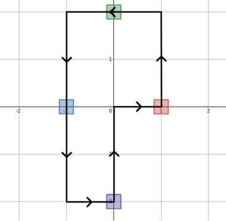
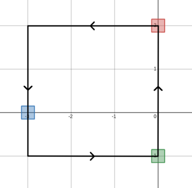

<h1 style='text-align: center;'> A. Traveling Salesman Problem</h1>

<h5 style='text-align: center;'>time limit per test: 1 second</h5>
<h5 style='text-align: center;'>memory limit per test: 256 megabytes</h5>

You are living on an infinite plane with the Cartesian coordinate system on it. In one move you can go to any of the four adjacent points (left, right, up, down).

More formally, if you are standing at the point $(x, y)$, you can: 

* go left, and move to $(x - 1, y)$, or
* go right, and move to $(x + 1, y)$, or
* go up, and move to $(x, y + 1)$, or
* go down, and move to $(x, y - 1)$.

There are $n$ boxes on this plane. The $i$-th box has coordinates $(x_i,y_i)$. It is guaranteed that the boxes are either on the $x$-axis or the $y$-axis. That is, either $x_i=0$ or $y_i=0$.

You can collect a box if you and the box are at the same point. Find the minimum number of moves you have to perform to collect all of these boxes if you have to start and finish at the point $(0,0)$.

### Input

The first line contains a single integer $t$ ($1 \le t \le 100$) — the number of test cases.

The first line of each test case contains a single integer $n$ ($1 \le n \le 100$) — the number of boxes.

The $i$-th line of the following $n$ lines contains two integers $x_i$ and $y_i$ ($-100 \le x_i, y_i \le 100$) — the coordinate of the $i$-th box. It is guaranteed that either $x_i=0$ or $y_i=0$.

Do note that the sum of $n$ over all test cases is not bounded.

### Output

For each test case output a single integer — the minimum number of moves required.

## Example

### Input


```text
340 -21 0-1 00 230 2-3 00 -110 0
```
### Output

```text

12
12
0

```
## Note

In the first test case, a possible sequence of moves that uses the minimum number of moves required is shown below.

  $$(0,0) \to (1,0) \to (1,1) \to (1, 2) \to (0,2) \to (-1,2) \to (-1,1) \to (-1,0) \to (-1,-1) \to (-1,-2) \to (0,-2) \to (0,-1) \to (0,0)$$ In the second test case, a possible sequence of moves that uses the minimum number of moves required is shown below.

  $$(0,0) \to (0,1) \to (0,2) \to (-1, 2) \to (-2,2) \to (-3,2) \to (-3,1) \to (-3,0) \to (-3,-1) \to (-2,-1) \to (-1,-1) \to (0,-1) \to (0,0)$$ In the third test case, we can collect all boxes without making any moves.


#### Tags 

#800 #OK #geometry #greedy #implementation 

## Blogs
- [All Contest Problems](../Codeforces_Round_812_(Div._2).md)
- [Announcement (en)](../blogs/Announcement_(en).md)
- [Tutorial (en)](../blogs/Tutorial_(en).md)
