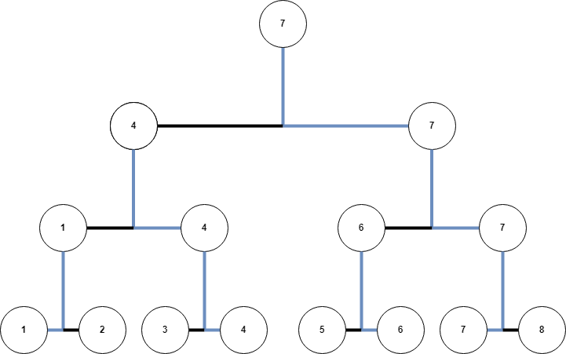

<h1 style='text-align: center;'> D. Tournament Countdown</h1>

<h5 style='text-align: center;'>time limit per test: 2 seconds</h5>
<h5 style='text-align: center;'>memory limit per test: 256 megabytes</h5>

This is an interactive problem.

There was a tournament consisting of $2^n$ contestants. The $1$-st contestant competed with the $2$-nd, the $3$-rd competed with the $4$-th, and so on. After that, the winner of the first match competed with the winner of second match, etc. The tournament ended when there was only one contestant left, who was declared the winner of the tournament. Such a tournament scheme is known as the single-elimination tournament.

You don't know the results, but you want to find the winner of the tournament. In one query, you select two integers $a$ and $b$, which are the indices of two contestants. The jury will return $1$ if $a$ won more matches than $b$, $2$ if $b$ won more matches than $a$, or $0$ if their number of wins was equal.

Find the winner in no more than $\left \lceil \frac{1}{3} \cdot 2^{n + 1} \right \rceil$ queries. Here $\lceil x \rceil$ denotes the value of $x$ rounded up to the nearest integer.

## Note

 that the tournament is long over, meaning that the results are fixed and do not depend on your queries.

### Input

The first line contains a single integer $t$ ($1 \leq t \leq 2^{14}$) — the number of test cases.

The only line of input contains a single integer $n$ ($1 \leq n \leq 17$).

It is guaranteed that the sum of $2^n$ over all test cases does not exceed $2^{17}$.

## Interaction

The interaction for each test case begins by reading the integer $n$.

To make a query, output "? a b" ($1 \leq a, b \leq 2^n$) without quotes. Afterwards, you should read one single integer — the answer for your query. You can make at most $\left \lceil \frac{1}{3} \cdot 2^{n + 1} \right \rceil$ such queries in each test case.

If you receive the integer $-1$ instead of an answer or a valid value of $n$, it means your program has made an invalid query, has exceed the limit of queries, or has given incorrect answer on the previous test case. Your program must terminate immediately to receive a Wrong Answer verdict. Otherwise you can get an arbitrary verdict because your solution will continue to read from a closed stream.

When you are ready to give the final answer, output "! x" ($1 \leq x \leq 2^n$) without quotes — the winner of the tournament. Giving this answer does not count towards the limit of queries. After solving a test case, your program should move to the next one immediately. After solving all test cases, your program should be terminated immediately.

After printing a query or the answer do not forget to output end of line and flush the output. Otherwise, you will get Idleness limit exceeded. To do this, use: 

* fflush(stdout) or cout.flush() in C++;
* System.out.flush() in Java;
* flush(output) in Pascal;
* stdout.flush() in Python;
* see documentation for other languages.

Hacks

To hack, use the following format.

The first line contains an integer $t$ ($1 \leq t \leq 2^{14}$) — the number of test cases.

The first line of each test case contains a single integer $n$ ($1 \leq n \leq 17$).

The second line of each test case contains $2^n$ numbers on a line — the number of wins of each participant. There should be a sequence of matches that is consistent with the number of wins.

The sum of $2^n$ should not exceed $2^{17}$.

## Example

### Input


```text
1
3

2

0

2

```
#Output
```text


? 1 4

? 1 6

? 5 7

! 7
```
## Note

The tournament in the first test case is shown below. The number of wins is $[1,0,0,2,0,1,3,0]$.

  In this example, the winner is the $7$-th contestant. 

#### Tags 

#1800 #NOT OK #constructive_algorithms #greedy #interactive #number_theory #probabilities 

## Blogs
- [All Contest Problems](../Codeforces_Round_812_(Div._2).md)
- [Announcement (en)](../blogs/Announcement_(en).md)
- [Tutorial (en)](../blogs/Tutorial_(en).md)
