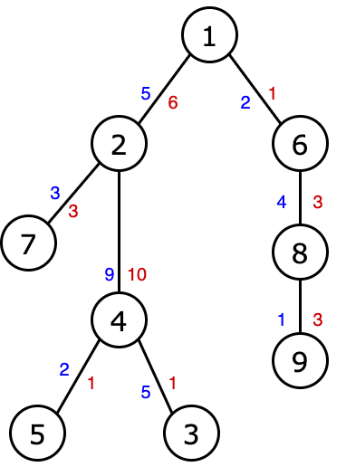

<h1 style='text-align: center;'> G. Path Prefixes</h1>

<h5 style='text-align: center;'>time limit per test: 3 seconds</h5>
<h5 style='text-align: center;'>memory limit per test: 256 megabytes</h5>

You are given a rooted tree. It contains $n$ vertices, which are numbered from $1$ to $n$. The root is the vertex $1$.

Each edge has two positive integer values. Thus, two positive integers $a_j$ and $b_j$ are given for each edge.

### Output

 $n-1$ numbers $r_2, r_3, \dots, r_n$, where $r_i$ is defined as follows.

Consider the path from the root (vertex $1$) to $i$ ($2 \le i \le n$). Let the sum of the costs of $a_j$ along this path be $A_i$. Then $r_i$ is equal to the length of the maximum prefix of this path such that the sum of $b_j$ along this prefix does not exceed $A_i$.

  
## Example

 for $n=9$. The blue color shows the costs of $a_j$, and the red color shows the costs of $b_j$. Consider an example. In this case:

* $r_2=0$, since the path to $2$ has an amount of $a_j$ equal to $5$, only the prefix of this path of length $0$ has a smaller or equal amount of $b_j$;
* $r_3=3$, since the path to $3$ has an amount of $a_j$ equal to $5+9+5=19$, the prefix of length $3$ of this path has a sum of $b_j$ equal to $6+10+1=17$ ( the number is $17 \le 19$);
* $r_4=1$, since the path to $4$ has an amount of $a_j$ equal to $5+9=14$, the prefix of length $1$ of this path has an amount of $b_j$ equal to $6$ (this is the longest suitable prefix, since the prefix of length $2$ already has an amount of $b_j$ equal to $6+10=16$, which is more than $14$);
* $r_5=2$, since the path to $5$ has an amount of $a_j$ equal to $5+9+2=16$, the prefix of length $2$ of this path has a sum of $b_j$ equal to $6+10=16$ (this is the longest suitable prefix, since the prefix of length $3$ already has an amount of $b_j$ equal to $6+10+1=17$, what is more than $16$);
* $r_6=1$, since the path up to $6$ has an amount of $a_j$ equal to $2$, the prefix of length $1$ of this path has an amount of $b_j$ equal to $1$;
* $r_7=1$, since the path to $7$ has an amount of $a_j$ equal to $5+3=8$, the prefix of length $1$ of this path has an amount of $b_j$ equal to $6$ (this is the longest suitable prefix, since the prefix of length $2$ already has an amount of $b_j$ equal to $6+3=9$, which is more than $8$);
* $r_8=2$, since the path up to $8$ has an amount of $a_j$ equal to $2+4=6$, the prefix of length $2$ of this path has an amount of $b_j$ equal to $1+3=4$;
* $r_9=3$, since the path to $9$ has an amount of $a_j$ equal to $2+4+1=7$, the prefix of length $3$ of this path has a sum of $b_j$ equal to $1+3+3=7$.
### Input

The first line contains an integer $t$ ($1 \le t \le 10^4$) — the number of test cases in the test.

The descriptions of test cases follow.

Each description begins with a line that contains an integer $n$ ($2 \le n \le 2\cdot10^5$) — the number of vertices in the tree.

This is followed by $n-1$ string, each of which contains three numbers $p_j, a_j, b_j$ ($1 \le p_j \le n$; $1 \le a_j,b_j \le 10^9$) — the ancestor of the vertex $j$, the first and second values an edge that leads from $p_j$ to $j$. The value of $j$ runs through all values from $2$ to $n$ inclusive. It is guaranteed that each set of input data has a correct hanged tree with a root at the vertex $1$.

It is guaranteed that the sum of $n$ over all input test cases does not exceed $2\cdot10^5$.

### Output

For each test case, output $n-1$ integer in one line: $r_2, r_3, \dots, r_n$.

## Example

### Input


```text
491 5 64 5 12 9 104 2 11 2 12 3 36 4 38 1 341 1 1002 1 13 101 141 100 12 1 13 1 101101 1 42 3 52 5 13 4 33 1 55 3 55 2 11 3 26 2 1
```
### Output

```text

0 3 1 2 1 1 2 3 
0 0 3 
1 2 2 
0 1 2 1 1 2 2 1 1 

```
## Note

The first example is clarified in the statement.

In the second example:

* $r_2=0$, since the path to $2$ has an amount of $a_j$ equal to $1$, only the prefix of this path of length $0$ has a smaller or equal amount of $b_j$;
* $r_3=0$, since the path to $3$ has an amount of $a_j$ equal to $1+1=2$, the prefix of length $1$ of this path has an amount of $b_j$ equal to $100$ ($100 > 2$);
* $r_4=3$, since the path to $4$ has an amount of $a_j$ equal to $1+1+101=103$, the prefix of length $3$ of this path has an amount of $b_j$ equal to $102$, .


#### Tags 

#1700 #NOT OK #binary_search #data_structures #dfs_and_similar #trees 

## Blogs
- [All Contest Problems](../Codeforces_Round_811_(Div._3).md)
- [Announcement](../blogs/Announcement.md)
- [Tutorial (en)](../blogs/Tutorial_(en).md)
