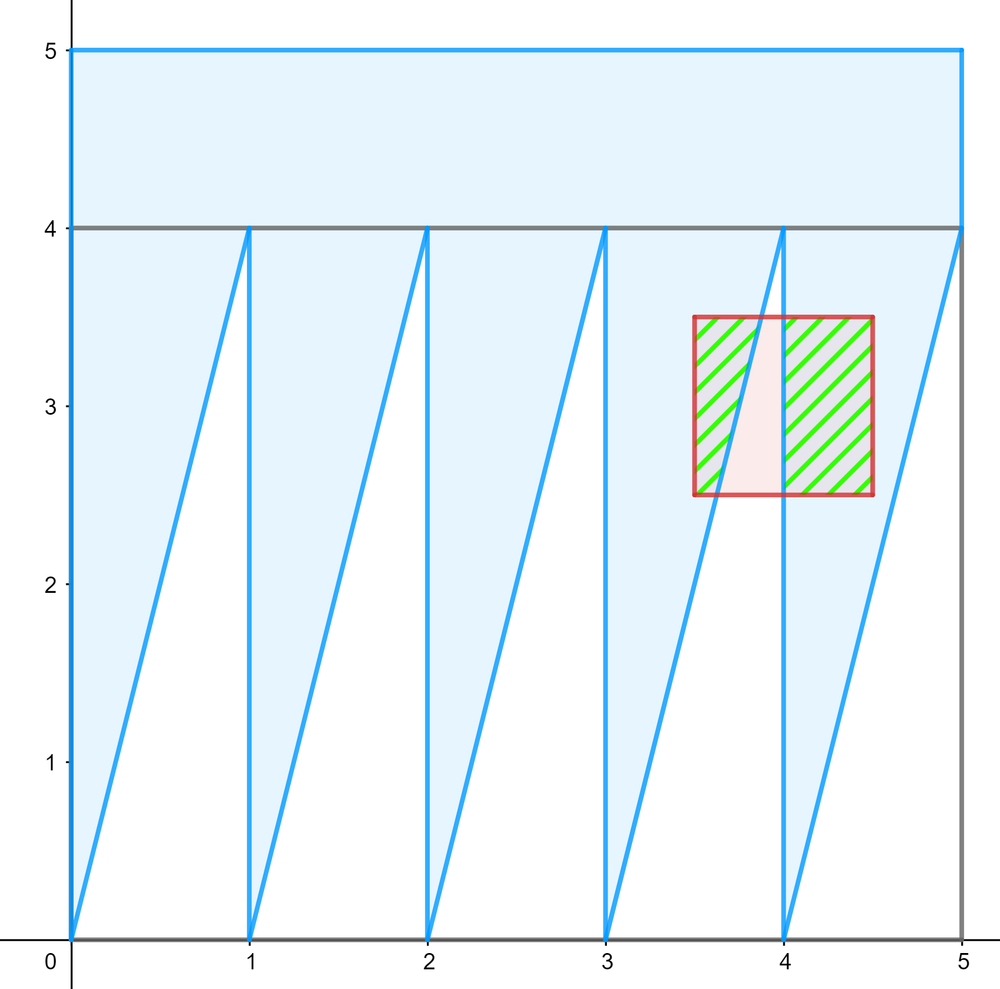
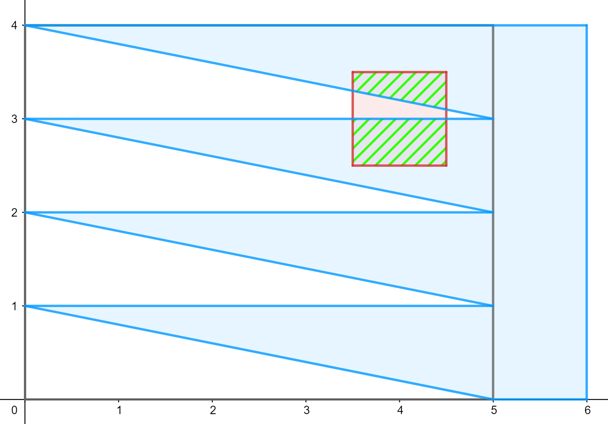

# Tutorial

Hello, Сodeforces!

We are very grateful for Your participation in our round.

Thanks to [Qwerty1232](https://codeforces.com/profile/Qwerty1232 "Master Qwerty1232") for the help with this editorial.

[1715A - Crossmarket](../problems/A._Crossmarket.md "Codeforces Round 816 (Div. 2)")

 **Advice #0***Just to it. The testing system is here for the testing. Send your solution.*

 **Hint #1**If (n;m)≠(1;1)(n;m)≠(1;1), then: - Stanley should teleport at most once - Megan shouldn't use portals at all

 **Hint #2**Stanley and Megan gonna move only toward their destinations (Stanley will increase xx and yy, Megan will decrease xx and increase yy.

 **Hint #3**Megan can move along one route, which is the same regardless of board size.

 **Solution**
### [1715A - Crossmarket](../problems/A._Crossmarket.md "Codeforces Round 816 (Div. 2)")

*For convenience let's define going upward as decreasing xx coordinate, downward — increasing xx, left — decreasing yy, right — increasing y.*

One of the optimal solutions is the following:

 * Megan goes upward to Stanley, she spends (n−1)(n−1) units of energy for that. Then she goes right to her final destination by spending (m−1)(m−1) more units of energy.
* Stanley now has a choice: he obviously has to teleport from his starting position either all the way down, or right. He chooses what will save him the most energy, so he teleports along the greater wall of the shop for the 1 unit of power.
* Then Stanley has to finish his route: he walks along the smaller side and spends min(n,m)−1min(n,m)−1 more energy.

If at least one of the dimensions is not 11, then the answer is (n−1)+(m−1)+1+(min(n,m)−1)=min(n,m)+n+m−2(n−1)+(m−1)+1+(min(n,m)−1)=min(n,m)+n+m−2. In case where (n,m)=(1,1)(n,m)=(1,1) answer is 00.

 **Normal proof**
### [1715A - Crossmarket](../problems/A._Crossmarket.md "Codeforces Round 816 (Div. 2)")

Obviously, except for 1 case, it is always beneficial for Stanley to use teleportation. Let the first portal he visited be AA, and the last is BB. It is also obvious, that teleporting for more than 1 time makes no sense, so that's why we consider, that he always teleports from AA to BB and that's it.

For the sake of convenience let's define manhattan distance between two points as dist(P1,P2)=|P1x−P2x|+|P1y−P2y|dist(P1,P2)=|P1x−P2x|+|P1y−P2y|.

Consider the next few cases for the relative position of those two portals:

 1. Ax≤BxAx≤Bx and Ay>ByAy>By

Megan must make at least (n−1)+(m−1)(n−1)+(m−1) moves. The portal does not help Stanley in the yy direction, so he must make at least (m−1)(m−1) moves.

 1. Ax>BxAx>Bx and Ay≤ByAy≤By

Megan must make at least (n−1)+(m−1)(n−1)+(m−1) moves. The portal does not help Stanley in the xx direction, so he must make at least (n−1)(n−1) moves.

 1. Ax≤BxAx≤Bx and Ay≤ByAy≤By

Megan must make at least dist(A,B)dist(A,B) moves between AA and BB. Going between A and B either undoes Megan's progress in the xx direction or yy direction (depending on which is visited first), so she must make at least an additional (n−1)or(m−1)(n−1)or(m−1) moves. Stanley must make at least (n−1)+(m−1)−dist(A,B)(n−1)+(m−1)−dist(A,B) moves.

 1. Ax>BxAx>Bx and Ay>ByAy>By

Megan must make at least (n−1)+(m−1)(n−1)+(m−1) moves. Using the portal undoes Stanley's progress in both the x and y directions, so he must make at least (n−1)+(m−1)(n−1)+(m−1) moves.

In all cases, the total number of moves is at least (n-1) + (m-1) + min(n-1, m-1).

 **Proof, director's cut (or how you should not do)**In a while, after I came up with an idea for this task, I got excited to proof it formally. I was very happy with the result — A's proof was longer than a regular editorial for Fdiv2, or even Fdiv1. A couple of days before the round [Monogon](https://codeforces.com/profile/Monogon "Grandmaster Monogon") told us that there is a solution much easier to understand, for which I am very grateful! But I would like to save the original version as an example, of how you should not prove the easiest task in your contest. 

### [1715A - Crossmarket](../problems/A._Crossmarket.md "Codeforces Round 816 (Div. 2)")

Proof:

To start with, Stanley and Megan can complete their steps in any order. So, again, for our convenience let's reorder their moves in such a way, that firstly Megan finishes her route and places portals, and then Stanley does what he needs to do.

What is always the optimal route for Stanley? He goes to the nearest cell with the teleport and then teleports to the nearest possible cell to his finish. 

It is obvious, that Stanley can always complete his route without going left or up (except for the teleportations).

Let's try to prove a similar statement for Megan: she can always plan her route avoiding moves left or down. These two cases are almost equivalent, so we will consider the first one.

Let's assume that teleportations are free for Megan. Consider any cell, from which she made her move to the left. Then it is possible to "shift" a segment of the route to the right in order to decrease its length at least by one in conjunction with getting rid of at least one move to the left. More formally we need to construct a new route for her, so the following conditions are met: for each cell in the previous route either itself, or her right neighbor is included in the new route. This can be done by the following algorithm: we will consider cells from the original route A in order of installation of the portals, and build the new route B in parallel. If we cannot include the cell (x,y) from A to the route B because it does not have adjacent sides to any of the cells from B. Then we can include the cell (x,y+1) to B (it cannot be out of bounds). Let there be a cell (x1,y1) in A with a portal, that was installed earlier than in our current cell, and that is adjacent to our current cell. If we could not include cell (x,y) to the route B, that it means that we also did not include the cell (x1,y1) there, thus cell (x1,y1+1) is in B, that also also allows us to include cell (x,y+1).

After such an operation Stanley's energy consumption could increase at most by 1. Though energy spent by Megan decreased at least by one. That means that our new route is not more energy-consuming. 

That way Megan will never go left or down, so she will spend at least (n−1)+(m−1)=n+m−2 units of power.

If, when all the operations are applied, Stanley teleports from the cell (x1,y1) to (x2,y2), then [x1≤x2,y1≥y2x1≥x2,y1≤y2. In the first case he teleports along Megan's route and approaches his finish by (x2−x1)−(y1−y2), and in the second case he teleports across Megan's route and approaches his destination by (y2−y1)−(x1−x2). As you can easily notice, first's expression maximum is n−1, and second's is m−1. Hence Stanley will spend at least (n−1)+(m−1)−max(n−1,m−1)=n+m−max(n,m)−1 units of power. After adding only teleportation we get n+m−max(n,m)

We got two lower bounds, that in sum are n+m−2+n+m−max(n,m)=2n+2m−max(n,m)−2=n+m+min(n,m)−2, which is not better, than our solution's answer, even though we did not consider Megan's teleportations.

 * С++ code: [169161824](https://codeforces.com/contest/1715/submission/169161824 "Submission 169161824 by ilyakrasnovv")
* Python code: [169161508](https://codeforces.com/contest/1715/submission/169161508 "Submission 169161508 by ilyakrasnovv")
* Kotlin code: [169161674](https://codeforces.com/contest/1715/submission/169161674 "Submission 169161674 by ilyakrasnovv")

[1715B - Beautiful Array](../problems/B._Beautiful_Array.md "Codeforces Round 816 (Div. 2)")

 **Hint #1**Greedy.

 **Hint #2*** What are the limits of ss with all else being the same?
* What is the number, which we can always add to a divisible by xx, to keep the answer the same?
 **Hint #3*** ss is at least x⋅sx⋅s
* maximum reminder mod xx is x−1x−1.
 **Solution**
### [1715B - Beautiful Array](../problems/B._Beautiful_Array.md "Codeforces Round 816 (Div. 2)")

To start with, the sum of the numbers in the array s cannot be less, than k⋅b (where k is the number by which we divide, and b is beauty (s≥k⋅b))

It is important, that s≤k⋅b+(k−1)⋅n. Let's assume that is not true. Consider the sum of divisible parts of numbers in the array: it obviously does not exceed k⋅b, thus the sum of remainders is at least (k−1)⋅n+1, which means, that at least one of the numbers' remainders is k, which is impossible by definition of the remainder.

That way we got the criteria for the existence of the answer: k⋅b≤s≤k⋅b+(k−1)⋅n.

If there does exist an answer, then we can use the following algorithm:

* Assign k⋅b to any of the n cells of the array.
* Iterate over all the cells (including the cell from the previous item) and add min(s−sum,k−1) to the current cell, where sum is the current sum of the elements.

  * С++ code: [169162178](https://codeforces.com/contest/1715/submission/169162178 "Submission 169162178 by ilyakrasnovv")
* Python code: [169161968](https://codeforces.com/contest/1715/submission/169161968 "Submission 169161968 by ilyakrasnovv")

[1715C - Monoblock](../problems/C._Monoblock.md "Codeforces Round 816 (Div. 2)")

 **Hint #1**Look from the perspective of joints between blocks

 **Hint #2**For each pair of adjacent different numbers, calculate how many subsegments contain them.

 **Hint #3**To apply the changes, neighboring numbers and the position of the changing number are all we need to know. 

 **Solution**
### [1715C - Monoblock](../problems/C._Monoblock.md "Codeforces Round 816 (Div. 2)")

Let us introduce another definition for the beauty  — beauty of the array a is a number of such positions (indexes) i<n, that ai≠ai+1, plus 1. Let's call "joints" places where two adjacent different numbers exist in the array.

Now consider the problem from the angle of these joints: if f(joint) is equal to the number of segments, that overlap this joint, then the sum of beauty over all subsegments is equal to the sum of f(joint) over all joints. To get a clearer understanding, consider the following example: [1,7,7,9,9,9]=[1]+[7,7]+[9,9,9] ("+" is basically a joint). There are 5 segments, which contain first joint ([1:2],[1:3],[1:4],[1:5],[1:6]), and there are 9 such for the second joint ([1:4],[1:5],[1,6],[2:4],[2:5],[2:6],[3:4],[3:5],[3:6]), 14 in total. After adding the number of subsegments, we get the answer: 6⋅72=21,21+14=35.

From this the solution is derived, apart from change requests: iterate over the array, find "joints", comparing adjacent numbers, if ai is different from ai+1, that we must add i⋅(n−i) to the answer, that is how many possible beginnings of subsegments from the left multiplied by the number of possible ends from the right.

How we should apply changes? In fact, it's worth just checking if there are any neighboring joints for the position of the changing number, subtracting the number of subsegments, that overlap these joints, and then doing similar operations after setting a new value for the number.

For a better understanding and more details, we suggest you look over the authors' solutions.

 * С++ сode: [169162300](https://codeforces.com/contest/1715/submission/169162300 "Submission 169162300 by ilyakrasnovv")

[1715D - 2+ doors](../problems/D._2+_doors.md "Codeforces Round 816 (Div. 2)")

 **Hint #1**We can solve the task separately by bits.

 **Hint #2**What are the most useful conditions? Those, that state that bitwise or of some bits in ii-th and jj-th numbers is 00 because we can null both of these bits for sure.

 **Hint #3**Solve the task separately by bits. Firstly, satisfy conditions from the second hint, then try to null the bits from the beginning.

 **Solution**
### [1715D - 2+ doors](../problems/D._2+_doors.md "Codeforces Round 816 (Div. 2)")

The first observation is that we can solve the task separately bit by bit, because of 

* bitwise or operation is "bit-independent": bits of one particular power don't affect other bits
* to gen a lexicographically minimal solution, we can combine solutions for each bit separately

This makes it possible for us to create a solution for a boolean array, and then run it 30 times for all numbers and statements, considering only i-th bit in each run.

For ease of understanding let's speak in a language of graphs: we have an undirected graph with n vertices, on each vertex, there is either 0 or 1, and on each edge, there is a bitwise or of numbers, that are written on vertices connected by that edge. We have to recover the numbers on the vertices after they were somehow lost, knowing, that numbers on the vertices create a lexicographically minimal sequence possible.

Initially, let's write 1 on each of the vertices. Then walk through them and consider incidental edges. If any of the edges contain 0, we must also write 0 on our current vertex and the neighbor by that edge. After zeroing all the required vertices, let's try to make our sequence lexicographically minimal. Walk through the vertices again and try to write 0 on each: to check if everything is ok, iterate over the incidental edges again. If any of them contains 1 and connects us with a vertex with 0, then we cannot make our vertex 0. 

Such solution works in O(log(max(ai))⋅(n+m)) time.

For a better understanding and more details, we suggest you look over the authors' solutions.

 * С++ сode: [169162393](https://codeforces.com/contest/1715/submission/169162393 "Submission 169162393 by ilyakrasnovv")

[1715E - Long Way Home](../problems/E._Long_Way_Home.md "Codeforces Round 816 (Div. 2)")

 **Hint 1**For every ii from 11 to nn find the shortest path from 11 to ii, ending with an air trip.

 **Hint 2**Can you solve the problem for k=1k=1?

 **Hint 3**If you have somehow solved the problem for k=ik=i, how can you solve it for k=i+1k=i+1?

 **Solution**
### [1715E - Long Way Home](../problems/E._Long_Way_Home.md "Codeforces Round 816 (Div. 2)")

Let's assume we know the shortest distances from the first vertex to each, if we have added no more than k edges (air travels). Let's learn to recalculate the answer for (k+1) edges.

First, let's update the answer for all the paths ending in an air travel. Then we can run Dijkstra to take into account all the paths ending with a usual edge.

In order to add an air travel, we need to update the distance to v, with all the paths ending with an air travel to v. To do so, we can use Convex Hull Trick, since the recalculation formula has the following form (dold — array of distances for k edges, dnew — array of distances if k+1 the flight goes exactly to the i-th vertex):

dnew[v]=minu dold[u]+(u−v)2

After that, we need to run Dijkstra to update the distances with all the paths not ending with an air travel.

The resulting asymptotics is O(k(mlogn+n))

 * С++ сode: [169162508](https://codeforces.com/contest/1715/submission/169162508 "Submission 169162508 by ilyakrasnovv")

[1715F - Crop Squares](../problems/F._Crop_Squares.md "Codeforces Round 816 (Div. 2)")

 **Advice #0**There is a lot of freedom, but there exists a very simple solution. If You think of something complicated such as advanced geometry, You are probably doing something wrong.

 **Hint #1**Try to think about sawtooth-like figures.

 **Hint #2**You can use only 2 queries.

 **Hint #3**The figure is periodic. Both of those queries use the same figure, but in one query it is rotated by 90∘90∘.

 **Solution**
### [1715F - Crop Squares](../problems/F._Crop_Squares.md "Codeforces Round 816 (Div. 2)")

In fact, two queries are enough. The first query is to find out the area of intersection of the polygon with 2n+2 vertices at the points with coordinates (0,m+1),(0,0),(1,m),(1,0),…,(n−1,m),(n−1,0),(n,m),(n,m+1) with a filled square. Such a polygon is periodic over x axis with period 1, hence the x-coordinate of the lower left corner of the filled square does not affect the intersection area. Denote the intersection area — s, then the y-coordinate of the lower left corner of the square is calculated by the formula y=ms−12.

An example of such a polygon for the field 5×4 and a filled square with the lower left corner at the point (3.5,2.5):

  With the second query, we find out the area of intersection of a similar polygon with 2m+2 vertices at points with coordinates (n+1,m),(0,m),(n,m−1),(0,m−1),…,(n,1),(0,1),(n,0),(n+1,0) with a filled square. Such a polygon is periodic over y axis with period 1, hence the y-coordinate of the lower left corner of the filled square does not affect the intersection area. Denote the intersection area — s, then the x-coordinate of the lower left corner of the square is calculated by the formula x=ns−12.

An example of such a polygon for the field 5×4 and a filled square with the lower left corner at the point (3.5,2.5):

   * С++ сode: [169162576](https://codeforces.com/contest/1715/submission/169162576 "Submission 169162576 by ilyakrasnovv")
