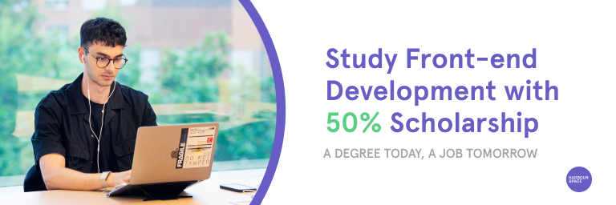
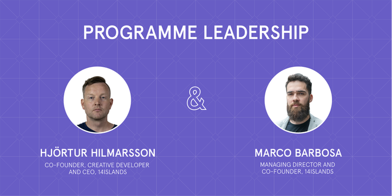

# Announcement

Hello Codeforces!

On [Thursday, August 4, 2022 at 20:35UTC+6](https://codeforces.com/https://www.timeanddate.com/worldclock/fixedtime.html?day=4&month=8&year=2022&hour=17&min=35&sec=0&p1=166) [Educational Codeforces Round 133 (Rated for Div. 2)](https://codeforces.com/contest/1716 "Educational Codeforces Round 133 (Rated for Div. 2)") will start.

Series of Educational Rounds continue being held as [Harbour.Space University](https://codeforces.com/https://harbour.space/) initiative! You can read the details about the cooperation between [Harbour.Space University](https://codeforces.com/https://harbour.space/) and Codeforces in the [blog post](//codeforces.com/blog/entry/51208).

This round will be **rated for the participants with rating lower than 2100**. It will be held on extended ICPC rules. The penalty for each incorrect submission until the submission with a full solution is 10 minutes. After the end of the contest you will have 12 hours to hack any solution you want. You will have access to copy any solution and test it locally.

You will be given **6 or 7 problems** and **2 hours** to solve them.

The problems were invented and prepared by Adilbek [adedalic](https://codeforces.com/profile/adedalic "International Master adedalic") Dalabaev, Vladimir [vovuh](https://codeforces.com/profile/vovuh "Master vovuh") Petrov, Ivan [BledDest](https://codeforces.com/profile/BledDest "International Grandmaster BledDest") Androsov, Maksim [Neon](https://codeforces.com/profile/Neon "Candidate Master Neon") Mescheryakov and me. Also huge thanks to Mike [MikeMirzayanov](https://codeforces.com/profile/MikeMirzayanov "Headquarters, MikeMirzayanov") Mirzayanov for great systems Polygon and Codeforces.

Good luck to all the participants!

Our friends at Harbour.Space also have a message for you:

*Harbour.Space's Front-end Development programme is where programming and creativity collide. Receive up to a 50% scholarship and take advantage of this opportunity to study in Barcelona and learn from industry experts while you become one yourself.*

*The programme is heavily geared towards developing students’ professional skills needed for employment while being able to adapt to rapidly changing technology.* 

*So let's meet your programme leaders:*

*[Hjörtur](https://codeforces.com/https://www.linkedin.com/in/hjortureh/) is the CEO of 14islands, a design and development studio from Stockholm in Sweden and Floripa in Brazil. He co-founded the studio in 2011 and since then they've done work with companies such as Google, Adidas, Disney, Facebook, HBO, Shopify, Ericsson and many innovative startups in the world.*

*[Marco Barbosa](https://codeforces.com/http://url7115.harbour.space/ls/click?upn=AZXLIAvAQy2p2KNiiWgcDv9rEz3L1vrX2ZVbKhothlIVCqx2giNJfTS76AJYuYbYkzf2sieiZ9KFNoaUagiUiw-3D-3D_HY__Dy-2BCNKjEkq6jOsHmh-2FJYlcF7LnJqkZZkNQpumIZyZjT-2F6-2F8JfoWVki1f5cJzV1Kdb1XRzErdiUdSqH7BNy0hxi8j88WrELppl9hs4bkNNtPcagpZf8FCmZi3oFAEqXMi5UBkDDaXJp2MlQPwYLKnVtDuKCTJBauJoqpF1doOMhBGjSI3t5IfRlJchcDJLPZGEVd7bAiT9NChJCNN-2FCmKassP3QJPZ5GjcGJer5ep4gHdGZo8M-2FvbRG-2FOp2WnJ7kPFDPcnG7-2BnsOA54Ull3ybzfpVua45uwrNg1nOGxbIRFw-3D) is the Managing Director of 14islands, a design and development studio from Stockholm in Sweden and Floripa in Brazil. Their projects have won multiple awards such as the FWA, Awwwards, CSS Design Awards, and European Design Awards.* 

  [Apply Now →](https://study.harbour.space/front-end-development?utm_source=codeforces&utm_medium=partner&utm_campaign=bcn_b2c_summer-scholarship) *Good luck,*

*Harbour.Space University Team*

**UPD:** [Editorial is out](Tutorial.md)

