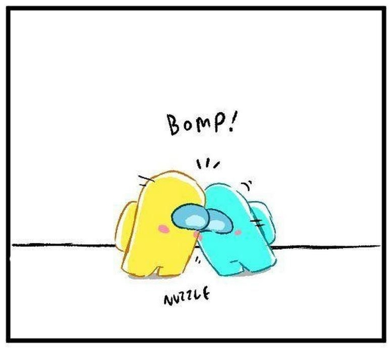

# Announcement

Приветствую, Кодефорсес ✿*∗˵╰༼✪ᗜ✪༽╯˵∗*✿
-----------------------------------------

*(Welcome, Codeforces on Russian)*

[TeaTime](https://codeforces.com/profile/TeaTime "Master TeaTime") and I are happy to invite you to participate in [Codeforces Round 818 (Div. 2)](https://codeforces.com/contest/1717 "Codeforces Round 818 (Div. 2)"). It will take place on [Friday, September 2, 2022 at 20:35UTC+6](https://codeforces.com/https://www.timeanddate.com/worldclock/fixedtime.html?day=2&month=9&year=2022&hour=17&min=35&sec=0&p1=166). The round will be **rated** for all participants with rating strictly lower than **2100**. You will have **2 hours** to solve **6 problems**.

The standard place for thanks:

 * To our cute coordinator [Artyom123](https://codeforces.com/profile/Artyom123 "Grandmaster Artyom123").
* [KAN](https://codeforces.com/profile/KAN "Legendary Grandmaster KAN"), [geranazavr555](https://codeforces.com/profile/geranazavr555 "Headquarters, geranazavr555"), [MikeMirzayanov](https://codeforces.com/profile/MikeMirzayanov "Headquarters, MikeMirzayanov") for being able to me conduct this round on this platform.
* Our valiant army of testers: [Mangooste](https://codeforces.com/profile/Mangooste "Grandmaster Mangooste"), [teraqqq](https://codeforces.com/profile/teraqqq "International Grandmaster teraqqq"), [SomethingNew](https://codeforces.com/profile/SomethingNew "International Grandmaster SomethingNew"), [74TrAkToR](https://codeforces.com/profile/74TrAkToR "Grandmaster 74TrAkToR"), [Igorbunov](https://codeforces.com/profile/Igorbunov "Grandmaster Igorbunov"), [Vladithur](https://codeforces.com/profile/Vladithur "Master Vladithur"), [Dart-Xeyter](https://codeforces.com/profile/Dart-Xeyter "Master Dart-Xeyter"), [Alexdat2000](https://codeforces.com/profile/Alexdat2000 "Master Alexdat2000"), [vsinitsynav](https://codeforces.com/profile/vsinitsynav "Master vsinitsynav"), [Renedyn](https://codeforces.com/profile/Renedyn "Master Renedyn"), [_DAC_](https://codeforces.com/profile/_DAC_ "Master _DAC_"), [talant](https://codeforces.com/profile/talant "Master talant"), [NewLul](https://codeforces.com/profile/NewLul "Candidate Master NewLul"), [satyam343](https://codeforces.com/profile/satyam343 "Candidate Master satyam343"), [I_love_geom](https://codeforces.com/profile/I_love_geom "Candidate Master I_love_geom"), [Aris](https://codeforces.com/profile/Aris "Expert Aris"), [PUFL](https://codeforces.com/profile/PUFL "Pupil PUFL").
* [Igorbunov](https://codeforces.com/profile/Igorbunov "Grandmaster Igorbunov") for the idea of one of the tasks.
* **You** for your participation.

See you at the round🥰

Scoring distribution: **500 — 1000 — 1500 — 2000 — 2000 — 3000**

**UPD**: [Editorial](Tutorial_(en).md)!!! (Thanks to [purplesyringa](https://codeforces.com/profile/purplesyringa "International Master purplesyringa") for English translation)

**UPD**: **Winners**!

**Div 2:**

 * [Chenyu_Qiu](https://codeforces.com/profile/Chenyu_Qiu "Candidate Master Chenyu_Qiu")
* [Akemi-Homura](https://codeforces.com/profile/Akemi-Homura "Candidate Master Akemi-Homura")
* [_meow_](https://codeforces.com/profile/_meow_ "Pupil _meow_")
* [qxforever](https://codeforces.com/profile/qxforever "Candidate Master qxforever")
* [DuRen13](https://codeforces.com/profile/DuRen13 "Newbie DuRen13")

**Div 1:**

 * [jiangly](https://codeforces.com/profile/jiangly "Legendary Grandmaster jiangly")
* [maspy](https://codeforces.com/profile/maspy "International Grandmaster maspy")
* [Vercingetorix](https://codeforces.com/profile/Vercingetorix "International Grandmaster Vercingetorix")
* [Alice_foo_foo](https://codeforces.com/profile/Alice_foo_foo "Legendary Grandmaster Alice_foo_foo")
* [peti1234](https://codeforces.com/profile/peti1234 "International Grandmaster peti1234")
