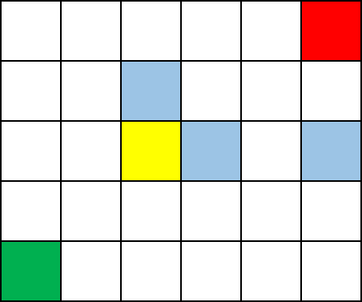

<h1 style='text-align: center;'> A. Chip Game</h1>

<h5 style='text-align: center;'>time limit per test: 1 second</h5>
<h5 style='text-align: center;'>memory limit per test: 256 megabytes</h5>

Burenka and Tonya are playing an old Buryat game with a chip on a board of $n \times m$ cells.

At the beginning of the game, the chip is located in the lower left corner of the board. In one move, the player can move the chip to the right or up by any odd number of cells (but you cannot move the chip both to the right and up in one move). The one who cannot make a move loses.

Burenka makes the first move, the players take turns. Burenka really wants to win the game, but she is too lazy to come up with a strategy, so you are invited to solve the difficult task of finding it. Name the winner of the game (it is believed that Burenka and Tonya are masters of playing with chips, so they always move in the optimal way).

  Chip's starting cell is green, the only cell from which chip can't move is red. if the chip is in the yellow cell, then blue cells are all options to move the chip in one move. 
### Input

The first line contains one integer $t$ ($1 \leq t \leq 10^4$) — the number of test cases. The following is a description of the input data sets.

The only line of each test case contains two integers $n$ and $m$ ($1 \leq n, m \leq 10^9$) — the dimensions of the game board.

### Output

For each test case print a single line — the name of the winner of the game ("Burenka" or "Tonya").

## Example

### Input


```text
61 11 45 62 26 3999999999 1000000000
```
### Output

```text

Tonya
Burenka
Burenka
Tonya
Burenka
Burenka

```
## Note

In the first case, Burenka has no move, so Tonya wins.

In the second case, Burenka can move $3$ cells to the right, after which Tony will not be able to make a move, which means that Burenka wins.

In the third case, Burenka can move $5$ squares to the right. Then we can say that we have a game on a board of $1 \times 5$ cells, and Tonya is the first player. In such game the second player wins, so in the original one Burenka will win.


#### Tags 

#800 #OK #games #math 

## Blogs
- [All Contest Problems](../Codeforces_Round_814_(Div._2).md)
- [Codeforces Round #814](../blogs/Codeforces_Round_814.md)
- [Tutorial](../blogs/Tutorial.md)
