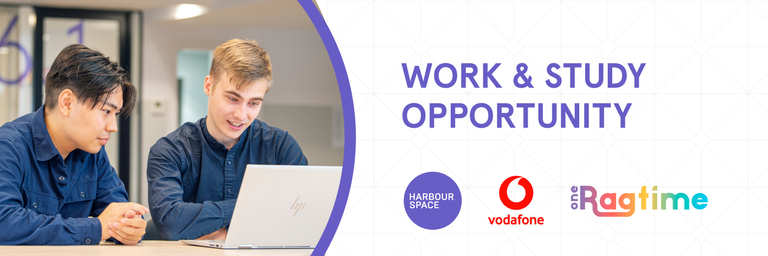

# Announcement

Hello Codeforces!

On [Saturday, August 27, 2022 at 20:35UTC+6](https://codeforces.com/https://www.timeanddate.com/worldclock/fixedtime.html?day=27&month=8&year=2022&hour=17&min=35&sec=0&p1=166) [Educational Codeforces Round 134 (Rated for Div. 2)](https://codeforces.com/contest/1721 "Educational Codeforces Round 134 (Rated for Div. 2)") will start.

Series of Educational Rounds continue being held as [Harbour.Space University](https://codeforces.com/https://harbour.space/) initiative! You can read the details about the cooperation between [Harbour.Space University](https://codeforces.com/https://harbour.space/) and Codeforces in the [blog post](//codeforces.com/blog/entry/51208).

This round will be **rated for the participants with rating lower than 2100**. It will be held on extended ICPC rules. The penalty for each incorrect submission until the submission with a full solution is 10 minutes. After the end of the contest you will have 12 hours to hack any solution you want. You will have access to copy any solution and test it locally.

You will be given **6 or 7 problems** and **2 hours** to solve them.

The problems were invented and prepared by Adilbek [adedalic](https://codeforces.com/profile/adedalic "International Master adedalic") Dalabaev, Vladimir [vovuh](https://codeforces.com/profile/vovuh "Master vovuh") Petrov, Ivan [BledDest](https://codeforces.com/profile/BledDest "International Grandmaster BledDest") Androsov, Maksim [Neon](https://codeforces.com/profile/Neon "Candidate Master Neon") Mescheryakov and me. Also huge thanks to Mike [MikeMirzayanov](https://codeforces.com/profile/MikeMirzayanov "Headquarters, MikeMirzayanov") Mirzayanov for great systems Polygon and Codeforces.

Good luck to all the participants!

Our friends at Harbour.Space also have a message for you:

 **NEW APPRENTICESHIP OPPORTUNITIES IN BARCELONA** **VODAFONE x HARBOUR.SPACE*** **&** **ONERAGTIME x HARBOUR.SPACE*****Harbour.Space University** has partnered with **Vodafone Business**, a company rich in tradition that specializes in telecommunications and with **Oneragtime**, a fund-as-a-platform specialized in sourcing, financing and scaling early-stage tech startups from across Europe, to offer motivated tech talents Master’s degree scholarships in **Data Science** and **Front-end Development** with combination of work experience.*

*Candidates will be working on the following tasks:* 

*Data Scientist at Vodafone:*

 * *Data Science: Descriptive and predictive analytics: selection, definition, and execution of adequate algorithms, models, tests, visualizations, etc.*
* *Technology: Selection, definition, and execution of adequate programming languages/frameworks, file formats, data storage solutions, automatic data flows, etc.*
* *Architecture: Define and/or follow best practices for Big Data & amp; Analytics use cases while extracting, transforming, storing, and feeding data to/from different data sources using on-premises solutions as well as public cloud services.*
* *Management: Report to project managers, clients, external and/or internal teams. Estimate resources and timelines for different tasks and follow up during the full project life cycle.*
* *Innovation: Awareness of and continuous training in state-of-the-art techniques, models, frameworks, and technical approaches to be applied to Data Science activities.*

*Front-End Developer at Oneragtime:*

 * *Define the technology stack / tools to be used in the frontend*
* *Suggest projects that will improve the product or code base*
* *Write scalable, maintainable, reusable, and well-tested software that adheres to best practices*
* *Make technical time estimation on future software deliveries*
* *Document solutions with clear and concise explanations*
* *Collaborate with Product Owners, Growth Hacker, UX / Product Designers*

*All successful applicants will be eligible for a 100% tuition fee scholarship (22.900 €/year) provided by Vodafone Business for Data Science and by Oneragtime for Front-end Development.*

**CANDIDATE’S COMMITMENT**

**Study Commitment:** *3 hours/day* ‍ *You will complete 15 modules (each three weeks long) in one year. The daily class workload is 3 hours, plus homework to complete in your own time.*

**Work Commitment:** *4+ hours/day* ‍ *Immerse yourself in the professional world during your apprenticeship. You’ll learn from the best and get to apply your newly acquired knowledge in the field from day one.*

**University requirements**

 * *Bachelor's degree in the field of Mathematics, Statistics, Data Science, Computer Science or similar*
* *English proficiency*

**Work requirements**

*Data Science:*

 * *Advanced knowledge and experience in SQL, Python, Spark/Scala, and bash*
* *Experienced use of Big Data technologies: Spark, HDFS, Kafka, etc.*
* *Hands-on experience with Data Science techniques: feature engineering,*

*Front-end Development:*

 * *Proficient in HTML/JSX, CSS, and with strong fundamentals in Javascript ES6*
* *Understand Vue*
* *Familiar with UX/UI principles: Figma*
* *Familiar with Webflow*
* *Expertise with Web pack, gulp, similar frontend build tools (npm)*
* *Proficient in unit testing tools e.g. JEST or similar tools*
* *Proficient in either Sass, LESS, TailwindCSS, Bootstrap, Flexbox, or similar tools*
* *Understanding of REST API*
* *Familiarity with Docker is appreciated*
* *Familiar with SQL works (Bonus: if you understand Postgre)*

 **Apply Now for:**  [Front-end Development](https://scholarships.harbour.space/oneragtime?utm_source=codeforces&utm_medium=partner&utm_campaign=bcn_b2b_oneragtime&utm_content=edu134)  [Data Science](https://scholarships.harbour.space/vodafone-apprenticeship?utm_source=codeforces&utm_medium=partner&utm_campaign=bcn_b2b_vodafone-data-science&utm_content=edu134 ) **UPD:** [Editorial is out](Tutorial.md)

