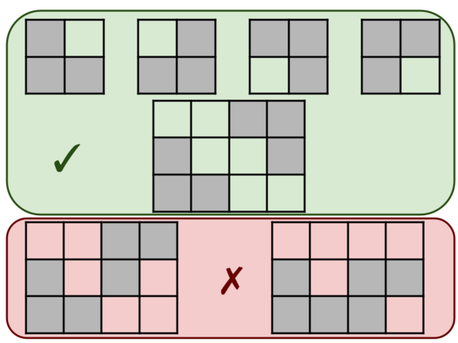

<h1 style='text-align: center;'> F. L-shapes</h1>

<h5 style='text-align: center;'>time limit per test: 1 second</h5>
<h5 style='text-align: center;'>memory limit per test: 256 megabytes</h5>

An L-shape is a figure on gridded paper that looks like the first four pictures below. An L-shape contains exactly three shaded cells (denoted by *), which can be rotated in any way.

  You are given a rectangular grid. Determine if it contains L-shapes only, where L-shapes can't touch an edge or corner. More formally: 

* Each shaded cell in the grid is part of exactly one L-shape, and
* no two L-shapes are adjacent by edge or corner.

For example, the last two grids in the picture above do not satisfy the condition because the two L-shapes touch by corner and edge, respectively.

### Input

The input consists of multiple test cases. The first line contains an integer $t$ ($1 \leq t \leq 100$) — the number of test cases. The description of the test cases follows.

The first line of each test case contains two integers $n$ and $m$ ($1 \leq n, m \leq 50$) — the number of rows and columns in the grid, respectively.

Then $n$ lines follow, each containing $m$ characters. Each of these characters is either '.' or '*' — an empty cell or a shaded cell, respectively.

### Output

For each test case, output "YES" if the grid is made up of L-shape that don't share edges or corners, and "NO" otherwise.

You can output the answer in any case (for example, the strings "yEs", "yes", "Yes" and "YES" will be recognized as a positive answer).

## Example

### Input


```text
106 10........**.**......*..*..*.........**......*.....*..**....**6 10....*...**.**......*..*..*.........**......*.....*..**....**3 3...***...4 4.*..**....**..*.5 4.*..**........**..*.3 2.****.2 3*...**3 2..***.3 3.***.***.3 3..*.**..*
```
### Output

```text

YES
NO
NO
NO
YES
NO
NO
YES
NO
NO

```


#### Tags 

#1700 #NOT OK #dfs_and_similar #implementation 

## Blogs
- [All Contest Problems](../Codeforces_Round_817_(Div._4).md)
- [Announcement (en)](../blogs/Announcement_(en).md)
- [Tutorial (en)](../blogs/Tutorial_(en).md)
