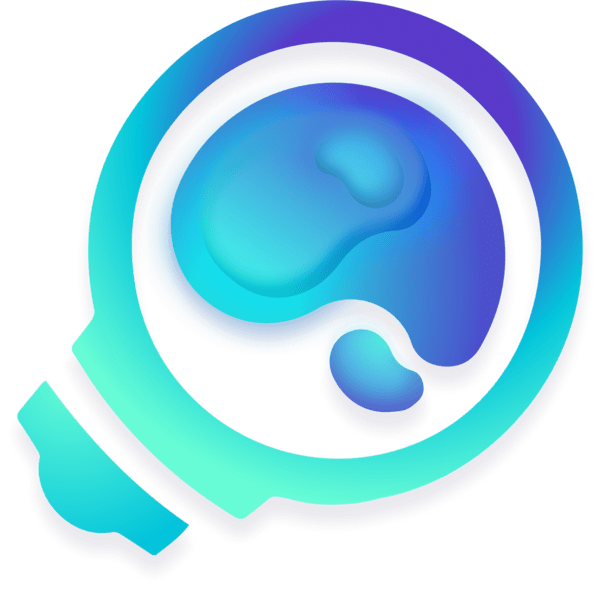

# Announcement_(en)

Hello, **Codeforces**! 🤗

We are happy to invite you to participate in [COMPFEST 14 Preliminary Online Mirror (Unrated, ICPC Rules, Teams Preferred)](https://codeforces.com/contests/1725) on [Sunday, September 4, 2022 at 19:35UTC+6](https://codeforces.com/https://www.timeanddate.com/worldclock/fixedtime.html?day=4&month=9&year=2022&hour=16&min=35&sec=0&p1=166). COMPFEST is a national **ICPC-style contest** for university students in Indonesia.

The problems are written and prepared by [Pyqe](https://codeforces.com/profile/Pyqe "Международный гроссмейстер Pyqe"), [steven.novaryo](https://codeforces.com/profile/steven.novaryo "Кандидат в мастера steven.novaryo"), [Nyse](https://codeforces.com/profile/Nyse "Эксперт Nyse"), [muhammadhasan01](https://codeforces.com/profile/muhammadhasan01 "Мастер muhammadhasan01"), [gansixeneh](https://codeforces.com/profile/gansixeneh "Кандидат в мастера gansixeneh"), [nandonathaniel](https://codeforces.com/profile/nandonathaniel "Эксперт nandonathaniel"), [FerdiHS](https://codeforces.com/profile/FerdiHS "Эксперт FerdiHS"), [TakeMe](https://codeforces.com/profile/TakeMe "Эксперт TakeMe"), and [NeoZap](https://codeforces.com/profile/NeoZap "Эксперт NeoZap").

We would also like to thank:

 * [KAN](https://codeforces.com/profile/KAN "Легендарный гроссмейстер KAN") for helping to host the mirror round;
* rama_pang ([rama_pang](https://codeforces.com/profile/rama_pang "Международный гроссмейстер rama_pang"), [yz_](https://codeforces.com/profile/yz_ "Мастер yz_"), [Berted](https://codeforces.com/profile/Berted "Мастер Berted")), pengzoo ([DishonoredRighteous](https://codeforces.com/profile/DishonoredRighteous "Гроссмейстер DishonoredRighteous"), [golikovnik](https://codeforces.com/profile/golikovnik "Гроссмейстер golikovnik")), [bukanYohandi](https://codeforces.com/profile/bukanYohandi "Кандидат в мастера bukanYohandi"), [bry_rp](https://codeforces.com/profile/bry_rp "Мастер bry_rp"), [Drew_](https://codeforces.com/profile/Drew_ "Мастер Drew_"), and [david.alexander01](https://codeforces.com/profile/david.alexander01 "Новичок david.alexander01") for testing the contest and providing us very useful feedback;
* Universitas Indonesia, all the local committees, administrators, and managers of the whole COMPFEST event;
* [prabowo](https://codeforces.com/profile/prabowo "Гроссмейстер prabowo") for existing;
* [fushar](https://codeforces.com/profile/fushar "Эксперт fushar") for the Judgels platform used in the official contest; and finally
* [MikeMirzayanov](https://codeforces.com/profile/MikeMirzayanov "Штаб, MikeMirzayanov") for the amazing Codeforces and Polygon platform!
* Extra thanks for [Pyqe](https://codeforces.com/profile/Pyqe "Международный гроссмейстер Pyqe") for the dedication and effort 💪 in COMPFEST 14, as without him, the contest would not exist.

The contest will last for **5 hours** and consist of **13 problems**. While it is preferred to participate in a team, individual participation is also allowed. The problems themselves are expected to be easier than ICPC Regional contest. 

COMPFEST itself is an annual event hosted by Universitas Indonesia. It is the largest student-run IT event in Indonesia and competitive programming contest is one of the competitions hosted.

We hope you will enjoy and have fun in the contest. Good luck!!

**UPD: [Editorial](Tutorial_(en).md) is up!!**

