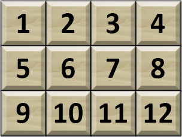
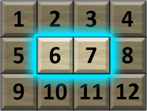

<h1 style='text-align: center;'> A. Accumulation of Dominoes</h1>

<h5 style='text-align: center;'>time limit per test: 1 second</h5>
<h5 style='text-align: center;'>memory limit per test: 256 megabytes</h5>

Pak Chanek has a grid that has $N$ rows and $M$ columns. Each row is numbered from $1$ to $N$ from top to bottom. Each column is numbered from $1$ to $M$ from left to right.

Each tile in the grid contains a number. The numbers are arranged as follows: 

* Row $1$ contains integers from $1$ to $M$ from left to right.
* Row $2$ contains integers from $M+1$ to $2 \times M$ from left to right.
* Row $3$ contains integers from $2 \times M+1$ to $3 \times M$ from left to right.
* And so on until row $N$.

A domino is defined as two different tiles in the grid that touch by their sides. A domino is said to be tight if and only if the two numbers in the domino have a difference of exactly $1$. Count the number of distinct tight dominoes in the grid.

Two dominoes are said to be distinct if and only if there exists at least one tile that is in one domino, but not in the other.

#### Input

The only line contains two integers $N$ and $M$ ($1 \leq N, M \leq 10^9$) — the number of rows and columns in the grid.

#### Output

An integer representing the number of distinct tight dominoes in the grid.

## Examples

#### Input


```text
3 4
```
#### Output


```text
9
```
#### Input


```text
2 1
```
#### Output


```text
1
```
## Note

The picture below is the grid that Pak Chanek has in the first example.

  The picture below is an example of a tight domino in the grid.

  

#### Tags 

#800 #OK #math 

## Blogs
- [All Contest Problems](../COMPFEST_14_-_Preliminary_Online_Mirror_(Unrated,_ICPC_Rules,_Teams_Preferred).md)
- [Announcement (en)](../blogs/Announcement_(en).md)
- [Tutorial (en)](../blogs/Tutorial_(en).md)
