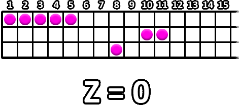

<h1 style='text-align: center;'> F. Field Photography</h1>

<h5 style='text-align: center;'>time limit per test: 1 second</h5>
<h5 style='text-align: center;'>memory limit per test: 256 megabytes</h5>

Pak Chanek is traveling to Manado. It turns out that OSN (Indonesian National Scientific Olympiad) 2019 is being held. The contestants of OSN 2019 are currently lining up in a field to be photographed. The field is shaped like a grid of size $N \times 10^{100}$ with $N$ rows and $10^{100}$ columns. The rows are numbered from $1$ to $N$ from north to south, the columns are numbered from $1$ to $10^{100}$ from west to east. The tile in row $r$ and column $c$ is denoted as $(r,c)$.

There are $N$ provinces that participate in OSN 2019. Initially, each contestant who represents province $i$ stands in tile $(i, p)$ for each $p$ satisfying $L_i \leq p \leq R_i$. So, we can see that there are $R_i-L_i+1$ contestants who represent province $i$.

Pak Chanek has a variable $Z$ that is initially equal to $0$. In one operation, Pak Chanek can choose a row $i$ and a positive integer $k$. Then, Pak Chanek will do one of the two following possibilities: 

* Move all contestants in row $i$ exactly $k$ tiles to the west. In other words, a contestant who is in $(i, p)$ is moved to $(i, p-k)$.
* Move all contestants in row $i$ exactly $k$ tiles to the east. In other words, a contestant who is in $(i, p)$ is moved to $(i, p+k)$.

After each operation, the value of $Z$ will change into $Z \text{ OR } k$, with $\text{OR}$ being the [bitwise OR operation](https://en.wikipedia.org/wiki/Bitwise_operation#OR). 
## Note

 that Pak Chanek can do operations to the same row more than once. Also note that Pak Chanek is not allowed to move contestants out of the grid.

There are $Q$ questions. For the $j$-th question, you are given a positive integer $W_j$, Pak Chanek must do zero or more operations so that the final value of $Z$ is exactly $W_j$. Define $M$ as the biggest number such that after all operations, there is at least one column that contains exactly $M$ contestants. For each question, you must find the biggest possible $M$ for all sequences of operations that can be done by Pak Chanek. 
## Note

 that the operations done by Pak Chanek for one question do not carry over to other questions.

### Input

The first line contains a single integer $N$ ($1 \leq N \leq 10^5$) — the number of rows in the grid and also the number of provinces that participate in OSN 2019.

The $i$-th of the next $N$ lines contains two integers $L_i$ and $R_i$ ($1 \leq L_i \leq R_i \leq 10^9$) describing the positions of the contestants who represent province $i$.

The next line contains a single integer $Q$ ($1 \leq Q \leq 10^5$) — the number of questions.

The $j$-th of the next $Q$ lines contains a single integer $W_j$ ($1 \leq W_j \leq 10^9$) — the required final value of $Z$ for the $j$-th question.

### Output

### Output

 $Q$ lines, with the $j$-th line containing an integer that is the answer to the $j$-th question.

## Example

### Input


```text
3
1 5
10 11
8 8
2
12
5
```
### Output


```text
2
3
```
## Note

For the $1$-st question, Pak Chanek can do the following operations to get $M=2$: 

* Move all contestants in row $2$ to the east by $4$ tiles. $Z$ changes into $0 \text{ OR } 4 = 4$.
* Move all contestants in row $1$ to the east by $12$ tiles. $Z$ changes into $4 \text{ OR } 12 = 12$.

Now, columns $14$ and $15$ each contains exactly $2$ contestants.

For the $2$-nd question, Pak Chanek can do the following operations to get $M=3$: 

* Move all contestants in row $3$ to the east by $4$ tiles. $Z$ changes into $0 \text{ OR } 4 = 4$.
* Move all contestants in row $3$ to the west by $1$ tiles. $Z$ changes into $4 \text{ OR } 1 = 5$.
* Move all contestants in row $1$ to the east by $5$ tiles. $Z$ changes into $5 \text{ OR } 5 = 5$.
* Move all contestants in row $1$ to the east by $5$ tiles. $Z$ changes into $5 \text{ OR } 5 = 5$.

Now, column $11$ contains exactly $3$ contestants.

The following is an illustration of the example operations for the $2$-nd question.




#### Tags 

#2100 #NOT OK #bitmasks #data_structures #sortings 

## Blogs
- [All Contest Problems](../COMPFEST_14_-_Preliminary_Online_Mirror_(Unrated,_ICPC_Rules,_Teams_Preferred).md)
- [Announcement (en)](../blogs/Announcement_(en).md)
- [Tutorial (en)](../blogs/Tutorial_(en).md)
