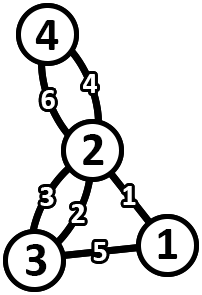
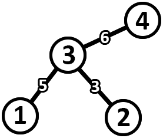

<h1 style='text-align: center;'> I. Imitating the Key Tree</h1>

<h5 style='text-align: center;'>time limit per test: 1 second</h5>
<h5 style='text-align: center;'>memory limit per test: 256 megabytes</h5>

Pak Chanek has a tree called the key tree. This tree consists of $N$ vertices and $N-1$ edges. The edges of the tree are numbered from $1$ to $N-1$ with edge $i$ connecting vertices $U_i$ and $V_i$. Initially, each edge of the key tree does not have a weight.

Formally, a path with length $k$ in a graph is a sequence $[v_1, e_1, v_2, e_2, v_3, e_3, \ldots, v_k, e_k, v_{k+1}]$ such that: 

* For each $i$, $v_i$ is a vertex and $e_i$ is an edge.
* For each $i$, $e_i$ connects vertices $v_i$ and $v_{i+1}$.

A circuit is a path that starts and ends on the same vertex.

A path in a graph is said to be simple if and only if the path does not use the same edge more than once. 
## Note

 that a simple path can use the same vertex more than once.

The cost of a simple path in a weighted graph is defined as the maximum weight of all edges it traverses.

Count the number of distinct undirected weighted graphs that satisfy the following conditions: 

* The graph has $N$ vertices and $2N-2$ edges.
* For each pair of different vertices $(x, y)$, there exists a simple circuit that goes through vertices $x$ and $y$ in the graph.
* The weight of each edge in the graph is an integer between $1$ and $2N-2$ inclusive. Each edge has distinct weights.
* The graph is formed in a way such that there is a way to assign a weight $W_i$ to each edge $i$ in the key tree that satisfies the following conditions:
	+ For each pair of edges $(i, j)$, if $i<j$, then $W_i<W_j$.
	+ For each pair of different vertex indices $(x, y)$, the cost of the only simple path from vertex $x$ to $y$ in the key tree is equal to the minimum cost of a simple circuit that goes through vertices $x$ and $y$ in the graph.
* 
## Note

 that the graph is allowed to have multi-edges, but is not allowed to have self-loops.

Print the answer modulo $998\,244\,353$.

Two graphs are considered distinct if and only if there exists a triple $(a, b, c)$ such that there exists an edge that connects vertices $a$ and $b$ with weight $c$ in one graph, but not in the other.

### Input

The first line contains a single integer $N$ ($2 \le N \le 10^5$) — the number of vertices in the key tree.

The $i$-th of the next $N-1$ lines contains two integers $U_i$ and $V_i$ ($1 \le U_i, V_i \le N$) — an edge connecting vertices $U_i$ and $V_i$. The graph in the input is a tree.

### Output

An integer representing the number of distinct undirected weighted graphs that satisfy the conditions of the problem modulo $998\,244\,353$.

## Example

### Input


```text
4
3 2
1 3
4 3
```
### Output


```text
540
```
## Note

The following is an example of a graph that satisfies.



The following is an assignment of edge weights in the key tree that corresponds to the graph above.



As an example, consider a pair of vertex indices $(1, 4)$. 

* The circuit in the graph for this pair of vertices is $3 \xrightarrow{2} 2 \xrightarrow{4} 4 \xrightarrow{6} 2 \xrightarrow{1} 1 \xrightarrow{5} 3$ with a cost of $6$.
* The path in the key tree for this pair of vertices is $1 \xrightarrow{5} 3 \xrightarrow{6} 4$ with a cost of $6$.


#### Tags 

#2800 #NOT OK #combinatorics #dsu #trees 

## Blogs
- [All Contest Problems](../COMPFEST_14_-_Preliminary_Online_Mirror_(Unrated,_ICPC_Rules,_Teams_Preferred).md)
- [Announcement (en)](../blogs/Announcement_(en).md)
- [Tutorial (en)](../blogs/Tutorial_(en).md)
