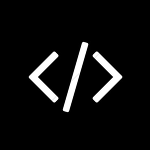

# Announcement_(en)

Hello Codeforces!

Grimoire of Code, the official Competitive Programming club of IIT Kharagpur, is happy to invite everyone to take part in [Codeforces Round 819 (Div. 1 + Div. 2) and Grimoire of Code Annual Contest 2022](https://codeforces.com/contest/1726) which will take place on [Tuesday, September 6, 2022 at 20:35UTC+6](https://codeforces.com/https://www.timeanddate.com/worldclock/fixedtime.html?day=6&month=9&year=2022&hour=17&min=35&sec=0&p1=166). **This round will be rated for everyone.**

You will be given **8 problems** and **2 hours 15 minutes** to solve them.

The problems have been authored and prepared by Grimoire of Code members Anubhav [anubhavdhar](https://codeforces.com/profile/anubhavdhar "Master anubhavdhar") Dhar, Debajyoti [little_angel](https://codeforces.com/profile/little_angel "Candidate Master little_angel") Dasgupta, and Mainak [Newtech66](https://codeforces.com/profile/Newtech66 "Master Newtech66") Roy.

 

---

We'd like to thank all the people who made this round possible:

 * [Artyom123](https://codeforces.com/profile/Artyom123 "Grandmaster Artyom123") for their [supercalifragilisticexpialidocious](https://codeforces.com/blog/entry/104289?#comment-926551) coordination + Russian translations!
* [shivansh1102](https://codeforces.com/profile/shivansh1102 "Expert shivansh1102") for being the one and only leamder.  No, "leamder" is not a typo
* [harsh639](https://codeforces.com/profile/harsh639 "Expert harsh639") and [rishit3234](https://codeforces.com/profile/rishit3234 "Master rishit3234") for behind-the-scenes work and proposing tasks that did not make it to the final problemset.
* All of our testers: [AwakeAnay](https://codeforces.com/profile/AwakeAnay "Master AwakeAnay"), [TimeWarp101](https://codeforces.com/profile/TimeWarp101 "Candidate Master TimeWarp101"), [naman1601](https://codeforces.com/profile/naman1601 "Master naman1601"), [preyam](https://codeforces.com/profile/preyam "Candidate Master preyam"), [fugazi](https://codeforces.com/profile/fugazi "Candidate Master fugazi"), [kasparovian](https://codeforces.com/profile/kasparovian "Master kasparovian"), [amul_agrawal](https://codeforces.com/profile/amul_agrawal "Master amul_agrawal"), [TheOneYouWant](https://codeforces.com/profile/TheOneYouWant "International Master TheOneYouWant"), [AlbertoTDNeto](https://codeforces.com/profile/AlbertoTDNeto "Master AlbertoTDNeto"), [thenymphsofdelphi](https://codeforces.com/profile/thenymphsofdelphi "International Grandmaster thenymphsofdelphi"), [physics0523](https://codeforces.com/profile/physics0523 "Grandmaster physics0523"), [Um_nik](https://codeforces.com/profile/Um_nik "Legendary Grandmaster Um_nik"), [Absyarka](https://codeforces.com/profile/Absyarka "Expert Absyarka"), [MayankAg](https://codeforces.com/profile/MayankAg "Candidate Master MayankAg"), [hackerbhaiya](https://codeforces.com/profile/hackerbhaiya "Expert hackerbhaiya"), [Pratyush1606](https://codeforces.com/profile/Pratyush1606 "Pupil Pratyush1606"), [sqrt_pi](https://codeforces.com/profile/sqrt_pi "Candidate Master sqrt_pi"), for testing and providing useful feedback.
* [MikeMirzayanov](https://codeforces.com/profile/MikeMirzayanov "Headquarters, MikeMirzayanov") for great platforms Codeforces and Polygon.

We hope everyone will enjoy the contest.

See you on the leaderboard!

 

---

*About Grimoire of Code:*

Grimoire of Code is the official Competitive Programming club of IIT Kharagpur created by and for competitive programming enthusiasts. We promote competitive programming culture in our college, and provide a forum for interested minds to discuss their thoughts and ideas. We also conduct mock coding rounds for placements and internships in Indian colleges.

You can check out our Facebook page [**here**](https://codeforces.com/https://www.facebook.com/goc.iitkgp).

You can check out the problems from last year's Annual Contest [**here**](https://codeforces.com/https://www.hackerearth.com/challenges/competitive/may-circuits-21/).

 

---

 Updates
-------

**UPD1:** The contest duration has been extended to **2 hours 15 minutes**.

**UPD2:** Score distribution: 500−1000−1500−2000−2250−2750−3250−3500500−1000−1500−2000−2250−2750−3250−3500

**UPD3:** Congratulations to the winners!

 1. [Benq](https://codeforces.com/profile/Benq "Legendary Grandmaster Benq")
2. [tourist](https://codeforces.com/profile/tourist "Legendary Grandmaster tourist")
3. [jiangly](https://codeforces.com/profile/jiangly "Legendary Grandmaster jiangly")
4. [Maksim1744](https://codeforces.com/profile/Maksim1744 "Legendary Grandmaster Maksim1744")
5. [kotatsugame](https://codeforces.com/profile/kotatsugame "International Grandmaster kotatsugame")
6. [tatyam](https://codeforces.com/profile/tatyam "International Grandmaster tatyam")
7. [TLEwpdus](https://codeforces.com/profile/TLEwpdus "Legendary Grandmaster TLEwpdus")
8. [gyh20](https://codeforces.com/profile/gyh20 "Legendary Grandmaster gyh20")
9. [turmax](https://codeforces.com/profile/turmax "International Grandmaster turmax")
10. [Radewoosh](https://codeforces.com/profile/Radewoosh "Legendary Grandmaster Radewoosh")

**UPD4:** [**Editorial**](Tutorial_(en).md)  ~~(editorial for F will be added soon)~~  It is now added.

**UPD5:** The contest is unrated due to problem copying. [Details](https://codeforces.com/blog/entry/106700).

