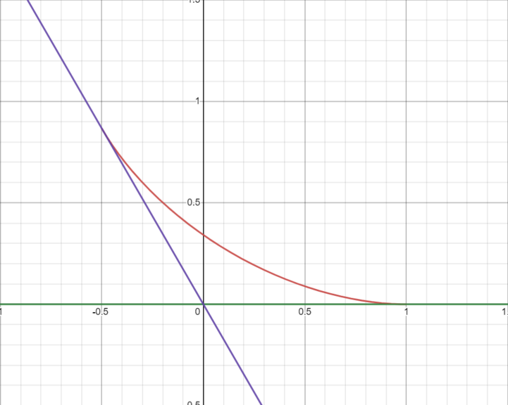

# Tutorial_(en)

We'd like to thank you all for participating in the contest, and hope you enjoyed it. Hope to see you again next year!

~~The editorial for problem F will be added soon.~~ It is now added.

 

---

 [1726A - Mainak and Array](../problems/A._Mainak_and_Array.md)
--------------------------------------------------------------------------

Idea: [anubhavdhar](https://codeforces.com/profile/anubhavdhar "Master anubhavdhar")   
 Editorial: [anubhavdhar](https://codeforces.com/profile/anubhavdhar "Master anubhavdhar")

 **Hint 1**Which subsegments are relevant?

 **Hint 2**an and a1 can be taken up only by *some* combination of elements, not all.

 **Solution**
### [1726A - Mainak and Array](../problems/A._Mainak_and_Array.md "Codeforces Round 819 (Div. 1 + Div. 2) and Grimoire of Code Annual Contest 2022")

There are four candidates of the maximum value of $a_n - a_1$ achievable, each of which can be found in $\mathcal O(n)$ time.

* No subarray is chosen: Answer would be $a_n - a_1$ in this case.
* Chosen subarray contains $a_n$ and $a_1$ : Answer would be $\max\limits_{i = 1}^n\{ a_{(i - 1)} - a_i\}$ where $a_0$ is same as $a_n$ (notice that the previous case is included in this case as well).
* Chosen subarray doesn't contain $a_n$ : Answer would be $\max\limits_{i = 1}^{n - 1}\{a_n - a_i\}$.
* Chosen subarray doesn't contain $a_1$ : Answer would be $\max\limits_{i = 2}^n\{a_i - a_1\}$.

Finally we report the maximum of all of these four values in total time $\mathcal O(n)$.

 **Implementation****C++**
```cpp
#include<bits/stdc++.h>
using namespace std;

inline void test_case(){
	
	int N;
	cin >> N;

	int A[N];
	int ans = -1000000007;

	for(int i = 0; i < N; ++i){
		cin >> A[i];
	}

	for(int i = 0; i < N; ++i){
		ans = max(ans, A[(i - 1 + N) % N] - A[i]);
	}

	for(int i = 1; i < N; ++i){
		ans = max(ans, A[i] - A[0]);
	}

	for(int i = 0; i < N - 1; ++i){
		ans = max(ans, A[N - 1] - A[i]);
	}

	cout << ans << 'n';
}

signed main(){

	int test_case_number;
	cin>>test_case_number;
	while(test_case_number--)
		test_case();
	
	return 0;
}
```
 **Python**
```cpp
t=int(input())
for _ in range(t):
    n=int(input())
    a=[int(x) for x in input().split()]
    ans=max(a[-1]-min(a),max(a)-a[0])
    for i in range(n):
        ans=max(ans,a[i-1]-a[i])
    print(ans)
```
 [1726B - Mainak and Interesting Sequence](../problems/B._Mainak_and_Interesting_Sequence.md)
-----------------------------------------------------------------------------------------

Idea: [anubhavdhar](https://codeforces.com/profile/anubhavdhar "Master anubhavdhar")   
 Editorial: [anubhavdhar](https://codeforces.com/profile/anubhavdhar "Master anubhavdhar")

 **Hint 1**Which cases of n and m are easy to come up with a solution? Which cases is it easy to show that no solution exist?

 **Hint 2**What happens when n is even but m is odd?

 **Solution**
### [1726B - Mainak and Interesting Sequence](../problems/B._Mainak_and_Interesting_Sequence.md "Codeforces Round 819 (Div. 1 + Div. 2) and Grimoire of Code Annual Contest 2022")

Lemma: In an interesting sequence $a_1, a_2, \ldots, a_n$, every element other than the largest must have even occurrences.

Proof: For the sake of contradiction, assume that for some $x$ ($x > 0$), such than $x \ne \max\limits_{i = 1}^n\{a_i\}$, $x$ appears an odd number of times. Let $P(z)$ denote the bitwise XOR of all elements in $a$ that are less than $z$. By assumption $P(x) = 0$. Now, since $x$ is not maximum of the sequence $a$, there exists $y$ in $a$, such that $x < y$ and there are no other elements $t$ such that $x < t < y$ (in other words, $y$ is the immediate larger element of $x$ in $a$). Again, $P(y) = 0$ as well by assumption. However, since $x$ appears an odd number of times, we have: $0 = P(y) = P(x) \oplus x = 0 \oplus x = x$, which is a contradiction as $x$ must be positive.

This gives us an $\mathcal O(n)$ solution as follows:

* Case - I: If $n > m$ — It is clearly impossible to construct an interesting sequence with sum equal to $m$ (as integers must be positive).
* Case - II: $n$ is odd — Create $(n - 1)$ occurrences of $1$, and a single occurrence of $(m-n+1)$.
* Case - III: $n$ is even, $m$ is even — Create $(n - 2)$ occurrences of $1$ and two occurrences of $(m - n + 2)/2$.
* Case - IV: $n$ is even, $m$ is odd — No such interesting sequences exist.
	+ Proof: For the sake of contradiction assume that such an interesting sequence, $a$, exists. Since $m$ is odd, there must be an odd number $x$ that occurs an odd number of times in $a$. Again since $n$ is even there must be another integer $y$ (different from $x$) that occurs an also odd number of times. Hence either $x$ or $y$ (whichever is lower) violates the lemma.
 **Implementation****C++**
```cpp
#include<bits/stdc++.h>
using namespace std;

inline void test_case(){
	
	int N, M;
	cin >> N >> M;

	if(((N % 2 == 0) && (M % 2 == 1)) || (M < N)){ // impossible cases, M < N and (M - odd, N - even)
		cout << "NOn";
	}else if((N % 2) == 1){ // (N - odd)
		cout << "YESn";
		for(int i = 1; i < N; ++i){
			cout << "1 ";
		}
		cout << M - N + 1 << 'n';
	}else{ // (N - even, M - even)
		cout << "YESn";
		for(int i = 2; i < N; ++i){
			cout << "1 ";
		}
		cout << (M - N + 2) / 2 << ' ' << (M - N + 2) / 2 << 'n';
	}

}

signed main(){

	ios_base::sync_with_stdio(false);
	cin.tie(NULL);
	cout.tie(NULL);

	int test_case_number;
	cin>>test_case_number;
	while(test_case_number--)
		test_case();
	
	return 0;
}
```
 **Python**
```cpp
import sys
input = sys.stdin.readline

t=int(input())
for _ in range(t):
    n,m=map(int,input().split())
    if n>m or (n%2==0 and m%2==1):
        print("NO")
    else:
        print("YES")
        ans=[]
        if n%2==1:
            ans.extend([1]*(n-1)+[m-n+1])
        else:
            ans.extend([1]*(n-2)+[(m-n+2)//2]*2)
        print(*ans,sep=' ')
```
 [1726C - Jatayu's Balanced Bracket Sequence](../problems/C._Jatayu's_Balanced_Bracket_Sequence.md)
--------------------------------------------------------------------------------------------

Idea: [Newtech66](https://codeforces.com/profile/Newtech66 "Master Newtech66")   
 Editorial: [anubhavdhar](https://codeforces.com/profile/anubhavdhar "Master anubhavdhar")

 **Hint 1**When can a connected component begin? 

 **Hint 2**What when two `'('` appear consecutively?

 **Solution**There are several ways to solve this problem (even bash-able with data structures like DSU and Segment Trees), but here is the one that is easiest to code.

 
### [1726C - Jatayu's Balanced Bracket Sequence](../problems/C._Jatayu's_Balanced_Bracket_Sequence.md "Codeforces Round 819 (Div. 1 + Div. 2) and Grimoire of Code Annual Contest 2022")

Claim: The answer is one more than the number of occurrences of the substring "((" in the balanced bracket sequence given (considering overlapping occurrences as well).

Proof: Observe the behavior of the lowest index $k$ of any connected component. The properties that would hold true are:

* $s_k = $ '('. This is because for all edges connecting indices $i$ and $j$ such that $i < j$, $s_i = $ '(' and $s_j = $ ')'.
* $k = 1$ is the lowest index for its connected component.
* For $k > 1$, $k$ is a lowest index for a connected component if and only if $s_{k - 1} = $ '('. This is because:
	+ if $s_{k - 1} = $ ')', then for any matching bracket $s_{j_1}$ of $s_{k - 1}$ ($j_1 < k - 1$) and for any matching bracket $s_{j_2}$ of $s_{k}$ ($j_2 > k$), there must be edges $(j_1, j_2)$ and $(k, j_2)$. This means that $j_1$ (which is less than $k$) is in the connected component of $k$. [Contradiction]
	+ if $s_{k - 1} = $ '(', then we can prove that there cannot be a smaller index in the connected component of $k$. For the sake of contradiction, assume that there exists a smaller index $a$ in the same connected component. This means, there is an edge $(a, b)$, such that $a < k$ and $b > k$ is in the connected component of $k$. Let $p_i$ be the number of '(' minus the the number of ')' in the prefix $s[1 \ldots i]$ (consider $p_0 = 0$ for the empty prefix). Observe that for all edges $(i, j)$, ($i < j$), it holds that $p_j = p_i - 1$ and for all $i'$, $i \le i' \le j$, we must have $p_{i'} \ge p_j$. This means that for a connected component $\mathcal C$, for all $i \in \mathcal C$, $s_i = $ '(', $p_i$ is constant. Hence $p_k = p_a$. Further we have $p_b = p_a - 1$ and $p_{k - 2} = p_{k - 1} - 1 = p_k - 2 = p_b - 1$. This implies $a < (k - 1)$, hence $a \le (k - 2) \le b$, however, $p_{k - 2} = p_b - 1 < p_b$. [Contradiction]

Therefore for each '(' preceded by another '(', we have one such connected component (so we add the occurrences of the substring "((" to our answer). However, we missed the connected component of node $1$ (so we add $1$ to our answer). [Proved]

Hence we can solve it in $\mathcal O(n)$.

 **Implementation****C++**
```cpp
#include<bits/stdc++.h>
using namespace std;

inline void test_case(){
	
	int N;
	string S;

	cin >> N >> S;
	N <<= 1;
	
	int ans = 1; // ans = 1 + count("((")
	for(int i = 1; i < N; ++i){
		if(S[i] == '(' && S[i - 1] == '('){ // adding 1 for count("((")
			++ans;
		}
	}

	cout << ans << 'n'; 
}

signed main(){

	ios_base::sync_with_stdio(false);
	cin.tie(NULL);
	cout.tie(NULL);

	int test_case_number;
	cin>>test_case_number;
	while(test_case_number--)
		test_case();
	
	return 0;
}
```
 **Python**
```cpp
t=int(input())
for _ in range(t):
    n=int(input())
    s=input()
    print(1+s.count("(")-s.count("()"))
```
 [1726D - Edge Split](../problems/D._Edge_Split.md)
--------------------------------------------------------------------

Idea: [Newtech66](https://codeforces.com/profile/Newtech66 "Master Newtech66")   
 Editorial: [Newtech66](https://codeforces.com/profile/Newtech66 "Master Newtech66")

 **Hint 1**what does m≤n+2 mean?

 **Hint 2**What if we look at a spanning tree?

 **Hint 3**Does any arbitrary spanning tree work?

 **Solution**
### [1726D - Edge Split](../problems/D._Edge_Split.md "Codeforces Round 819 (Div. 1 + Div. 2) and Grimoire of Code Annual Contest 2022")

Let's say for convenience that the set of red edges is called $R$ and the set of blue edges is called $B$.

Fact: In at least one optimal configuration, $R$ or $B$ forms a spanning tree.

Proof: Let's say that $R$ is not a spanning tree in some optimal configuration. If we move an edge connecting two disconnected vertices in $R$ from $B$ to $R$ (this edge must exist since the input is a connected graph), $c_2$ will increase by at most $1$, and $c_1$ will decrease by $1$. Also, if we have a cycle in $R$, we can move this edge from $R$ to $B$ and $c_1$ won't change. But $c_2$ may decrease by $1$. So making $R$ a spanning tree never makes the answer worse. We can swap $R$ and $B$ in this proof, it doesn't matter.

If $R$ is a spanning tree then $c_1=1$ and we want to minimise $c_2$. Clearly, it would be best if there was no cycle in $B$. It turns out that we can ensure this.

Notice that $m \leq (n-1)+3$, so the number of extra edges is very small. Let us build a spanning tree using DFS. A DFS tree will only have back edges and no cross edges. If there is no cycle taking these back edges in $B$, we are done. However, if there is a cycle (and there can be at most $1$ cycle, since you need at least $5$ edges for $2$ cycles), it looks like edges $u-v$ $v-w$ $u-w$ where $u$ is an ancestor of $v$ and $v$ is an ancestor of $w$. It is easy to get rid of this cycle by dropping one back edge ending at $w$ and taking the span edge connecting $w$ with its parent in the DFS tree. Note that $R$ remains a spanning tree. Hence we are done.

Time complexity: $\mathcal{O}(n)$

 **Implementation**
```cpp
#include<bits/stdc++.h>
using namespace std;
using lol=long long int;
#define endl "n"

void dfs(int u,const vector<vector<pair<int,int>>>& g,vector<bool>& vis,vector<int>& dep,vector<int>& par,string& s)
{
    vis[u]=true;
    for(auto [v,idx]:g[u])
    {
        if(vis[v])  continue;
        dep[v]=dep[u]+1;
        par[v]=u;
        s[idx]='1';
        dfs(v,g,vis,dep,par,s);
    }
}

int main()
{
ios_base::sync_with_stdio(false);
cin.tie(NULL);
int _=1;
cin>>_;
while(_--)
{
    int n,m;
    cin>>n>>m;
    vector<vector<pair<int,int>>> g(n+1);
    vector<pair<int,int>> edges(m);
    string s(m,'0');
    for(int i=0;i<m;i++)
    {
        int u,v;
        cin>>u>>v;
        edges[i]={u,v};
        g[u].push_back({v,i});
        g[v].push_back({u,i});
    }
    vector<bool> vis(n+1,false);
    vector<int> dep(n+1,0),par(n+1,-1);
    dfs(1,g,vis,dep,par,s);
    map<int,int> cnt;
    for(int i=0;i<m;i++)
    {
        if(s[i]=='0')
        {
            cnt[edges[i].first]++;
            cnt[edges[i].second]++;
        }
    }
    if(cnt.size()==3)
    {
        int mn=2*n+5,mx=0;
        for(auto [_,c]:cnt)
        {
            mn=min(mn,c);
            mx=max(mx,c);
        }
        if(mn==mx && mn==2)
        {
            vector<pair<int,int>> can;
            for(auto [v,_]:cnt) can.push_back({dep[v],v});
            sort(can.rbegin(),can.rend());
            int u=can[0].second;
            int i,j;    //replace edge i with edge j
            for(auto [v,idx]:g[u])
            {
                if(s[idx]=='0') i=idx;
                else if(v==par[u])    j=idx;
            }
            s[i]='1';
            s[j]='0';
        }
    }
    cout<<s<<endl;
}
return 0;
}
```
 [1726E - Almost Perfect](../problems/E._Almost_Perfect.md)
------------------------------------------------------------------------

Idea: [Newtech66](https://codeforces.com/profile/Newtech66 "Master Newtech66")   
 Editorial: [Newtech66](https://codeforces.com/profile/Newtech66 "Master Newtech66"), [anubhavdhar](https://codeforces.com/profile/anubhavdhar "Master anubhavdhar")

 **Hint 1**How will the permutation cycles look like ?

 **Hint 2**Can we fix the number of the largest sized permutation cycles and calculate the number of perfect permutations?

 **Hint 3**How do we handle the smaller permutation cycles?

 **Key fact****Key fact:** There are only 3 kinds of cycles in almost perfect permutations: (i), (i,j) and (i,j,i+1,j+1).

**Proof:**

 * Cycle size cannot be 3: Take (a,b,c) as a cycle with a<b<c, then pb=a, p−1b=c, but a<b<c implies |a−c|>1.
* Cycle size cannot be more than 4: Let (a1,a2,a3,a4,a5,…,ak) be consecutive elements of a cycle with size k (k≥5). This means a1≠a5, but |a1−a3|=1 and |a3−a5|=1. For now assume a1−a3=1 (proof of a1−a3=−1 is very similar). This means a3−a5=1 (as a1≠a5) and similarly a7−a5=1 and so on (if k≤6, a7 is basically a7modk; i.e. it wraps around). Now, we observe that if a1=x, then a3=x−1, a5=x−2, a7=x−3. Therefore ak+1=x−(k+1). But since that cycle is of size k, ak+1 = aj, for some j≤k. Therefore (x−(k+1))=(x−j), for some j≤k; which means (k+1)≤k — A contradiction.
* works for any 2 sized cycles (i,j): Proof is trivial.
* works for any 4 sized cycles (i,j,i+1,j+1): Proof is trivial.
* works **only for** 4 sized cycles (i,j,i+1,j+1): Consider cycle (a,b,c,d). |a−c|=1, |b−d|=1. WLOG assume a<c (therefore c=a+1).

 1. *Case I*: b<d. therefore cycle is (a,b,a+1,b+1) — of the given form.
2. *Case II*: b>d. therefore cycle is (a,d+1,a+1,d), which is same as (d,a,d+1,a+1) — also of the given form.
 **Solution 1: the easy way**Special thanks to [Um_nik](https://codeforces.com/profile/Um_nik "Legendary Grandmaster Um_nik") for sharing this solution!

Let's call (i) as type 1 cycles, (i,j) as type 2 cycles and (i,j,i+1,j+1) as type 3 cycles.

What we will do, is we will fix the number of type 3 and type 2 cycles and come up with a formula.

Let's say there are s type 3 cycles. We need to pick 2s numbers from [1,n−1] such that no two are adjacent. The number of ways to do this is (n−2s2s). Then we can permute these numbers in (2s)! ways and group the numbers in pairs of two, but these s pairs can be permuted to get something equivalent, so we need to divide by s!. Hence we get:

 (n−2s2s)(2s)!s!Now, for the remaining (n−4s) elements, we know that only cycles will be of length 2 or 1. Let Ik denote the number of permutations with cycles only of length 2 and 1. Then the final answer would be 

 ⌊n4⌋∑s=0(n−2s2s)(2s)!s!In−4sNow, we would be done if we found out Ik for all k∈1,2,...n. Observe that I1=1 and I2=2. Further for k>2, the k-th element can appear in a cycle of length 1, where there are Ik−1 ways to do it; and the k-th element can appear in a cycle of length two, which can be done in (k−1)⋅Ik−2 ways. Therefore we finally have:

 Ik=Ik−1+(k−1)⋅Ik−2This completes the solution. Time complexity: O(n).

 **Solution 2: the hard way**Using the observations in **Solution 1** this can be reduced to a counting problem using generating functions. Details follow.

Now, from the remaining n−4s numbers, let's pick 2k numbers to form k type 2 cycles. We can do this in (n−4s2k) ways. Like before, we can permute them in (2k)! ways, but we can shuffle these k pairs around so we have to divide by k!. Also, (i,j) and (j,i) are the same cycle, so we also need to divide by 2k because we can flip the pairs and get the same thing.

Finally, we have the following formula:

 ⌊n4⌋∑s=0⌊n−4s2⌋∑k=0(2s)!s!(n−2s2s)(n−4s2k)(2k)!2kk!We can simplify this to get,

 ⌊n4⌋∑s=0(n−2s)!s!⌊n−4s2⌋∑k=012k(n−4s−2k)!k!Now, observe that the answer is in the form of two nested summations. Let us focus on precomputing the inner summation using generating functions. We define the following generating function:

 P(x)=∑r≥0(⌊r2⌋∑k=012k(r−2k)!k!)xr=∑r≥0(⌊r2⌋∑k=0xr2k(r−2k)!k!)=∑r≥0(⌊r2⌋∑k=0x(r−2k)(r−2k)!⋅x2k2kk!)=∑r≥0(⌊r2⌋∑k=0x(r−2k)(r−2k)!⋅(x22)kk!)=(∑i≥0xii!)⋅(∑j≥0(x22)jj!)P(x)=(ex)⋅(ex22)=ex+x22We can compute the first few terms of ex=∑i≥0xii! and ex22=∑j≥0x2j2jj!; and using FFT, we can multiply these (in O(nlogn) time) to get the first few terms of P(x)=ex+x22. 

Finally, we can get the answer (in O(n) time) as,

 ⌊n4⌋∑s=0(n−2s)!s!([xn−4s]P(x))where [xm]F(x) is the coefficient of xm in the Taylor expansion of F(x).

Time complexity: O(max(ti)logmax(ti)+∑ti), where ti is the value of n in the i-th test case.

 **Implementation****Solution 1**
```cpp
#include <iostream>
#include <cstdio>
#include <cstdlib>
#include <algorithm>
#include <cmath>
#include <vector>
#include <set>
#include <map>
#include <unordered_set>
#include <unordered_map>
#include <queue>
#include <ctime>
#include <cassert>
#include <complex>
#include <string>
#include <cstring>
#include <chrono>
#include <random>
#include <bitset>
#include <array>
using namespace std;

#ifdef LOCAL
	#define eprintf(...) {fprintf(stderr, __VA_ARGS__);fflush(stderr);}
#else
	#define eprintf(...) 42
#endif

using ll = long long;
using ld = long double;
using uint = unsigned int;
using ull = unsigned long long;
template<typename T>
using pair2 = pair<T, T>;
using pii = pair<int, int>;
using pli = pair<ll, int>;
using pll = pair<ll, ll>;
mt19937_64 rng(chrono::steady_clock::now().time_since_epoch().count());
ll myRand(ll B) {
	return (ull)rng() % B;
}

#define pb push_back
#define mp make_pair
#define all(x) (x).begin(),(x).end()
#define fi first
#define se second

clock_t startTime;
double getCurrentTime() {
	return (double)(clock() - startTime) / CLOCKS_PER_SEC;
}


const uint MOD = 998244353;
template<uint mod = MOD> struct mint { // 1000000007  1000000009
	uint x;

	mint() : x(0) {}
	mint(ll _x) {
		_x %= mod;
		if (_x < 0) _x += mod;
		x = _x;
	}

	mint& operator += (const mint &a) {
		x += a.x;
		if (x >= mod) x -= mod;
		return *this;
	}
	mint& operator -= (const mint &a) {
		x += mod - a.x;
		if (x >= mod) x -= mod;
		return *this;
	}
	mint& operator *= (const mint &a) {
		x = (ull)x * a.x % mod;
		return *this;
	}
	mint pow(ll pw) const {
		mint res = 1;
		mint cur = *this;
		while(pw) {
			if (pw & 1) res *= cur;
			cur *= cur;
			pw >>= 1;
		}
		return res;
	}
	mint inv() const {
		assert(x != 0);
		uint t = x;
		uint res = 1;
		while(t != 1) {
			uint z = mod / t;
			res = (ull)res * (mod - z) % mod;
			t = mod - t * z;
		}
		return res;
	}
	mint& operator /= (const mint &a) {
		return *this *= a.inv();
	}
	mint operator + (const mint &a) const {
		return mint(*this) += a;
	}
	mint operator - (const mint &a) const {
		return mint(*this) -= a;
	}
	mint operator * (const mint &a) const {
		return mint(*this) *= a;
	}
	mint operator / (const mint &a) const {
		return mint(*this) /= a;
	}

	bool sqrt(mint &res) const {
		if (mod == 2 || x == 0) {
			res = *this;
			return true;
		}
		if (pow((mod - 1) / 2) != 1) return false;
		if (mod % 4 == 3) {
			res = pow((mod + 1) / 4);
			return true;
		}
		int pw = (mod - 1) / 2;
		int K = 30;
		while((1 << K) > pw) K--;
		while(true) {
			mint t = myRand(mod);
			mint a = 0, b = 0, c = 1;
			for (int k = K; k >= 0; k--) {
				a = b * b;
				b = b * c * 2;
				c = c * c + a * *this;
				if (((pw >> k) & 1) == 0) continue;
				a = b;
				b = b * t + c;
				c = c * t + a * *this;
			}
			if (b == 0) continue;
			c -= 1;
			c *= mint() - b.inv();
			if (c * c == *this) {
				res = c;
				return true;
			}
		}
		assert(false);
	}

	bool operator == (const mint &a) const {
		return x == a.x;
	}
	bool operator != (const mint &a) const {
		return x != a.x;
	}
	bool operator < (const mint &a) const {
		return x < a.x;
	}
};
template<uint mod = MOD> struct Factorials {
	using Mint = mint<mod>;
	vector<Mint> f, fi;

	Factorials() : f(), fi() {}
	Factorials(int n) {
		n += 10;
		f = vector<Mint>(n);
		fi = vector<Mint>(n);
		f[0] = 1;
		for (int i = 1; i < n; i++)
			f[i] = f[i - 1] * i;
		fi[n - 1] = f[n - 1].inv();
		for (int i = n - 1; i > 0; i--)
			fi[i - 1] = fi[i] * i;
	}

	Mint C(int n, int k) {
		if (k < 0 || k > n) return 0;
		return f[n] * fi[k] * fi[n - k];
	}
};
template<uint mod = MOD> struct Powers {
	using Mint = mint<mod>;
	vector<Mint> p, pi;

	Powers() : p(), pi() {}
	Powers(int n, Mint x) {
		n += 10;
		if (x == 0) {
			p = vector<Mint>(n);
			p[0] = 1;
		} else {
			p = vector<Mint>(n);
			pi = vector<Mint>(n);
			p[0] = pi[0] = 1;
			Mint xi = x.inv();
			for (int i = 1; i < n; i++) {
				p[i] = p[i - 1] * x;
				pi[i] = pi[i - 1] * xi;
			}
		}
	}

	Mint pow(int n) {
		if (n >= 0)
			return p[n];
		else
			return pi[-n];
	}
};
template<uint mod = MOD> struct Inverses {
	using Mint = mint<mod>;
	vector<Mint> ii;

	Inverses() : ii() {}
	Inverses(int n) {
		n += 10;
		ii = vector<Mint>(n);
		ii[1] = 1;
		for (int x = 2; x < n; x++)
			ii[x] = Mint() - ii[mod % x] * (mod / x);
	}

	Mint inv(Mint x) {
		assert(x != 0);
		uint t = x.x;
		uint res = 1;
		while(t >= (int)ii.size()) {
			uint z = mod / t;
			res = (ull)res * (mod - z) % mod;
			t = mod - t * z;
		}
		return ii[t] * res;
	}
};
using Mint = mint<>;

const int N = 300300;
Factorials F(N);
Mint F2[N];
Powers P2(N, Mint(2));
Mint invol[N];

void precalc() {
	F2[0] = 1;
	for (int i = 1; i < N; i++)
		F2[i] = F2[i - 1] * (2 * i - 1);
	invol[0] = invol[1] = 1;
	for (int i = 2; i < N; i++)
		invol[i] = invol[i - 1] + invol[i - 2] * (i - 1);
}

void solve() {
	int n;
	scanf("%d", &n);
	Mint ans = 0;
	for (int k = 0; 4 * k <= n; k++) {
		Mint cur = invol[n - 4 * k];
		cur *= F.C(n - 2 * k, 2 * k);
		cur *= F2[k];
		cur *= P2.pow(k);
		ans += cur;
	}
	printf("%un", ans.x);
}

int main()
{
	startTime = clock();
//	freopen("input.txt", "r", stdin);
//	freopen("output.txt", "w", stdout);

	precalc();

	int t;
	scanf("%d", &t);
	while(t--) solve();

	return 0;
}
```
 **Solution 2**
```cpp
#include<bits/stdc++.h>

using namespace std;

#define ll long long
const int MAXN = 300005;

/* PARTS OF CODE for fft taken from https://cp-algorithms.com/algebra/fft.html */


const ll mod = 998244353;
const ll root = 15311432; // which is basically 3 ^ 119 
const ll root_1 = 469870224;
const ll root_pw = (1 << 23);

ll fact[MAXN + 1], ifact[MAXN + 1], sum_pow[MAXN + 1];
vector<ll> P(MAXN); // this will be the first few terms of e^(x + (x^2)/2).

ll fxp(ll a, ll n){ // returns a ^ n modulo mod in O(log(mod)) time
	if(!n){
		return 1;
	}else if(n & 1){
		return a * fxp(a, n ^ 1) % mod;
	}else{
		ll v = fxp(a, n >> 1);
		return v * v % mod;
	}
}

inline ll inverse(ll a){ // returns the modular inverse of 
	return fxp(a % mod, mod -2);
}

void init_fact(){ // initializes fact[ ] and ifact[ ]
	fact[0] = ifact[0] = 1;
	for(int i = 1; i <= MAXN; ++i){
		fact[i] = fact[i - 1]  * i% mod;
		ifact[i] = inverse(fact[i]);
	}
}

ll C(ll n, ll r){ // returns nCr in O(1) time
	return (r > n || r < 0) ? 0 : (ifact[r] * ifact[n - r] % mod * fact[n] % mod);
}

// code for fft in O(nlogn)
void fft(vector<ll>& a, bool invert){
	int n = a.size();

	/// this does the bit inversion 
	for(int i = 1, j = 0; i < n; ++i){
		int bit = n >> 1;
		for(; j & bit; bit >>= 1){
			j ^= bit;
		}
		j ^= bit;
		if(i < j){
			swap(a[i], a[j]);
		}
	}

	for(int len = 2; len <= n; len <<= 1){
		ll wlen = invert ? root_1: root;
		for(int i = len; i < root_pw; i <<= 1){
			wlen = wlen * wlen % mod;
		}
		for(int i = 0; i < n; i += len){
			ll w = 1;
			for(int j = 0; j < len / 2; ++j){
				ll u = a[i + j], v = a[i + j + len / 2] * w % mod;
				a[i + j] = u + v < mod ? u + v : u + v - mod;
				a[i + j + len / 2] = u - v >= 0 ? u - v : u - v + mod;
				w = w * wlen % mod;
			}
		}
	}

	if(invert){
		ll n_1 = inverse(n);
		for(ll& x : a){
			x = x * n_1 % mod;
		}
	}
}

//multiplying two polynomials a and b using ntt in O(max(A, B)log(max(A, B))), where A, B are degrees of a, b respectively
vector<ll> mul(vector<ll> const& a, vector<ll> const& b){

	vector<ll> fa(a.begin(), a.end()), fb(b.begin(), b.end());
	int n = 1;
	while(n < (int)a.size() + (int)b.size()){
		n <<= 1;
	}
	fa.resize(n);
	fb.resize(n);

	fft(fa, false);
	fft(fb, false);
	for(int i = 0; i < n; ++i){
		fa[i] = fa[i] * fb[i] % mod;
	}
	fft(fa, true);
	while(fa.size() > 1 && fa[fa.size() - 1] == 0){
		fa.pop_back();
	}

	return fa;
}

/* End of FFT Template */

inline void init(){ // precomputes the first few terms of P(x) = e^(x + (x ^ 2) / 2)
	init_fact();
	vector<ll> e_x(MAXN), e_x2_by2(MAXN);
	ll modular_inverse_of_2 = (mod + 1) / 2; 

	for(int i = 0; i < MAXN; ++i){
		e_x[i] = ifact[i]; // e^x = sum{x^k / k!}
		e_x2_by2[i] = ((i & 1)) ? 0 : ifact[i / 2] * fxp(modular_inverse_of_2, i / 2) % mod; // e^((x^2)/2) = sum{(x^2k)/(k!.(2^k))}
	}

	P = mul(e_x, e_x2_by2); // P(x) = e^(x + (x ^ 2) / 2) = (e ^ x) . (e ^ ((x ^ 2) / 2))
}

void test_case(){

	int N;
	cin >> N;

	ll ans = 0;
	for(int s = 0; s <= N / 4; ++s){ // computing the answer for N using the precomputed P(x) polynomial
		ans = (ans + fact[N - 2 * s] * ifact[s] % mod * P[N - 4 * s]) % mod;
	}

	cout << ans << 'n';
}

signed main(){

	ios_base::sync_with_stdio(false);
	cin.tie(NULL);
	cout.tie(NULL);
	
	init();
	int test_case_number;
	cin>>test_case_number;
	while(test_case_number--)
		test_case();
	
	return 0;
}
```
 [1726F - Late For Work (submissions are not allowed)](../problems/F._Late_For_Work_(submissions_are_not_allowed).md)
-----------------------------------------------------------------------------------------------------

Please note that it is no longer possible to submit solutions to this problem on Codeforces. You can read the details [here](https://codeforces.com/blog/entry/106700).

Idea: [little_angel](https://codeforces.com/profile/little_angel "Candidate Master little_angel")   
 Editorial: [Newtech66](https://codeforces.com/profile/Newtech66 "Master Newtech66")

 **Hints****Hint 1**The di are irrelevant. Take partial sums and add them to each ci modulo T.

 **Hint 2**If your start time is fixed, it is never beneficial to wait at a green light. Drive whenever you can.

 **Hint 3**Visualise the problem as n parallel lines, each coloured with a red and green interval. Now imagine the car moving up (and looping back at T) whenever it has to wait at a red light, and shooting to the right immediately when the lights are green.

 **Hint 4**You can model this as a shortest paths problem.

 **Solution**There are solutions to this problem using lazy segment trees, or say, sets and maps. I'll describe my own solution here, which converts the problem to a shortest paths problem.

First of all, the di are irrelevant, since we can take partial sums and add them to ci. In the final answer, just add the sum of all di.

Now, we can offset the green (or red) intervals by the modified ci to get new red and green intervals modulo T.

Imagine n parallel lines of length T, with the corresponding intervals coloured red and green. Now, consider the intervals to be static. In this picture, the car can be visualised to be moving upwards along the line (looping back at T) when on red intervals and shooting to the right when it reaches a green interval. Notice that for a fixed starting time, it is always optimal to drive whenever you can. So essentially, fixing your start time also fixes your answer.

Now let's convert this to a graph. Notice that only the endpoints of green intervals matter, so overall, we'll have 2n nodes in our graph, plus a dummy node representing the start of the journey that connects to all endpoints that can be reached without being blocked by a red interval, and a dummy node representing the end of the journey that connects to all endpoints from which you can reach the end without being blocked by a red interval. So in total, 2n+2 nodes.

We'll add an edge between two nodes with a weight equal to the amount of time we'll have to spend waiting for the red light to turn green. We can achieve this with a multiset storing all currently visible endpoints, and then doing a little casework to add edges from nodes blocked by the current red interval and then deleting them, and adding new ones. We'll do this only O(n) times. In the end, whatever is left in the multiset are all the visible endpoints and we can connect them to the dummy node for the end. We can repeat this in the backward direction to get the endpoints for the dummy node for the start, though in my code, I elected to do this with an interval union data structure.

Finally, just run Dijkstra's algorithm on this graph. The answer is the sum of all di plus the shortest path between the dummy node for the start and the dummy node for the end.

Time complexity: O(nlogn)

 **Implementation**
```cpp
#include<bits/stdc++.h>
using namespace std;
using lol=long long int;
const lol inf=1e18+8;
 
struct IntervalUnion{
    set<int> lf,ri;
    map<int,int> lr,rl;
    void add(int l,int r)
    {
        if(!ri.empty())
        {
            auto it=ri.lower_bound(r);
            if(it!=ri.end() && rl[*it]<=l)  return;
        }
        while(!lf.empty())
        {
            auto it=lf.lower_bound(l);
            if(it==lf.end() || r<*it)    break;
            int nl=*it;
            r=max(r,lr[nl]);
            rl.erase(lr[nl]);
            ri.erase(lr[nl]);
            lr.erase(nl);
            lf.erase(nl);
        }
        while(!ri.empty())
        {
            auto it=ri.lower_bound(l);
            if(it==ri.end() || r<rl[*it])   break;
            int nl=rl[*it];
            l=min(l,nl);
            rl.erase(lr[nl]);
            ri.erase(lr[nl]);
            lr.erase(nl);
            lf.erase(nl);
        }
        lf.insert(l);
        ri.insert(r);
        lr[l]=r;
        rl[r]=l;
    }
    bool contains(int x)
    {
        auto it=ri.upper_bound(x);
        if(it==ri.end())    return false;
        return rl[*it]<=x;
    }
};
 
int main()
{
ios_base::sync_with_stdio(false);
cin.tie(NULL);
int n,t;
cin>>n>>t;
vector<pair<int,int>> gc(n);
for(auto& [g,c]:gc) cin>>g>>c;
lol sum=0;
for(int i=1;i<n;i++)
{
    int d;
    cin>>d;
    sum+=d;
    gc[i].second=(gc[i].second+(sum%t))%t;
}
vector<vector<pair<int,int>>> gr(2*n+2);
multiset<pair<int,int>> ms;
IntervalUnion iu;
for(int i=0;i<n;i++)
{
    auto [g,c]=gc[i];
    int l=(g-c+t)%t,r=t-c;
    if(l<r)
    {
        while(!ms.empty())
        {
            auto it=ms.lower_bound({l,-1});
            if(it==ms.end() || it->first>=r)    break;
            gr[2*i].push_back({it->second,r-it->first});
            ms.erase(it);
        }
    }else
    {
        while(!ms.empty())
        {
            auto it=ms.lower_bound({l,-1});
            if(it==ms.end() || it->first>=t)    break;
            gr[2*i].push_back({it->second,r+t-it->first});
            ms.erase(it);
        }
        while(!ms.empty())
        {
            auto it=ms.lower_bound({0,-1});
            if(it==ms.end() || it->first>=r)    break;
            gr[2*i].push_back({it->second,r-it->first});
            ms.erase(it);
        }
    }
    ms.insert({r%t,2*i});
    ms.insert({(l-1+t)%t,2*i+1});
    if(!iu.contains(r%t)) gr[2*i].push_back({2*n+1,0});
    if(!iu.contains((l-1+t)%t)) gr[2*i+1].push_back({2*n+1,0});
    if(l<r) iu.add(l,r);
    else
    {
        iu.add(l,t);
        iu.add(0,r);
    }
}
while(!ms.empty())
{
    auto it=ms.begin();
    gr[2*n].push_back({it->second,0});
    ms.erase(it);
}
//do dijkstra on this graph
vector<lol> sp(2*n+2,inf);
priority_queue<pair<lol,int>,vector<pair<lol,int>>,greater<pair<lol,int>>> pq;
pq.push({0,2*n});
sp[2*n]=0;
while(!pq.empty())
{
    auto [dist,u]=pq.top();
    pq.pop();
    if(dist>sp[u])   continue;
    for(auto [v,w]:gr[u])
    {
        if(dist+w<sp[v])
        {
            sp[v]=dist+w;
            pq.push({sp[v],v});
        }
    }
}
cout<<sum+sp[2*n+1];
return 0;
}
```
 [1726G - A Certain Magical Party](../problems/G._A_Certain_Magical_Party.md)
---------------------------------------------------------------------------------

Idea: [Newtech66](https://codeforces.com/profile/Newtech66 "Master Newtech66")   
 Editorial: [Newtech66](https://codeforces.com/profile/Newtech66 "Master Newtech66"), [anubhavdhar](https://codeforces.com/profile/anubhavdhar "Master anubhavdhar")

 **Hints****Hint 1**The happiness of a person can never decrease. It is obvious.

 **Hint 2**Let T be the final value all elements are equal to. For all x<T, there can be at most one occurrence of <x,1> in the array, where <a,b> means a person with happiness a and personality b.

 **Hint 3**There is only one possible T, given by m+n−1.

 **Hint 4**If it is possible to place multiple numbers in the order at a certain point (i.e. if there are multiple possible <u,v> which when placed will all yield <T,v>), it is always better to prefer the larger number, and to place a number with personality 1 over one with personality 0 in case of a tie.

 **Subhint**If T=M, the <M,1> group is special, since it doesn't matter when you place it since the final happiness value will still be M, and it won't affect any other group's viability either.

 **Hint 5**For a valid ordering (if exists), the 0 behaving people would be sorted in non-decreasing order of initial happiness.

 **Hint 6**For a valid ordering (if exists) and at any intermediate step, for all 1 behaving people <u,1> yet to speak, the number of people with a larger happiness than u cannot exceed (T−u). In other words, if we placed <u,1> at any intermediate step, its final happiness would not exceed T.

 **Solution**
### [1726G - A Certain Magical Party](../problems/G._A_Certain_Magical_Party.md "Codeforces Round 819 (Div. 1 + Div. 2) and Grimoire of Code Annual Contest 2022")

First of all, if there is only $1$ distinct value of happiness, any ordering is fine since no one has strictly greater or lesser happiness, and the answer is $n!$. From here on, we assume that there are at least $2$ distinct values of happiness.

Note: The notation $<u,v>$ refers to elements with happiness $u$ and behaviour $v$.

Observation 1: The happiness of a person can never decrease. It is obvious.

Let's call the final happiness value all elements will be equal to as the target value $T$. Also, let the smallest happiness value of the array be $m$, and the largest be $M$. Note that $T \geq M$, otherwise, it is impossible for a valid order to exist, from observation $1$.

Observation 2: For all $x<T$, there can be at most one occurrence of $<x,1>$ in the array.

Proof:

Let's say there is more than one occurrence of $<x,1>$. Let's say at some point, we can place one occurrence of it in our order, and we place it. But then for the remaining occurrences, it immediately becomes impossible to place them anymore, because the number of strictly greater values increases by $1$, and can only increase from there. Hence, contradiction.

—————

Observation 3: There is only one possible $T$, given by $m+n-1$.

Proof:

Let's say we have $<m,0>$. Then no matter what we do, its final happiness value will still be $m$, since there will never be a value strictly lesser than it. This means $T=m$. This however, breaks our assumption of $2$ distinct values. So only $<m,1>$ can exist. But if that exists, from observation $2$, exactly one such occurrence exists. The number of values strictly greater than $m$ will always be constant. So, no matter when we place it, the final happiness value is going to be $m+n-1$.

—————

Observation 4: If it is possible to place multiple numbers in the order at a certain point ( i.e. if there are multiple possible $<u,v>$ place which will all yield $<T,v>$ ), it is always better to prefer the larger number, and to place a number with behaviour $1$ over one with behaviour $0$ in case of a tie.

Proof: Let's say you pick something smaller than the larger number. Now this number becomes $T$, which is $\geq M$. Now consider the larger number. If it had a $0$, now it is impossible to place it anymore, because the number of numbers strictly lesser has reduced by $1$, and it can only reduce. A similar argument follows for $1$.

In the same group, you have to prefer $1$s over $0$s. Let's say you placed the $0$ first. Now the number of numbers strictly greater has increased by $1$, and can only increase. Therefore you can never place the $1$ now. Placing the $1$ first does not affect the viability of placing the $0$s.

Important: If $T=M$, the $<M,1>$ group is special, since it doesn't matter when you place it since the final happiness value will still be $M$, and it won't affect any other group's viability either. But the observation still holds.

In fact, except the $<M,1>$ group in the case of $T=M$, you have to follow this order. This means the order is unique upto considering equal elements as indistinguishable. This means, we can only choose the order of placing equal values. We cannot choose the occupied positions in the final order.

Hence the count is going to be the product of the number of possible permutations for each group.

$$\begin{aligned}P=\prod_{\text{all }<u,v>} {cnt_{<u,v>}!}\end{aligned}$$

—————

Observation 5: For a valid ordering (if exists), the $0$ behaving people would be sorted in non-decreasing order of initial happiness.

Proof: We assume the contrary: Suppose for $x > y$, $<x, 0>$ speaks before $<y, 0>$ in some valid order. Since it is known that both finally become $<T, 0>$, it must be the case that there were $(T - x)$ people with a smaller happiness than $x$, when $x$ speaks and $(T - y)$ people with a smaller happiness than $y$, when $y$ speaks. As $x > y$, everyone having a happiness less than $y$ must also have a happiness less than $x$. Therefore when $y$ speaks at least $(T - y)$ people had a happiness smaller than $x$. Now $(T - x) < (T - y)$; which means the number of people having a value less than $x$ increased. But the happiness of each person can only increase, and hence the number of poeple with a happiness less than $x$ cannot increase; contradiction.

—————

Observation 6: For a valid ordering (if exists) and at any intermediate step, for all $1$ behaving people $<u, 1>$ yet to speak, the number of people with a larger happiness than $u$ cannot exceed $(T - u)$. In other words, if we placed $<u, 1>$ at any intermediate step, its final happiness would not exceed $T$.

Proof: The happiness of everyone can only increase. So if the number of people with happiness greater than $<u, 1>$ exceeds $(T - u)$ before $<u, 1>$ has spoken, the number of people with a happiness greater than $u$ would not decrease when $u$ subsequently speaks. This means the final happiness of this person would be greater than $T$, which cannot happen.

—————

As mentioned before, in the case of the group $<M,1>$ if $T=M$, it doesn't matter where we place them in the order, but the order of the remaining elements is fixed. If there are $S$ occurrences of this group, then we have $n$ spots we can choose to place these values of the group in, and then the rest of the elements will follow the order in the remaining positions. The count $P$ is going to be multiplied by $\binom{n}{S}$.

However, it may be the case that no such ordering exists. We thus try to find an order using Observation 4 and speed it up using Observation 5 and Observation 6. 

We notice that we can have a brute force simulation of Observation 4 to find the order in $\mathcal{O}(n^2)$ time. However, we can do the following:

1. Place all occurrences of $<T, 1>$ at the beginning as their positions don't matter.
2. Keep a sorted (non-decreasing) list of all the $0$ behaving people who are yet to speak. From Observation 5 the only candidate who can be placed from this list at a given step is the least happy candidate.
3. Keep a sorted (increasing) list of all $1$ behaving people who are yet to speak where we keep track of the maximum of the final happiness reached if they were to speak now (i.e. their initial happiness + the number of people with a strictly greater happiness at present) among all people in this list. From Observation 6, we know that if this maximum exceeds $T$, there is no possible ordering and we output $0$. Hence from now we will assume that the maximum happiness reached if they were to talk now to be at most $T$.
4. At each step, there are only two potential speakers that we need to check (since we are breaking ties using Observation 4): The least happy $0$ behaving person (if its happiness reached currently is $T$) and the maximum stored in the last step (if it is equal to $T$). If neither is valid, we report no answer.
5. Otherwise, we break ties using Observation 4 and make that person speak. We change their happiness to $T$ and the final happiness values if they speak now, of all the $1$ behaving people that had a greater happiness (handled in step $3$) than the current person would increase by $1$.
6. If we can complete the entire process, we have a valid ordering.

This can be done quickly using two segment trees: One for keeping the happiness reached values of $1$ behaving people yet to speak and storing their maximum (so that steps $3$ and $5$ become max query and range updates); and another for keeping the count of people having a particular happiness value (to speed up finding the current happiness value if they speak now for the least happy $0$ behaving person in step $4$). 

Time complexity: $\mathcal{O}(n\log n)$

 **Implementation**
```cpp
#include<bits/stdc++.h>

#define ll long long
#define pb push_back
#define mp make_pair
#define pii pair<int, int>
#define pll pair<ll, ll>
#define ff first 
#define ss second
#define vi vector<int>
#define vl vector<ll>
#define vii vector<pii>
#define vll vector<pll>
#define FOR(i,N) for(i=0;i<(N);++i)
#define FORe(i,N) for(i=1;i<=(N);++i)
#define FORr(i,a,b) for(i=(a);i<(b);++i)
#define FORrev(i,N) for(i=(N);i>=0;--i)
#define F0R(i,N) for(int i=0;i<(N);++i)
#define F0Re(i,N) for(int i=1;i<=(N);++i)
#define F0Rr(i,a,b) for(ll i=(a);i<(b);++i)
#define F0Rrev(i,N) for(int i=(N);i>=0;--i)
#define all(v) (v).begin(),(v).end()
#define dbgLine cerr<<" LINE : "<<__LINE__<<"n"
#define ldd long double

using namespace std;

const int Alp = 26;
const int __PRECISION = 9;
const int inf = 1e9 + 8;

const ldd PI = acos(-1);
const ldd EPS = 1e-7;

const ll MOD = 998244353;
const ll MAXN = 260007;
const ll ROOTN = 320;
const ll LOGN = 18;
const ll INF = 1e18 + 1022;

int N;
int A[MAXN];
bool B[MAXN];
vi a[2];
pii people[MAXN];
ll fact[MAXN + 1], ifact[MAXN + 1];


ll fxp(ll a, ll n){
	if(n == 0) return 1;
	if(n % 2 == 1) return a * fxp(a, n - 1) % MOD;
	return fxp(a * a % MOD, n / 2);
}

ll inv(ll a){
	return fxp(a % MOD, MOD - 2);
}
void init(){
	fact[0] = ifact[0] = 1;
	F0Re(i, MAXN){
		fact[i] = fact[i - 1] * i % MOD;
		ifact[i] = inv(fact[i]);
	}
}

struct SegTree_sum{
	int st[4*MAXN];
	void upd(int node, int ss, int se, int i, int val){
		if(ss > i or se < i)	return;
		if(ss == se)	{st[node] += val; return;}
		int mid = (ss + se) / 2;
		upd(node*2+1, ss, mid, i, val);
		upd(node*2+2, mid+1, se, i, val);
		st[node] = st[node*2+1] + st[node*2+2];
	}
	int quer(int node,int ss, int se, int l, int r){
		if(ss > r or se < l)	return 0;
		if(ss >= l and se <= r)	return st[node];
		int mid = (ss + se)/2;
		return quer(node*2+1, ss, mid, l ,r) + quer(node*2+2, mid + 1, se, l,r);
	}
	SegTree_sum()	{F0R(i, MAXN*4) st[i] = 0;}
	inline void update(int i, int val) {upd(0, 0, 2 * MAXN, i, val);}
	inline int query(int l, int r) {return quer(0, 0, 2 * MAXN, l, r);}
}S_sum;

struct Segtree_max{
	int st[4 * MAXN], lz[4 * MAXN];
	inline void push(int node, int ss, int se){
		if(lz[node] == 0) return;
		st[node] += lz[node];
		if(ss != se) lz[node * 2 + 1] += lz[node], lz[node * 2 + 2] += lz[node];
		lz[node] = 0;
	}
	void upd(int node, int ss, int se, int l, int r, int val){
		push(node, ss, se);
		if(ss > r or se < l) return;
		if(ss >= l and se <= r) {lz[node] += val; push(node, ss, se); return;}
		int mid = (ss + se)/2;
		upd(node * 2 + 1, ss, mid, l, r, val);
		upd(node * 2 + 2, 1 + mid, se, l, r, val);
		st[node] = max(st[node * 2 + 1], st[node * 2 + 2]);
	}
	int quer(int node, int ss, int se, int tar){
		push(node, ss, se);
		if(st[node] < tar || st[node] > tar){
			return -1;
		}
		if(ss == se){
			return ss;
		}
		int mid = (ss + se) / 2;
		push(node * 2 + 1, ss, mid);
		push(node * 2 + 2, mid + 1, se);
		return (st[node * 2 + 2] < tar) ? quer(node * 2 + 1, ss, mid, tar) : quer(node * 2 + 2, mid + 1, se, tar);
	}
	Segtree_max() {F0R(i,MAXN * 4) st[i] = - 10 * MAXN, lz[i] = 0;}
	inline void update(int l, int r, ll val) {if(l <= r) upd(0, 0, 2 * MAXN, l, r, val);}
	inline ll query(int v) {return quer(0, 0, 2 * MAXN, v);}
}S_max;

signed main(){

	
	ios_base::sync_with_stdio(false);
	cin.tie(NULL);
	cout.tie(NULL);
	
	init();
	cin >> N;
	F0R(i, N){
		cin >> A[i];
	}
	F0R(i, N){
		cin >> B[i];
	}

	F0R(i, N){
		a[B[i]].pb(A[i]);
		people[i] = {A[i], B[i]};
		S_sum.update(A[i], 1);
	}

	sort(all(a[0]));
	sort(all(a[1]));
	sort(people, people + N);
	int m = people[0].ff;
	int M = people[N - 1].ff;
	int T = people[0].ff + N - 1;

	if(m == M){
		cout << fact[N] << 'n';
		return 0;
	}else if(people[0].ss == 0){
		cout << "0n";
		return 0;
	}else if(M > T){
		cout << "0n";
		return 0;
	}

	int T_cnt = 0;

	F0R(i, (int)a[1].size()){
		if(a[1][i] == T){
			++T_cnt;
		}else if(i + 1 < (int)a[1].size() && a[1][i] == a[1][i + 1]){
			cout << "0n";
			return 0;
		}
	}

	ll ans = fact[N] * ifact[N - T_cnt] % MOD;
	int p = -1, t = 0;
	for(int x : a[0]){
		if(p != x){
			ans = ans * fact[t] % MOD;
			t = 0;
		}
		++t;
		p = x;
	}
	ans = ans * fact[t] % MOD;

	int ptr = 0;

	for(int x : a[1]){
		if(x == T){
			break;
		}
		int y = x + S_sum.query(x + 1, 2 * MAXN);
		S_max.update(x, x, y + 10 * MAXN);
	}

	vii sequence(T_cnt, mp(T, 1));

	F0R(i, N - T_cnt){
		int zero = T + 1, one = T + 1;
		if(ptr < (int)a[0].size() && S_sum.query(1, a[0][ptr] - 1) + a[0][ptr] == T){
			zero = a[0][ptr];
		}
		one = S_max.query(T);
		if(one == -1 && zero == T + 1){
			cout << "0n";
			return 0;
		}
		if(zero == T + 1 || one >= zero){
			sequence.pb({one, 1});
			S_max.update(one, one, - 10 * N);
			S_max.update(one + 1, T - 1, 1);
			S_sum.update(one, -1);
			S_sum.update(T, 1);
		}else{
			sequence.pb({zero, 0});
			S_sum.update(zero, -1);
			S_sum.update(T, 1);
			S_max.update(zero, T - 1, 1);
			++ptr;
		}
	}
	cout << ans << 'n';
	
	return 0;
}
```
 [1726H - Mainak and the Bleeding Polygon](../problems/H._Mainak_and_the_Bleeding_Polygon.md)
-----------------------------------------------------------------------------------------

Idea: [anubhavdhar](https://codeforces.com/profile/anubhavdhar "Master anubhavdhar")   
 Editorial: [Newtech66](https://codeforces.com/profile/Newtech66 "Master Newtech66"), [anubhavdhar](https://codeforces.com/profile/anubhavdhar "Master anubhavdhar")

 **Hint 1**What role does the angles of the polygon play?

 **Hint 2**Is there some overlap in the area of two such regions? How do we account for that?

 **Solution**
### [1726H - Mainak and the Bleeding Polygon](../problems/H._Mainak_and_the_Bleeding_Polygon.md "Codeforces Round 819 (Div. 1 + Div. 2) and Grimoire of Code Annual Contest 2022")

Clearly, the unsafe area is bounded by the envelope of the curve you get if you slide a rod of length $1$ around the interior of the polygon and pressed against the edges at all times.

Observation 1: The length of each side of the polygon is $\geq 1$.

This one is obvious. Further, it implies that (almost always) we only need to consider unsafe areas formed by adjacent pairs of edges (there is one exception to this which is a rectangle with a side of length $1$, in which case the whole rectangle is unsafe). The proof is left as an exercise to the reader (our proof required some casework and induction on the angle and number of edges). The unsafe area for the whole polygon is the union of the unsafe areas formed by each pair of adjacent edges.

Two adjacent edges can be viewed as a pair of lines $y=0$ and $y=x \cdot \tan{( \alpha )}$ where $\alpha$ is the angle between the edges (which is $\geq \frac{\pi}{2}$). As it turns out, the envelope of the unsafe area is given by the parametric equations

$$\begin{aligned} x&=f(\theta,\alpha)=\frac{\sin\left(\theta-\alpha\right)}{\sin \alpha}+\frac{\cos\left(\theta-\alpha\right)\sin\left(\theta\right)\cos\left(\theta\right)}{\sin \alpha} \\\ y&=g(\theta,\alpha)=\frac{\cos\left(\theta-\alpha\right)\sin^{2}\left(\theta\right)}{\sin \alpha} \\\ \alpha & < \theta < \pi \end{aligned}$$

A sketch of the area for $\alpha=\frac{2\pi}{3}$:

  Also, the area is given by the formula

$$\begin{aligned} \frac{\cot{(\alpha)}+(\pi-\alpha) \cdot (\csc^2{(\alpha)}+2)}{16} \end{aligned}$$

We can easily just add up these values for each pair of adjacent edges. However, we are overestimating the area. We need to subtract out the intersecting parts of the individual unsafe areas.

Observation 2: At most $2$ individual unsafe areas cover any given point. If $2$ unsafe areas intersect, they are the areas made by $3$ successive edges.

If say, $3$ unsafe areas covered a point, then one of them must be between non-adjacent edges, which is not possible by the implications of observation 1. Furthermore, if the intersection of the unsafe areas is non-empty, the length of the common edge must be $< 2$, otherwise it will definitely be empty (this fact should be intuitively obvious). However, since the polygon has vertices has integer coordinates, if the length of an edge is $< 2$, it must be $1$ (it is parallel to one axis) or $\sqrt{2}$ (it is diagonal). Note that each possibility of edges with such lengths in an oriented fashion can occur at most once. Which gives us observation 3.

Observation 3: The number of sides of length $< 2$ is $\leq 8$.

What this basically means is that we will have to compute the area of the intersection of two unsafe areas only $\mathcal{O}(1)$ times.

Coming back to the curve, its area can be given by the integral

$$\begin{aligned} \int{y(\theta) \cdot \frac{\mathrm{d} x(\theta)}{\mathrm{d}\theta}\text{ }\mathrm{d}\theta}=\frac{1}{\sin^2{\alpha}}\int{[2\cos^2{(\theta-\alpha)}\cos^2{\theta}\sin^2{\theta}-\sin{(\theta-\alpha)}\cos{(\theta-\alpha)}\sin^3{\theta}\cos{\theta}]\text{ }\mathrm{d}\theta} \end{aligned}$$

This indefinite integral evaluates to

$$\begin{aligned} \frac{1}{64\sin^2{\alpha}}(\sin{(2 (\alpha - 3 \theta))} - \sin{(2 (\alpha - 2 \theta))} - 4 \sin{(2 (\alpha - \theta))} - \sin{(2 (\alpha + \theta))} - 4 \theta \cos{(2 \alpha)} + 8 \theta - 2 \sin{(4 \theta)}) + C \end{aligned}$$

Now, all we need to do is find the bounds of integration by finding the point at which the curves cross.

Now, for an edge of length $L$, where $L$ is either $1$ or $\sqrt 2$, we need to find the area of overlap and subtract it from our overestimated value. if we place the edge on the $x$-axis starting from origin, then the adjacent edges which were at an angle $\alpha_1$ and $\alpha_2$, now are straight lines, one at an angle $\alpha_1$ passing from the origin, whereas other is another straight line at an angle $\pi - \alpha_2$ passing through $(L, 0)$. Clearly, the parametric equations of the two envelopes would be $(f(\theta, \alpha_1), g(\theta, \alpha_1))$ for $\alpha_1 \le \theta \le \pi$ and $(L - f(\phi, \alpha2), g(\phi, \alpha_2))$ for $\alpha_2 \le \phi \le \pi$.

Observation 4: $g(\theta, \alpha)$, for a fixed $\alpha \in [\frac \pi 2, \pi)$, is a decreasing function of $\theta$, $\alpha \le \theta \le \pi$.

This fact can be easily verified from the equation of $g(\alpha, \theta)$ as $\cos(x)$ is decreasing in the range of $(\theta - \alpha)$ i.e. $[0, \pi - \alpha] \subset [0, \frac \pi 2]$, and $\sin^2(x)$ is decreasing in the range of $\theta$, i.e. $[\alpha, \pi] \subset [\frac \pi 2, \pi]$.

This means for a given value, $y = \lambda$, we can binary search in $\mathcal O(\log(\frac 1 \varepsilon))$, the value of $\theta$, such that $g(\alpha, \theta) = \lambda$. Once we get $\theta$, we can further get the $x$-coordinate just by plugging $\theta$ in $f(\theta, \alpha)$. Consequently, for both the parametric equations, we can evaluate $x$ as a function of $y$, in $\mathcal O(\log(\frac 1 \varepsilon))$ time.

Observation 5: If the coordinates of the intersection of $(f(\theta, \alpha_1), g(\theta, \alpha_1))$ for $\alpha_1 \le \theta \le \pi$ and $(L - f(\phi, \alpha2), g(\phi, \alpha_2))$ for $\alpha_2 \le \phi \le \pi$ is $(h, k)$, then we can can binary search on $k$ in $\mathcal O(\log(\frac 1 \varepsilon))$ function evaluations of $x$ as a function of $y$.

Observe that $0 < k < \sin(\max(\alpha_1, \alpha_2))$. Now, for a given guess $\lambda$ of the $y$-coordinate of the intersection point, let's say the first parametric function provides an $x$-coordinate of $x_1$ and the second parametric curve gives $x_2$. In other words, $(x_1, \lambda)$ and $(x_2, \lambda)$ are points on the first and the second curves respectively. Now, if $\lambda > k$, then we must have $x_1 < x_2$, whereas if $\lambda < k$, we have $x_1 > x_2$; and thus we can find the value of $k$ in $\mathcal O(log(\frac 1 \varepsilon))$ evaluations of $x_1$ and $x_2$ using a binary search.

Therefore we can find the intersection point (and therefore the corresponding $\theta$ and $\phi$ values) in $\mathcal O(\log^2(\frac 1 \varepsilon))$ time. Once we have the $\theta$ and the $\phi$ values, we get the bounds of the indefinite integral after which we just plug in the values $\theta$ and $\phi$ to the indefinite integral to get the overlap area.

Since we are doing this only for edges of length $< 2$, by observation 3, the final time complexity is $\mathcal{O}(n+\log^2{\varepsilon^{-1}})$.

However, a solution doing this for every edge would run in $\mathcal{O}(n\log^2{\varepsilon^{-1}})$ time. For the given constraints, this optimization was not necessary to pass.

 **Implementation**
```cpp
#include<bits/stdc++.h>
using namespace std;
using lol=long long int;
using ldd=long double;
#define endl "n"
const ldd PI=acos(-1.0);
const int ITERATIONS = 60;
const int PRECISION = 11;

struct Point{
    lol x,y;
    Point& operator-=(const Point& rhs){
        x-=rhs.x,y-=rhs.y;
        return *this;
    }
    friend Point operator-(Point lhs,const Point& rhs){
        lhs -= rhs;
        return lhs;
    }
};
std::istream& operator>>(std::istream& is, Point& obj){
    is>>obj.x>>obj.y;
    return is;
}

ldd norm(Point p){
    return p.x*p.x+p.y*p.y;
}
ldd cross_product(Point a,Point b){
    return a.x*b.y-a.y*b.x;
}
ldd dot_product(Point a,Point b){
    return a.x*b.x+a.y*b.y;
}
ldd getalpha(Point a,Point b,Point c){
    return atan2l(cross_product(c-b,a-b),dot_product(c-b,a-b));
}
ldd getarea(Point a,Point b,Point c){
    Point l1=c-b,l2=a-b;
    return (dot_product(l1,l2)/cross_product(l1,l2)+atan2l(cross_product(l1,l2),-dot_product(l1,l2))*((norm(l1)*norm(l2))/(cross_product(l1,l2)*cross_product(l1,l2))+2.0))/16.0;
}

ldd f(ldd theta, ldd alpha){
	return -cos(theta)+(1.0/tan(alpha))*sin(theta) + (cos(theta)*(1.0/tan(alpha))+sin(theta)) * (sin(2*theta)/2.0);
}
ldd g(ldd theta, ldd alpha){
	return (cos(theta)*(1.0/tan(alpha))+sin(theta)) * (1.0 - cos(2*theta))/2.0;
}
ldd get_x(ldd y, ldd alpha, ldd & theta){
	ldd lo = alpha, hi = PI;
	for(int it = 0; it < ITERATIONS; ++it){
		theta = (lo + hi) / 2.0;
		ldd y_guess = g(theta, alpha);
		if(y > y_guess){
			hi = theta;
		}else{
			lo = theta;
		}
	}

	return f(theta, alpha);
}
ldd A(ldd theta, ldd alpha){
	return (sin(2 * (alpha - 3 * theta)) - sin(2 * (alpha - 2 * theta)) - 4 * sin(2 * (alpha - theta)) - sin(2 * (alpha + theta))
			- 4 * theta * cos(2 * alpha) + 8 * theta - 2 * sin(4 * theta)) / (64.0 * sin(alpha) * sin(alpha));
}
ldd find_overlap_area(ldd alpha_1, ldd alpha_2, ldd L){

	ldd lo = 0, hi = sin(max(alpha_1, alpha_2));
	ldd theta_1 = PI, theta_2 = PI;

	for(int it = 0; it < ITERATIONS; ++it){
		ldd mid_y = (lo + hi) / 2;
		ldd x1 = get_x(mid_y, alpha_1, theta_1);
		ldd x2 = L - get_x(mid_y, alpha_2, theta_2);
		if(x1 < x2){
			hi = mid_y;
		}else{
			lo = mid_y;
		}

	}

	return (A(PI, alpha_1) + A(PI, alpha_2)) - (A(theta_1, alpha_1) + A(theta_2, alpha_2));
}

int main()
{
ios_base::sync_with_stdio(false);
cin.tie(NULL);
int n;
cin>>n;
vector<Point> v(n);
for(auto& p:v)  cin>>p;
if(n == 4){
    int MY = max({v[0].y, v[1].y, v[2].y, v[3].y});
    int my = min({v[0].y, v[1].y, v[2].y, v[3].y});
    int MX = max({v[0].x, v[1].x, v[2].x, v[3].x});
    int mx = min({v[0].x, v[1].x, v[2].x, v[3].x});
    if(MY - my == 1 || MX - mx == 1){
        cout << fixed << setprecision(PRECISION) << 1.0 * (MY - my) * (MX - mx) << endl;
        exit(0);
    }
}
double ans=0.0;
for(int i=0;i<n;i++){
    ans+=getarea(v[(i-1+n)%n],v[i],v[(i+1)%n]);
}
for(int i=0;i<n;i++){
    Point a=v[(i-1+n)%n],b=v[i],c=v[(i+1)%n],d=v[(i+2)%n];
    if(norm(c-b)<3){
        ans-=find_overlap_area(getalpha(a,b,c),getalpha(b,c,d),sqrt(norm(c-b)));
    }
}
cout<<fixed<<setprecision(PRECISION)<<ans;
return 0;
}
```
 

---

 Vote for the problems here!
---------------------------

Feel free to vote for your opinion of each problem, and the best problem of the contest.

 **Vote here****A*** Best problem: 


[*10*](https://codeforces.com/data/like?action=like "I like this")
* Good problem: 

 
[*114*](https://codeforces.com/data/like?action=like "I like this")
* Average problem: 

 
[*24*](https://codeforces.com/data/like?action=like "I like this")
* Bad problem: 

 
[*28*](https://codeforces.com/data/like?action=like "I like this")
* Did not solve: 

 
[*2*](https://codeforces.com/data/like?action=like "I like this")
 **B*** Best problem: 

 
[*14*](https://codeforces.com/data/like?action=like "I like this")
* Good problem: 

 
[*118*](https://codeforces.com/data/like?action=like "I like this")
* Average problem: 

 
[*14*](https://codeforces.com/data/like?action=like "I like this")
* Bad problem: 

 
[*17*](https://codeforces.com/data/like?action=like "I like this")
* Did not solve: 

 
[*1*](https://codeforces.com/data/like?action=like "I like this")
 **C*** Best problem: 

 
[*50*](https://codeforces.com/data/like?action=like "I like this")
* Good problem: 

 
[*103*](https://codeforces.com/data/like?action=like "I like this")
* Average problem: 

 
[*8*](https://codeforces.com/data/like?action=like "I like this")
* Bad problem: 

 
[*15*](https://codeforces.com/data/like?action=like "I like this")
* Did not solve: 

 
[*10*](https://codeforces.com/data/like?action=like "I like this")
 **D*** Best problem: 

 
[*19*](https://codeforces.com/data/like?action=like "I like this")
* Good problem: 

 
[*80*](https://codeforces.com/data/like?action=like "I like this")
* Average problem: 

 
[*16*](https://codeforces.com/data/like?action=like "I like this")
* Bad problem: 

 
[*17*](https://codeforces.com/data/like?action=like "I like this")
* Did not solve: 

 
[*23*](https://codeforces.com/data/like?action=like "I like this")
 **E*** Best problem: 

 
[*23*](https://codeforces.com/data/like?action=like "I like this")
* Good problem: 

 
[*43*](https://codeforces.com/data/like?action=like "I like this")
* Average problem: 

 
[*9*](https://codeforces.com/data/like?action=like "I like this")
* Bad problem: 

 
[*3*](https://codeforces.com/data/like?action=like "I like this")
* Did not solve: 

 
[*22*](https://codeforces.com/data/like?action=like "I like this")
 **F*** Best problem: 

 
[*10*](https://codeforces.com/data/like?action=like "I like this")
* Good problem: 

 
[*3*](https://codeforces.com/data/like?action=like "I like this")
* Average problem: 

 
[*3*](https://codeforces.com/data/like?action=like "I like this")
* Bad problem: 

 
[*241*](https://codeforces.com/data/like?action=like "I like this")
* Did not solve: 

 
[*15*](https://codeforces.com/data/like?action=like "I like this")
 **G*** Best problem: 

 
[*6*](https://codeforces.com/data/like?action=like "I like this")
* Good problem: 

 
[*12*](https://codeforces.com/data/like?action=like "I like this")
* Average problem: 

 
[*1*](https://codeforces.com/data/like?action=like "I like this")
* Bad problem: 

 
[*6*](https://codeforces.com/data/like?action=like "I like this")
* Did not solve: 

 
[*28*](https://codeforces.com/data/like?action=like "I like this")
 **H*** Best problem: 

 
[*11*](https://codeforces.com/data/like?action=like "I like this")
* Good problem: 

 
[*2*](https://codeforces.com/data/like?action=like "I like this")
* Average problem: 

 
[*1*](https://codeforces.com/data/like?action=like "I like this")
* Bad problem: 

 
[*8*](https://codeforces.com/data/like?action=like "I like this")
* Did not solve: 

 
[*40*](https://codeforces.com/data/like?action=like "I like this")
