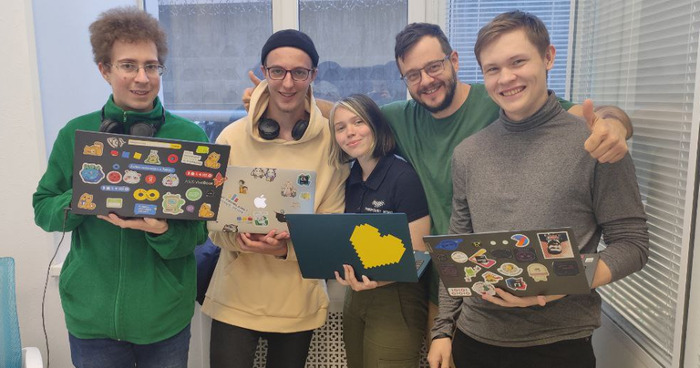

# Announcement

Hello! [Codeforces Round 820 (Div. 3)](https://codeforces.com/contest/1729 "Codeforces Round 820 (Div. 3)") will start at [Monday, September 12, 2022 at 20:35UTC+6](https://codeforces.com/https://www.timeanddate.com/worldclock/fixedtime.html?day=12&month=9&year=2022&hour=17&min=35&sec=0&p1=166). You will be offered 6-8 problems with expected difficulties to compose an interesting competition for participants with ratings up to 1600. However, all of you who wish to take part and have a rating of 1600 or higher, can register for the round unofficially.

The round will be hosted by rules of educational rounds (extended ICPC). Thus, solutions will be judged on preliminary tests during the round, and after the round, it will be a 12-hour phase of **open hacks**.

You will be given **6-8 problems** and **2 hours and 15 minutes** to solve them. One of the problems in this round is **interactive**. Don't forget to read the [guide on interactive problems](https://codeforces.com/blog/entry/45307).

Note that the **penalty** for the wrong submission in this round is **10 minutes**.

[Remember](https://codeforces.com/blog/entry/59228) that only the trusted participants of the third division will be included in the official standings table. As it is written by link, this is a compulsory measure for combating unsporting behavior. To qualify as a *trusted participant of the third division*, you must:

 * take part in at least five rated rounds (and solve at least one problem in each of them)
* do not have a point of 1900 or higher in the rating.

**Regardless of whether you are a trusted participant of the third division or not, if your rating is less than 1600, then the round will be rated for you.**

Thanks to MikeMirzayanov for the platform, help with ideas for problems and for coordination of our work. Problems have been created and written by ITMO University team: [MikeMirzayanov](https://codeforces.com/profile/MikeMirzayanov "Headquarters, MikeMirzayanov"), [myav](https://codeforces.com/profile/myav "Pupil myav"), [Gol_D](https://codeforces.com/profile/Gol_D "Candidate Master Gol_D"), [Aris](https://codeforces.com/profile/Aris "Expert Aris"), [Gornak40](https://codeforces.com/profile/Gornak40 "Expert Gornak40"), [senjougaharin](https://codeforces.com/profile/senjougaharin "Master senjougaharin") and [Vladosiya](https://codeforces.com/profile/Vladosiya "Expert Vladosiya").

We would like to thank: [Kniaz](https://codeforces.com/profile/Kniaz "Master Kniaz"), [BledDest](https://codeforces.com/profile/BledDest "International Grandmaster BledDest"), [Svyat](https://codeforces.com/profile/Svyat "Candidate Master Svyat"), [Be_dos](https://codeforces.com/profile/Be_dos "Master Be_dos"), [Timur2006](https://codeforces.com/profile/Timur2006 "Expert Timur2006"), [FelixDzerzhinsky](https://codeforces.com/profile/FelixDzerzhinsky "Candidate Master FelixDzerzhinsky"), [alphabet321](https://codeforces.com/profile/alphabet321 "Expert alphabet321"), [FedShat](https://codeforces.com/profile/FedShat "Expert FedShat"), [vsinitsynav](https://codeforces.com/profile/vsinitsynav "Master vsinitsynav"), [Jostic11](https://codeforces.com/profile/Jostic11 "Master Jostic11"), [erankyun](https://codeforces.com/profile/erankyun "Candidate Master erankyun"), [_Roma_](https://codeforces.com/profile/_Roma_ "Expert _Roma_"), [KKT_89](https://codeforces.com/profile/KKT_89 "Candidate Master KKT_89"), [ABalobanov](https://codeforces.com/profile/ABalobanov "Candidate Master ABalobanov"), [lightseba](https://codeforces.com/profile/lightseba "Master lightseba"), [powergee101](https://codeforces.com/profile/powergee101 "Candidate Master powergee101"), [DafuQ_o](https://codeforces.com/profile/DafuQ_o "Expert DafuQ_o") and [AshrafEzz](https://codeforces.com/profile/AshrafEzz "Expert AshrafEzz") for testing the contest and valuable feedback. List of testers will be updated.

Good luck!

**UPD 1:** 

     
 We are in the middle of the round (and missing [Gornak40](https://codeforces.com/profile/Gornak40 "Expert Gornak40") and [Gol_D](https://codeforces.com/profile/Gol_D "Candidate Master Gol_D")). **UPD 2:** [Editorial](Tutorial.md)

