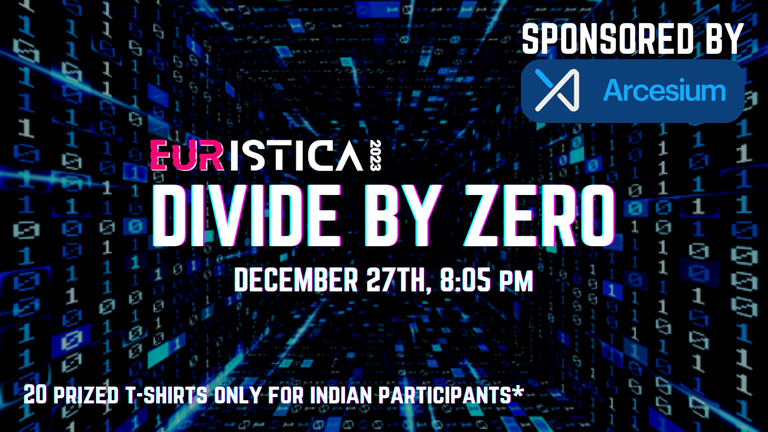

# Announcement_(en)

#### Hello, Codeforces!

[The Programming Club, IIT Indore](https://codeforces.com/https://www.linkedin.com/company/progclub-iiti/mycompany/) is proud to present the **8th edition** of its flagship event, **Divide By Zero** — [Codeforces Round #841 (Div. 2) and Divide By Zero 2022](https://codeforces.com/contest/1731), under the annual code-fest, **Euristica'23**. 

You can check some of the previous editions of **Divide By Zero** prepared by us : [Codeforces Round #399 (Div. 1 + Div. 2)](https://codeforces.com/blog/entry/50510), [Codeforces Round #474 (Div. 1 + Div. 2)](https://codeforces.com/blog/entry/58754), [Codeforces Round #714 (Div. 2)](https://codeforces.com/blog/entry/89520). 

The contest will take place on [Tuesday, December 27, 2022 at 20:35UTC+6](https://codeforces.com/https://www.timeanddate.com/worldclock/fixedtime.html?day=27&month=12&year=2022&hour=17&min=35&sec=0&p1=166). **This round will be rated for all participants with a rating lower than 2100.**

People who had a great contribution to making this round possible:

 * Problems were authored by [nishkarsh](https://codeforces.com/profile/nishkarsh "Master nishkarsh"), [ka_tri](https://codeforces.com/profile/ka_tri "Expert ka_tri") and me.
* [sksusha8853](https://codeforces.com/profile/sksusha8853 "Candidate Master sksusha8853"), [Phantom_Deluxe](https://codeforces.com/profile/Phantom_Deluxe "Expert Phantom_Deluxe"), [Anurag203](https://codeforces.com/profile/Anurag203 "Candidate Master Anurag203"), [nishu2002](https://codeforces.com/profile/nishu2002 "Pupil nishu2002"), [hk2102](https://codeforces.com/profile/hk2102 "Expert hk2102"), [krishanu21saini](https://codeforces.com/profile/krishanu21saini "Expert krishanu21saini") and [somyamehta_24](https://codeforces.com/profile/somyamehta_24 "Expert somyamehta_24") made a great contribution to the problemset.
* Thanks to [ajit](https://codeforces.com/profile/ajit "Master ajit"), [awoo](https://codeforces.com/profile/awoo "Grandmaster awoo"), [NemanjaSo2005](https://codeforces.com/profile/NemanjaSo2005 "Expert NemanjaSo2005"), [Nahian9696](https://codeforces.com/profile/Nahian9696 "Candidate Master Nahian9696"), [Qg3](https://codeforces.com/profile/Qg3 "Expert Qg3"), [CARBINE](https://codeforces.com/profile/CARBINE "Expert CARBINE"), [TomiokapEace](https://codeforces.com/profile/TomiokapEace "Expert TomiokapEace"), [maomao90](https://codeforces.com/profile/maomao90 "Grandmaster maomao90"), [MasterRayuga](https://codeforces.com/profile/MasterRayuga "Candidate Master MasterRayuga") and [prvocislo](https://codeforces.com/profile/prvocislo "International Master prvocislo") for testing the problems.
* Thanks to [adedalic](https://codeforces.com/profile/adedalic "International Master adedalic") for wonderful coordination and for giving great advice throughout the round.
* [MikeMirzayanov](https://codeforces.com/profile/MikeMirzayanov "Headquarters, MikeMirzayanov") for Codeforces and Polygon platforms.

You will be given **6 problems**, and **2 hours** to solve them. The points distribution will be updated later.

**UPD1**: Score distribution is **500 — 1000 — 1500 — 1500 — 2000 — 2750**

**UPD2**: The [editorial](Tutorial_(en).md) is up.

**PRIZES**: Twenty T-shirt will be given to:

 * Top 10 Indian Participants
* Random 10 from top 100 (rank 11-100) Indian participants

Hope you guys enjoy the contest! See you on the leaderboard :P

#### **About Euristica**

Euristica is the annual flagship programming event of The Programming Club of IIT Indore. As part of Euristica, we conduct a variety of online competitions spanning different programming domains. These events are open and free for all, and there will be exciting prizes and goodies for the winners.

Head over to our [website](https://codeforces.com/http://Fluxus.co.in) to find out more about the competitions.

**UPD3**: Here is the list of winners who won T-shirts. We will contact you guys soon. Congrats!

Top 10 Indian Participants 

 * [socho](https://codeforces.com/profile/socho "Master socho")
* [kshitij_sodani](https://codeforces.com/profile/kshitij_sodani "International Master kshitij_sodani")
* [rivalq](https://codeforces.com/profile/rivalq "Grandmaster rivalq")
* [aryanc403](https://codeforces.com/profile/aryanc403 "Grandmaster aryanc403")
* [satyam343](https://codeforces.com/profile/satyam343 "Master satyam343")
* [meme](https://codeforces.com/profile/meme "Candidate Master meme")
* [shadow9236](https://codeforces.com/profile/shadow9236 "Master shadow9236")
* [JrNTR](https://codeforces.com/profile/JrNTR "Candidate Master JrNTR")
* [iLLusio](https://codeforces.com/profile/iLLusio "Master iLLusio")
* [ShlokG](https://codeforces.com/profile/ShlokG "Master ShlokG")

Random 10 from top 100 (rank 11-100) Indian participants

 * [yash_daga](https://codeforces.com/profile/yash_daga "Grandmaster yash_daga")
* [vineeth_kada](https://codeforces.com/profile/vineeth_kada "Candidate Master vineeth_kada")
* [GoatTamer](https://codeforces.com/profile/GoatTamer "Candidate Master GoatTamer")
* [Yomapeed](https://codeforces.com/profile/Yomapeed "Expert Yomapeed")
* [killer_god](https://codeforces.com/profile/killer_god "Master killer_god")
* [orientor](https://codeforces.com/profile/orientor "Candidate Master orientor")
* [milind0110](https://codeforces.com/profile/milind0110 "Candidate Master milind0110")
* [Chimpanzee](https://codeforces.com/profile/Chimpanzee "Expert Chimpanzee")
* [mayankfrost](https://codeforces.com/profile/mayankfrost "Candidate Master mayankfrost")
* [hsrb](https://codeforces.com/profile/hsrb "Expert hsrb")

We have uploaded the link to the code for generating random numbers and ranklist [here](https://codeforces.com/https://drive.google.com/drive/folders/1qZX8-w6bKUI1GXHh911BiY6vECZT0xQ3).

