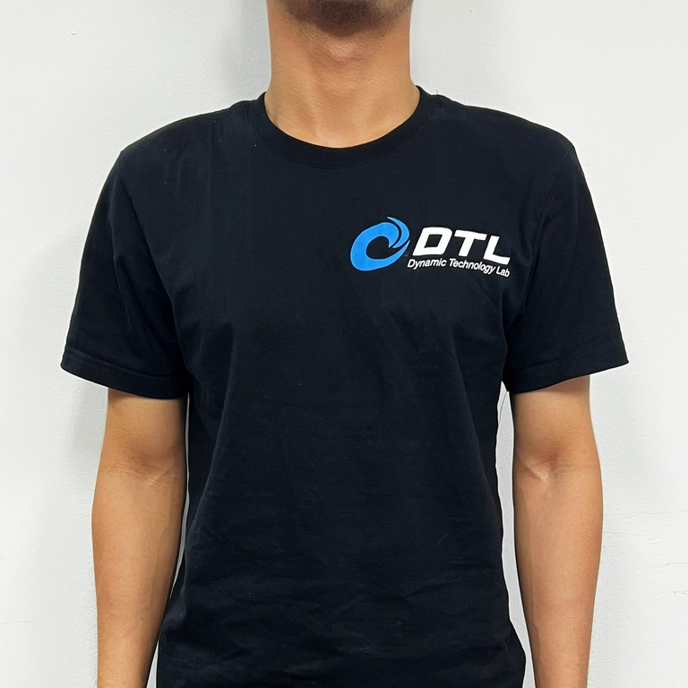
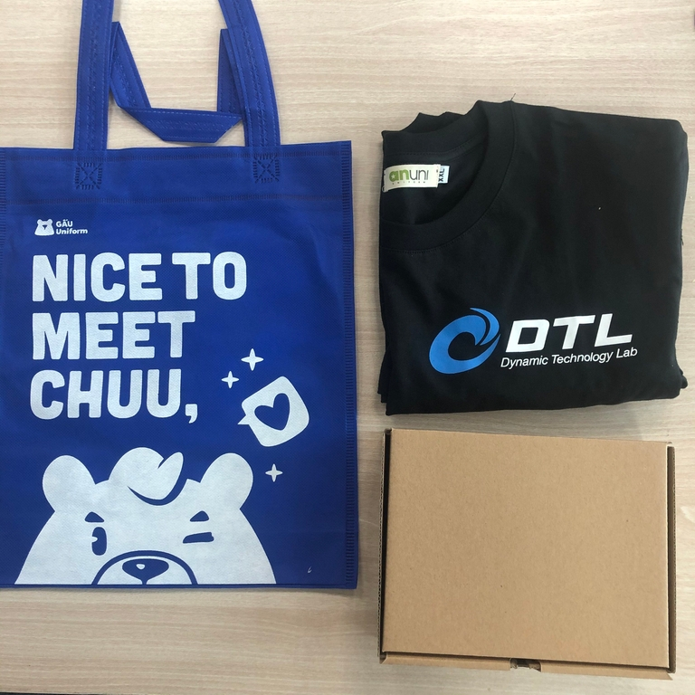
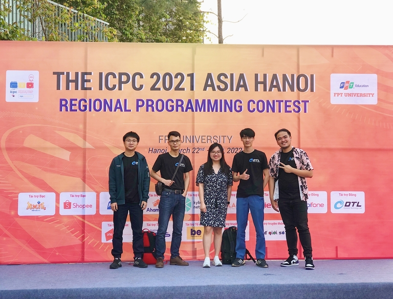

# Announcement_(en)


 
> Hello Codeforces. Hoping you're having a wonderful day! ^_^

DYTECHLAB Cup 2022
==================

This October, we invite you to the **first ever [Dytechlab Cup 2022](https://codeforces.com/contest/1737 "Dytechlab Cup 2022")** that will start on [Friday, October 7, 2022 at 20:35UTC+6](https://codeforces.com/https://www.timeanddate.com/worldclock/fixedtime.html?day=7&month=10&year=2022&hour=17&min=35&sec=0&p1=166). The problems were prepared by members of our company who *share a passion for Competitive Programming*. It is an open and rated round for both divisions.

The round will consist of **7 problems** and will be **150 minutes** long. We wish everyone good luck and have a positive delta!

### Prizes

 * 1st place: **US$200** cash prize
* 2nd place: **US$100** cash prize
* 3rd place: **US$50** cash prize

Also, we understand that contestants like dope **MERCHANDISE**, so we are giving away lots of them!

 * **Top 20** will get a merchandise package which will include: a t-shirt **with your Codeforces handle on it**, a notebook, 2 pens, and a sports bag.
* **30 merchandise packages**, each including a t-shirt & 2 pens will be *randomly distributed* to 30 contestants ranking 21-200.
* **100 merchandise packages**, each including a sports bag & 2 pens will be *randomly distributed* to 100 contestants ranking 201-1500.

    All packages will include stickers in it, so you can stick them to your laptop and show your friends how hardworking you've been :p

### Our appreciation goes to

 * [MikeMirzayanov](https://codeforces.com/profile/MikeMirzayanov "Headquarters, MikeMirzayanov") for the Codeforces and the Polygon platform.
* [gop2024](https://codeforces.com/profile/gop2024 "International Grandmaster gop2024") for coordination of the round.
* [magnified](https://codeforces.com/profile/magnified "Master magnified") for one of the problems and your enthusiastic support in preparing the round.
* [blobugh](https://codeforces.com/profile/blobugh "Master blobugh") for one problem that fills in the gap to finalize the contest.
*  [ngfam_kongu](https://codeforces.com/profile/ngfam_kongu "Master ngfam_kongu"), [MofK](https://codeforces.com/profile/MofK "Grandmaster MofK"), [ladpro98](https://codeforces.com/profile/ladpro98 "Master ladpro98") and every other [Dynamic Technology Lab](https://codeforces.com/https://dytechlab.com/) member who helped in coordination, was spot-on while we were working together in the office and helped me come up with ideas for problems.
* The list of testers (still updating): [KAN](https://codeforces.com/profile/KAN "Legendary Grandmaster KAN"), [Elite_Vanor](https://codeforces.com/profile/Elite_Vanor "Expert Elite_Vanor"), [HmmOrange](https://codeforces.com/profile/HmmOrange "Expert HmmOrange"), [Kuroni](https://codeforces.com/profile/Kuroni "International Grandmaster Kuroni"), [.DucAnh.](https://codeforces.com/profile/.DucAnh. "Candidate Master .DucAnh."), [LetterC67](https://codeforces.com/profile/LetterC67 "Master LetterC67"), [nguyentien_zzz](https://codeforces.com/profile/nguyentien_zzz "Specialist nguyentien_zzz"), [VanIOImaster153](https://codeforces.com/profile/VanIOImaster153 "Candidate Master VanIOImaster153"), [ngd.nam](https://codeforces.com/profile/ngd.nam "Specialist ngd.nam"), [nigus](https://codeforces.com/profile/nigus "Grandmaster nigus"), [hank55663](https://codeforces.com/profile/hank55663 "International Grandmaster hank55663"), [VuaVeNhi](https://codeforces.com/profile/VuaVeNhi "Master VuaVeNhi"), [lobotomy](https://codeforces.com/profile/lobotomy "Expert lobotomy"), [kieusontungcva](https://codeforces.com/profile/kieusontungcva "Candidate Master kieusontungcva"), [ehnryx](https://codeforces.com/profile/ehnryx "Grandmaster ehnryx"), [stevenkplus](https://codeforces.com/profile/stevenkplus "International Grandmaster stevenkplus"), [MagentaCobra](https://codeforces.com/profile/MagentaCobra "Master MagentaCobra"), [dorijanlendvaj](https://codeforces.com/profile/dorijanlendvaj "International Grandmaster dorijanlendvaj"), [djq_cpp](https://codeforces.com/profile/djq_cpp "Legendary Grandmaster djq_cpp"), [ugly2333](https://codeforces.com/profile/ugly2333 "Legendary Grandmaster ugly2333"), [gyh20](https://codeforces.com/profile/gyh20 "Legendary Grandmaster gyh20"), [TomiokapEace](https://codeforces.com/profile/TomiokapEace "Expert TomiokapEace"), [SSerxhs](https://codeforces.com/profile/SSerxhs "International Grandmaster SSerxhs"), [jeroenodb](https://codeforces.com/profile/jeroenodb "International Grandmaster jeroenodb"), [willy108](https://codeforces.com/profile/willy108 "Candidate Master willy108"), [abc864197532](https://codeforces.com/profile/abc864197532 "Grandmaster abc864197532"), [-skyline-](https://codeforces.com/profile/-skyline- "International Grandmaster -skyline-"), [blobugh](https://codeforces.com/profile/blobugh "Master blobugh"), [ak2006](https://codeforces.com/profile/ak2006 "Specialist ak2006"), [satyam343](https://codeforces.com/profile/satyam343 "Master satyam343"), [Andreasyan](https://codeforces.com/profile/Andreasyan "Grandmaster Andreasyan"), [emorgan](https://codeforces.com/profile/emorgan "Grandmaster emorgan").

**Wish you the best and a very positive delta in this round!**

**UPD:** score distribution is: 500−1000−1500−2000−2750−3500−3750500−1000−1500−2000−2750−3500−3750.

**UPD2:** Scripts to generate ranks of random prize winners. Seed xx will be the **sum of score of the top 10 participants**:

`./genrandom_winners x`

 **Scripts (genrandom_winners.cpp)**
```cpp
#include "testlib.h"
#include <bits/stdc++.h>
using namespace std;

/*
*  rnd.next(4) - Random int bw 0-3
*  rnd.next(4, 100) - Random int bw 4-100
*  rnd.next(10.0) - Random real [0;10)
*  rnd.next("one|two|three") Random word out of 'one', 'two' and 'three'
*  rnd.next("[1-9][0-9]{99}") Random REGEX (100-digit number as a string)
*  rnd.wnext(4,t) wnext is a method of obtaining an uneven distribution (with a biased expectation)
*  rnd.any(container) A random element of the container container (with random access via an iterator), for example, it works for std::vector and std::string
*  shuffle
*/

int main(int argc, char* argv[])
{
  registerGen(argc, argv, 0);
  vector <int> shirt_winners = {};
  vector <int> bag_winners = {};

  for (int i = 21; i <= 200; i++) shirt_winners.push_back(i);
  for (int i = 201; i <= 1500; i++) bag_winners.push_back(i);

  shuffle(shirt_winners.begin(), shirt_winners.end());
  shuffle(bag_winners.begin(), bag_winners.end());

  // list of shirt winners
  cout << "===== Rank of SHIRT WINNERS =====n";
  for (int i = 0; i < 30; i++) {
    cout << shirt_winners[i] << ' ';
  }
  cout << "n";

  // list of bag winners
  cout << "===== Rank of BAG WINNERS =====n";
  for (int i = 0; i < 100; i++) {
    cout << bag_winners[i] << ' ';
  }
  cout << "n";
}

```
**UPD3**: [Editorial](Tutorial_(en).md).

The total score of top 10 is: 11460+9086+8829+8609+8380+8354+7511+6874+6775+6755=8263311460+9086+8829+8609+8380+8354+7511+6874+6775+6755=82633. The **list of ranks** of prize winners is fixed and you can check using the published code above, using the total above as a seed. I will make a list the following days and contact the prizes winners! PLEASE NOTE that the list of real winners only finalized after the system detect & remove cheaters!

**Congratulations to everyone and HAVE A GOOD WEEKEND!**

**UPD4:** [standings](https://codeforces.com/contest/1737/standings "Standings - Dytechlab Cup 2022")

**Winners:**

 

| **Place** | **Participant** |
| --- | --- |
| [1](https://codeforces.com/contest/1737/standings/participant/141590929#p141590929) | [tourist](https://codeforces.com/profile/tourist "Legendary Grandmaster tourist") |
| [2](https://codeforces.com/contest/1737/standings/participant/141484883#p141484883) | [ksun48](https://codeforces.com/profile/ksun48 "Legendary Grandmaster ksun48") |
| [3](https://codeforces.com/contest/1737/standings/participant/141601815#p141601815) | [orzdevinwang](https://codeforces.com/profile/orzdevinwang "Legendary Grandmaster orzdevinwang") |
| [4](https://codeforces.com/contest/1737/standings/participant/141592505#p141592505) | [inaFSTream](https://codeforces.com/profile/inaFSTream "Legendary Grandmaster inaFSTream") |
| [5](https://codeforces.com/contest/1737/standings/participant/141591625#p141591625) | [heno239](https://codeforces.com/profile/heno239 "Legendary Grandmaster heno239") |

**First to solve:**

 

| **Task** | **Participant** |
| --- | --- |
| [A](../problems/A._Ela_Sorting_Books.md) | [manish17_](https://codeforces.com/profile/manish17_ "Specialist manish17_") |
| [B](../problems/B._Ela's_Fitness_and_the_Luxury_Number.md) | [tourist](https://codeforces.com/profile/tourist "Legendary Grandmaster tourist") |
| [C](../problems/C._Ela_and_Crickets.md) | [Y25t](https://codeforces.com/profile/Y25t "International Grandmaster Y25t") |
| [D](../problems/D._Ela_and_the_Wiring_Wizard.md) | [platelets](https://codeforces.com/profile/platelets "Grandmaster platelets") |
| [E](../problems/E._Ela_Goes_Hiking.md) | [EternalAlexander](https://codeforces.com/profile/EternalAlexander "International Grandmaster EternalAlexander") |
| [F](../problems/F._Ela_and_Prime_GCD.md) | [gisp_zjz](https://codeforces.com/profile/gisp_zjz "Legendary Grandmaster gisp_zjz") |
| [G](../problems/G._Ela_Takes_Dancing_Class.md) | [rainboy](https://codeforces.com/profile/rainboy "Master rainboy") |

 

---

About Dytechlab & Job Opportunities
====================================

*If you are interested in employment opportunities in **Eastern Europe**, **Dubai**, or **South East Asia**, please fill out the contact form below*:

  [Contact form →](https://codeforces.com/userForm/a54ba432e1674888) 

**We are [Dynamic Technology Lab, Pte Ltd. (DTL)](https://codeforces.com/https://dytechlab.com/)**, a *quantitative hedge fund* engaging in global securities trading with multiple asset classes. Since our founding in 2009, from humble beginnings in a home garage, we are now a **sizable**, **well-established financial institution** with offices in **Singapore**, **Shanghai**, **Beijing**, and **Hanoi**. Our success is fueled by some of the most inquisitive minds who are relentless in their pursuit of innovation.

As a **tech-focused Licensed Fund Management Company** under the Monetary Authority of Singapore, DTL is dedicated to producing strong consistent returns for its investors by relying on mathematical and statistical models to drive its investment process.

Right now, we are looking for lots and lots of Engineering positions and are ready to bring opportunities to work in a quantitative trading environment for Engineers of all levels, all around the world!

Learn more about us [on this blog](https://codeforces.com/blog/entry/107073) or on our [website](https://codeforces.com/https://dytechlab.com)!
-----------------------------------------------------------------------------------------------------------------------------------------------

